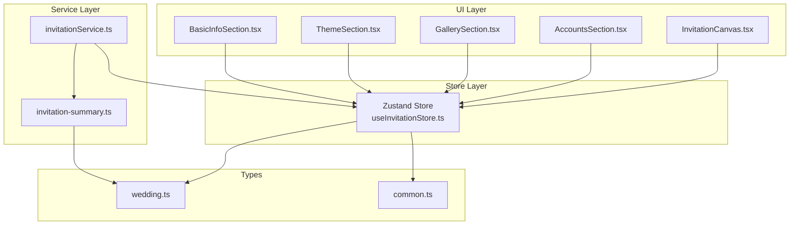
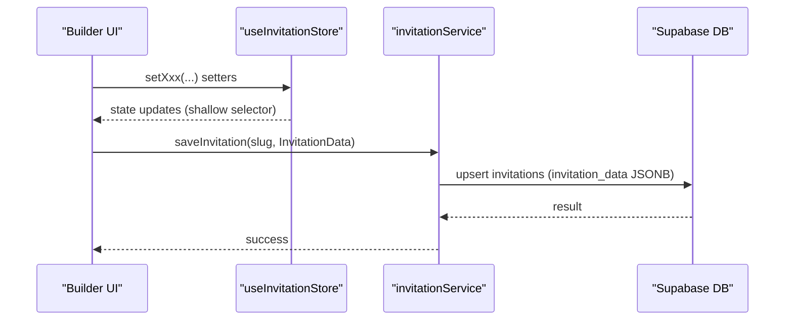
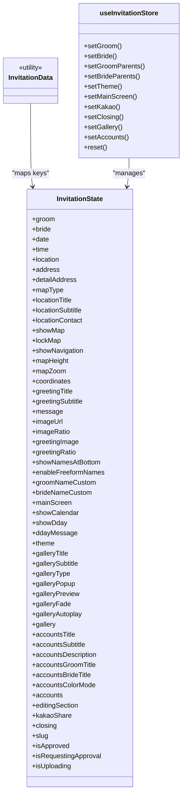
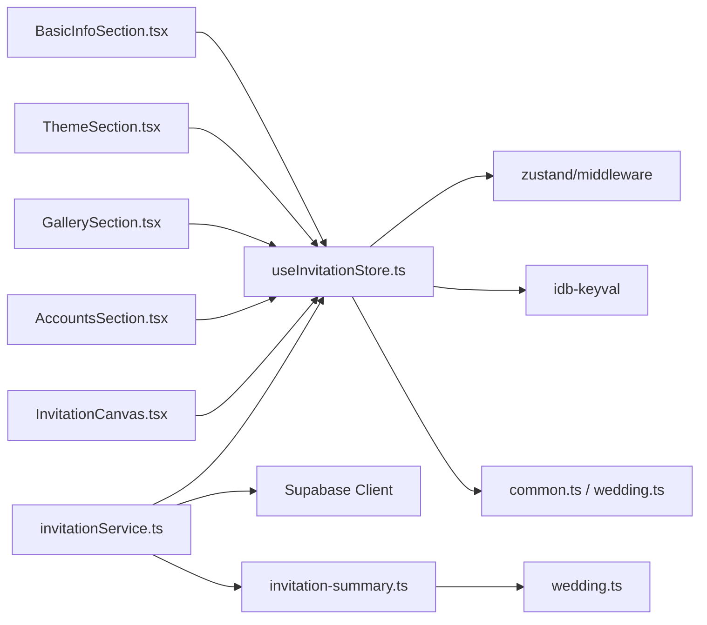

# Store Architecture and Data Structure

<cite>
**Referenced Files in This Document**
- [useInvitationStore.ts](file://src/store/useInvitationStore.ts)
- [wedding.ts](file://src/types/wedding.ts)
- [common.ts](file://src/types/common.ts)
- [invitationService.ts](file://src/services/invitationService.ts)
- [invitation-summary.ts](file://src/lib/invitation-summary.ts)
- [BasicInfoSection.tsx](file://src/components/builder/sections/BasicInfoSection.tsx)
- [ThemeSection.tsx](file://src/components/builder/sections/ThemeSection.tsx)
- [GallerySection.tsx](file://src/components/builder/sections/GallerySection.tsx)
- [AccountsSection.tsx](file://src/components/builder/sections/AccountsSection.tsx)
- [InvitationCanvas.tsx](file://src/components/preview/InvitationCanvas.tsx)
- [BuilderPage.tsx](file://src/app/builder/page.tsx)
- [MyPageClient.tsx](file://src/app/mypage/MyPageClient.tsx)
</cite>

## Table of Contents
1. [Introduction](#introduction)
2. [Project Structure](#project-structure)
3. [Core Components](#core-components)
4. [Architecture Overview](#architecture-overview)
5. [Detailed Component Analysis](#detailed-component-analysis)
6. [Dependency Analysis](#dependency-analysis)
7. [Performance Considerations](#performance-considerations)
8. [Troubleshooting Guide](#troubleshooting-guide)
9. [Conclusion](#conclusion)

## Introduction
This document explains the Zustand store architecture and the InvitationData structure used to manage wedding invitation configurations. It covers the comprehensive state shape, type-safe design with branded types and union types, the INITIAL_STATE defaults, validation patterns, and practical state access patterns. It also details how complex nested objects are managed through dedicated setter functions and how the state integrates with components and services.

## Project Structure
The store is defined in a single Zustand module and consumed across builder sections, preview components, and services. Key areas:
- Store definition and initial state: src/store/useInvitationStore.ts
- Type definitions and branded types: src/types/common.ts, src/types/wedding.ts
- Service layer for persistence: src/services/invitationService.ts
- Preview canvas composition: src/components/preview/InvitationCanvas.tsx
- Builder sections consuming the store: src/components/builder/sections/*

**Diagram sources**
- [useInvitationStore.ts](file://src/store/useInvitationStore.ts#L1-L534)
- [BasicInfoSection.tsx](file://src/components/builder/sections/BasicInfoSection.tsx#L1-L134)
- [ThemeSection.tsx](file://src/components/builder/sections/ThemeSection.tsx#L1-L136)
- [GallerySection.tsx](file://src/components/builder/sections/GallerySection.tsx#L1-L25)
- [AccountsSection.tsx](file://src/components/builder/sections/AccountsSection.tsx#L1-L305)
- [InvitationCanvas.tsx](file://src/components/preview/InvitationCanvas.tsx#L35-L89)
- [invitationService.ts](file://src/services/invitationService.ts#L1-L81)
- [invitation-summary.ts](file://src/lib/invitation-summary.ts#L1-L73)
- [wedding.ts](file://src/types/wedding.ts#L1-L389)
- [common.ts](file://src/types/common.ts#L1-L235)

**Section sources**
- [useInvitationStore.ts](file://src/store/useInvitationStore.ts#L1-L534)
- [invitationService.ts](file://src/services/invitationService.ts#L1-L81)

## Core Components
- InvitationState: The complete state shape with nested objects for groom/bride, location, theme, gallery, accounts, UI, sharing, closing, and approval/upload flags.
- InvitationData: A derived utility type that excludes function members from InvitationState, enabling safe serialization/persistence.
- INITIAL_STATE: Default values for all state fields, including nested objects and arrays.
- Zustand store with persistence: Uses Zustand with a custom IndexedDB-backed storage via idb-keyval.

Key characteristics:
- Branded types: Used in domain types (e.g., WeddingId, GuestId) to prevent accidental type mixing.
- Union types: Enforce allowed literal values for enums-like fields (e.g., mapType, layout, font).
- Optional and nullable fields: Some fields accept null (e.g., coordinates, image URLs).
- Deep merges: Persisted state merges with current state, preserving nested objects safely.

**Section sources**
- [useInvitationStore.ts](file://src/store/useInvitationStore.ts#L4-L230)
- [useInvitationStore.ts](file://src/store/useInvitationStore.ts#L232-L234)
- [useInvitationStore.ts](file://src/store/useInvitationStore.ts#L244-L371)
- [useInvitationStore.ts](file://src/store/useInvitationStore.ts#L474-L533)
- [wedding.ts](file://src/types/wedding.ts#L6-L10)
- [common.ts](file://src/types/common.ts#L8-L9)

## Architecture Overview
The store is a central state container for the invitation builder. Components subscribe to specific parts of the state using shallow selectors to minimize re-renders. Services serialize the InvitationData type to persist invitations to Supabase.

**Diagram sources**
- [useInvitationStore.ts](file://src/store/useInvitationStore.ts#L373-L473)
- [invitationService.ts](file://src/services/invitationService.ts#L9-L24)

## Detailed Component Analysis

### InvitationState and InvitationData
- InvitationState defines the entire state shape, including:
  - Basic Info: groom/bride names, relations, parents with deceased flags
  - Event Info: date/time/location/address/detailAddress
  - Location Settings: mapType, locationTitle/subtitle/contact, showMap/lockMap/showNavigation/mapHeight/mapZoom, sketchUrl/ratio
  - Greeting and Main Screen: greetingTitle/subtitle/message, image/greetingImage ratios, names display options, mainScreen layout/visibility flags
  - Theme: font, backgroundColor, accentColor, fontScale, pattern/effect, privacy, zoom prevention, entrance animation, English subtitle visibility
  - Gallery: title/subtitle/type/popup/preview/fade/autoplay, array of image items
  - Accounts: title/subtitle/description/group titles, colorMode, array of account entries with type/relation/bank/accountNumber/holder
  - UI and Sharing: editingSection, kakaoShare, closing, slug, approval flags, upload flag
- InvitationData: A mapped type that removes function members from InvitationState, leaving only serializable data.

Practical implications:
- Type-safe updates: Setters accept Partial<...> for nested objects, enabling granular updates.
- Serialization safety: InvitationData ensures only data (no functions) is persisted.

**Section sources**
- [useInvitationStore.ts](file://src/store/useInvitationStore.ts#L4-L230)
- [useInvitationStore.ts](file://src/store/useInvitationStore.ts#L232-L234)

### INITIAL_STATE Defaults
- Date defaults to 100 days in the future via a helper.
- Map defaults to Seoul coordinates and default zoom level.
- Theme defaults include font selection, background/accent colors, and privacy settings.
- Gallery/accounts initialized as empty arrays with sensible defaults.
- UI flags default to enabled features for a good out-of-the-box experience.

Validation patterns:
- Union literals enforce allowed values for enums-like fields.
- Optional fields allow null for images/coordinates.
- Nested objects are defaulted to ensure consumers do not encounter undefined.

**Section sources**
- [useInvitationStore.ts](file://src/store/useInvitationStore.ts#L238-L242)
- [useInvitationStore.ts](file://src/store/useInvitationStore.ts#L244-L371)

### State Access Patterns and Type Inference
- Shallow selectors: Components use shallow selectors to subscribe to specific fields, reducing unnecessary re-renders.
- Function setters: Each nested object has dedicated setters (e.g., setGroom, setBride, setGroomParents, setBrideParents).
- Deep updates: setTheme, setMainScreen, setKakao, setClosing perform deep merges to preserve existing nested state.
- Utility type usage: InvitationData is used in services to ensure only serializable data is stored.

Examples of access patterns:
- BasicInfoSection reads and writes groom/bride and parent fields via dedicated setters.
- ThemeSection updates theme.accentColor, font, pattern, and backgroundColor.
- AccountsSection manages an array of accounts with add/update/remove operations.

**Section sources**
- [BasicInfoSection.tsx](file://src/components/builder/sections/BasicInfoSection.tsx#L15-L134)
- [ThemeSection.tsx](file://src/components/builder/sections/ThemeSection.tsx#L22-L136)
- [AccountsSection.tsx](file://src/components/builder/sections/AccountsSection.tsx#L19-L305)
- [useInvitationStore.ts](file://src/store/useInvitationStore.ts#L378-L473)

### Relationship Between State and Components
- Preview canvas composes a subset of InvitationData fields to render the invitation preview.
- Builder sections encapsulate UI logic and delegate state updates to the store.
- Services consume InvitationData to persist and retrieve invitation records.

**Diagram sources**
- [useInvitationStore.ts](file://src/store/useInvitationStore.ts#L4-L230)
- [useInvitationStore.ts](file://src/store/useInvitationStore.ts#L232-L234)

### Practical Examples

#### Example: Building a Greeting Message
- Access greetingTitle, greetingSubtitle, message via shallow selectors.
- Update with setters for granular changes.
- Preview component consumes InvitationData fields to render.

**Section sources**
- [ThemeSection.tsx](file://src/components/builder/sections/ThemeSection.tsx#L22-L136)
- [InvitationCanvas.tsx](file://src/components/preview/InvitationCanvas.tsx#L35-L89)

#### Example: Managing Gallery Images
- Use setGallery with either a replacement array or a reducer function.
- Toggle galleryType, popup, preview, fade, and autoplay flags.
- Preview canvas reads gallery and related flags.

**Section sources**
- [GallerySection.tsx](file://src/components/builder/sections/GallerySection.tsx#L9-L25)
- [useInvitationStore.ts](file://src/store/useInvitationStore.ts#L433-L440)
- [InvitationCanvas.tsx](file://src/components/preview/InvitationCanvas.tsx#L56-L63)

#### Example: Updating Accounts
- Add/remove accounts and update holders automatically based on groom/bride relations.
- Sync holder names when relations change.

**Section sources**
- [AccountsSection.tsx](file://src/components/builder/sections/AccountsSection.tsx#L58-L113)

#### Example: Saving InvitationData
- Serialize current store state to InvitationData and persist via invitationService.saveInvitation.

**Section sources**
- [invitationService.ts](file://src/services/invitationService.ts#L9-L24)
- [BuilderPage.tsx](file://src/app/builder/page.tsx#L100-L111)

## Dependency Analysis
- Store depends on:
  - Zustand for state management
  - zustand/middleware for persistence
  - idb-keyval for IndexedDB storage
- Components depend on:
  - useInvitationStore with shallow selectors
  - UI primitives and form components
- Services depend on:
  - Supabase client
  - InvitationData type for serialization
  - Invitation summary utilities for projections

**Diagram sources**
- [useInvitationStore.ts](file://src/store/useInvitationStore.ts#L1-L2)
- [invitationService.ts](file://src/services/invitationService.ts#L1-L5)
- [invitation-summary.ts](file://src/lib/invitation-summary.ts#L1-L73)
- [wedding.ts](file://src/types/wedding.ts#L1-L389)
- [common.ts](file://src/types/common.ts#L1-L235)

**Section sources**
- [useInvitationStore.ts](file://src/store/useInvitationStore.ts#L1-L534)
- [invitationService.ts](file://src/services/invitationService.ts#L1-L81)

## Performance Considerations
- Shallow selectors: Components use shallow selectors to subscribe to specific fields, minimizing re-renders.
- Deep merges: Setters for nested objects perform deep merges to avoid losing other fields.
- IndexedDB persistence: Using idb-keyval allows larger payloads compared to localStorage.
- Lazy loading: Dynamic imports for heavy components (e.g., RichTextEditor) reduce initial bundle size.

## Troubleshooting Guide
Common issues and resolutions:
- Unexpected nulls: Ensure coordinates and image URLs are handled as nullable in components.
- Deep merge conflicts: When adding new fields, rely on the merge function to preserve nested objects.
- Selector scope: Prefer shallow selectors to avoid subscribing to the entire state.
- Persistence failures: Verify IndexedDB availability and idb-keyval integration.

**Section sources**
- [useInvitationStore.ts](file://src/store/useInvitationStore.ts#L491-L530)

## Conclusion
The Zustand store provides a robust, type-safe foundation for managing complex invitation data. The InvitationData utility type ensures serialization safety, while dedicated setters and shallow selectors keep components responsive and maintainable. The architecture cleanly separates concerns between UI, store, and services, enabling scalable development and reliable persistence.