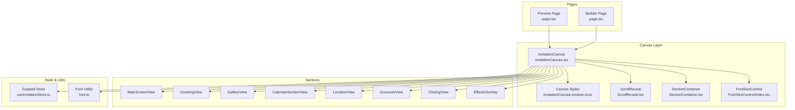
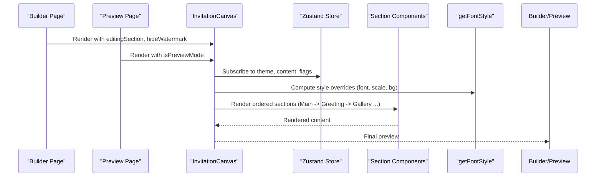
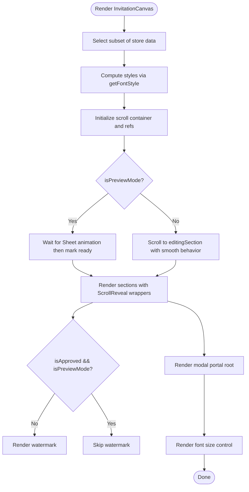
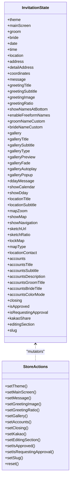
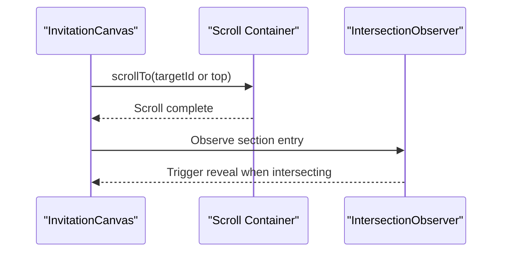
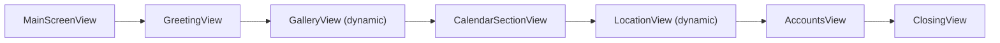
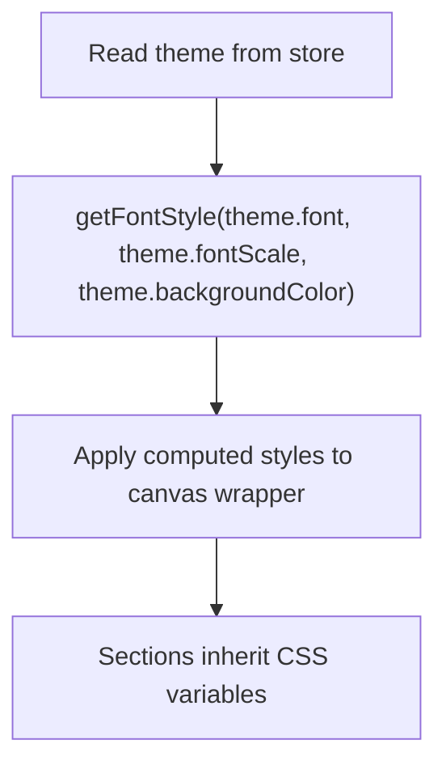
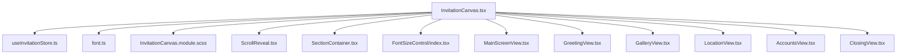

# Canvas Rendering Engine

<cite>
**Referenced Files in This Document**
- [InvitationCanvas.tsx](file://src/components/preview/InvitationCanvas.tsx)
- [InvitationCanvas.module.scss](file://src/components/preview/InvitationCanvas.module.scss)
- [useInvitationStore.ts](file://src/store/useInvitationStore.ts)
- [page.tsx (Builder)](file://src/app/builder/page.tsx)
- [page.tsx (Preview)](file://src/app/preview/page.tsx)
- [font.ts](file://src/lib/utils/font.ts)
- [ScrollReveal.tsx](file://src/components/preview/ScrollReveal.tsx)
- [SectionContainer.tsx](file://src/components/preview/SectionContainer.tsx)
- [FontSizeControl/index.tsx](file://src/components/preview/elements/FontSizeControl/index.tsx)
- [MainScreenView.tsx](file://src/components/preview/sections/MainScreenView.tsx)
- [GreetingView.tsx](file://src/components/preview/sections/GreetingView.tsx)
- [GalleryView.tsx](file://src/components/preview/sections/GalleryView.tsx)
- [LocationView.tsx](file://src/components/preview/sections/LocationView.tsx)
- [AccountsView.tsx](file://src/components/preview/sections/AccountsView.tsx)
- [ClosingView.tsx](file://src/components/preview/sections/ClosingView.tsx)
</cite>

## Table of Contents
1. [Introduction](#introduction)
2. [Project Structure](#project-structure)
3. [Core Components](#core-components)
4. [Architecture Overview](#architecture-overview)
5. [Detailed Component Analysis](#detailed-component-analysis)
6. [Dependency Analysis](#dependency-analysis)
7. [Performance Considerations](#performance-considerations)
8. [Troubleshooting Guide](#troubleshooting-guide)
9. [Conclusion](#conclusion)
10. [Appendices](#appendices)

## Introduction
This document explains the InvitationCanvas rendering engine that powers the responsive mobile preview of wedding invitations. It focuses on the canvas architecture, real-time rendering pipeline, memoization and performance strategies, scroll management, section-based rendering, dynamic component loading with Next.js, style injection via getFontStyle, and the relationship between theme properties and visual rendering. It also covers customization examples, performance guidance for large canvases, debugging techniques, and the integration with the Zustand store for state synchronization, including differences between preview and edit modes.

## Project Structure
The canvas is implemented as a presentational component that renders a fixed sequence of themed sections. It integrates with a global Zustand store for real-time updates, uses Next.js dynamic imports for heavy components, and applies a style injection system to synchronize theme fonts and scales.

**Diagram sources**
- [page.tsx (Builder)](file://src/app/builder/page.tsx#L1-L232)
- [page.tsx (Preview)](file://src/app/preview/page.tsx#L1-L10)
- [InvitationCanvas.tsx](file://src/components/preview/InvitationCanvas.tsx#L1-L469)
- [InvitationCanvas.module.scss](file://src/components/preview/InvitationCanvas.module.scss#L1-L73)
- [ScrollReveal.tsx](file://src/components/preview/ScrollReveal.tsx#L1-L64)
- [SectionContainer.tsx](file://src/components/preview/SectionContainer.tsx#L1-L50)
- [FontSizeControl/index.tsx](file://src/components/preview/elements/FontSizeControl/index.tsx#L1-L67)
- [useInvitationStore.ts](file://src/store/useInvitationStore.ts#L1-L534)
- [font.ts](file://src/lib/utils/font.ts#L1-L57)

**Section sources**
- [InvitationCanvas.tsx](file://src/components/preview/InvitationCanvas.tsx#L1-L469)
- [InvitationCanvas.module.scss](file://src/components/preview/InvitationCanvas.module.scss#L1-L73)
- [useInvitationStore.ts](file://src/store/useInvitationStore.ts#L1-L534)
- [page.tsx (Builder)](file://src/app/builder/page.tsx#L1-L232)
- [page.tsx (Preview)](file://src/app/preview/page.tsx#L1-L10)

## Core Components
- InvitationCanvas: The central renderer that composes sections, manages scroll behavior, applies theme styles, and handles preview vs edit differences.
- Zustand Store: Provides real-time state for theme, content, and UI flags; exposes selectors for efficient re-renders.
- Style Injection: getFontStyle injects CSS variables for font family, scale, and background to unify typography and theme across sections.
- Scroll Management: ScrollReveal and a scroll container manage animated reveals and targeted scrolling to sections.
- Section-Based Rendering: Each section is a presentational component wrapped in SectionContainer and ScrollReveal.
- Dynamic Imports: Heavy components (e.g., GalleryView, LocationView) are loaded lazily with SSR disabled and loading placeholders.

**Section sources**
- [InvitationCanvas.tsx](file://src/components/preview/InvitationCanvas.tsx#L1-L469)
- [useInvitationStore.ts](file://src/store/useInvitationStore.ts#L1-L534)
- [font.ts](file://src/lib/utils/font.ts#L1-L57)
- [ScrollReveal.tsx](file://src/components/preview/ScrollReveal.tsx#L1-L64)
- [SectionContainer.tsx](file://src/components/preview/SectionContainer.tsx#L1-L50)
- [GalleryView.tsx](file://src/components/preview/sections/GalleryView.tsx#L1-L310)
- [LocationView.tsx](file://src/components/preview/sections/LocationView.tsx#L1-L206)

## Architecture Overview
The InvitationCanvas orchestrates a fixed sequence of themed sections. It reads a narrowed subset of the Zustand store, computes styles via getFontStyle, and renders sections wrapped in ScrollReveal and SectionContainer. Dynamic imports defer expensive components until needed. The Builder and Preview pages pass flags to toggle preview mode and editing behavior.

**Diagram sources**
- [page.tsx (Builder)](file://src/app/builder/page.tsx#L1-L232)
- [page.tsx (Preview)](file://src/app/preview/page.tsx#L1-L10)
- [InvitationCanvas.tsx](file://src/components/preview/InvitationCanvas.tsx#L1-L469)
- [useInvitationStore.ts](file://src/store/useInvitationStore.ts#L1-L534)
- [font.ts](file://src/lib/utils/font.ts#L1-L57)

## Detailed Component Analysis

### InvitationCanvas: Core Rendering Engine
- Memoization: Uses React.memo on the inner content component and a selector-based memo wrapper to minimize re-renders.
- State Selection: A dedicated selector extracts only the fields needed for rendering, reducing unnecessary updates.
- Style Injection: Computes inline styles via getFontStyle and applies them to the canvas wrapper.
- Scroll Management: Implements robust scroll-to-section logic with retries and a readiness flag to avoid layout jank during animations.
- Preview vs Edit: In preview mode, it defers visibility until after a sheet animation completes; in edit mode, it scrolls smoothly to the target section.
- Dynamic Components: Uses Next.js dynamic imports for GalleryView and LocationView with SSR disabled and loading skeletons.
- Watermark: Conditionally renders a watermark for unapproved live pages outside preview mode.
- Modal Root: Renders a portal root for modals to stay within the mockup frame.
- Font Size Control: Renders a font size control panel specifically for preview mode.

**Diagram sources**
- [InvitationCanvas.tsx](file://src/components/preview/InvitationCanvas.tsx#L1-L469)
- [font.ts](file://src/lib/utils/font.ts#L1-L57)

**Section sources**
- [InvitationCanvas.tsx](file://src/components/preview/InvitationCanvas.tsx#L1-L469)
- [InvitationCanvas.module.scss](file://src/components/preview/InvitationCanvas.module.scss#L1-L73)

### Zustand Store Integration
- Store Shape: Comprehensive state for theme, content, UI flags, and sections.
- Selector Strategy: InvitationCanvas uses a shallow selector to subscribe to only the fields it needs, minimizing re-renders.
- Persistence: Uses a JSON storage adapter backed by IndexedDB with a merge strategy to handle evolving schema.
- Editing Mode: The store tracks editingSection to coordinate scroll behavior in the canvas.

**Diagram sources**
- [useInvitationStore.ts](file://src/store/useInvitationStore.ts#L1-L534)

**Section sources**
- [useInvitationStore.ts](file://src/store/useInvitationStore.ts#L1-L534)
- [InvitationCanvas.tsx](file://src/components/preview/InvitationCanvas.tsx#L91-L144)

### Scroll Management and Section Reveal
- Scroll Container: A single scrollable area holds all sections. The canvas scrolls to either the top or a specific section anchor.
- Target Resolution: Converts editingSection to a canonical ID and scrolls to the element’s offsetTop for stability.
- Readiness Gate: In preview mode, the canvas waits for the element to exist and layout before revealing content to avoid jolts during animations.
- ScrollReveal: Each section is wrapped in ScrollReveal, which uses IntersectionObserver to animate entries based on reduced motion preferences.

**Diagram sources**
- [InvitationCanvas.tsx](file://src/components/preview/InvitationCanvas.tsx#L215-L288)
- [ScrollReveal.tsx](file://src/components/preview/ScrollReveal.tsx#L1-L64)

**Section sources**
- [InvitationCanvas.tsx](file://src/components/preview/InvitationCanvas.tsx#L215-L288)
- [ScrollReveal.tsx](file://src/components/preview/ScrollReveal.tsx#L1-L64)

### Section-Based Rendering and Dynamic Imports
- Section Order: MainScreen -> Greeting -> Gallery -> Calendar/D-Day -> Location -> Accounts -> Closing.
- Wrappers: Each section uses SectionContainer for consistent spacing and ScrollReveal for entrance animations.
- Dynamic Components:
  - GalleryView: Heavy slider/gallery library; SSR disabled with a skeleton loading fallback.
  - LocationView: Dynamically imports map containers (Kakao/Naver) with a shared loading overlay.
- Conditional Rendering: Sections render only when data is present or flags permit.

**Diagram sources**
- [InvitationCanvas.tsx](file://src/components/preview/InvitationCanvas.tsx#L315-L430)
- [GalleryView.tsx](file://src/components/preview/sections/GalleryView.tsx#L1-L310)
- [LocationView.tsx](file://src/components/preview/sections/LocationView.tsx#L1-L206)

**Section sources**
- [InvitationCanvas.tsx](file://src/components/preview/InvitationCanvas.tsx#L315-L430)
- [GalleryView.tsx](file://src/components/preview/sections/GalleryView.tsx#L1-L310)
- [LocationView.tsx](file://src/components/preview/sections/LocationView.tsx#L1-L206)

### Style Injection and Theme Properties
- getFontStyle: Produces a style object that sets the active font variable, background color, and font scale, and normalizes other font variables to maintain consistency.
- Canvas Wrapper: The canvas applies computed styles to its wrapper, ensuring typography and background reflect the current theme.
- Theme Fields: Font family, background color, accent color, pattern, effect, and animateEntrance influence rendering across sections.

**Diagram sources**
- [font.ts](file://src/lib/utils/font.ts#L34-L56)
- [InvitationCanvas.tsx](file://src/components/preview/InvitationCanvas.tsx#L291-L294)

**Section sources**
- [font.ts](file://src/lib/utils/font.ts#L1-L57)
- [InvitationCanvas.tsx](file://src/components/preview/InvitationCanvas.tsx#L291-L294)

### Preview vs Edit Mode Differences
- Builder Page: Passes editingSection to the canvas to scroll to the active section; hides watermark; uses a static iPhone mockup for desktop preview.
- Preview Page: Passes isPreviewMode to the canvas; enables font size control; conditionally shows watermark only when not approved and not in preview mode.
- Dynamic Imports: Both pages leverage dynamic imports for heavy components to optimize initial load.

**Section sources**
- [page.tsx (Builder)](file://src/app/builder/page.tsx#L177-L208)
- [page.tsx (Preview)](file://src/app/preview/page.tsx#L1-L9)
- [InvitationCanvas.tsx](file://src/components/preview/InvitationCanvas.tsx#L28-L33)

### Practical Examples of Canvas Customization
- Adjusting Font Scale: Use the font size control panel to change theme.fontScale in preview mode.
- Changing Accent Color: Update theme.accentColor in the store to alter section accents and interactive elements.
- Enabling Entrance Animations: Toggle theme.animateEntrance to control ScrollReveal behavior.
- Switching Patterns and Effects: Change theme.pattern and theme.effect to apply visual overlays and effects selectively.

**Section sources**
- [FontSizeControl/index.tsx](file://src/components/preview/elements/FontSizeControl/index.tsx#L1-L67)
- [useInvitationStore.ts](file://src/store/useInvitationStore.ts#L88-L101)
- [ScrollReveal.tsx](file://src/components/preview/ScrollReveal.tsx#L17-L63)

## Dependency Analysis
The canvas depends on:
- Zustand store for state and persistence.
- getFontStyle for unified theme application.
- Section components for content rendering.
- Dynamic imports for heavy modules.
- ScrollReveal and SectionContainer for layout and animations.

**Diagram sources**
- [InvitationCanvas.tsx](file://src/components/preview/InvitationCanvas.tsx#L1-L469)
- [useInvitationStore.ts](file://src/store/useInvitationStore.ts#L1-L534)
- [font.ts](file://src/lib/utils/font.ts#L1-L57)
- [InvitationCanvas.module.scss](file://src/components/preview/InvitationCanvas.module.scss#L1-L73)
- [ScrollReveal.tsx](file://src/components/preview/ScrollReveal.tsx#L1-L64)
- [SectionContainer.tsx](file://src/components/preview/SectionContainer.tsx#L1-L50)
- [FontSizeControl/index.tsx](file://src/components/preview/elements/FontSizeControl/index.tsx#L1-L67)
- [MainScreenView.tsx](file://src/components/preview/sections/MainScreenView.tsx#L1-L402)
- [GreetingView.tsx](file://src/components/preview/sections/GreetingView.tsx#L1-L158)
- [GalleryView.tsx](file://src/components/preview/sections/GalleryView.tsx#L1-L310)
- [LocationView.tsx](file://src/components/preview/sections/LocationView.tsx#L1-L206)
- [AccountsView.tsx](file://src/components/preview/sections/AccountsView.tsx#L1-L127)
- [ClosingView.tsx](file://src/components/preview/sections/ClosingView.tsx#L1-L197)

**Section sources**
- [InvitationCanvas.tsx](file://src/components/preview/InvitationCanvas.tsx#L1-L469)
- [useInvitationStore.ts](file://src/store/useInvitationStore.ts#L1-L534)

## Performance Considerations
- Memoization
  - InvitationCanvasContent is wrapped with React.memo to prevent re-renders when props/data are unchanged.
  - The selector-based wrapper subscribes only to necessary fields, minimizing downstream re-renders.
- Dynamic Imports
  - GalleryView and LocationView are dynamically imported with SSR disabled and loading skeletons to defer heavy bundles.
- Scroll Readiness
  - In preview mode, the canvas delays visibility until after a sheet animation completes to avoid layout thrashing.
- Font Scaling
  - getFontStyle computes styles once per theme change and applies CSS variables to avoid recalculating styles per component.
- Animation Preferences
  - ScrollReveal respects reduced motion preferences to avoid heavy animations when not needed.
- Large Galleries
  - GalleryView supports autoplay and fade effects; tune these flags to balance engagement and performance.
- IndexedDB Persistence
  - Store persistence uses IndexedDB-backed storage to accommodate larger datasets without localStorage limitations.

[No sources needed since this section provides general guidance]

## Troubleshooting Guide
- Scroll Jitter During Preview
  - Cause: Layout shifts while a drawer/sheet animates.
  - Fix: Ensure the canvas waits for the element to exist and layout before marking ready; rely on offsetTop-based scrolling.
- Missing Watermark in Live Preview
  - Cause: isApproved is true or isPreviewMode is true.
  - Fix: Verify store flags and hideWatermark prop.
- Dynamic Component Not Loading
  - Cause: SSR enabled or missing loading fallback.
  - Fix: Confirm dynamic imports have ssr: false and a loading component.
- Font Not Updating
  - Cause: getFontStyle not applied or CSS variables overridden.
  - Fix: Ensure computed styles are applied to the canvas wrapper and CSS variables are set.
- Entrance Animations Not Triggering
  - Cause: Reduced motion preference or animateEntrance disabled.
  - Fix: Check theme.animateEntrance and user preference.
- Gallery Autoplay Issues
  - Cause: Autoplay conflicts with modal state.
  - Fix: Stop autoplay when the lightbox opens and resume when closed.

**Section sources**
- [InvitationCanvas.tsx](file://src/components/preview/InvitationCanvas.tsx#L254-L288)
- [InvitationCanvas.tsx](file://src/components/preview/InvitationCanvas.tsx#L440-L442)
- [GalleryView.tsx](file://src/components/preview/sections/GalleryView.tsx#L101-L114)
- [font.ts](file://src/lib/utils/font.ts#L34-L56)
- [ScrollReveal.tsx](file://src/components/preview/ScrollReveal.tsx#L17-L46)

## Conclusion
The InvitationCanvas rendering engine combines a selective Zustand store subscription, memoization, and dynamic imports to deliver a responsive, animated, and highly customizable mobile preview. Its style injection system and section wrappers ensure consistent theming and performance. By leveraging ScrollReveal, a scroll-ready gate, and preview/edit mode flags, it provides a smooth authoring and viewing experience.

[No sources needed since this section summarizes without analyzing specific files]

## Appendices

### Canvas Wrapper Structure and Styles
- Wrapper: Contains shadow, max-width on desktop, and a scrollable area.
- Hidden State: Temporarily hides content until ready in preview mode.
- Watermark: SVG background pattern rotated and blended for subtle coverage.
- Modal Root: Portal root for modals to stay within the mockup.

**Section sources**
- [InvitationCanvas.module.scss](file://src/components/preview/InvitationCanvas.module.scss#L1-L73)

### Relationship Between Theme Properties and Visual Rendering
- Font Family and Scale: Applied via getFontStyle; affects all sections uniformly.
- Background Color: Used to tint overlays and wave effects.
- Accent Color: Drives section accents, links, and interactive elements.
- Effects and Patterns: Applied selectively via the canvas wrapper and section backgrounds.

**Section sources**
- [font.ts](file://src/lib/utils/font.ts#L34-L56)
- [InvitationCanvas.tsx](file://src/components/preview/InvitationCanvas.tsx#L291-L294)
- [MainScreenView.tsx](file://src/components/preview/sections/MainScreenView.tsx#L326-L338)