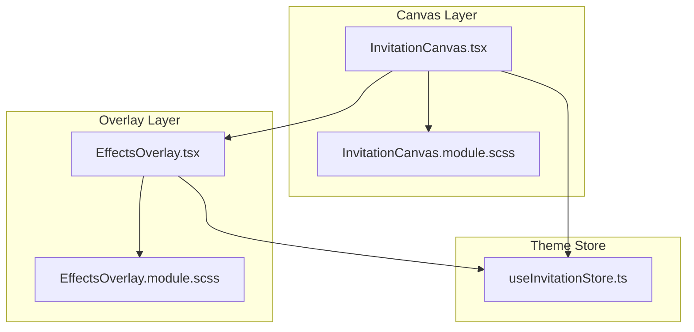
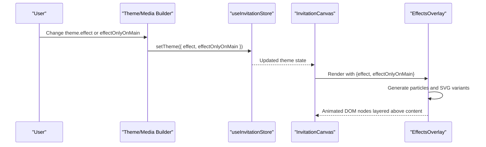
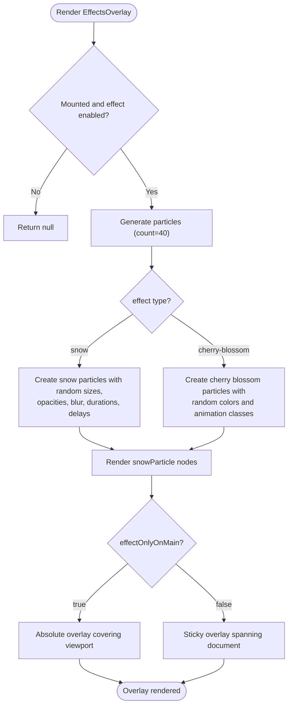
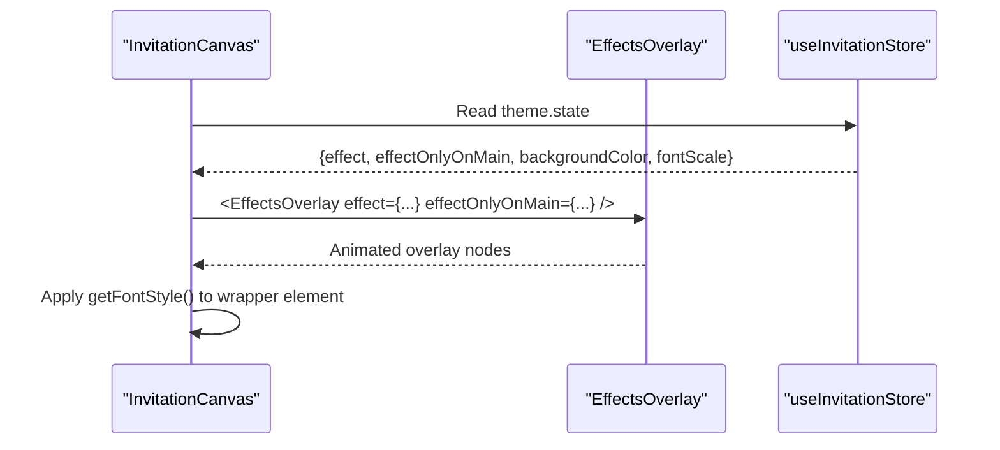
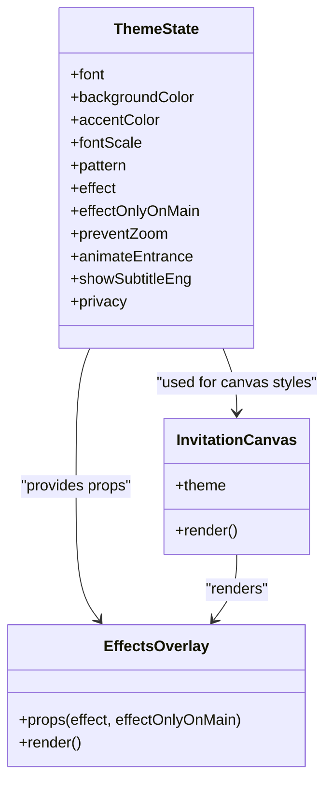
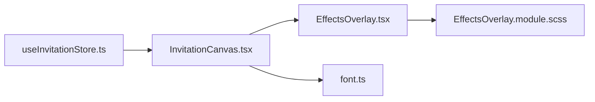

# Effects Overlay

<cite>
**Referenced Files in This Document**
- [EffectsOverlay.tsx](file://src/components/preview/sections/EffectsOverlay.tsx)
- [EffectsOverlay.module.scss](file://src/components/preview/sections/EffectsOverlay.module.scss)
- [InvitationCanvas.tsx](file://src/components/preview/InvitationCanvas.tsx)
- [InvitationCanvas.module.scss](file://src/components/preview/InvitationCanvas.module.scss)
- [useInvitationStore.ts](file://src/store/useInvitationStore.ts)
- [ThemeSection.tsx](file://src/components/builder/sections/ThemeSection.tsx)
- [MainScreenSectionContent.tsx](file://src/components/builder/sections/MainScreenSectionContent.tsx)
- [font.ts](file://src/lib/utils/font.ts)
- [_animations.scss](file://src/styles/_animations.scss)
</cite>

## Table of Contents
1. [Introduction](#introduction)
2. [Project Structure](#project-structure)
3. [Core Components](#core-components)
4. [Architecture Overview](#architecture-overview)
5. [Detailed Component Analysis](#detailed-component-analysis)
6. [Dependency Analysis](#dependency-analysis)
7. [Performance Considerations](#performance-considerations)
8. [Troubleshooting Guide](#troubleshooting-guide)
9. [Conclusion](#conclusion)

## Introduction
This document explains the Effects Overlay system responsible for animated backgrounds and theme-based visual enhancements rendered over the invitation canvas. It covers how the EffectsOverlay component applies animated snow and cherry blossom effects, how animation timing and performance are managed, and how the overlay integrates with the theme system. Practical customization examples, optimization strategies, and troubleshooting guidance are included to help developers and designers tailor the overlay to specific aesthetic goals.

## Project Structure
The Effects Overlay system spans three primary areas:
- Canvas integration: the InvitationCanvas composes the overlay alongside content sections.
- Overlay component: EffectsOverlay renders animated particles and SVG-based cherry blossom variants.
- Theme integration: theme state controls effect selection and scoping.

**Diagram sources**
- [InvitationCanvas.tsx](file://src/components/preview/InvitationCanvas.tsx#L310-L313)
- [EffectsOverlay.tsx](file://src/components/preview/sections/EffectsOverlay.tsx#L16-L19)
- [EffectsOverlay.module.scss](file://src/components/preview/sections/EffectsOverlay.module.scss#L1-L21)
- [useInvitationStore.ts](file://src/store/useInvitationStore.ts#L89-L101)

**Section sources**
- [InvitationCanvas.tsx](file://src/components/preview/InvitationCanvas.tsx#L310-L313)
- [EffectsOverlay.tsx](file://src/components/preview/sections/EffectsOverlay.tsx#L16-L19)
- [EffectsOverlay.module.scss](file://src/components/preview/sections/EffectsOverlay.module.scss#L1-L21)
- [useInvitationStore.ts](file://src/store/useInvitationStore.ts#L89-L101)

## Core Components
- EffectsOverlay: Renders animated particles and cherry blossom SVG variants based on theme configuration. It supports two effect types and can scope rendering to the main screen or span globally.
- InvitationCanvas: Hosts the overlay and composes all invitation sections. It passes theme-driven effect props to the overlay.
- Theme Store: Provides theme state including effect selection and overlay scoping flag.

Key responsibilities:
- EffectsOverlay: Generates particle arrays with randomized sizes, durations, delays, and blur filters; selects cherry blossom variants and animation classes; applies CSS-in-JS via inline styles and CSS modules.
- InvitationCanvas: Passes theme.effect and theme.effectOnlyOnMain to EffectsOverlay; sets canvas-wide styles via getFontStyle.
- Theme Store: Holds theme.effect and theme.effectOnlyOnMain; exposes setters for theme updates.

**Section sources**
- [EffectsOverlay.tsx](file://src/components/preview/sections/EffectsOverlay.tsx#L73-L167)
- [InvitationCanvas.tsx](file://src/components/preview/InvitationCanvas.tsx#L310-L313)
- [useInvitationStore.ts](file://src/store/useInvitationStore.ts#L89-L101)

## Architecture Overview
The overlay is integrated into the invitation canvas and controlled by theme state. The canvas computes base styles from theme and delegates effect rendering to the overlay.

**Diagram sources**
- [ThemeSection.tsx](file://src/components/builder/sections/ThemeSection.tsx#L22-L133)
- [MainScreenSectionContent.tsx](file://src/components/builder/sections/MainScreenSectionContent.tsx#L209-L219)
- [useInvitationStore.ts](file://src/store/useInvitationStore.ts#L432-L432)
- [InvitationCanvas.tsx](file://src/components/preview/InvitationCanvas.tsx#L310-L313)
- [EffectsOverlay.tsx](file://src/components/preview/sections/EffectsOverlay.tsx#L73-L167)

## Detailed Component Analysis

### EffectsOverlay Component
EffectsOverlay is a memoized client component that conditionally renders animated effects based on theme state. It generates a fixed number of animated particles and cherry blossom SVG variants, applying randomized styles for natural motion.

Effect types and rendering:
- Snow: Renders circular white particles with randomized sizes, opacities, blur filters, and animation durations/delays. Particles animate downward with a slight horizontal drift.
- Cherry Blossom: Renders four SVG petal variants with randomized colors and animation classes (fall, tumbling, sway, diagonal). Uses inline styles for positioning and animation timing.

Overlay scoping:
- effectOnlyOnMain: When true, overlay is absolutely positioned to cover the viewport; when false, overlay is sticky and spans the document height without blocking scroll.

Conditional rendering:
- Mounted state and effect === 'none' guard ensure no DOM is rendered when effects are disabled.

CSS-in-JS and CSS Modules:
- Inline styles define per-particle properties (width, height, left, top, opacity, animationDuration, animationDelay, filter).
- CSS modules provide animation keyframes and class names for particle movement.

**Diagram sources**
- [EffectsOverlay.tsx](file://src/components/preview/sections/EffectsOverlay.tsx#L84-L135)
- [EffectsOverlay.module.scss](file://src/components/preview/sections/EffectsOverlay.module.scss#L3-L21)
- [EffectsOverlay.module.scss](file://src/components/preview/sections/EffectsOverlay.module.scss#L67-L158)

**Section sources**
- [EffectsOverlay.tsx](file://src/components/preview/sections/EffectsOverlay.tsx#L73-L167)
- [EffectsOverlay.module.scss](file://src/components/preview/sections/EffectsOverlay.module.scss#L53-L158)

### InvitationCanvas Integration
InvitationCanvas composes the EffectsOverlay alongside content sections. It reads theme.effect and theme.effectOnlyOnMain and passes them to the overlay. Canvas-wide styles are computed via getFontStyle and applied to the wrapper element.

Key integration points:
- Overlay injection: EffectsOverlay is rendered immediately after the overlay-scoped wrapper.
- Theme prop forwarding: effect and effectOnlyOnMain are passed directly from theme.
- Canvas styling: getFontStyle returns CSS variable overrides and background color for the entire canvas.

**Diagram sources**
- [InvitationCanvas.tsx](file://src/components/preview/InvitationCanvas.tsx#L310-L313)
- [InvitationCanvas.tsx](file://src/components/preview/InvitationCanvas.tsx#L291-L294)
- [font.ts](file://src/lib/utils/font.ts#L34-L56)
- [useInvitationStore.ts](file://src/store/useInvitationStore.ts#L89-L101)

**Section sources**
- [InvitationCanvas.tsx](file://src/components/preview/InvitationCanvas.tsx#L291-L294)
- [InvitationCanvas.tsx](file://src/components/preview/InvitationCanvas.tsx#L310-L313)
- [font.ts](file://src/lib/utils/font.ts#L34-L56)

### Theme Integration and Conditional Rendering
Theme state drives overlay behavior:
- theme.effect: Controls which effect is active ('none' | 'cherry-blossom' | 'snow').
- theme.effectOnlyOnMain: Controls whether the overlay covers the viewport or spans the document.

Builder controls:
- ThemeSection: Allows changing accent color, font, font scale, background pattern, and background color.
- MainScreenSectionContent: Provides segmented controls for 'cherry-blossom' vs 'snow' effects and 'mist'/'ripple' photo effects.

**Diagram sources**
- [useInvitationStore.ts](file://src/store/useInvitationStore.ts#L89-L101)
- [EffectsOverlay.tsx](file://src/components/preview/sections/EffectsOverlay.tsx#L16-L19)
- [InvitationCanvas.tsx](file://src/components/preview/InvitationCanvas.tsx#L310-L313)

**Section sources**
- [useInvitationStore.ts](file://src/store/useInvitationStore.ts#L89-L101)
- [ThemeSection.tsx](file://src/components/builder/sections/ThemeSection.tsx#L22-L133)
- [MainScreenSectionContent.tsx](file://src/components/builder/sections/MainScreenSectionContent.tsx#L209-L219)

## Dependency Analysis
EffectsOverlay depends on:
- Theme state for effect selection and scoping.
- CSS modules for animation keyframes and overlay positioning.
- Inline styles for per-particle randomized properties.

InvitationCanvas depends on:
- Theme state for canvas-wide styles.
- EffectsOverlay for animated background rendering.

**Diagram sources**
- [useInvitationStore.ts](file://src/store/useInvitationStore.ts#L89-L101)
- [InvitationCanvas.tsx](file://src/components/preview/InvitationCanvas.tsx#L310-L313)
- [EffectsOverlay.tsx](file://src/components/preview/sections/EffectsOverlay.tsx#L73-L167)
- [EffectsOverlay.module.scss](file://src/components/preview/sections/EffectsOverlay.module.scss#L1-L158)
- [font.ts](file://src/lib/utils/font.ts#L34-L56)

**Section sources**
- [useInvitationStore.ts](file://src/store/useInvitationStore.ts#L89-L101)
- [InvitationCanvas.tsx](file://src/components/preview/InvitationCanvas.tsx#L310-L313)
- [EffectsOverlay.tsx](file://src/components/preview/sections/EffectsOverlay.tsx#L73-L167)
- [EffectsOverlay.module.scss](file://src/components/preview/sections/EffectsOverlay.module.scss#L1-L158)
- [font.ts](file://src/lib/utils/font.ts#L34-L56)

## Performance Considerations
- Particle count: EffectsOverlay generates a fixed number of particles (count=40). Reducing this count lowers GPU/CPU load; increasing it enhances density but may impact performance on low-end devices.
- Randomization cost: Per-frame randomized properties (sizes, durations, delays, blur) are computed once per effect change. Keep randomization minimal to avoid layout thrashing.
- Animation timing: Animation durations and delays are randomized per particle. Shorter durations increase frame churn; longer durations reduce motion but may feel static.
- Overlay scoping: Using effectOnlyOnMain=true confines overlay to viewport, reducing paint area. Using effectOnlyOnMain=false allows global coverage but increases DOM presence.
- CSS-in-JS vs CSS classes: Inline styles are efficient for per-element randomness; prefer CSS classes for shared animation names and keyframes.
- Blur filters: Gaussian blur adds GPU cost. Reduce blur intensity or disable for lower-end devices.
- Scroll behavior: Global overlay does not block scroll; ensure animations remain smooth during scroll-heavy interactions.

Optimization tips:
- Use requestAnimationFrame for batched updates if adding dynamic generation mid-scroll.
- Consider reducing particle count on mobile or underpowered devices.
- Prefer hardware-accelerated properties (transform/opacity) for smoother animations.
- Disable effects when not visible (e.g., offscreen) to save resources.

[No sources needed since this section provides general guidance]

## Troubleshooting Guide
Common issues and resolutions:
- No overlay appears:
  - Verify theme.effect is not 'none'.
  - Confirm mounted state and that effect !== 'none' is true.
  - Ensure InvitationCanvas passes effect and effectOnlyOnMain props to EffectsOverlay.
- Overlay not covering main screen:
  - Check theme.effectOnlyOnMain flag; false enables global overlay.
  - Confirm overlay classes (.overlayMain vs .overlayGlobal) are applied.
- Snow particles not moving:
  - Inspect animation-duration and animation-delay values; ensure they are non-zero.
  - Verify keyframes exist and are applied via animation-name classes.
- Cherry blossom variants missing:
  - Ensure variant selection logic runs and SVG defs are present.
  - Confirm animation classes are applied to each particle.
- Performance drops on mobile:
  - Reduce particle count.
  - Remove blur filters or reduce blur radius.
  - Disable global overlay and use main-only overlay.

**Section sources**
- [EffectsOverlay.tsx](file://src/components/preview/sections/EffectsOverlay.tsx#L84-L135)
- [EffectsOverlay.module.scss](file://src/components/preview/sections/EffectsOverlay.module.scss#L3-L21)
- [EffectsOverlay.module.scss](file://src/components/preview/sections/EffectsOverlay.module.scss#L67-L158)
- [InvitationCanvas.tsx](file://src/components/preview/InvitationCanvas.tsx#L310-L313)

## Conclusion
The Effects Overlay system provides elegant, theme-driven animations that enhance the invitation experience. By combining randomized particle generation, SVG-based cherry blossom variants, and CSS-in-JS styling, it delivers customizable visual effects scoped either to the main screen or globally. Proper integration with the theme store and InvitationCanvas ensures seamless rendering and easy customization. Following the performance and troubleshooting guidance helps maintain smooth animations across devices and browsers.