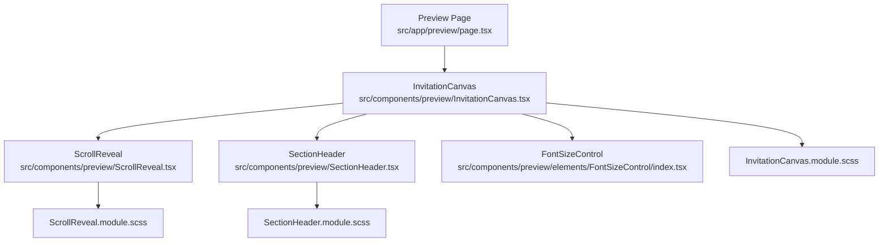
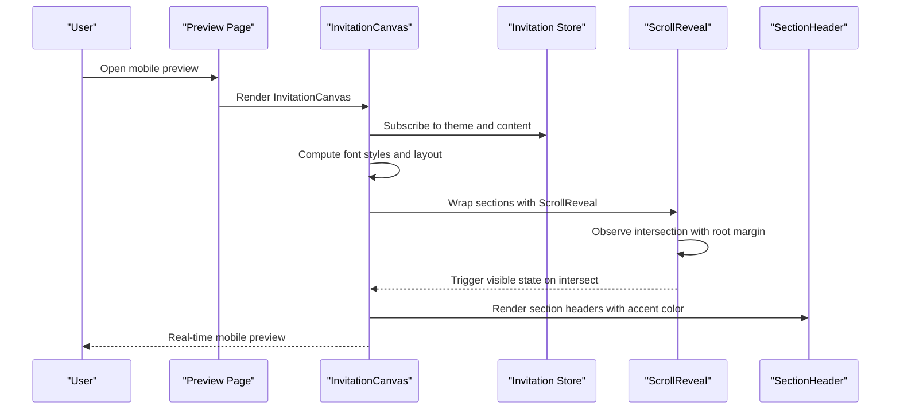
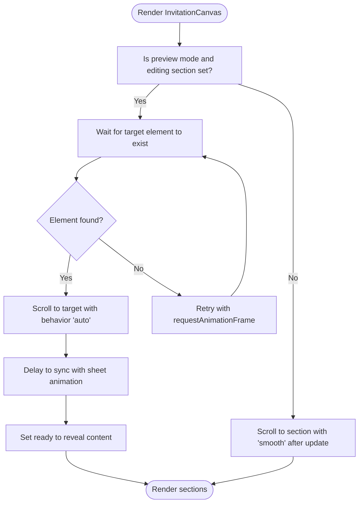
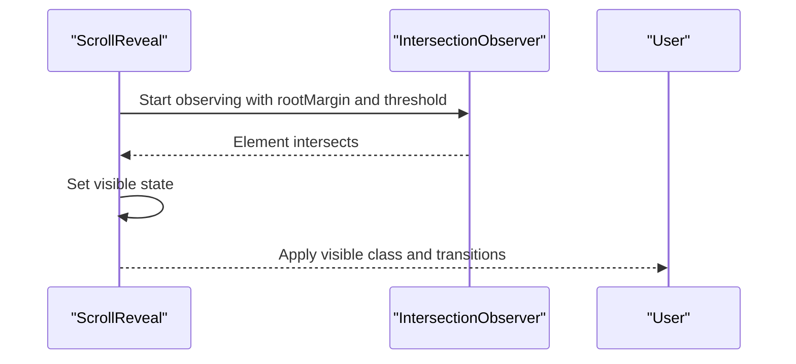
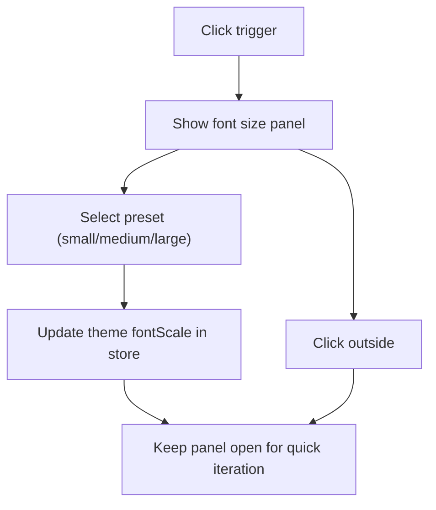
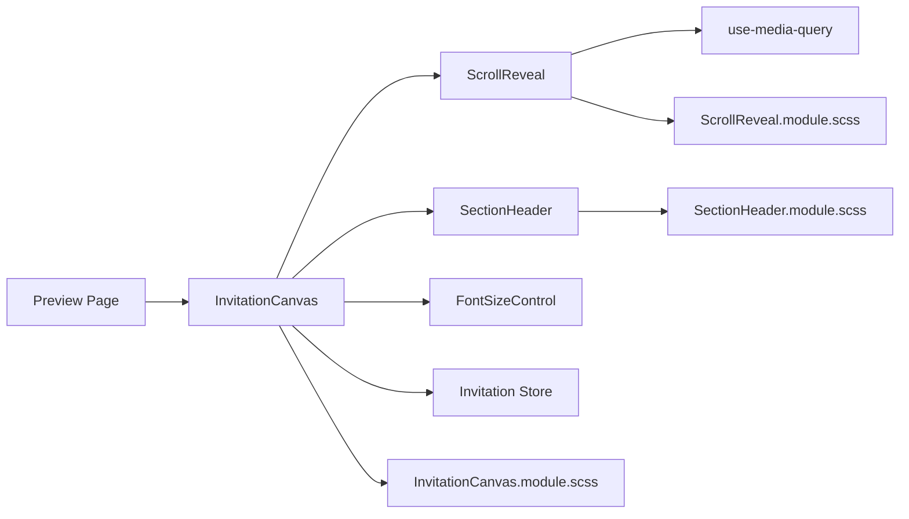

# Mobile Simulation

<cite>
**Referenced Files in This Document**
- [src/app/preview/page.tsx](file://src/app/preview/page.tsx)
- [src/components/preview/InvitationCanvas.tsx](file://src/components/preview/InvitationCanvas.tsx)
- [src/components/preview/InvitationCanvas.module.scss](file://src/components/preview/InvitationCanvas.module.scss)
- [src/components/preview/ScrollReveal.tsx](file://src/components/preview/ScrollReveal.tsx)
- [src/components/preview/ScrollReveal.module.scss](file://src/components/preview/ScrollReveal.module.scss)
- [src/components/preview/SectionHeader.tsx](file://src/components/preview/SectionHeader.tsx)
- [src/components/preview/SectionHeader.module.scss](file://src/components/preview/SectionHeader.module.scss)
- [src/components/preview/elements/FontSizeControl/index.tsx](file://src/components/preview/elements/FontSizeControl/index.tsx)
- [src/hooks/use-media-query.ts](file://src/hooks/use-media-query.ts)
</cite>

## Table of Contents
1. [Introduction](#introduction)
2. [Project Structure](#project-structure)
3. [Core Components](#core-components)
4. [Architecture Overview](#architecture-overview)
5. [Detailed Component Analysis](#detailed-component-analysis)
6. [Dependency Analysis](#dependency-analysis)
7. [Performance Considerations](#performance-considerations)
8. [Troubleshooting Guide](#troubleshooting-guide)
9. [Conclusion](#conclusion)
10. [Appendices](#appendices)

## Introduction
This document explains the mobile simulation system that powers realistic mobile preview experiences. It focuses on device frame rendering, responsive breakpoint handling, scroll behavior simulation, the ScrollReveal animation system, font size controls for preview accessibility, section header interactions, mobile-specific styling considerations, viewport emulation techniques, and integration with the builder interface for real-time preview updates. Practical examples and performance guidance are included to help customize and debug mobile previews effectively.

## Project Structure
The mobile preview pipeline centers around a dedicated preview page and a composition of preview components that render a complete invitation flow inside a scrollable canvas. The preview page hosts the InvitationCanvas, which orchestrates section rendering, animations, and accessibility controls.

**Diagram sources**
- [src/app/preview/page.tsx](file://src/app/preview/page.tsx#L1-L10)
- [src/components/preview/InvitationCanvas.tsx](file://src/components/preview/InvitationCanvas.tsx#L1-L469)
- [src/components/preview/ScrollReveal.tsx](file://src/components/preview/ScrollReveal.tsx#L1-L64)
- [src/components/preview/SectionHeader.tsx](file://src/components/preview/SectionHeader.tsx#L1-L31)
- [src/components/preview/elements/FontSizeControl/index.tsx](file://src/components/preview/elements/FontSizeControl/index.tsx#L1-L67)
- [src/components/preview/InvitationCanvas.module.scss](file://src/components/preview/InvitationCanvas.module.scss#L1-L73)
- [src/components/preview/ScrollReveal.module.scss](file://src/components/preview/ScrollReveal.module.scss#L1-L23)
- [src/components/preview/SectionHeader.module.scss](file://src/components/preview/SectionHeader.module.scss#L1-L33)

**Section sources**
- [src/app/preview/page.tsx](file://src/app/preview/page.tsx#L1-L10)
- [src/components/preview/InvitationCanvas.tsx](file://src/components/preview/InvitationCanvas.tsx#L1-L469)

## Core Components
- InvitationCanvas: Hosts the entire preview, manages scroll behavior, applies theme-based font scaling, and renders all sections. It also handles initial scroll-to-section logic for preview mode and integrates the font size control.
- ScrollReveal: Provides intersection-based entrance animations with reduced-motion awareness and smooth transitions.
- SectionHeader: Renders section titles with optional subtitles and accent decoration lines.
- FontSizeControl: Allows adjusting font scale in preview mode for accessibility testing.
- use-media-query hook: SSR-safe media query subscription used by ScrollReveal to respect user motion preferences.

**Section sources**
- [src/components/preview/InvitationCanvas.tsx](file://src/components/preview/InvitationCanvas.tsx#L1-L469)
- [src/components/preview/ScrollReveal.tsx](file://src/components/preview/ScrollReveal.tsx#L1-L64)
- [src/components/preview/SectionHeader.tsx](file://src/components/preview/SectionHeader.tsx#L1-L31)
- [src/components/preview/elements/FontSizeControl/index.tsx](file://src/components/preview/elements/FontSizeControl/index.tsx#L1-L67)
- [src/hooks/use-media-query.ts](file://src/hooks/use-media-query.ts#L1-L16)

## Architecture Overview
The mobile preview architecture composes a scrollable canvas that simulates a mobile device. Sections are rendered in order, with optional entrance animations and responsive typography. The system integrates with the builder’s store to reflect real-time changes instantly.

**Diagram sources**
- [src/app/preview/page.tsx](file://src/app/preview/page.tsx#L1-L10)
- [src/components/preview/InvitationCanvas.tsx](file://src/components/preview/InvitationCanvas.tsx#L1-L469)
- [src/components/preview/ScrollReveal.tsx](file://src/components/preview/ScrollReveal.tsx#L1-L64)
- [src/components/preview/SectionHeader.tsx](file://src/components/preview/SectionHeader.tsx#L1-L31)

## Detailed Component Analysis

### InvitationCanvas: Device Frame Rendering and Scroll Behavior
- Device frame and viewport emulation:
  - The canvas wrapper establishes a centered, bounded container suitable for mobile-sized screens and adds subtle shadow for depth.
  - On larger viewports, the wrapper constrains width to a mobile breakpoint to simulate a device frame.
- Scroll area and overflow:
  - The scroll container enables vertical scrolling and hides horizontal overflow, with a custom scrollbar utility applied.
- Initial scroll-to-section:
  - When preview mode is active and an editing section is specified, the component waits for the target element to be present and scrolls smoothly to it. A fallback mechanism ensures readiness even if layout is delayed.
  - After successful scroll, a short delay aligns with sheet animations to avoid layout jank, then reveals content.
- Accessibility and reduced motion:
  - Uses theme-provided font styles computed via a font utility to scale text consistently across sections.
- Modals and overlays:
  - A modal portal root is provided to keep overlays scoped within the preview.
- Watermark:
  - Unapproved live pages display a watermark overlay for visibility.

**Diagram sources**
- [src/components/preview/InvitationCanvas.tsx](file://src/components/preview/InvitationCanvas.tsx#L215-L288)

**Section sources**
- [src/components/preview/InvitationCanvas.tsx](file://src/components/preview/InvitationCanvas.tsx#L1-L469)
- [src/components/preview/InvitationCanvas.module.scss](file://src/components/preview/InvitationCanvas.module.scss#L1-L73)

### ScrollReveal: Entrance Animations and Reduced Motion
- Intersection observer:
  - Observes the wrapped element with a root margin and a modest threshold to trigger visibility early.
- Reduced motion:
  - Respects user preference for reduced motion by disabling animations when the system prefers reduced motion.
- Transition behavior:
  - Applies a smooth iOS-style easing with translate3d and opacity transitions for GPU-friendly animation.

**Diagram sources**
- [src/components/preview/ScrollReveal.tsx](file://src/components/preview/ScrollReveal.tsx#L23-L46)
- [src/components/preview/ScrollReveal.module.scss](file://src/components/preview/ScrollReveal.module.scss#L1-L23)
- [src/hooks/use-media-query.ts](file://src/hooks/use-media-query.ts#L1-L16)

**Section sources**
- [src/components/preview/ScrollReveal.tsx](file://src/components/preview/ScrollReveal.tsx#L1-L64)
- [src/components/preview/ScrollReveal.module.scss](file://src/components/preview/ScrollReveal.module.scss#L1-L23)
- [src/hooks/use-media-query.ts](file://src/hooks/use-media-query.ts#L1-L16)

### SectionHeader: Typography and Visual Hierarchy
- Renders a centered header with optional subtitle and a thin accent line.
- Typography scales with the current font scale variable to maintain readability across preview sizes.
- Accent color support allows consistent theming with the invitation’s theme.

**Section sources**
- [src/components/preview/SectionHeader.tsx](file://src/components/preview/SectionHeader.tsx#L1-L31)
- [src/components/preview/SectionHeader.module.scss](file://src/components/preview/SectionHeader.module.scss#L1-L33)

### FontSizeControl: Preview Accessibility Controls
- Provides a compact trigger button to toggle a panel of font size presets.
- Updates the theme’s font scale in the invitation store, immediately affecting all text sizing in the preview.
- Includes click-outside detection to close the panel cleanly.

**Diagram sources**
- [src/components/preview/elements/FontSizeControl/index.tsx](file://src/components/preview/elements/FontSizeControl/index.tsx#L9-L67)

**Section sources**
- [src/components/preview/elements/FontSizeControl/index.tsx](file://src/components/preview/elements/FontSizeControl/index.tsx#L1-L67)

### Responsive Breakpoint Handling and Viewport Emulation
- Mobile-first layout:
  - The canvas wrapper sets a constrained width on wider screens to emulate a mobile device frame.
- Media queries:
  - Additional breakpoints and responsive utilities are available through shared mixins and variables to fine-tune spacing and typography at various widths.
- Reduced motion:
  - The ScrollReveal component respects reduced motion preferences to ensure accessibility.

**Section sources**
- [src/components/preview/InvitationCanvas.module.scss](file://src/components/preview/InvitationCanvas.module.scss#L1-L73)
- [src/components/preview/ScrollReveal.module.scss](file://src/components/preview/ScrollReveal.module.scss#L15-L21)
- [src/hooks/use-media-query.ts](file://src/hooks/use-media-query.ts#L1-L16)

### Touch Gesture Simulation and Scroll Behavior
- Scroll behavior:
  - The canvas uses native vertical scrolling with hidden horizontal overflow. Entrance animations are intersection-based and do not rely on scroll events.
- Reduced motion:
  - When reduced motion is enabled, animations are disabled but scroll behavior remains unchanged.
- Initial scroll-to-section:
  - Uses scrollTo with either auto or smooth behavior depending on context, ensuring stable positioning even during animated drawers.

**Section sources**
- [src/components/preview/InvitationCanvas.tsx](file://src/components/preview/InvitationCanvas.tsx#L215-L288)
- [src/components/preview/ScrollReveal.tsx](file://src/components/preview/ScrollReveal.tsx#L18-L19)

### Integration with the Builder Interface and Real-Time Updates
- Store-driven rendering:
  - InvitationCanvas subscribes to the invitation store to receive real-time updates to theme and content, ensuring the preview reflects builder changes instantly.
- Preview page:
  - The preview page simply renders the canvas, keeping the integration surface minimal and predictable.

**Section sources**
- [src/components/preview/InvitationCanvas.tsx](file://src/components/preview/InvitationCanvas.tsx#L455-L468)
- [src/app/preview/page.tsx](file://src/app/preview/page.tsx#L1-L10)

## Dependency Analysis
The preview stack exhibits low coupling and clear separation of concerns:
- InvitationCanvas depends on ScrollReveal, SectionHeader, FontSizeControl, and the invitation store.
- ScrollReveal depends on the media query hook for reduced motion.
- Stylesheets encapsulate presentation logic and are consumed by their respective components.

**Diagram sources**
- [src/app/preview/page.tsx](file://src/app/preview/page.tsx#L1-L10)
- [src/components/preview/InvitationCanvas.tsx](file://src/components/preview/InvitationCanvas.tsx#L1-L469)
- [src/components/preview/ScrollReveal.tsx](file://src/components/preview/ScrollReveal.tsx#L1-L64)
- [src/components/preview/SectionHeader.tsx](file://src/components/preview/SectionHeader.tsx#L1-L31)
- [src/components/preview/elements/FontSizeControl/index.tsx](file://src/components/preview/elements/FontSizeControl/index.tsx#L1-L67)
- [src/hooks/use-media-query.ts](file://src/hooks/use-media-query.ts#L1-L16)
- [src/components/preview/InvitationCanvas.module.scss](file://src/components/preview/InvitationCanvas.module.scss#L1-L73)
- [src/components/preview/ScrollReveal.module.scss](file://src/components/preview/ScrollReveal.module.scss#L1-L23)
- [src/components/preview/SectionHeader.module.scss](file://src/components/preview/SectionHeader.module.scss#L1-L33)

**Section sources**
- [src/components/preview/InvitationCanvas.tsx](file://src/components/preview/InvitationCanvas.tsx#L1-L469)
- [src/components/preview/ScrollReveal.tsx](file://src/components/preview/ScrollReveal.tsx#L1-L64)
- [src/components/preview/SectionHeader.tsx](file://src/components/preview/SectionHeader.tsx#L1-L31)
- [src/components/preview/elements/FontSizeControl/index.tsx](file://src/components/preview/elements/FontSizeControl/index.tsx#L1-L67)
- [src/hooks/use-media-query.ts](file://src/hooks/use-media-query.ts#L1-L16)

## Performance Considerations
- GPU-accelerated animations:
  - ScrollReveal uses translate3d and opacity with will-change to leverage hardware acceleration.
- Intersection observer:
  - Efficiently triggers animations only when elements enter the viewport, minimizing layout thrash.
- Scroll stability:
  - Uses offsetTop-based scrolling and a short post-animation delay to avoid layout jitter during animated drawers.
- Hidden scrollbars:
  - Custom scrollbar utilities reduce paint overhead on scroll containers.
- SSR-safe media queries:
  - The media query hook avoids hydration mismatches and ensures consistent behavior across server and client.

[No sources needed since this section provides general guidance]

## Troubleshooting Guide
- Content does not appear on first load in preview mode:
  - Verify that the initial scroll-to-section logic completes retries and sets ready after the animation delay.
- Jitter or jump during drawer animations:
  - Ensure the scroll container uses offsetTop-based positioning and that the post-scroll delay matches the drawer animation duration.
- Animations not triggering:
  - Confirm that the intersection observer thresholds and root margins are appropriate and that reduced motion is not enabled.
- Font size adjustments not reflected:
  - Check that the font scale updates in the store and that the canvas recomputes font styles accordingly.
- Overly large margins on section headers:
  - Adjust the header margin in the section header stylesheet to reduce bottom spacing.

**Section sources**
- [src/components/preview/InvitationCanvas.tsx](file://src/components/preview/InvitationCanvas.tsx#L215-L288)
- [src/components/preview/ScrollReveal.tsx](file://src/components/preview/ScrollReveal.tsx#L23-L46)
- [src/components/preview/elements/FontSizeControl/index.tsx](file://src/components/preview/elements/FontSizeControl/index.tsx#L9-L67)
- [src/components/preview/SectionHeader.module.scss](file://src/components/preview/SectionHeader.module.scss#L5-L5)

## Conclusion
The mobile simulation system combines a scrollable canvas, intersection-based entrance animations, and responsive typography to deliver a realistic and accessible mobile preview. By leveraging the invitation store for real-time updates, providing font scaling controls, and respecting user motion preferences, the system supports efficient builder workflows and thorough mobile testing.

[No sources needed since this section summarizes without analyzing specific files]

## Appendices

### Practical Examples
- Customizing mobile preview appearance:
  - Adjust the canvas wrapper width and shadow in the canvas stylesheet to refine the device frame.
  - Modify the footer padding height and copyright text to fit branding needs.
- Enabling or disabling entrance animations:
  - Toggle the animateEntrance prop on ScrollReveal-wrapped sections to compare static vs. animated layouts.
- Fine-tuning scroll behavior:
  - Increase the post-scroll delay if drawers animate longer, or adjust the intersection observer root margin for earlier triggering.

**Section sources**
- [src/components/preview/InvitationCanvas.module.scss](file://src/components/preview/InvitationCanvas.module.scss#L1-L73)
- [src/components/preview/ScrollReveal.module.scss](file://src/components/preview/ScrollReveal.module.scss#L1-L23)
- [src/components/preview/ScrollReveal.tsx](file://src/components/preview/ScrollReveal.tsx#L23-L46)