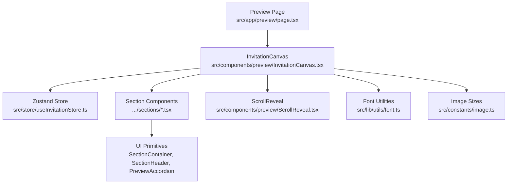
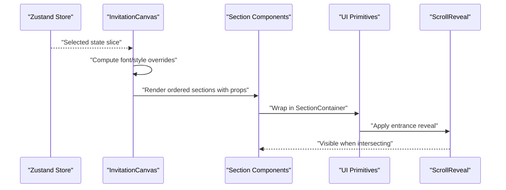
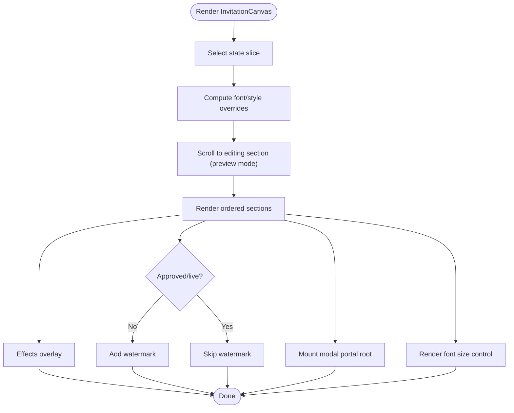
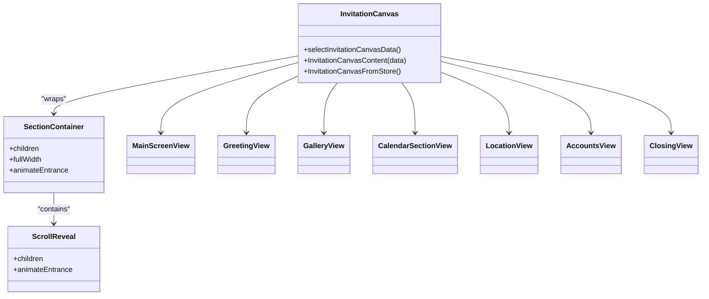
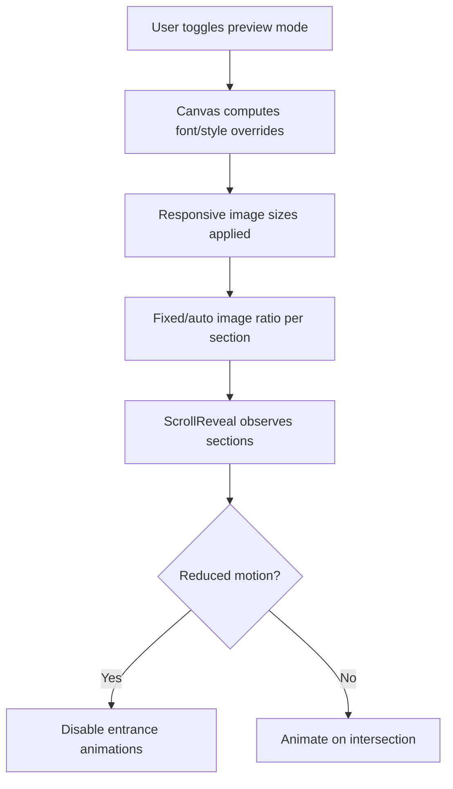
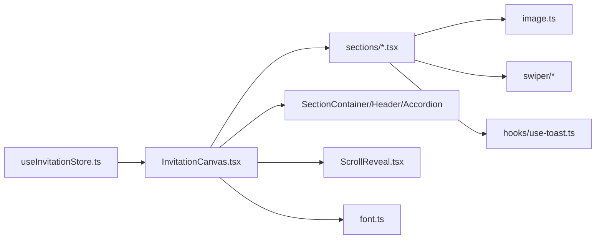

# Preview System

<cite>
**Referenced Files in This Document**
- [src/app/preview/page.tsx](file://src/app/preview/page.tsx)
- [src/components/preview/InvitationCanvas.tsx](file://src/components/preview/InvitationCanvas.tsx)
- [src/store/useInvitationStore.ts](file://src/store/useInvitationStore.ts)
- [src/components/preview/sections/MainScreenView.tsx](file://src/components/preview/sections/MainScreenView.tsx)
- [src/components/preview/sections/GreetingView.tsx](file://src/components/preview/sections/GreetingView.tsx)
- [src/components/preview/sections/GalleryView.tsx](file://src/components/preview/sections/GalleryView.tsx)
- [src/components/preview/sections/CalendarSectionView.tsx](file://src/components/preview/sections/CalendarSectionView.tsx)
- [src/components/preview/sections/LocationView.tsx](file://src/components/preview/sections/LocationView.tsx)
- [src/components/preview/sections/AccountsView.tsx](file://src/components/preview/sections/AccountsView.tsx)
- [src/components/preview/sections/ClosingView.tsx](file://src/components/preview/sections/ClosingView.tsx)
- [src/components/preview/ScrollReveal.tsx](file://src/components/preview/ScrollReveal.tsx)
- [src/components/preview/SectionContainer.tsx](file://src/components/preview/SectionContainer.tsx)
- [src/components/preview/SectionHeader.tsx](file://src/components/preview/SectionHeader.tsx)
- [src/components/preview/PreviewAccordion.tsx](file://src/components/preview/PreviewAccordion.tsx)
- [src/constants/image.ts](file://src/constants/image.ts)
- [src/lib/utils/font.ts](file://src/lib/utils/font.ts)
- [src/hooks/use-media-query.ts](file://src/hooks/use-media-query.ts)
</cite>

## Table of Contents
1. [Introduction](#introduction)
2. [Project Structure](#project-structure)
3. [Core Components](#core-components)
4. [Architecture Overview](#architecture-overview)
5. [Detailed Component Analysis](#detailed-component-analysis)
6. [Dependency Analysis](#dependency-analysis)
7. [Performance Considerations](#performance-considerations)
8. [Troubleshooting Guide](#troubleshooting-guide)
9. [Conclusion](#conclusion)
10. [Appendices](#appendices)

## Introduction
This document explains the real-time invitation rendering engine powering the preview system. It focuses on the InvitationCanvas architecture, how builder state translates into responsive mobile previews, the section rendering pipeline, and the mobile preview simulation with device frames and responsive breakpoints. It also covers customization examples, performance optimization for large canvases, export considerations, and cross-browser compatibility strategies.

## Project Structure
The preview system centers around a single page that renders the InvitationCanvas. InvitationCanvas composes multiple presentational section components, each responsible for a distinct part of the invitation layout. A centralized Zustand store holds the entire builder state, enabling real-time updates across the preview.

**Diagram sources**
- [src/app/preview/page.tsx](file://src/app/preview/page.tsx#L1-L10)
- [src/components/preview/InvitationCanvas.tsx](file://src/components/preview/InvitationCanvas.tsx#L1-L469)
- [src/store/useInvitationStore.ts](file://src/store/useInvitationStore.ts#L1-L534)
- [src/components/preview/ScrollReveal.tsx](file://src/components/preview/ScrollReveal.tsx#L1-L64)
- [src/lib/utils/font.ts](file://src/lib/utils/font.ts#L1-L57)
- [src/constants/image.ts](file://src/constants/image.ts#L1-L9)

**Section sources**
- [src/app/preview/page.tsx](file://src/app/preview/page.tsx#L1-L10)
- [src/components/preview/InvitationCanvas.tsx](file://src/components/preview/InvitationCanvas.tsx#L1-L469)

## Core Components
- InvitationCanvas: Orchestrates the entire preview, selects and passes only the subset of state needed for rendering, manages scroll-to-section behavior for editing, applies theme fonts and scaling, and conditionally renders overlays and watermarks.
- Section Components: Presentational components for each logical section (Main Screen, Greeting, Gallery, Calendar/D-Day, Location, Accounts, Closing).
- UI Primitives: SectionContainer, SectionHeader, PreviewAccordion, ScrollReveal encapsulate shared layout, typography, and motion behavior.
- Store: Centralized state with persistence and selective subscription for efficient updates.

**Section sources**
- [src/components/preview/InvitationCanvas.tsx](file://src/components/preview/InvitationCanvas.tsx#L28-L148)
- [src/store/useInvitationStore.ts](file://src/store/useInvitationStore.ts#L232-L371)
- [src/components/preview/SectionContainer.tsx](file://src/components/preview/SectionContainer.tsx#L8-L45)
- [src/components/preview/SectionHeader.tsx](file://src/components/preview/SectionHeader.tsx#L5-L26)
- [src/components/preview/PreviewAccordion.tsx](file://src/components/preview/PreviewAccordion.tsx#L8-L73)
- [src/components/preview/ScrollReveal.tsx](file://src/components/preview/ScrollReveal.tsx#L10-L63)

## Architecture Overview
The InvitationCanvas subscribes to a carefully selected slice of the store, ensuring minimal re-renders. It computes derived styles (fonts, scale, background) and passes typed props to each section. Sections are rendered in a fixed order, each wrapped in a container and optional entrance animation. Dynamic imports defer heavy map components until client-side. A modal portal root enables lightboxes and modals to stay within the preview frame.

**Diagram sources**
- [src/components/preview/InvitationCanvas.tsx](file://src/components/preview/InvitationCanvas.tsx#L91-L144)
- [src/components/preview/InvitationCanvas.tsx](file://src/components/preview/InvitationCanvas.tsx#L291-L294)
- [src/components/preview/SectionContainer.tsx](file://src/components/preview/SectionContainer.tsx#L21-L44)
- [src/components/preview/ScrollReveal.tsx](file://src/components/preview/ScrollReveal.tsx#L17-L63)

## Detailed Component Analysis

### InvitationCanvas: Real-time Rendering Engine
- State selection: Uses a selector to extract only the fields needed for preview rendering, minimizing unnecessary re-renders.
- Scroll-to-section: On preview mode, scrolls smoothly to the target section ID, with a stabilization delay to avoid layout jitter during animations.
- Theme application: Computes CSS variables for font family, scale, and background, applying them to the canvas wrapper.
- Conditional rendering: Effects overlay, watermark, and modal portal root; dynamic imports for map components; skeleton fallbacks for gallery.
- Composition: Renders sections in a strict order, each wrapped in a container and optional entrance animation.

**Diagram sources**
- [src/components/preview/InvitationCanvas.tsx](file://src/components/preview/InvitationCanvas.tsx#L91-L144)
- [src/components/preview/InvitationCanvas.tsx](file://src/components/preview/InvitationCanvas.tsx#L291-L294)
- [src/components/preview/InvitationCanvas.tsx](file://src/components/preview/InvitationCanvas.tsx#L215-L288)
- [src/components/preview/InvitationCanvas.tsx](file://src/components/preview/InvitationCanvas.tsx#L310-L449)

**Section sources**
- [src/components/preview/InvitationCanvas.tsx](file://src/components/preview/InvitationCanvas.tsx#L28-L148)
- [src/components/preview/InvitationCanvas.tsx](file://src/components/preview/InvitationCanvas.tsx#L150-L451)
- [src/store/useInvitationStore.ts](file://src/store/useInvitationStore.ts#L91-L144)

### Section Rendering System
Each section is a presentational component receiving typed props from the store slice. They are wrapped in SectionContainer and optionally animated via ScrollReveal. The order is:
1) Main Screen
2) Greeting
3) Gallery
4) Calendar & D-Day
5) Location
6) Accounts
7) Closing

**Diagram sources**
- [src/components/preview/InvitationCanvas.tsx](file://src/components/preview/InvitationCanvas.tsx#L315-L430)
- [src/components/preview/SectionContainer.tsx](file://src/components/preview/SectionContainer.tsx#L21-L44)
- [src/components/preview/ScrollReveal.tsx](file://src/components/preview/ScrollReveal.tsx#L17-L63)
- [src/components/preview/sections/MainScreenView.tsx](file://src/components/preview/sections/MainScreenView.tsx#L19-L47)
- [src/components/preview/sections/GreetingView.tsx](file://src/components/preview/sections/GreetingView.tsx#L23-L38)
- [src/components/preview/sections/GalleryView.tsx](file://src/components/preview/sections/GalleryView.tsx#L31-L43)
- [src/components/preview/sections/CalendarSectionView.tsx](file://src/components/preview/sections/CalendarSectionView.tsx#L9-L20)
- [src/components/preview/sections/LocationView.tsx](file://src/components/preview/sections/LocationView.tsx#L18-L37)
- [src/components/preview/sections/AccountsView.tsx](file://src/components/preview/sections/AccountsView.tsx#L19-L30)
- [src/components/preview/sections/ClosingView.tsx](file://src/components/preview/sections/ClosingView.tsx#L16-L31)

**Section sources**
- [src/components/preview/InvitationCanvas.tsx](file://src/components/preview/InvitationCanvas.tsx#L315-L430)
- [src/components/preview/SectionContainer.tsx](file://src/components/preview/SectionContainer.tsx#L8-L45)
- [src/components/preview/ScrollReveal.tsx](file://src/components/preview/ScrollReveal.tsx#L10-L63)

### Mobile Preview Simulation and Responsive Breakpoints
- Device frame: The preview is embedded in a white container suitable for simulating a mobile screen.
- Responsive breakpoints: Image sizes are tailored for mobile/desktop using media queries. Fixed vs auto image ratios adapt to layout needs.
- Entrance animations: ScrollReveal respects reduced motion preferences and triggers on viewport intersection.

**Diagram sources**
- [src/lib/utils/font.ts](file://src/lib/utils/font.ts#L34-L56)
- [src/constants/image.ts](file://src/constants/image.ts#L1-L9)
- [src/hooks/use-media-query.ts](file://src/hooks/use-media-query.ts#L1-L16)
- [src/components/preview/ScrollReveal.tsx](file://src/components/preview/ScrollReveal.tsx#L17-L46)

**Section sources**
- [src/app/preview/page.tsx](file://src/app/preview/page.tsx#L1-L10)
- [src/lib/utils/font.ts](file://src/lib/utils/font.ts#L1-L57)
- [src/constants/image.ts](file://src/constants/image.ts#L1-L9)
- [src/hooks/use-media-query.ts](file://src/hooks/use-media-query.ts#L1-L16)

### Individual Section Components

#### Main Screen View
- Layout variants: classic, minimal, english, korean, heart, arch, oval, frame, fill, basic.
- Image area: supports fixed/auto aspect and effects (mist, ripple); gradient overlays for fill layouts.
- Names and connectors: ampersand, ring, or custom connector text; optional suffix.

**Section sources**
- [src/components/preview/sections/MainScreenView.tsx](file://src/components/preview/sections/MainScreenView.tsx#L19-L47)
- [src/components/preview/sections/MainScreenView.tsx](file://src/components/preview/sections/MainScreenView.tsx#L113-L396)

#### Greeting View
- Rich text content area with optional header image.
- Family relation display for groom/bride; freeform names supported.

**Section sources**
- [src/components/preview/sections/GreetingView.tsx](file://src/components/preview/sections/GreetingView.tsx#L23-L38)
- [src/components/preview/sections/GreetingView.tsx](file://src/components/preview/sections/GreetingView.tsx#L43-L152)

#### Gallery View
- Multiple gallery types: swiper, thumbnail, grid.
- Autoplay, fade effects, and popup modal with focus trap and scroll lock.
- Portal-based modal mounts under a dedicated root to stay within the preview frame.

**Section sources**
- [src/components/preview/sections/GalleryView.tsx](file://src/components/preview/sections/GalleryView.tsx#L31-L43)
- [src/components/preview/sections/GalleryView.tsx](file://src/components/preview/sections/GalleryView.tsx#L50-L304)

#### Calendar & D-Day
- Monthly calendar grid highlighting the wedding date.
- Live countdown ticker and customizable D-Day message with token replacement.

**Section sources**
- [src/components/preview/sections/CalendarSectionView.tsx](file://src/components/preview/sections/CalendarSectionView.tsx#L9-L20)
- [src/components/preview/sections/CalendarSectionView.tsx](file://src/components/preview/sections/CalendarSectionView.tsx#L26-L230)

#### Location View
- Dynamic map containers (Kakao/Naver) loaded on demand.
- Navigation links to external maps and address copy action.
- Optional sketch image with fixed/auto ratio.

**Section sources**
- [src/components/preview/sections/LocationView.tsx](file://src/components/preview/sections/LocationView.tsx#L18-L37)
- [src/components/preview/sections/LocationView.tsx](file://src/components/preview/sections/LocationView.tsx#L58-L200)

#### Accounts View
- Accordion-based grouping for groom/bride accounts.
- Copy-to-clipboard for account numbers with toast feedback.

**Section sources**
- [src/components/preview/sections/AccountsView.tsx](file://src/components/preview/sections/AccountsView.tsx#L19-L30)
- [src/components/preview/sections/AccountsView.tsx](file://src/components/preview/sections/AccountsView.tsx#L36-L121)

#### Closing View
- Final message area with optional background image.
- Social sharing: Kakao share integration and link copy.

**Section sources**
- [src/components/preview/sections/ClosingView.tsx](file://src/components/preview/sections/ClosingView.tsx#L16-L31)
- [src/components/preview/sections/ClosingView.tsx](file://src/components/preview/sections/ClosingView.tsx#L37-L191)

### UI Primitives
- SectionContainer: Adds consistent spacing and optional full-width behavior; wraps ScrollReveal.
- SectionHeader: Title/subtitle with accent color and decorative line.
- PreviewAccordion: Expandable group with three color modes and dynamic text color calculation.
- ScrollReveal: IntersectionObserver-based entrance animation respecting reduced motion.

**Section sources**
- [src/components/preview/SectionContainer.tsx](file://src/components/preview/SectionContainer.tsx#L8-L45)
- [src/components/preview/SectionHeader.tsx](file://src/components/preview/SectionHeader.tsx#L5-L26)
- [src/components/preview/PreviewAccordion.tsx](file://src/components/preview/PreviewAccordion.tsx#L8-L73)
- [src/components/preview/ScrollReveal.tsx](file://src/components/preview/ScrollReveal.tsx#L10-L63)

## Dependency Analysis
- InvitationCanvas depends on:
  - Zustand store via a shallow selector for efficient subscriptions.
  - Font utilities for CSS variable computation.
  - Dynamic imports for map components to defer heavy libraries.
  - UI primitives for consistent layout and motion.
- Sections depend on:
  - SectionContainer and SectionHeader for structure.
  - Image sizing constants for responsive images.
  - Swiper for interactive galleries.
  - Toast hooks for user feedback.

**Diagram sources**
- [src/store/useInvitationStore.ts](file://src/store/useInvitationStore.ts#L373-L533)
- [src/components/preview/InvitationCanvas.tsx](file://src/components/preview/InvitationCanvas.tsx#L1-L469)
- [src/lib/utils/font.ts](file://src/lib/utils/font.ts#L1-L57)
- [src/constants/image.ts](file://src/constants/image.ts#L1-L9)

**Section sources**
- [src/store/useInvitationStore.ts](file://src/store/useInvitationStore.ts#L373-L533)
- [src/components/preview/InvitationCanvas.tsx](file://src/components/preview/InvitationCanvas.tsx#L1-L469)

## Performance Considerations
- Selective state subscription: The canvas uses a selector to pull only preview-relevant fields, reducing re-renders.
- Memoization: Core components are memoized to avoid unnecessary recomputation.
- Dynamic imports: Map components are loaded on demand to minimize initial bundle size.
- Image optimization: Next/Image with appropriate sizes and aspect ratios; blob URL handling for local images.
- Entrance animations: IntersectionObserver with reduced-motion safety avoids costly animations when not desired.
- Large galleries: Autoplay and fade effects are optional; modal synchronization minimizes layout thrash.
- Scroll stability: Auto vs smooth scrolling and stabilization delays prevent layout jitter during preview navigation.

[No sources needed since this section provides general guidance]

## Troubleshooting Guide
- Preview not scrolling to section:
  - Ensure the editingSection prop is set and matches a section ID. The canvas normalizes targets and waits for DOM readiness.
- Maps not loading:
  - Confirm mapType and coordinates; dynamic imports require client-side rendering.
- Gallery autoplay not working:
  - Verify galleryAutoplay flag and that the modal is closed; autoplay is paused when the popup is open.
- Watermark appears unexpectedly:
  - The watermark is shown when the invitation is not approved and not in preview mode.
- Reduced motion animations:
  - If entrance animations are disabled, confirm system preference and that animateEntrance is not forced true.

**Section sources**
- [src/components/preview/InvitationCanvas.tsx](file://src/components/preview/InvitationCanvas.tsx#L215-L288)
- [src/components/preview/sections/LocationView.tsx](file://src/components/preview/sections/LocationView.tsx#L48-L56)
- [src/components/preview/sections/GalleryView.tsx](file://src/components/preview/sections/GalleryView.tsx#L101-L114)
- [src/components/preview/InvitationCanvas.tsx](file://src/components/preview/InvitationCanvas.tsx#L440-L442)
- [src/components/preview/ScrollReveal.tsx](file://src/components/preview/ScrollReveal.tsx#L17-L46)

## Conclusion
The preview system’s InvitationCanvas efficiently translates builder state into a responsive, animated, and modular invitation layout. By combining a focused store slice, dynamic imports, and UI primitives, it delivers a smooth real-time preview experience. Sections are composed in a clear order, with careful attention to performance and accessibility. The system supports customization through theme and section options, and provides pathways for export and sharing.

[No sources needed since this section summarizes without analyzing specific files]

## Appendices

### Practical Examples
- Customize fonts and scale: Adjust theme.font and theme.fontScale to change the entire preview’s typography.
- Modify entrance animations: Toggle theme.animateEntrance or use reduced motion preferences to disable animations.
- Gallery behavior: Choose galleryType, enable galleryAutoplay, and configure galleryFade for different experiences.
- Map provider: Switch mapType between naver and kakao; adjust mapZoom and lockMap for positioning.
- Watermark visibility: The watermark appears only when isApproved is false and not in preview mode.

**Section sources**
- [src/lib/utils/font.ts](file://src/lib/utils/font.ts#L34-L56)
- [src/components/preview/InvitationCanvas.tsx](file://src/components/preview/InvitationCanvas.tsx#L291-L294)
- [src/components/preview/sections/GalleryView.tsx](file://src/components/preview/sections/GalleryView.tsx#L128-L144)
- [src/components/preview/sections/LocationView.tsx](file://src/components/preview/sections/LocationView.tsx#L121-L137)
- [src/components/preview/InvitationCanvas.tsx](file://src/components/preview/InvitationCanvas.tsx#L440-L442)

### Export Functionality
- Current capabilities: The preview exposes a shareable URL and Kakao share integration in the Closing section.
- Suggested export: To export a static image, capture the canvas container using browser APIs or server-side rendering with a headless browser. Ensure the watermark is hidden and the modal portal is included in the capture.

**Section sources**
- [src/components/preview/sections/ClosingView.tsx](file://src/components/preview/sections/ClosingView.tsx#L55-L116)
- [src/components/preview/InvitationCanvas.tsx](file://src/components/preview/InvitationCanvas.tsx#L445-L449)

### Cross-Browser Compatibility
- Font rendering: CSS variables ensure consistent fallbacks across browsers.
- Media queries: Responsive image sizes rely on modern browser support; ensure polyfills if targeting older environments.
- IntersectionObserver: Used for animations; provide a polyfill for legacy browsers if needed.
- Dynamic imports: Require modern bundlers; ensure Next.js runtime handles SSR safely.

**Section sources**
- [src/lib/utils/font.ts](file://src/lib/utils/font.ts#L34-L56)
- [src/constants/image.ts](file://src/constants/image.ts#L1-L9)
- [src/components/preview/ScrollReveal.tsx](file://src/components/preview/ScrollReveal.tsx#L23-L46)