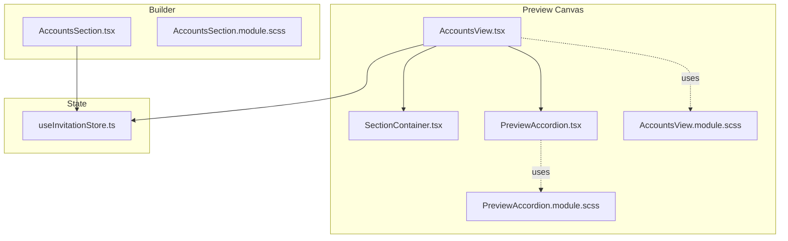
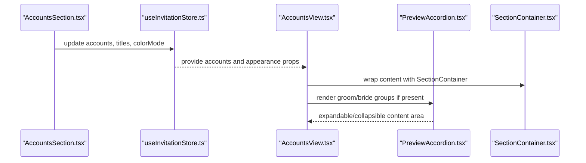
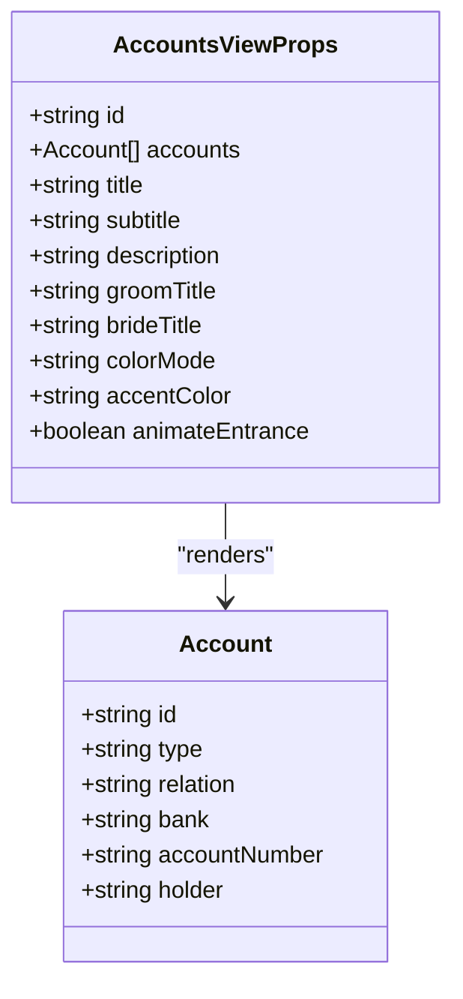
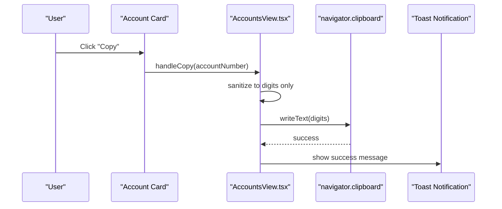
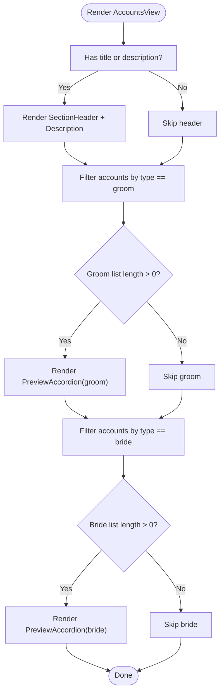
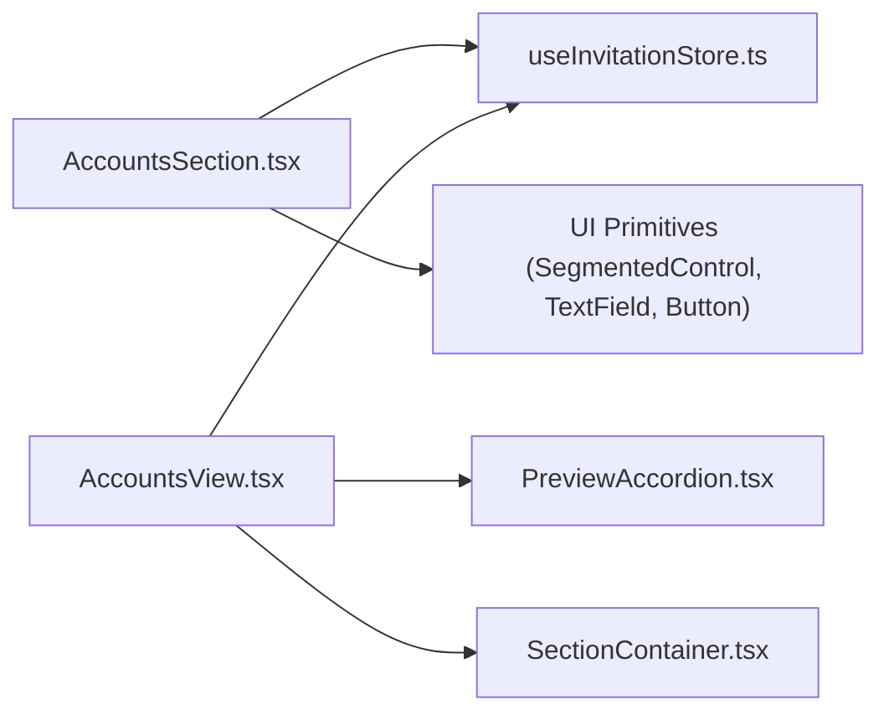

# Accounts View

<cite>
**Referenced Files in This Document**
- [AccountsView.tsx](file://src/components/preview/sections/AccountsView.tsx)
- [AccountsView.module.scss](file://src/components/preview/sections/AccountsView.module.scss)
- [AccountsSection.tsx](file://src/components/builder/sections/AccountsSection.tsx)
- [AccountsSection.module.scss](file://src/components/builder/sections/AccountsSection.module.scss)
- [useInvitationStore.ts](file://src/store/useInvitationStore.ts)
- [PreviewAccordion.tsx](file://src/components/preview/PreviewAccordion.tsx)
- [PreviewAccordion.module.scss](file://src/components/preview/PreviewAccordion.module.scss)
- [SectionContainer.tsx](file://src/components/preview/SectionContainer.tsx)
- [_accessibility.scss](file://src/styles/_accessibility.scss)
- [layout.tsx](file://src/app/layout.tsx)
- [login page](file://src/app/login/LoginPage.tsx)
- [privacy page](file://src/app/privacy/page.tsx)
</cite>

## Table of Contents
1. [Introduction](#introduction)
2. [Project Structure](#project-structure)
3. [Core Components](#core-components)
4. [Architecture Overview](#architecture-overview)
5. [Detailed Component Analysis](#detailed-component-analysis)
6. [Dependency Analysis](#dependency-analysis)
7. [Performance Considerations](#performance-considerations)
8. [Troubleshooting Guide](#troubleshooting-guide)
9. [Conclusion](#conclusion)

## Introduction
This document explains the AccountsView component responsible for displaying account and contact information in the invitation preview. It covers how account information is rendered, how contact-related UI elements behave, how the component integrates with the builder’s configuration, and how it handles responsive layouts, copy-to-clipboard functionality, and styling modes. Privacy considerations and accessibility features are also addressed.

## Project Structure
AccountsView is part of the preview section components and works alongside shared presentation primitives such as SectionContainer and PreviewAccordion. The builder-side AccountsSection manages the configuration stored in the invitation store.

**Diagram sources**
- [AccountsView.tsx](file://src/components/preview/sections/AccountsView.tsx#L1-L127)
- [SectionContainer.tsx](file://src/components/preview/SectionContainer.tsx#L1-L50)
- [PreviewAccordion.tsx](file://src/components/preview/PreviewAccordion.tsx#L1-L74)
- [AccountsView.module.scss](file://src/components/preview/sections/AccountsView.module.scss#L1-L90)
- [PreviewAccordion.module.scss](file://src/components/preview/PreviewAccordion.module.scss#L1-L89)
- [AccountsSection.tsx](file://src/components/builder/sections/AccountsSection.tsx#L1-L304)
- [AccountsSection.module.scss](file://src/components/builder/sections/AccountsSection.module.scss#L1-L140)
- [useInvitationStore.ts](file://src/store/useInvitationStore.ts#L113-L128)

**Section sources**
- [AccountsView.tsx](file://src/components/preview/sections/AccountsView.tsx#L1-L127)
- [AccountsSection.tsx](file://src/components/builder/sections/AccountsSection.tsx#L1-L304)
- [useInvitationStore.ts](file://src/store/useInvitationStore.ts#L113-L128)

## Core Components
- AccountsView: Renders the accounts section in the preview canvas. It separates accounts by type (groom/bride), conditionally renders sections, and provides a copy-to-clipboard action for account numbers.
- PreviewAccordion: Provides expandable/collapsible grouping for account lists with three color modes and dynamic accent color support.
- SectionContainer: Wraps preview sections with consistent spacing and entrance animations.
- AccountsSection (Builder): Manages account configuration in the builder UI, including adding/removing accounts and setting group titles and color mode.
- useInvitationStore: Centralized state for accounts, titles, subtitles, descriptions, and color mode.

Key responsibilities:
- Rendering account cards with relation, bank/holder, and formatted account number.
- Conditional rendering of groom and bride sections.
- Copy-to-clipboard with sanitized numeric formatting.
- Styling via colorMode and accentColor.
- Integration with builder configuration via Zustand store.

**Section sources**
- [AccountsView.tsx](file://src/components/preview/sections/AccountsView.tsx#L10-L30)
- [PreviewAccordion.tsx](file://src/components/preview/PreviewAccordion.tsx#L8-L28)
- [SectionContainer.tsx](file://src/components/preview/SectionContainer.tsx#L8-L28)
- [AccountsSection.tsx](file://src/components/builder/sections/AccountsSection.tsx#L1-L304)
- [useInvitationStore.ts](file://src/store/useInvitationStore.ts#L113-L128)

## Architecture Overview
AccountsView composes reusable preview components and reads configuration/state from the invitation store. The builder updates the store, which the preview consumes to render the final UI.

**Diagram sources**
- [AccountsSection.tsx](file://src/components/builder/sections/AccountsSection.tsx#L147-L304)
- [useInvitationStore.ts](file://src/store/useInvitationStore.ts#L113-L128)
- [AccountsView.tsx](file://src/components/preview/sections/AccountsView.tsx#L82-L121)
- [PreviewAccordion.tsx](file://src/components/preview/PreviewAccordion.tsx#L21-L73)
- [SectionContainer.tsx](file://src/components/preview/SectionContainer.tsx#L21-L45)

## Detailed Component Analysis

### AccountsView Component
AccountsView is a memoized presentation component that:
- Splits accounts into groom and bride groups.
- Conditionally renders a header and description when provided.
- Uses PreviewAccordion to group accounts by side.
- Provides a copy-to-clipboard action that strips non-digit characters from account numbers.

Rendering logic highlights:
- Filters accounts by type and renders separate accordions when lists are non-empty.
- Uses SectionContainer for consistent layout and entrance animation.
- Uses PreviewAccordion with configurable mode and accent color.

Copy-to-clipboard behavior:
- Sanitizes input to digits only before copying.
- Triggers a toast notification upon successful copy.

Styling system:
- Uses colorMode (accent/subtle/white) and accentColor to style the accordion header and icons.
- Applies CSS Modules for scoped styles.

Responsive layout:
- Flexbox-based layout adapts to screen sizes.
- Typography scales with a font-scale variable.

Accessibility considerations:
- Uses focus-visible styles for keyboard navigation.
- Buttons are keyboard operable and announce expanded state via aria-expanded.

Privacy considerations:
- Account numbers are copied without sensitive metadata.
- No personal contact details are exposed beyond the configured account list.

**Section sources**
- [AccountsView.tsx](file://src/components/preview/sections/AccountsView.tsx#L36-L122)
- [AccountsView.module.scss](file://src/components/preview/sections/AccountsView.module.scss#L13-L90)
- [_accessibility.scss](file://src/styles/_accessibility.scss#L13-L25)

### PreviewAccordion Component
PreviewAccordion provides:
- Expand/collapse behavior with animated height transitions.
- Three modes: subtle, accent, and white.
- Dynamic accent color with automatic contrast-aware text color.
- Accessible ARIA attributes and keyboard support.

Styling integration:
- Uses CSS variables for accent background and text color.
- Mode classes switch background and border styles.

**Section sources**
- [PreviewAccordion.tsx](file://src/components/preview/PreviewAccordion.tsx#L21-L73)
- [PreviewAccordion.module.scss](file://src/components/preview/PreviewAccordion.module.scss#L3-L89)

### SectionContainer Component
SectionContainer wraps preview sections with:
- Consistent inner container and optional full-width behavior.
- Entrance animation integration via ScrollReveal.
- Memoization to avoid unnecessary re-renders.

**Section sources**
- [SectionContainer.tsx](file://src/components/preview/SectionContainer.tsx#L21-L45)

### Builder AccountsSection
AccountsSection manages:
- Adding/removing accounts and updating fields (type, relation, bank, accountNumber, holder).
- Updating group titles and color mode.
- Using segmented controls and form fields for configuration.
- Persisting changes to the invitation store.

Integration with store:
- Reads and writes accounts, titles, subtitles, descriptions, and color mode.
- Uses shallow selectors to subscribe to specific fields.

**Section sources**
- [AccountsSection.tsx](file://src/components/builder/sections/AccountsSection.tsx#L147-L304)
- [AccountsSection.module.scss](file://src/components/builder/sections/AccountsSection.module.scss#L1-L140)
- [useInvitationStore.ts](file://src/store/useInvitationStore.ts#L113-L128)

### Data Model and Store Integration
The invitation store defines:
- accounts: array of account objects with id, type, relation, bank, accountNumber, holder.
- accountsTitle, accountsSubtitle, accountsDescription, accountsGroomTitle, accountsBrideTitle, accountsColorMode.

These fields are used by AccountsView to render the section and by AccountsSection to configure it.

**Section sources**
- [useInvitationStore.ts](file://src/store/useInvitationStore.ts#L113-L128)
- [AccountsView.tsx](file://src/components/preview/sections/AccountsView.tsx#L19-L30)

### Class Diagram: Accounts Types

**Diagram sources**
- [AccountsView.tsx](file://src/components/preview/sections/AccountsView.tsx#L10-L30)

### Sequence Diagram: Copy-to-Clipboard Flow

**Diagram sources**
- [AccountsView.tsx](file://src/components/preview/sections/AccountsView.tsx#L53-L59)

### Flowchart: Conditional Rendering of Account Groups

**Diagram sources**
- [AccountsView.tsx](file://src/components/preview/sections/AccountsView.tsx#L50-L121)

## Dependency Analysis
AccountsView depends on:
- PreviewAccordion for expandable sections.
- SectionContainer for layout and entrance animation.
- useInvitationStore for configuration and data.
- CSS Modules for scoped styling.

Builder AccountsSection depends on:
- useInvitationStore for state updates.
- UI primitives for form controls and layout.

**Diagram sources**
- [AccountsSection.tsx](file://src/components/builder/sections/AccountsSection.tsx#L1-L304)
- [AccountsView.tsx](file://src/components/preview/sections/AccountsView.tsx#L1-L127)
- [PreviewAccordion.tsx](file://src/components/preview/PreviewAccordion.tsx#L1-L74)
- [SectionContainer.tsx](file://src/components/preview/SectionContainer.tsx#L1-L50)
- [useInvitationStore.ts](file://src/store/useInvitationStore.ts#L113-L128)

**Section sources**
- [AccountsSection.tsx](file://src/components/builder/sections/AccountsSection.tsx#L1-L304)
- [AccountsView.tsx](file://src/components/preview/sections/AccountsView.tsx#L1-L127)
- [useInvitationStore.ts](file://src/store/useInvitationStore.ts#L113-L128)

## Performance Considerations
- Memoization: AccountsView is memoized to prevent unnecessary re-renders when props are unchanged.
- Conditional rendering: Sections are only rendered when there is data, reducing DOM nodes.
- CSS Modules: Scoped styles minimize cascade and improve maintainability.
- Animation: Entrance animation is opt-in via animateEntrance prop.

[No sources needed since this section provides general guidance]

## Troubleshooting Guide
Common issues and resolutions:
- Empty account list: Ensure accounts are populated in the store; AccountsView will skip rendering of empty groups.
- Copy button not working: Verify clipboard permissions and browser support; the component sanitizes input to digits before copying.
- Styling mismatch: Confirm colorMode and accentColor values match expected values; PreviewAccordion computes text color based on background contrast.
- Accessibility: Ensure focus-visible styles are applied; buttons and interactive elements should be keyboard operable.

Privacy and authentication:
- Contact details visibility is controlled by the configured accounts; no external contact information is shown.
- Authentication pages link to privacy policy; ensure compliance with data protection policies.

**Section sources**
- [AccountsView.tsx](file://src/components/preview/sections/AccountsView.tsx#L53-L59)
- [PreviewAccordion.tsx](file://src/components/preview/PreviewAccordion.tsx#L31-L41)
- [login page](file://src/app/login/LoginPage.tsx#L123-L154)
- [privacy page](file://src/app/privacy/page.tsx#L18-L65)

## Conclusion
AccountsView provides a clean, accessible, and responsive way to present account information in the invitation preview. Its integration with PreviewAccordion and SectionContainer ensures consistent UX, while the builder-side AccountsSection and useInvitationStore keep configuration centralized and easy to manage. Privacy and accessibility are considered through sanitization, contrast-aware styling, and focus-visible indicators.