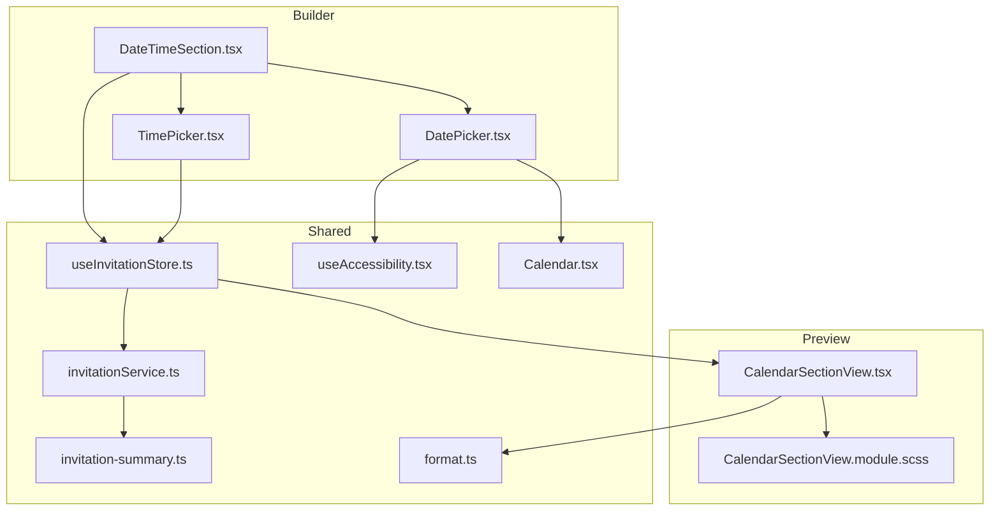
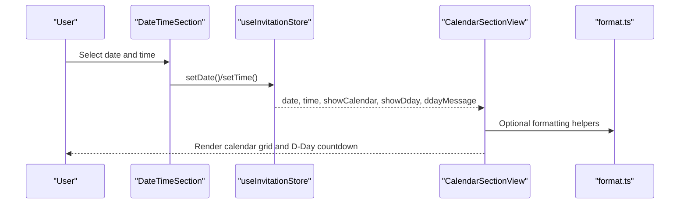
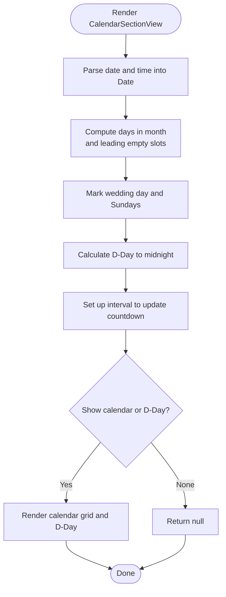
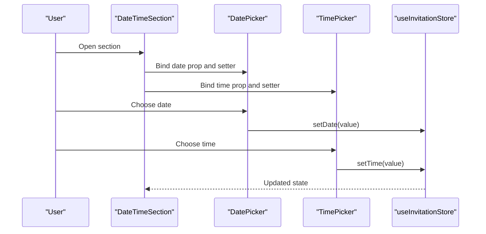
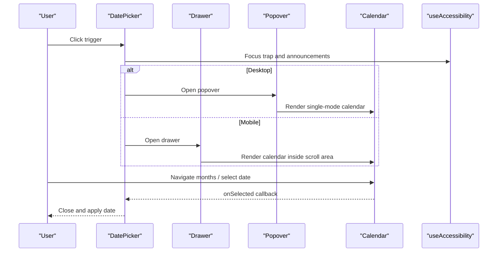
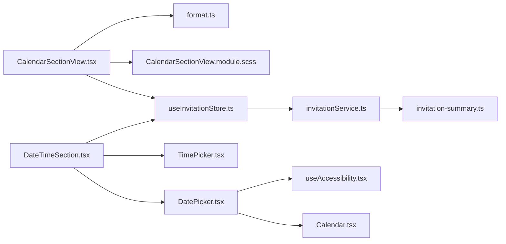

# Calendar Section View

<cite>
**Referenced Files in This Document**
- [CalendarSectionView.tsx](file://src/components/preview/sections/CalendarSectionView.tsx)
- [CalendarSectionView.module.scss](file://src/components/preview/sections/CalendarSectionView.module.scss)
- [DateTimeSection.tsx](file://src/components/builder/sections/DateTimeSection.tsx)
- [DatePicker.tsx](file://src/components/common/DatePicker/DatePicker.tsx)
- [TimePicker.tsx](file://src/components/common/TimePicker/TimePicker.tsx)
- [Calendar.tsx](file://src/components/ui/Calendar/Calendar.tsx)
- [format.ts](file://src/lib/utils/format.ts)
- [useInvitationStore.ts](file://src/store/useInvitationStore.ts)
- [invitationService.ts](file://src/services/invitationService.ts)
- [invitation-summary.ts](file://src/lib/invitation-summary.ts)
- [useAccessibility.tsx](file://src/hooks/useAccessibility.tsx)
</cite>

## Table of Contents
1. [Introduction](#introduction)
2. [Project Structure](#project-structure)
3. [Core Components](#core-components)
4. [Architecture Overview](#architecture-overview)
5. [Detailed Component Analysis](#detailed-component-analysis)
6. [Dependency Analysis](#dependency-analysis)
7. [Performance Considerations](#performance-considerations)
8. [Troubleshooting Guide](#troubleshooting-guide)
9. [Conclusion](#conclusion)

## Introduction
This document explains the CalendarSectionView component that renders the date and time display section of wedding invitations. It covers the calendar rendering system, date formatting logic, timezone handling, event display, date validation, and integration with the invitation's date/time settings. It also documents responsive calendar layouts, mobile-friendly date pickers, accessibility features, internationalization support, date range validation, and the relationship with the invitation's scheduling system.

## Project Structure
The CalendarSectionView component is part of the preview section rendering pipeline and integrates with builder controls and shared utilities.

**Diagram sources**
- [DateTimeSection.tsx](file://src/components/builder/sections/DateTimeSection.tsx#L15-L95)
- [DatePicker.tsx](file://src/components/common/DatePicker/DatePicker.tsx#L29-L115)
- [TimePicker.tsx](file://src/components/common/TimePicker/TimePicker.tsx#L17-L103)
- [CalendarSectionView.tsx](file://src/components/preview/sections/CalendarSectionView.tsx#L26-L235)
- [CalendarSectionView.module.scss](file://src/components/preview/sections/CalendarSectionView.module.scss#L1-L142)
- [useInvitationStore.ts](file://src/store/useInvitationStore.ts#L274-L451)
- [Calendar.tsx](file://src/components/ui/Calendar/Calendar.tsx#L14-L53)
- [invitationService.ts](file://src/services/invitationService.ts#L9-L80)
- [invitation-summary.ts](file://src/lib/invitation-summary.ts#L1-L74)
- [format.ts](file://src/lib/utils/format.ts#L5-L40)
- [useAccessibility.tsx](file://src/hooks/useAccessibility.tsx#L22-L76)

**Section sources**
- [CalendarSectionView.tsx](file://src/components/preview/sections/CalendarSectionView.tsx#L1-L236)
- [DateTimeSection.tsx](file://src/components/builder/sections/DateTimeSection.tsx#L1-L95)

## Core Components
- CalendarSectionView: Renders the calendar grid and D-Day countdown for preview.
- DateTimeSection: Builder UI for selecting date, time, and toggling calendar/D-Day visibility.
- DatePicker and TimePicker: Mobile-responsive date/time selection controls.
- Calendar (UI): Localized calendar widget with navigation and accessibility.
- useInvitationStore: Centralized state for date/time and display options.
- format utilities: Date/time formatting helpers.
- invitationService and invitation-summary: Invitation persistence and summary projection.

**Section sources**
- [CalendarSectionView.tsx](file://src/components/preview/sections/CalendarSectionView.tsx#L26-L235)
- [DateTimeSection.tsx](file://src/components/builder/sections/DateTimeSection.tsx#L15-L95)
- [DatePicker.tsx](file://src/components/common/DatePicker/DatePicker.tsx#L29-L115)
- [TimePicker.tsx](file://src/components/common/TimePicker/TimePicker.tsx#L17-L103)
- [Calendar.tsx](file://src/components/ui/Calendar/Calendar.tsx#L14-L174)
- [useInvitationStore.ts](file://src/store/useInvitationStore.ts#L274-L451)
- [format.ts](file://src/lib/utils/format.ts#L5-L40)
- [invitationService.ts](file://src/services/invitationService.ts#L9-L80)
- [invitation-summary.ts](file://src/lib/invitation-summary.ts#L1-L74)

## Architecture Overview
The calendar section is driven by builder inputs and rendered in preview mode. The builder updates Zustand state, which the preview reads to render the calendar grid, highlight the wedding day, and compute D-Day countdown.

**Diagram sources**
- [DateTimeSection.tsx](file://src/components/builder/sections/DateTimeSection.tsx#L48-L91)
- [useInvitationStore.ts](file://src/store/useInvitationStore.ts#L400-L451)
- [CalendarSectionView.tsx](file://src/components/preview/sections/CalendarSectionView.tsx#L26-L235)
- [format.ts](file://src/lib/utils/format.ts#L5-L40)

## Detailed Component Analysis

### CalendarSectionView: Calendar Rendering and D-Day Countdown
- Props: Accepts date, time, accent color, names, and visibility flags for calendar and D-Day.
- Wedding date parsing: Converts "YYYY-MM-DD" plus "HH:mm" into a Date object.
- Calendar grid generation: Computes days in month, leading empty slots for previous month, and marks the wedding day and Sundays.
- D-Day calculation: Computes days remaining to the wedding midnight, returning "today", positive days, or offset with sign.
- Countdown ticker: Updates every second using a timer hook.
- Conditional rendering: Returns null if both calendar and D-Day are hidden.

**Diagram sources**
- [CalendarSectionView.tsx](file://src/components/preview/sections/CalendarSectionView.tsx#L38-L139)

**Section sources**
- [CalendarSectionView.tsx](file://src/components/preview/sections/CalendarSectionView.tsx#L26-L235)
- [CalendarSectionView.module.scss](file://src/components/preview/sections/CalendarSectionView.module.scss#L4-L142)

### Date and Time Inputs: Builder Integration
- DateTimeSection wires DatePicker and TimePicker to Zustand state setters.
- DatePicker uses date-fns with Korean locale and switches between popover (desktop) and drawer (mobile).
- TimePicker provides hour/minute selection with AM/PM conversion and 24-hour recomposition.

**Diagram sources**
- [DateTimeSection.tsx](file://src/components/builder/sections/DateTimeSection.tsx#L48-L91)
- [DatePicker.tsx](file://src/components/common/DatePicker/DatePicker.tsx#L29-L115)
- [TimePicker.tsx](file://src/components/common/TimePicker/TimePicker.tsx#L17-L103)
- [useInvitationStore.ts](file://src/store/useInvitationStore.ts#L400-L451)

**Section sources**
- [DateTimeSection.tsx](file://src/components/builder/sections/DateTimeSection.tsx#L15-L95)
- [DatePicker.tsx](file://src/components/common/DatePicker/DatePicker.tsx#L29-L115)
- [TimePicker.tsx](file://src/components/common/TimePicker/TimePicker.tsx#L17-L103)

### Responsive Calendar Layout and Mobile Pickers
- Desktop: Popover opens a localized Calendar with navigation buttons.
- Mobile: Drawer hosts the Calendar; focus management ensures accessibility and prevents aria-hidden warnings.
- Calendar UI: Custom caption and day buttons with keyboard navigation and screen-reader-friendly labels.

**Diagram sources**
- [DatePicker.tsx](file://src/components/common/DatePicker/DatePicker.tsx#L29-L115)
- [Calendar.tsx](file://src/components/ui/Calendar/Calendar.tsx#L59-L174)
- [useAccessibility.tsx](file://src/hooks/useAccessibility.tsx#L22-L76)

**Section sources**
- [DatePicker.tsx](file://src/components/common/DatePicker/DatePicker.tsx#L29-L115)
- [Calendar.tsx](file://src/components/ui/Calendar/Calendar.tsx#L14-L174)
- [useAccessibility.tsx](file://src/hooks/useAccessibility.tsx#L22-L76)

### Date Formatting Logic and Internationalization
- CalendarSectionView uses hardcoded English month names and weekday abbreviations.
- Shared formatting utilities provide localized formatting for display elsewhere:
  - formatDate: "YYYY. MM. DD"
  - formatShortDate: "MM.DD"
  - formatTime: "HH:MM AM/PM"
  - getWeekday/getWeekdayKr: English/Korean weekday names
- DatePicker uses date-fns with Korean locale for desktop popover.

**Section sources**
- [CalendarSectionView.tsx](file://src/components/preview/sections/CalendarSectionView.tsx#L141-L142)
- [format.ts](file://src/lib/utils/format.ts#L5-L40)
- [DatePicker.tsx](file://src/components/common/DatePicker/DatePicker.tsx#L53-L54)

### Timezone Handling
- CalendarSectionView constructs the wedding Date from "YYYY-MM-DD" plus "HH:mm" without explicit timezone offsets.
- The computed Date reflects the local browser timezone of the viewer.
- Recommendation: For cross-timezone events, store UTC timestamps and convert to local time in presentation logic.

**Section sources**
- [CalendarSectionView.tsx](file://src/components/preview/sections/CalendarSectionView.tsx#L38-L51)

### Event Display and Conditional Rendering
- Wedding day marker: A colored dot appears on the selected day in the calendar grid.
- Visibility flags: showCalendar and showDday control whether the calendar grid and D-Day section render.
- D-Day message tokens: "(신랑)", "(신부)", and "(D-Day)" are replaced with groom/bride names and computed days.

**Section sources**
- [CalendarSectionView.tsx](file://src/components/preview/sections/CalendarSectionView.tsx#L171-L189)
- [CalendarSectionView.tsx](file://src/components/preview/sections/CalendarSectionView.tsx#L80-L101)

### Date Range Validation and Scheduling Integration
- Default date in store is set to 100 days in the future.
- Builder requires both date and time to mark the section as complete.
- Invitation persistence stores the entire invitation payload, including date/time and display options.

**Section sources**
- [useInvitationStore.ts](file://src/store/useInvitationStore.ts#L238-L242)
- [DateTimeSection.tsx](file://src/components/builder/sections/DateTimeSection.tsx#L46-L47)
- [invitationService.ts](file://src/services/invitationService.ts#L10-L24)

### Accessibility Features
- Calendar navigation buttons include aria-labels ("Previous month", "Next month").
- Drawer opens with focus management to move focus into the calendar area.
- Screen-reader announcements helper supports status updates.
- Keyboard navigation in Calendar ensures focus moves to selected day.

**Section sources**
- [Calendar.tsx](file://src/components/ui/Calendar/Calendar.tsx#L93-L110)
- [DatePicker.tsx](file://src/components/common/DatePicker/DatePicker.tsx#L82-L87)
- [useAccessibility.tsx](file://src/hooks/useAccessibility.tsx#L64-L76)

## Dependency Analysis

**Diagram sources**
- [CalendarSectionView.tsx](file://src/components/preview/sections/CalendarSectionView.tsx#L26-L235)
- [DateTimeSection.tsx](file://src/components/builder/sections/DateTimeSection.tsx#L15-L95)
- [DatePicker.tsx](file://src/components/common/DatePicker/DatePicker.tsx#L29-L115)
- [Calendar.tsx](file://src/components/ui/Calendar/Calendar.tsx#L14-L53)
- [useInvitationStore.ts](file://src/store/useInvitationStore.ts#L274-L451)
- [invitationService.ts](file://src/services/invitationService.ts#L9-L80)
- [invitation-summary.ts](file://src/lib/invitation-summary.ts#L1-L74)
- [format.ts](file://src/lib/utils/format.ts#L5-L40)
- [useAccessibility.tsx](file://src/hooks/useAccessibility.tsx#L22-L76)

**Section sources**
- [CalendarSectionView.tsx](file://src/components/preview/sections/CalendarSectionView.tsx#L26-L235)
- [DateTimeSection.tsx](file://src/components/builder/sections/DateTimeSection.tsx#L15-L95)
- [DatePicker.tsx](file://src/components/common/DatePicker/DatePicker.tsx#L29-L115)
- [Calendar.tsx](file://src/components/ui/Calendar/Calendar.tsx#L14-L174)
- [useInvitationStore.ts](file://src/store/useInvitationStore.ts#L274-L451)
- [invitationService.ts](file://src/services/invitationService.ts#L9-L80)
- [invitation-summary.ts](file://src/lib/invitation-summary.ts#L1-L74)
- [format.ts](file://src/lib/utils/format.ts#L5-L40)
- [useAccessibility.tsx](file://src/hooks/useAccessibility.tsx#L22-L76)

## Performance Considerations
- Calendar grid computation uses memoization on the wedding date to avoid recalculating days each render.
- Countdown interval runs every second; consider throttling or pausing when the tab is inactive.
- Picker components rely on date-fns; ensure locale bundles are optimized for production builds.

[No sources needed since this section provides general guidance]

## Troubleshooting Guide
- Empty or invalid date/time: CalendarSectionView defaults to current date/time when inputs are missing. Verify builder inputs are set.
- D-Day not updating: Ensure the wedding date is in the future; countdown stops at zero.
- Calendar not visible: Check showCalendar flag; if both calendar and D-Day are hidden, the section returns null.
- Timezone confusion: The component uses local time; for global audiences, normalize to UTC in the builder and convert in preview.
- Mobile picker focus issues: Confirm Drawer opens and focus moves into the calendar area; check accessibility hooks.

**Section sources**
- [CalendarSectionView.tsx](file://src/components/preview/sections/CalendarSectionView.tsx#L38-L51)
- [CalendarSectionView.tsx](file://src/components/preview/sections/CalendarSectionView.tsx#L144-L147)
- [DatePicker.tsx](file://src/components/common/DatePicker/DatePicker.tsx#L82-L87)
- [useAccessibility.tsx](file://src/hooks/useAccessibility.tsx#L22-L76)

## Conclusion
CalendarSectionView provides a clean, responsive calendar and D-Day countdown integrated with builder-driven date/time settings. Its modular design leverages shared utilities, responsive pickers, and accessibility best practices. For broader internationalization, adopt standardized date/time libraries and UTC normalization. The component’s structure supports easy extension for additional event markers and localized formatting.