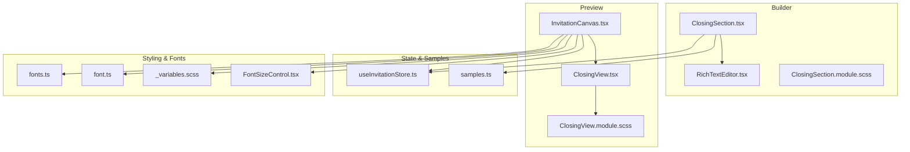
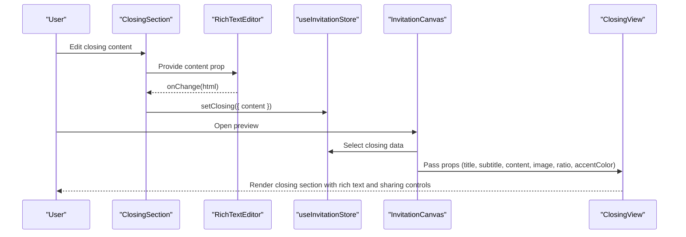
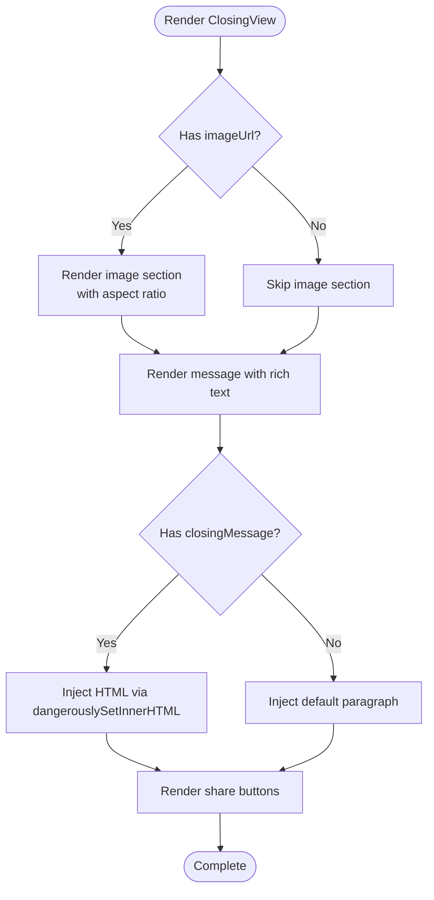
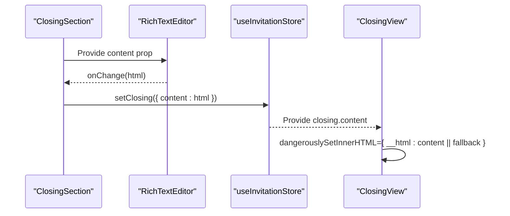
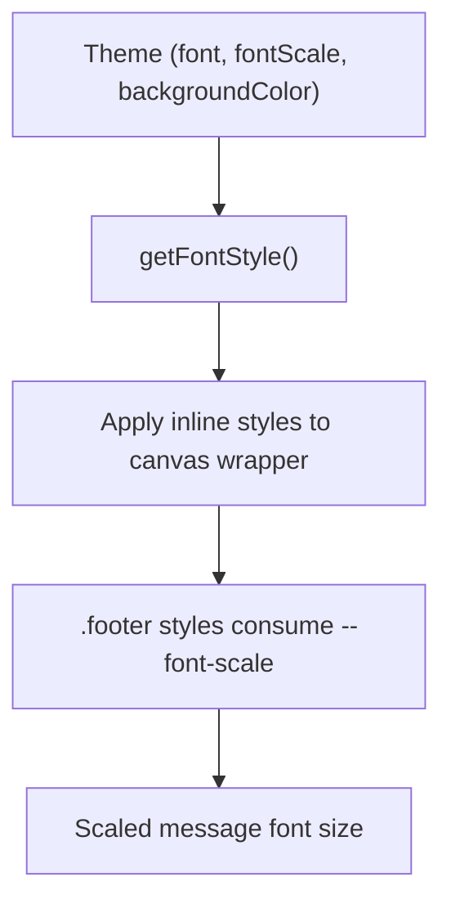
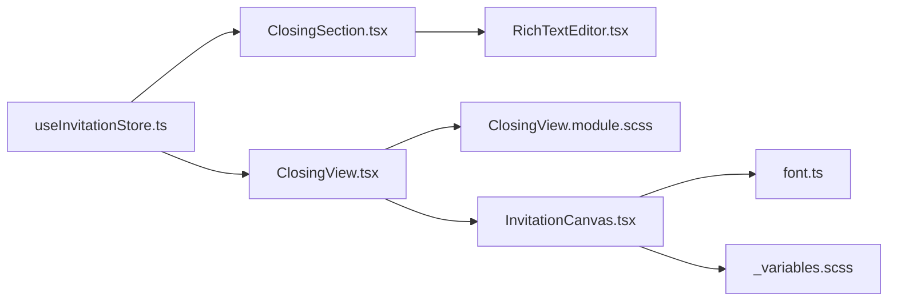

# Closing View

<cite>
**Referenced Files in This Document**
- [ClosingView.tsx](file://src/components/preview/sections/ClosingView.tsx)
- [ClosingView.module.scss](file://src/components/preview/sections/ClosingView.module.scss)
- [ClosingSection.tsx](file://src/components/builder/sections/ClosingSection.tsx)
- [ClosingSection.module.scss](file://src/components/builder/sections/ClosingSection.module.scss)
- [samples.ts](file://src/constants/samples.ts)
- [useInvitationStore.ts](file://src/store/useInvitationStore.ts)
- [RichTextEditor.tsx](file://src/components/common/RichTextEditor/RichTextEditor.tsx)
- [InvitationCanvas.tsx](file://src/components/preview/InvitationCanvas.tsx)
- [fonts.ts](file://src/lib/fonts.ts)
- [font.ts](file://src/lib/utils/font.ts)
- [_variables.scss](file://src/styles/_variables.scss)
- [FontSizeControl.tsx](file://src/components/preview/elements/FontSizeControl/FontSizeControl.tsx)
- [useAccessibility.tsx](file://src/hooks/useAccessibility.tsx)
- [accessibility.test.ts](file://src/test/accessibility.test.ts)
</cite>

## Table of Contents
1. [Introduction](#introduction)
2. [Project Structure](#project-structure)
3. [Core Components](#core-components)
4. [Architecture Overview](#architecture-overview)
5. [Detailed Component Analysis](#detailed-component-analysis)
6. [Dependency Analysis](#dependency-analysis)
7. [Performance Considerations](#performance-considerations)
8. [Troubleshooting Guide](#troubleshooting-guide)
9. [Conclusion](#conclusion)

## Introduction
This document provides a comprehensive guide to the ClosingView component, focusing on the closing message and signature section of the invitation. It explains rich text processing for closing messages, HTML content rendering, and dynamic content injection. It documents the signature display system, typography scaling, and integration with the invitation's theme colors and fonts. It also covers responsive layout for closing content, fallback mechanisms for empty messages, accessibility considerations for screen readers, practical examples of message processing, conditional rendering based on content presence, and the styling system using CSS modules. Finally, it addresses performance considerations for HTML rendering and content optimization techniques for the closing section.

## Project Structure
The ClosingView component is part of the preview section and integrates with the builder section for content creation. The invitation canvas composes all sections and applies theme styling.

**Diagram sources**
- [ClosingSection.tsx](file://src/components/builder/sections/ClosingSection.tsx#L1-L107)
- [RichTextEditor.tsx](file://src/components/common/RichTextEditor/RichTextEditor.tsx#L1-L173)
- [ClosingSection.module.scss](file://src/components/builder/sections/ClosingSection.module.scss#L1-L103)
- [ClosingView.tsx](file://src/components/preview/sections/ClosingView.tsx#L1-L197)
- [ClosingView.module.scss](file://src/components/preview/sections/ClosingView.module.scss#L1-L101)
- [InvitationCanvas.tsx](file://src/components/preview/InvitationCanvas.tsx#L1-L469)
- [useInvitationStore.ts](file://src/store/useInvitationStore.ts#L460-L534)
- [samples.ts](file://src/constants/samples.ts#L30-L49)
- [fonts.ts](file://src/lib/fonts.ts#L161-L181)
- [font.ts](file://src/lib/utils/font.ts#L1-L56)
- [_variables.scss](file://src/styles/_variables.scss#L63-L83)
- [FontSizeControl.tsx](file://src/components/preview/elements/FontSizeControl/FontSizeControl.tsx#L33-L66)

**Section sources**
- [ClosingView.tsx](file://src/components/preview/sections/ClosingView.tsx#L1-L197)
- [ClosingView.module.scss](file://src/components/preview/sections/ClosingView.module.scss#L1-L101)
- [ClosingSection.tsx](file://src/components/builder/sections/ClosingSection.tsx#L1-L107)
- [ClosingSection.module.scss](file://src/components/builder/sections/ClosingSection.module.scss#L1-L103)
- [InvitationCanvas.tsx](file://src/components/preview/InvitationCanvas.tsx#L414-L430)
- [useInvitationStore.ts](file://src/store/useInvitationStore.ts#L460-L534)

## Core Components
- ClosingView (Preview): Renders the closing message, optional image, and sharing controls. It conditionally renders the image section and applies responsive styles via CSS modules. It uses dangerouslySetInnerHTML for rich text content with a fallback paragraph when content is empty.
- ClosingSection (Builder): Provides a rich text editor for composing the closing message, optional image upload with ratio selection, and a sample phrases modal for quick content insertion.
- RichTextEditor: A TipTap-based editor that emits HTML content and supports formatting and placeholders.
- InvitationCanvas: Composes all sections, passes theme and data to ClosingView, and applies typography scaling and font family overrides.
- Store: Holds the closing state (title, subtitle, content, image URL, ratio) and exposes setters for builder updates.
- Styling System: Uses SCSS modules for scoped styles, CSS variables for typography, and runtime font scaling via a style override mechanism.

**Section sources**
- [ClosingView.tsx](file://src/components/preview/sections/ClosingView.tsx#L37-L192)
- [ClosingSection.tsx](file://src/components/builder/sections/ClosingSection.tsx#L25-L106)
- [RichTextEditor.tsx](file://src/components/common/RichTextEditor/RichTextEditor.tsx#L30-L146)
- [InvitationCanvas.tsx](file://src/components/preview/InvitationCanvas.tsx#L414-L430)
- [useInvitationStore.ts](file://src/store/useInvitationStore.ts#L469-L469)

## Architecture Overview
The closing section follows a clear separation of concerns:
- Builder collects content and stores it in Zustand.
- Preview reads the stored data and renders the UI with theme-aware styling.
- Rich text is processed and injected safely via controlled HTML content.

**Diagram sources**
- [ClosingSection.tsx](file://src/components/builder/sections/ClosingSection.tsx#L72-L78)
- [RichTextEditor.tsx](file://src/components/common/RichTextEditor/RichTextEditor.tsx#L53-L55)
- [useInvitationStore.ts](file://src/store/useInvitationStore.ts#L469-L469)
- [InvitationCanvas.tsx](file://src/components/preview/InvitationCanvas.tsx#L414-L430)
- [ClosingView.tsx](file://src/components/preview/sections/ClosingView.tsx#L118-L191)

## Detailed Component Analysis

### ClosingView (Preview)
- Purpose: Presents the closing message, optional illustration, and social sharing controls.
- Rich text rendering: Uses dangerouslySetInnerHTML to inject HTML content into a container with a shared "rich-text-content" class for consistent styling.
- Fallback mechanism: When closingMessage is empty, it injects a default paragraph as a fallback.
- Conditional rendering:
  - Image section: Renders only when imageUrl is present, supporting fixed or auto aspect ratios.
  - Message section: Applies a "noImage" class when no image is present to adjust spacing.
- Sharing controls:
  - KakaoTalk share: Initializes Kakao SDK if needed, constructs feed content, and handles errors via toast notifications.
  - Link copy: Copies current page URL to clipboard and shows a toast notification.
- Styling: Scoped via CSS modules with responsive typography and theme-aware colors.

**Diagram sources**
- [ClosingView.tsx](file://src/components/preview/sections/ClosingView.tsx#L118-L191)
- [ClosingView.module.scss](file://src/components/preview/sections/ClosingView.module.scss#L44-L63)

**Section sources**
- [ClosingView.tsx](file://src/components/preview/sections/ClosingView.tsx#L37-L192)
- [ClosingView.module.scss](file://src/components/preview/sections/ClosingView.module.scss#L44-L101)

### Rich Text Processing and Injection
- Builder-side: RichTextEditor emits HTML content on change and manages placeholder text and formatting.
- Preview-side: ClosingView injects the HTML into a div with the "rich-text-content" class to inherit typography and spacing styles.
- Fallback: When content is empty, a default paragraph is injected to ensure readable output.

**Diagram sources**
- [ClosingSection.tsx](file://src/components/builder/sections/ClosingSection.tsx#L72-L78)
- [RichTextEditor.tsx](file://src/components/common/RichTextEditor/RichTextEditor.tsx#L53-L55)
- [useInvitationStore.ts](file://src/store/useInvitationStore.ts#L469-L469)
- [ClosingView.tsx](file://src/components/preview/sections/ClosingView.tsx#L166-L171)

**Section sources**
- [ClosingSection.tsx](file://src/components/builder/sections/ClosingSection.tsx#L72-L78)
- [RichTextEditor.tsx](file://src/components/common/RichTextEditor/RichTextEditor.tsx#L30-L146)
- [ClosingView.tsx](file://src/components/preview/sections/ClosingView.tsx#L166-L171)

### Signature Display System
- The component does not render a dedicated signature area. Instead, the rich text content can include styled paragraphs and formatting to convey a signature-like feel. The rich text editor supports formatting and placeholder text to guide users in structuring their message.

**Section sources**
- [RichTextEditor.tsx](file://src/components/common/RichTextEditor/RichTextEditor.tsx#L47-L49)
- [ClosingView.tsx](file://src/components/preview/sections/ClosingView.tsx#L166-L171)

### Typography Scaling and Theme Integration
- InvitationCanvas computes a style object that sets CSS variables for font scaling and applies font family overrides. These variables are consumed by the closing section styles to scale text consistently.
- The closing message uses a scaled font size derived from a CSS variable and a base font family configured per theme.
- Font size control allows interactive adjustment of the scale factor.

**Diagram sources**
- [InvitationCanvas.tsx](file://src/components/preview/InvitationCanvas.tsx#L291-L294)
- [font.ts](file://src/lib/utils/font.ts#L34-L56)
- [ClosingView.module.scss](file://src/components/preview/sections/ClosingView.module.scss#L45-L48)
- [FontSizeControl.tsx](file://src/components/preview/elements/FontSizeControl/FontSizeControl.tsx#L33-L66)

**Section sources**
- [InvitationCanvas.tsx](file://src/components/preview/InvitationCanvas.tsx#L291-L294)
- [font.ts](file://src/lib/utils/font.ts#L34-L56)
- [ClosingView.module.scss](file://src/components/preview/sections/ClosingView.module.scss#L45-L48)
- [_variables.scss](file://src/styles/_variables.scss#L63-L83)
- [FontSizeControl.tsx](file://src/components/preview/elements/FontSizeControl/FontSizeControl.tsx#L33-L66)

### Responsive Layout for Closing Content
- The section centers content and applies consistent padding and margins.
- The image section supports two aspect ratios: fixed (16:9) and auto, adjusting container sizing accordingly.
- The message area adapts spacing depending on whether an image is present.

**Section sources**
- [ClosingView.module.scss](file://src/components/preview/sections/ClosingView.module.scss#L4-L101)

### Accessibility Considerations
- Rich text content is injected into a container with a shared class for consistent semantics and styling.
- Toast notifications provide feedback for sharing actions.
- Focus management utilities and screen reader announcements are available for broader accessibility patterns across the application.

**Section sources**
- [ClosingView.tsx](file://src/components/preview/sections/ClosingView.tsx#L55-L61)
- [useAccessibility.tsx](file://src/hooks/useAccessibility.tsx#L64-L76)
- [accessibility.test.ts](file://src/test/accessibility.test.ts#L1-L111)

### Practical Examples
- Composing a closing message:
  - Use the builder’s rich text editor to write formatted content.
  - Insert sample phrases from the modal for inspiration.
- Conditional rendering:
  - If an image is uploaded, it appears above the message with the chosen aspect ratio.
  - Without an image, the message receives adjusted spacing via the "noImage" class.
- Styling system:
  - The preview applies theme-specific font families and scales text using CSS variables.

**Section sources**
- [ClosingSection.tsx](file://src/components/builder/sections/ClosingSection.tsx#L25-L106)
- [samples.ts](file://src/constants/samples.ts#L30-L49)
- [ClosingView.module.scss](file://src/components/preview/sections/ClosingView.module.scss#L16-L63)

## Dependency Analysis
- ClosingView depends on:
  - InvitationCanvas for data and theme context.
  - CSS modules for scoped styling.
  - Zustand store for closing state.
  - Rich text content from the store.
- Builder dependencies:
  - RichTextEditor for content composition.
  - Zustand store for state updates.
  - Sample phrases for quick content insertion.

**Diagram sources**
- [useInvitationStore.ts](file://src/store/useInvitationStore.ts#L469-L469)
- [ClosingSection.tsx](file://src/components/builder/sections/ClosingSection.tsx#L1-L107)
- [RichTextEditor.tsx](file://src/components/common/RichTextEditor/RichTextEditor.tsx#L1-L173)
- [ClosingView.tsx](file://src/components/preview/sections/ClosingView.tsx#L1-L197)
- [ClosingView.module.scss](file://src/components/preview/sections/ClosingView.module.scss#L1-L101)
- [InvitationCanvas.tsx](file://src/components/preview/InvitationCanvas.tsx#L1-L469)
- [font.ts](file://src/lib/utils/font.ts#L1-L56)
- [_variables.scss](file://src/styles/_variables.scss#L63-L83)

**Section sources**
- [useInvitationStore.ts](file://src/store/useInvitationStore.ts#L469-L469)
- [ClosingSection.tsx](file://src/components/builder/sections/ClosingSection.tsx#L1-L107)
- [ClosingView.tsx](file://src/components/preview/sections/ClosingView.tsx#L1-L197)
- [InvitationCanvas.tsx](file://src/components/preview/InvitationCanvas.tsx#L1-L469)

## Performance Considerations
- HTML rendering:
  - dangerouslySetInnerHTML is used for rich text. Ensure content is sanitized to prevent XSS.
  - Avoid frequent re-renders by memoizing props passed to ClosingView.
- Image optimization:
  - Next.js Image component is used with appropriate sizes and optimized handling for blob URLs.
- Bundle size:
  - Dynamic imports are used for builder components to reduce initial load.
- Accessibility:
  - Keep markup minimal and semantic; avoid unnecessary wrappers around rich text.

[No sources needed since this section provides general guidance]

## Troubleshooting Guide
- Empty closing message:
  - The component injects a default paragraph when content is missing. Verify store content and ensure onChange is updating state.
- Kakao share not working:
  - Confirm Kakao SDK availability and initialization. Check toast notifications for initialization or capability errors.
- Rich text formatting lost:
  - Ensure the editor emits HTML and the preview uses the "rich-text-content" class for consistent styling.
- Typography not scaling:
  - Verify that InvitationCanvas applies the computed font style and that CSS variables are correctly set.

**Section sources**
- [ClosingView.tsx](file://src/components/preview/sections/ClosingView.tsx#L63-L116)
- [ClosingView.tsx](file://src/components/preview/sections/ClosingView.tsx#L166-L171)
- [InvitationCanvas.tsx](file://src/components/preview/InvitationCanvas.tsx#L291-L294)

## Conclusion
The ClosingView component delivers a robust, theme-integrated closing section with rich text support, responsive layout, and social sharing capabilities. Its integration with the builder’s rich text editor and the Zustand store ensures seamless authoring and rendering. By leveraging CSS modules, CSS variables, and runtime font scaling, it maintains consistent typography across devices. Following the outlined performance and accessibility recommendations will help sustain a high-quality user experience.