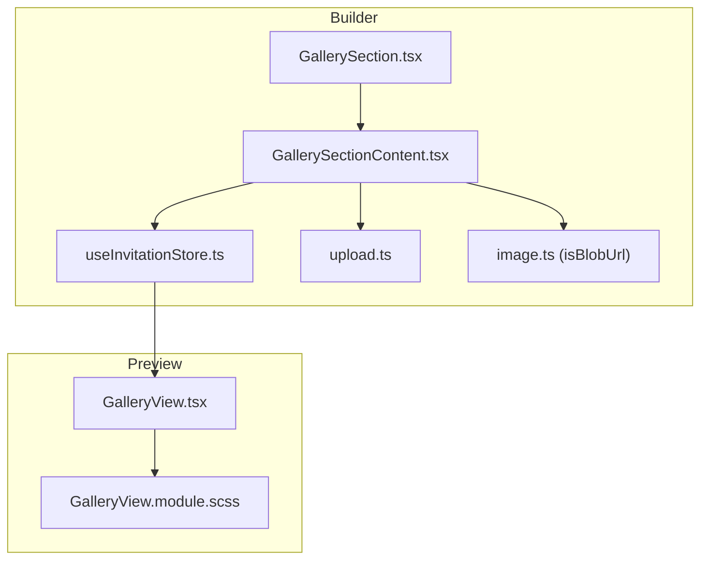
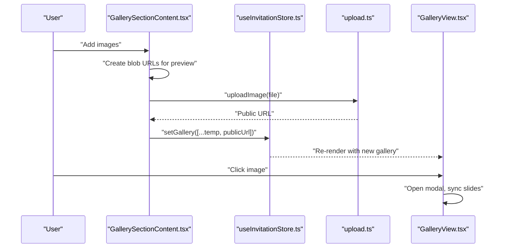
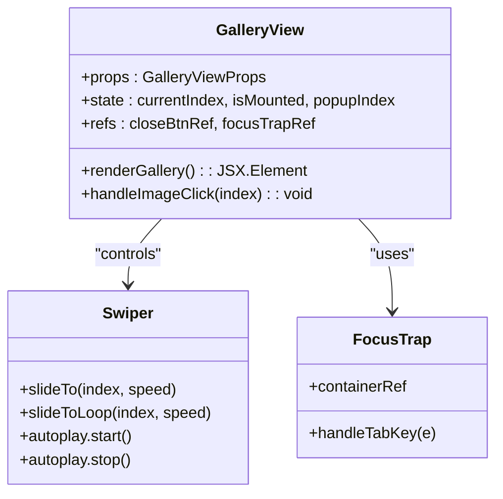
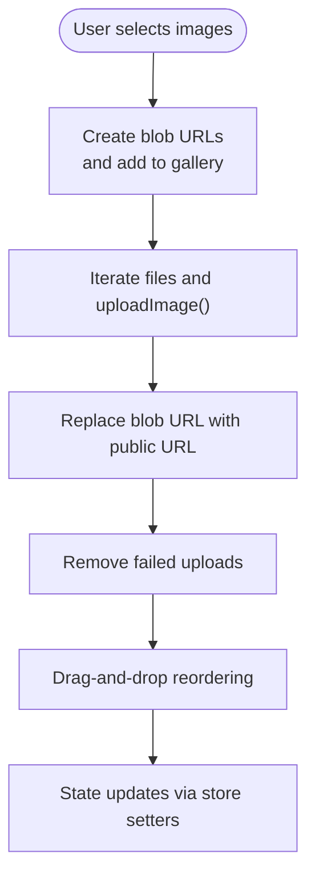
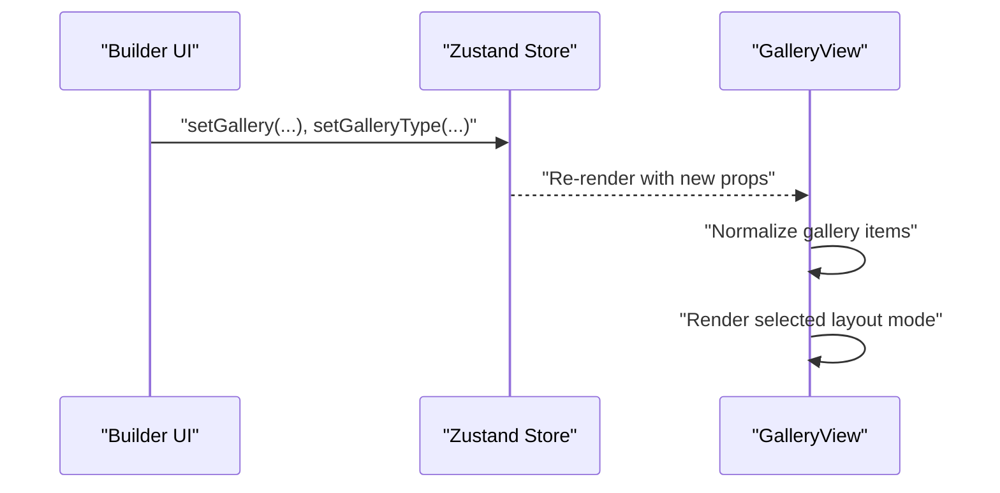
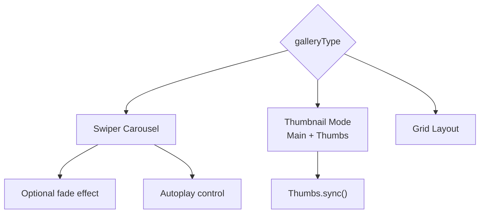
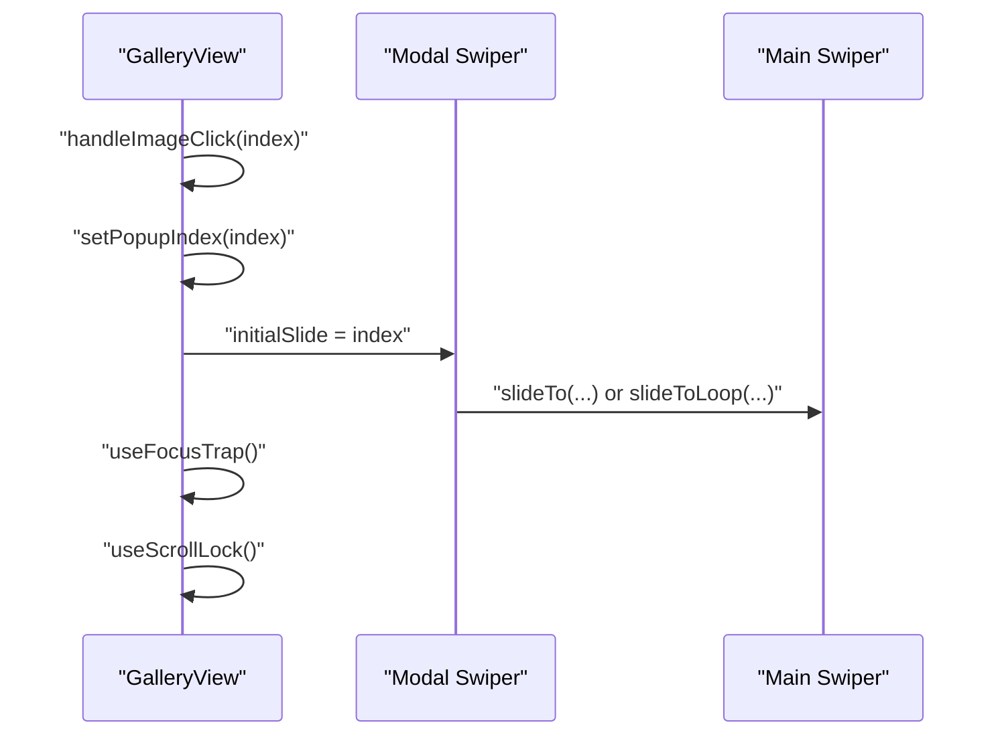
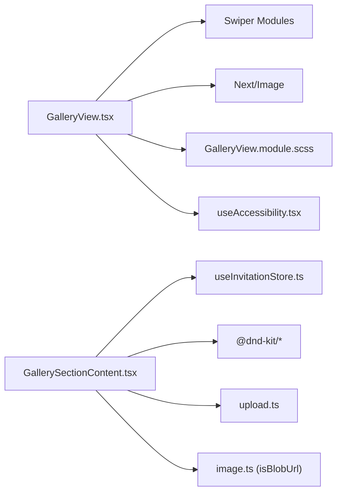

# Gallery View

<cite>
**Referenced Files in This Document**
- [GalleryView.tsx](file://src/components/preview/sections/GalleryView.tsx)
- [GalleryView.module.scss](file://src/components/preview/sections/GalleryView.module.scss)
- [GallerySection.tsx](file://src/components/builder/sections/GallerySection.tsx)
- [GallerySectionContent.tsx](file://src/components/builder/sections/GallerySectionContent.tsx)
- [GallerySection.module.scss](file://src/components/builder/sections/GallerySection.module.scss)
- [useInvitationStore.ts](file://src/store/useInvitationStore.ts)
- [image.ts](file://src/lib/image.ts)
- [upload.ts](file://src/utils/upload.ts)
- [image.ts (constants)](file://src/constants/image.ts)
- [useAccessibility.tsx](file://src/hooks/useAccessibility.tsx)
- [a11y.ts](file://src/lib/a11y.ts)
</cite>

## Table of Contents
1. [Introduction](#introduction)
2. [Project Structure](#project-structure)
3. [Core Components](#core-components)
4. [Architecture Overview](#architecture-overview)
5. [Detailed Component Analysis](#detailed-component-analysis)
6. [Dependency Analysis](#dependency-analysis)
7. [Performance Considerations](#performance-considerations)
8. [Troubleshooting Guide](#troubleshooting-guide)
9. [Conclusion](#conclusion)

## Introduction
This document explains the GalleryView component responsible for rendering the photo gallery section in the preview and builder experiences. It covers:
- Responsive grid system and layout modes
- Image carousel functionality using Swiper
- Lightbox modal with focus trap and scroll lock
- Image loading strategies, lazy loading, and performance optimizations
- Thumbnail generation and sync between main and thumbnails
- Touch and swipe gesture handling for mobile
- Practical examples of image processing and fallback handling
- Accessibility features including keyboard navigation, ARIA roles, and screen reader support
- Relationship with the builder’s gallery section and state synchronization patterns

## Project Structure
The gallery feature spans two primary areas:
- Preview rendering: GalleryView renders the gallery in the invitation preview
- Builder editing: GallerySection and GallerySectionContent manage editing, sorting, and uploading images

**Diagram sources**
- [GallerySection.tsx](file://src/components/builder/sections/GallerySection.tsx#L9-L22)
- [GallerySectionContent.tsx](file://src/components/builder/sections/GallerySectionContent.tsx#L106-L368)
- [useInvitationStore.ts](file://src/store/useInvitationStore.ts#L103-L116)
- [upload.ts](file://src/utils/upload.ts#L10-L38)
- [image.ts](file://src/lib/image.ts#L1-L4)
- [GalleryView.tsx](file://src/components/preview/sections/GalleryView.tsx#L50-L305)
- [GalleryView.module.scss](file://src/components/preview/sections/GalleryView.module.scss#L1-L186)

**Section sources**
- [GallerySection.tsx](file://src/components/builder/sections/GallerySection.tsx#L1-L25)
- [GallerySectionContent.tsx](file://src/components/builder/sections/GallerySectionContent.tsx#L1-L369)
- [useInvitationStore.ts](file://src/store/useInvitationStore.ts#L103-L116)
- [GalleryView.tsx](file://src/components/preview/sections/GalleryView.tsx#L1-L310)
- [GalleryView.module.scss](file://src/components/preview/sections/GalleryView.module.scss#L1-L186)

## Core Components
- GalleryView (preview): Renders three layout modes (swiper, thumbnail, grid), supports popup modal, and integrates Swiper for carousels and thumbnails.
- GallerySection/GallerySectionContent (builder): Manages gallery editing, drag-and-drop reordering, upload flow, and state updates.
- Zustand store: Centralizes gallery state and setters for title, subtitle, type, and image list.
- Utilities: Image helpers for blob URL detection and upload to Supabase Storage.

Key responsibilities:
- Normalize incoming gallery items (accepts plain URLs or objects)
- Render appropriate layout mode
- Handle click-to-open modal and synchronize slide indices
- Apply responsive image sizing and lazy loading via Next.js Image
- Enforce accessibility and focus management in modal

**Section sources**
- [GalleryView.tsx](file://src/components/preview/sections/GalleryView.tsx#L50-L305)
- [GallerySection.tsx](file://src/components/builder/sections/GallerySection.tsx#L9-L22)
- [GallerySectionContent.tsx](file://src/components/builder/sections/GallerySectionContent.tsx#L106-L368)
- [useInvitationStore.ts](file://src/store/useInvitationStore.ts#L103-L116)

## Architecture Overview
The gallery architecture follows a clear separation of concerns:
- Builder: Collects user inputs, manages uploads, and updates the store
- Preview: Reads from the store and renders the gallery with Swiper and Next.js Image

**Diagram sources**
- [GallerySectionContent.tsx](file://src/components/builder/sections/GallerySectionContent.tsx#L162-L205)
- [upload.ts](file://src/utils/upload.ts#L10-L38)
- [useInvitationStore.ts](file://src/store/useInvitationStore.ts#L169-L176)
- [GalleryView.tsx](file://src/components/preview/sections/GalleryView.tsx#L90-L121)

## Detailed Component Analysis

### GalleryView (Preview)
GalleryView is a presentational component that:
- Accepts normalized gallery items and layout options
- Renders three layout modes:
  - Swiper carousel with optional fade, autoplay, and preview indicators
  - Thumbnail mode with main and thumbnail Swiper instances synchronized
  - Grid layout with square thumbnails
- Implements a lightbox modal using React Portal and Swiper
- Integrates accessibility hooks for focus trapping and scroll locking

**Diagram sources**
- [GalleryView.tsx](file://src/components/preview/sections/GalleryView.tsx#L50-L305)
- [useAccessibility.tsx](file://src/hooks/useAccessibility.tsx#L22-L62)

Key behaviors:
- Normalization of gallery items to ensure consistent shape
- Conditional autoplay control based on modal visibility
- Modal slide synchronization with main Swiper
- Responsive image sizing via IMAGE_SIZES constants
- Accessibility: dialog role, aria-modal, focus trap, scroll lock

**Section sources**
- [GalleryView.tsx](file://src/components/preview/sections/GalleryView.tsx#L50-L305)
- [GalleryView.module.scss](file://src/components/preview/sections/GalleryView.module.scss#L1-L186)
- [image.ts (constants)](file://src/constants/image.ts#L1-L9)
- [useAccessibility.tsx](file://src/hooks/useAccessibility.tsx#L22-L62)

### GallerySection and GallerySectionContent (Builder)
The builder manages:
- Editing gallery metadata (title, subtitle)
- Layout mode selection (swiper, grid, thumbnail)
- Feature toggles (popup, autoplay, fade, preview)
- Image upload flow with temporary blob URLs and subsequent replacement with public URLs
- Drag-and-drop reordering with keyboard and pointer sensors
- Visual feedback during uploads and removal

**Diagram sources**
- [GallerySectionContent.tsx](file://src/components/builder/sections/GallerySectionContent.tsx#L162-L205)
- [upload.ts](file://src/utils/upload.ts#L10-L38)
- [image.ts](file://src/lib/image.ts#L1-L4)

Practical examples:
- Blob URL detection to show upload overlay
- Temporary items inserted before upload completes
- Public URL replacement after successful upload
- Error handling removes failed items

**Section sources**
- [GallerySection.tsx](file://src/components/builder/sections/GallerySection.tsx#L9-L22)
- [GallerySectionContent.tsx](file://src/components/builder/sections/GallerySectionContent.tsx#L106-L368)
- [GallerySection.module.scss](file://src/components/builder/sections/GallerySection.module.scss#L1-L233)
- [image.ts](file://src/lib/image.ts#L1-L4)
- [upload.ts](file://src/utils/upload.ts#L10-L38)

### State Synchronization Patterns
- The builder writes to the store using dedicated setters for gallery and layout options
- The preview reads from the store and renders accordingly
- Modal state is local to the preview component and does not mutate global state

**Diagram sources**
- [useInvitationStore.ts](file://src/store/useInvitationStore.ts#L103-L116)
- [GalleryView.tsx](file://src/components/preview/sections/GalleryView.tsx#L80-L88)

**Section sources**
- [useInvitationStore.ts](file://src/store/useInvitationStore.ts#L103-L116)
- [GalleryView.tsx](file://src/components/preview/sections/GalleryView.tsx#L80-L88)

### Layout Modes and Thumbnails
- Swiper mode: Full-width carousel with optional fade effect, autoplay, and preview indicators
- Thumbnail mode: Two Swiper instances (main and thumbs) synchronized via Thumbs plugin
- Grid mode: Responsive 3-column grid of square thumbnails

**Diagram sources**
- [GalleryView.tsx](file://src/components/preview/sections/GalleryView.tsx#L126-L224)
- [GalleryView.module.scss](file://src/components/preview/sections/GalleryView.module.scss#L4-L93)

**Section sources**
- [GalleryView.tsx](file://src/components/preview/sections/GalleryView.tsx#L126-L224)
- [GalleryView.module.scss](file://src/components/preview/sections/GalleryView.module.scss#L4-L93)

### Lightbox Modal Implementation
- Modal is rendered via React Portal into a dedicated root element
- Swiper inside modal synchronizes with main Swiper on slide change
- Focus trap ensures keyboard navigation remains within modal
- Scroll lock prevents background scrolling while modal is open
- Close button and backdrop click dismiss the modal

**Diagram sources**
- [GalleryView.tsx](file://src/components/preview/sections/GalleryView.tsx#L90-L121)
- [useAccessibility.tsx](file://src/hooks/useAccessibility.tsx#L22-L62)

**Section sources**
- [GalleryView.tsx](file://src/components/preview/sections/GalleryView.tsx#L241-L302)
- [useAccessibility.tsx](file://src/hooks/useAccessibility.tsx#L22-L62)

### Accessibility Features
- Modal:
  - Role dialog and aria-modal set appropriately
  - Close button with aria-label
  - Focus trap to keep keyboard focus inside modal
  - Scroll lock to prevent background scrolling
- General:
  - Focusable selector for assistive technologies
  - Announcements for dynamic updates (via shared utilities)

**Section sources**
- [GalleryView.tsx](file://src/components/preview/sections/GalleryView.tsx#L248-L263)
- [useAccessibility.tsx](file://src/hooks/useAccessibility.tsx#L22-L62)
- [a11y.ts](file://src/lib/a11y.ts#L1-L20)

## Dependency Analysis
- GalleryView depends on:
  - Swiper modules for carousel and thumbnails
  - Next.js Image for responsive image rendering
  - SCSS modules for layout and styling
  - Accessibility hooks for focus trap and scroll lock
  - Constants for responsive image sizes
- GallerySectionContent depends on:
  - Zustand store for state
  - Drag-and-drop libraries for reordering
  - Upload utility for Supabase storage
  - Local image helpers for blob URL detection

**Diagram sources**
- [GalleryView.tsx](file://src/components/preview/sections/GalleryView.tsx#L7-L15)
- [GalleryView.module.scss](file://src/components/preview/sections/GalleryView.module.scss#L1-L186)
- [useAccessibility.tsx](file://src/hooks/useAccessibility.tsx#L1-L77)
- [GallerySectionContent.tsx](file://src/components/builder/sections/GallerySectionContent.tsx#L1-L36)
- [upload.ts](file://src/utils/upload.ts#L1-L39)
- [image.ts](file://src/lib/image.ts#L1-L4)
- [useInvitationStore.ts](file://src/store/useInvitationStore.ts#L1-L200)

**Section sources**
- [GalleryView.tsx](file://src/components/preview/sections/GalleryView.tsx#L1-L25)
- [GallerySectionContent.tsx](file://src/components/builder/sections/GallerySectionContent.tsx#L1-L36)
- [useInvitationStore.ts](file://src/store/useInvitationStore.ts#L1-L200)

## Performance Considerations
- Responsive image sizing:
  - IMAGE_SIZES defines device-aware sizes for gallery, grid, and thumbnails
  - Next.js Image leverages sizes and srcSet for efficient loading
- Lazy loading:
  - Next.js Image defaults to lazy loading; priority is applied only to the currently visible modal slide
- Autoplay and throttling:
  - Autoplay stops when modal opens to reduce CPU usage
  - Looping and fade effects are disabled when unnecessary
- Rendering optimizations:
  - Memoized normalization of gallery items
  - Conditional mounting and portal creation
  - Minimal DOM nodes in grid mode

Recommendations:
- Prefer grid mode for large galleries to limit DOM nodes
- Disable autoplay for long galleries to save resources
- Use thumbnail mode for collections where quick navigation is desired

**Section sources**
- [image.ts (constants)](file://src/constants/image.ts#L1-L9)
- [GalleryView.tsx](file://src/components/preview/sections/GalleryView.tsx#L101-L114)
- [GalleryView.tsx](file://src/components/preview/sections/GalleryView.tsx#L288-L294)

## Troubleshooting Guide
Common issues and resolutions:
- Images not appearing in preview:
  - Verify gallery items are normalized (object with id and url)
  - Confirm blob URLs are replaced with public URLs after upload
- Upload failures:
  - Check console errors during uploadImage
  - Failed uploads are removed from the gallery list
- Modal not closing or focus issues:
  - Ensure focus trap and scroll lock are active only when popupIndex is set
  - Confirm portal element exists and is mounted
- Autoplay not stopping in modal:
  - Verify autoplay.stop() is called when popupIndex changes
- Thumbnails not syncing:
  - Ensure thumbs swiper instance is set and not destroyed
  - Confirm main swiper receives slideTo or slideToLoop calls

**Section sources**
- [GallerySectionContent.tsx](file://src/components/builder/sections/GallerySectionContent.tsx#L189-L205)
- [GalleryView.tsx](file://src/components/preview/sections/GalleryView.tsx#L96-L121)
- [useAccessibility.tsx](file://src/hooks/useAccessibility.tsx#L22-L62)

## Conclusion
The GalleryView component delivers a flexible, accessible, and performant gallery experience across preview and builder contexts. It leverages Swiper for rich interactions, Next.js Image for optimized loading, and robust accessibility patterns for inclusive use. The builder’s gallery section provides a seamless workflow for adding, ordering, and uploading images, with immediate visual feedback and reliable state synchronization.