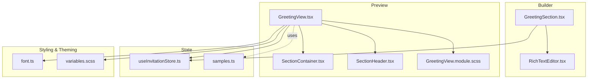
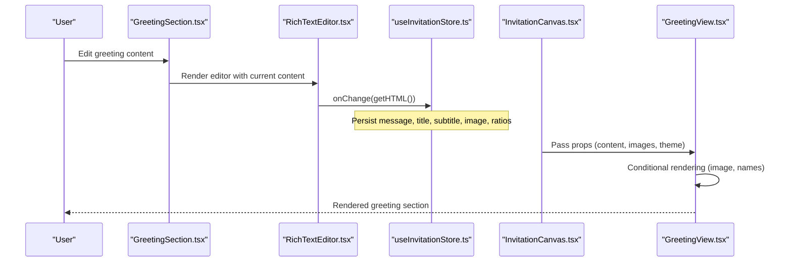
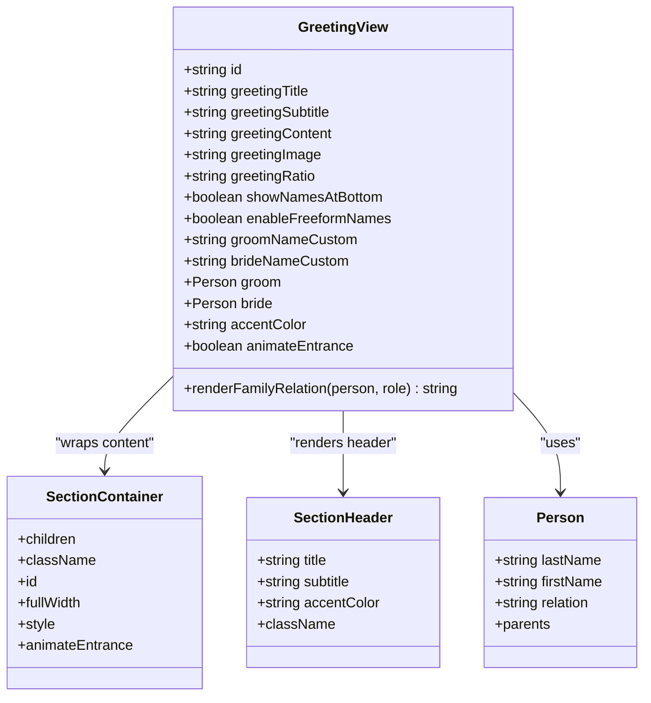
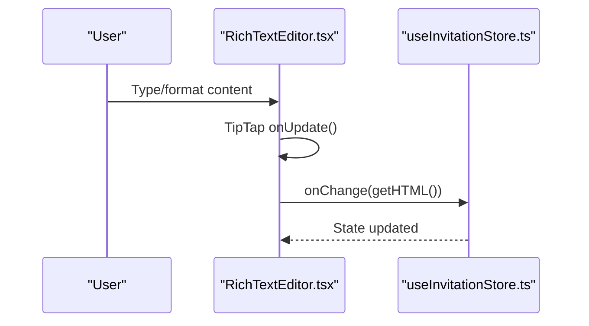
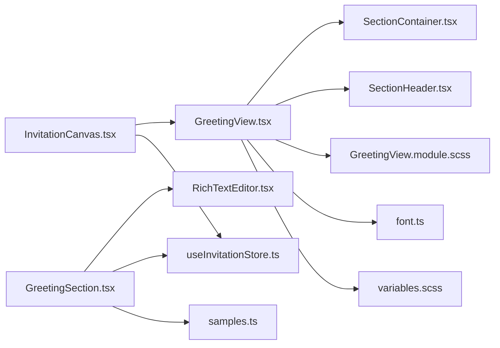

# Greeting View

<cite>
**Referenced Files in This Document**
- [GreetingView.tsx](file://src/components/preview/sections/GreetingView.tsx)
- [GreetingView.module.scss](file://src/components/preview/sections/GreetingView.module.scss)
- [GreetingSection.tsx](file://src/components/builder/sections/GreetingSection.tsx)
- [RichTextEditor.tsx](file://src/components/common/RichTextEditor/RichTextEditor.tsx)
- [RichTextEditor.module.scss](file://src/components/common/RichTextEditor/RichTextEditor.module.scss)
- [useInvitationStore.ts](file://src/store/useInvitationStore.ts)
- [samples.ts](file://src/constants/samples.ts)
- [InvitationCanvas.tsx](file://src/components/preview/InvitationCanvas.tsx)
- [SectionContainer.tsx](file://src/components/preview/SectionContainer.tsx)
- [SectionHeader.tsx](file://src/components/preview/SectionHeader.tsx)
- [font.ts](file://src/lib/utils/font.ts)
- [variables.scss](file://src/styles/_variables.scss)
- [a11y.ts](file://src/lib/a11y.ts)
- [useAccessibility.tsx](file://src/hooks/useAccessibility.tsx)
</cite>

## Table of Contents
1. [Introduction](#introduction)
2. [Project Structure](#project-structure)
3. [Core Components](#core-components)
4. [Architecture Overview](#architecture-overview)
5. [Detailed Component Analysis](#detailed-component-analysis)
6. [Dependency Analysis](#dependency-analysis)
7. [Performance Considerations](#performance-considerations)
8. [Troubleshooting Guide](#troubleshooting-guide)
9. [Conclusion](#conclusion)

## Introduction
This document explains the GreetingView component responsible for rendering the invitation greeting section. It covers the rich text processing pipeline, HTML content handling, dynamic content injection, responsive typography, integration with theme colors, fallback mechanisms, accessibility considerations, and the builder’s rich text editor integration. Practical examples illustrate content processing, conditional rendering, and the styling system using CSS modules and design tokens.

## Project Structure
The greeting feature spans three layers:
- Builder layer: Provides the rich text editor and form controls to edit greeting content and presentation options.
- Preview layer: Renders the greeting in the invitation canvas with responsive typography and theme integration.
- Store layer: Centralizes state for greeting content, images, and display options.

**Diagram sources**
- [GreetingSection.tsx](file://src/components/builder/sections/GreetingSection.tsx#L1-L199)
- [RichTextEditor.tsx](file://src/components/common/RichTextEditor/RichTextEditor.tsx#L1-L173)
- [GreetingView.tsx](file://src/components/preview/sections/GreetingView.tsx#L1-L158)
- [SectionContainer.tsx](file://src/components/preview/SectionContainer.tsx#L1-L50)
- [SectionHeader.tsx](file://src/components/preview/SectionHeader.tsx#L1-L31)
- [GreetingView.module.scss](file://src/components/preview/sections/GreetingView.module.scss#L1-L145)
- [useInvitationStore.ts](file://src/store/useInvitationStore.ts#L1-L534)
- [samples.ts](file://src/constants/samples.ts#L1-L64)
- [font.ts](file://src/lib/utils/font.ts#L1-L57)
- [variables.scss](file://src/styles/_variables.scss#L1-L127)

**Section sources**
- [GreetingView.tsx](file://src/components/preview/sections/GreetingView.tsx#L1-L158)
- [GreetingSection.tsx](file://src/components/builder/sections/GreetingSection.tsx#L1-L199)
- [useInvitationStore.ts](file://src/store/useInvitationStore.ts#L1-L534)

## Core Components
- GreetingView: Renders greeting title/subtitle, rich text content, optional image, and family name display. It receives theme colors and responsive options via props.
- GreetingSection: Builder UI for editing greeting content, image, and name display options.
- RichTextEditor: TipTap-based editor that emits sanitized HTML to the store.
- useInvitationStore: Holds greeting content, images, and display preferences.
- InvitationCanvas: Composes sections and passes theme and content to GreetingView.

Key responsibilities:
- Rich text processing: HTML emitted by the editor is injected into the preview using a safe method while preserving semantic structure.
- Dynamic content injection: Props from the store drive conditional rendering of image, freeform names, and relation-based names.
- Responsive typography: CSS variables and font scaling tokens adjust text sizing across devices.
- Theme integration: Accent color and font family are applied consistently across the greeting area.

**Section sources**
- [GreetingView.tsx](file://src/components/preview/sections/GreetingView.tsx#L43-L153)
- [GreetingSection.tsx](file://src/components/builder/sections/GreetingSection.tsx#L24-L198)
- [RichTextEditor.tsx](file://src/components/common/RichTextEditor/RichTextEditor.tsx#L30-L146)
- [useInvitationStore.ts](file://src/store/useInvitationStore.ts#L244-L371)
- [InvitationCanvas.tsx](file://src/components/preview/InvitationCanvas.tsx#L332-L347)

## Architecture Overview
The greeting rendering pipeline connects the builder and preview:

**Diagram sources**
- [GreetingSection.tsx](file://src/components/builder/sections/GreetingSection.tsx#L128-L135)
- [RichTextEditor.tsx](file://src/components/common/RichTextEditor/RichTextEditor.tsx#L53-L55)
- [useInvitationStore.ts](file://src/store/useInvitationStore.ts#L420-L431)
- [InvitationCanvas.tsx](file://src/components/preview/InvitationCanvas.tsx#L332-L347)
- [GreetingView.tsx](file://src/components/preview/sections/GreetingView.tsx#L96-L150)

## Detailed Component Analysis

### GreetingView: Rendering the Invitation Greeting
Responsibilities:
- Renders the greeting header with title and optional subtitle, using the invitation’s accent color.
- Injects rich text content into a paragraph container with a shared class for consistent styling.
- Conditionally renders an image with fixed or auto aspect ratio using Next.js Image and AspectRatio.
- Displays family names either via freeform text or relation-based formatting.

Conditional rendering highlights:
- Image visibility depends on the presence of a greeting image URL.
- Freeform names take precedence over relation-based names when enabled.
- Relation-based names are rendered only when not using freeform names and when enabled to show names at bottom.

Styling system:
- Uses CSS modules scoped to the component.
- Inherits font family and scale from theme variables.
- Applies accent color for decorative elements and separators.

Accessibility considerations:
- The rich text container uses a semantic paragraph structure suitable for screen readers.
- Alt text is provided for the greeting image.
- No explicit ARIA roles are added beyond standard semantics.

Performance characteristics:
- Uses memoization to avoid unnecessary re-renders.
- Image optimization via Next.js Image and blob URL detection.

**Section sources**
- [GreetingView.tsx](file://src/components/preview/sections/GreetingView.tsx#L43-L153)
- [GreetingView.module.scss](file://src/components/preview/sections/GreetingView.module.scss#L9-L62)
- [SectionContainer.tsx](file://src/components/preview/SectionContainer.tsx#L21-L45)
- [SectionHeader.tsx](file://src/components/preview/SectionHeader.tsx#L12-L26)

#### GreetingView Class Diagram

**Diagram sources**
- [GreetingView.tsx](file://src/components/preview/sections/GreetingView.tsx#L23-L58)
- [SectionContainer.tsx](file://src/components/preview/SectionContainer.tsx#L8-L28)
- [SectionHeader.tsx](file://src/components/preview/SectionHeader.tsx#L5-L10)

### Rich Text Processing and Sanitization
The builder uses TipTap to produce HTML content. The editor emits HTML on update and applies a shared class for consistent styling in both editor and preview.

Processing flow:
- TipTap editor emits HTML via onUpdate.
- onChange handler writes to the store, ensuring content is normalized and ready for preview.
- Preview injects the HTML into the DOM using a controlled container class.

Sanitization note:
- The preview uses a controlled HTML injection mechanism. While the editor produces HTML, the preview does not apply additional sanitization in this component. Ensure content safety at ingestion points (e.g., restrict allowed tags/attributes in the editor configuration).

**Section sources**
- [RichTextEditor.tsx](file://src/components/common/RichTextEditor/RichTextEditor.tsx#L41-L61)
- [RichTextEditor.tsx](file://src/components/common/RichTextEditor/RichTextEditor.tsx#L53-L55)
- [RichTextEditor.module.scss](file://src/components/common/RichTextEditor/RichTextEditor.module.scss#L97-L130)
- [GreetingView.tsx](file://src/components/preview/sections/GreetingView.tsx#L96-L100)

#### Rich Text Editor Sequence

**Diagram sources**
- [RichTextEditor.tsx](file://src/components/common/RichTextEditor/RichTextEditor.tsx#L53-L55)
- [useInvitationStore.ts](file://src/store/useInvitationStore.ts#L420-L420)

### Dynamic Content Injection and Conditional Rendering
Dynamic behavior:
- Greeting content is injected into a paragraph container with a shared class for consistent styling.
- Image rendering switches between fixed and auto aspect ratios based on user preference.
- Names are shown either via freeform text or relation-based formatting depending on user selection.

Conditional rendering logic:
- If greetingImage is present, render the image container with aspect ratio handling.
- If enableFreeformNames is true, render custom groom/bride name paragraphs.
- Otherwise, if showNamesAtBottom is true, render relation-based family groups.

Fallback mechanisms:
- Missing greetingImage hides the image container.
- Missing freeform names falls back to relation-based names.
- Missing subtitle defaults to a constant in the preview component.

**Section sources**
- [GreetingView.tsx](file://src/components/preview/sections/GreetingView.tsx#L96-L150)
- [GreetingSection.tsx](file://src/components/builder/sections/GreetingSection.tsx#L74-L87)

### Responsive Typography and Theme Integration
Typography system:
- Font family and scale are applied via CSS variables from the theme.
- Font scaling is driven by a theme-level multiplier that adjusts all text sizes proportionally.
- Paragraph spacing and line heights are tuned for readability.

Theme integration:
- Accent color is passed down to the header and decorative elements.
- Background color and font families are applied at the canvas level and inherited by sections.

Styling tokens:
- Design tokens for colors, fonts, and spacing are defined centrally and consumed through SCSS variables and CSS custom properties.

**Section sources**
- [font.ts](file://src/lib/utils/font.ts#L34-L56)
- [variables.scss](file://src/styles/_variables.scss#L64-L84)
- [GreetingView.module.scss](file://src/components/preview/sections/GreetingView.module.scss#L12-L18)
- [GreetingView.module.scss](file://src/components/preview/sections/GreetingView.module.scss#L85-L126)

### Accessibility Considerations
Current state:
- The greeting content is structured with paragraphs, aiding screen reader comprehension.
- Images include alt text for descriptive context.
- No additional ARIA roles are explicitly added in this component.

Recommendations:
- Consider adding landmark roles or aria-labelledby for complex headers.
- Ensure keyboard navigation remains smooth when images scale on hover.
- Validate color contrast for decorative separators and accents against the background.

**Section sources**
- [GreetingView.tsx](file://src/components/preview/sections/GreetingView.tsx#L106-L133)
- [SectionHeader.tsx](file://src/components/preview/SectionHeader.tsx#L15-L24)

### Relationship with the Builder’s Rich Text Editor
- The builder’s GreetingSection renders the RichTextEditor when expanded.
- The editor’s onChange handler writes HTML to the store.
- InvitationCanvas passes the stored greeting content to GreetingView for rendering.

Sample phrases:
- The builder can populate greeting content using curated samples, ensuring consistent messaging.

**Section sources**
- [GreetingSection.tsx](file://src/components/builder/sections/GreetingSection.tsx#L128-L135)
- [RichTextEditor.tsx](file://src/components/common/RichTextEditor/RichTextEditor.tsx#L30-L61)
- [samples.ts](file://src/constants/samples.ts#L12-L28)

## Dependency Analysis
Key dependencies and relationships:
- GreetingView depends on SectionContainer and SectionHeader for layout and header rendering.
- GreetingView consumes theme variables and accent color from the canvas.
- GreetingSection depends on the store for state and on RichTextEditor for content creation.
- InvitationCanvas composes GreetingView and passes theme and content props.

**Diagram sources**
- [GreetingView.tsx](file://src/components/preview/sections/GreetingView.tsx#L1-L12)
- [SectionContainer.tsx](file://src/components/preview/SectionContainer.tsx#L1-L7)
- [SectionHeader.tsx](file://src/components/preview/SectionHeader.tsx#L1-L3)
- [GreetingView.module.scss](file://src/components/preview/sections/GreetingView.module.scss#L1-L3)
- [font.ts](file://src/lib/utils/font.ts#L1-L57)
- [variables.scss](file://src/styles/_variables.scss#L1-L127)
- [GreetingSection.tsx](file://src/components/builder/sections/GreetingSection.tsx#L1-L21)
- [RichTextEditor.tsx](file://src/components/common/RichTextEditor/RichTextEditor.tsx#L1-L21)
- [useInvitationStore.ts](file://src/store/useInvitationStore.ts#L1-L30)
- [samples.ts](file://src/constants/samples.ts#L1-L11)
- [InvitationCanvas.tsx](file://src/components/preview/InvitationCanvas.tsx#L1-L20)

**Section sources**
- [GreetingView.tsx](file://src/components/preview/sections/GreetingView.tsx#L1-L12)
- [GreetingSection.tsx](file://src/components/builder/sections/GreetingSection.tsx#L1-L21)
- [useInvitationStore.ts](file://src/store/useInvitationStore.ts#L1-L30)
- [InvitationCanvas.tsx](file://src/components/preview/InvitationCanvas.tsx#L1-L20)

## Performance Considerations
- Memoization: GreetingView and SectionContainer are memoized to reduce re-renders.
- Image optimization: Next.js Image handles optimization and responsive sizing; blob URLs are detected to bypass optimization when needed.
- CSS modules: Scoped styles minimize cascade and improve maintainability.
- Font scaling: CSS variables enable efficient scaling without recalculating per element.
- Conditional rendering: Avoids rendering unused nodes (e.g., image or names) when not needed.

Optimization techniques:
- Prefer fixed aspect ratio for predictable layout and fewer layout shifts.
- Keep rich text content concise to minimize DOM depth.
- Defer heavy assets and lazy-load galleries outside the greeting section.

**Section sources**
- [GreetingView.tsx](file://src/components/preview/sections/GreetingView.tsx#L1-L12)
- [SectionContainer.tsx](file://src/components/preview/SectionContainer.tsx#L1-L7)
- [GreetingView.module.scss](file://src/components/preview/sections/GreetingView.module.scss#L39-L46)

## Troubleshooting Guide
Common issues and resolutions:
- Empty greeting content: Ensure the store has valid HTML content; otherwise, the paragraph container will render empty. Use the builder to populate content or prefill from samples.
- Missing image: Verify the greetingImage URL is set; otherwise, the image container is omitted.
- Incorrect aspect ratio: Confirm greetingRatio is set appropriately; fixed ratio uses AspectRatio while auto ratio adapts to container width.
- Color contrast: Adjust accent color or background to meet contrast guidelines for decorative elements.
- Accessibility: Add explicit labels or roles if content becomes complex; ensure focus order remains logical.

Validation steps:
- Inspect the paragraph container class to confirm rich text injection.
- Verify theme variables are applied at the canvas level.
- Test hover effects on images and ensure they do not interfere with readability.

**Section sources**
- [GreetingView.tsx](file://src/components/preview/sections/GreetingView.tsx#L96-L150)
- [useInvitationStore.ts](file://src/store/useInvitationStore.ts#L420-L431)
- [font.ts](file://src/lib/utils/font.ts#L34-L56)

## Conclusion
GreetingView delivers a robust, theme-integrated rendering of the invitation greeting. It leverages a TipTap-powered editor for rich text creation, applies responsive typography via design tokens, and supports flexible content presentation with conditional rendering. By combining CSS modules, theme variables, and careful accessibility practices, the component provides a scalable foundation for dynamic greeting content.