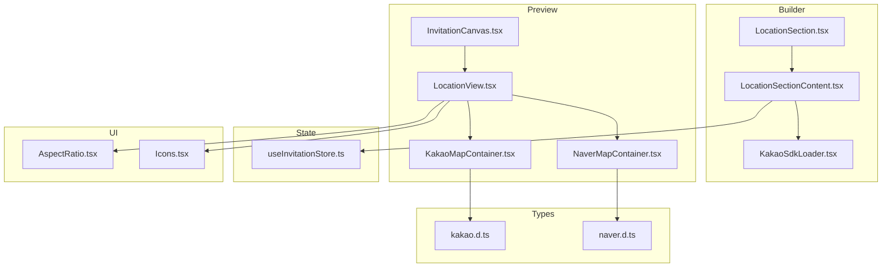
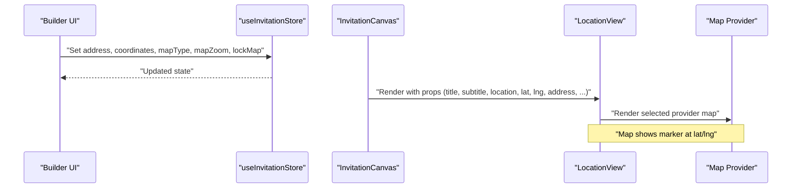
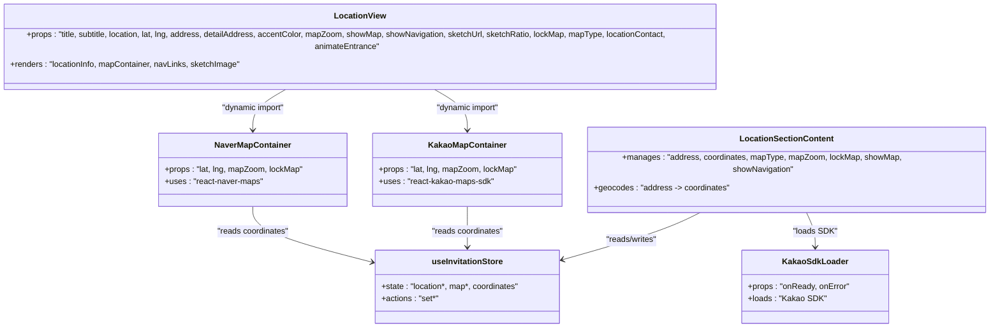

# Location View

<cite>
**Referenced Files in This Document**
- [LocationView.tsx](file://src/components/preview/sections/LocationView.tsx)
- [LocationView.module.scss](file://src/components/preview/sections/LocationView.module.scss)
- [KakaoMapContainer.tsx](file://src/components/preview/sections/maps/KakaoMapContainer.tsx)
- [NaverMapContainer.tsx](file://src/components/preview/sections/maps/NaverMapContainer.tsx)
- [LocationSection.tsx](file://src/components/builder/sections/LocationSection.tsx)
- [LocationSectionContent.tsx](file://src/components/builder/sections/LocationSectionContent.tsx)
- [KakaoSdkLoader.tsx](file://src/components/builder/sections/KakaoSdkLoader.tsx)
- [useInvitationStore.ts](file://src/store/useInvitationStore.ts)
- [InvitationCanvas.tsx](file://src/components/preview/InvitationCanvas.tsx)
- [AspectRatio.tsx](file://src/components/ui/AspectRatio/AspectRatio.tsx)
- [AspectRatio index.ts](file://src/components/ui/AspectRatio/index.ts)
- [Icons.tsx](file://src/components/common/Icons/Icons.tsx)
- [kakao.d.ts](file://src/types/kakao.d.ts)
- [naver.d.ts](file://src/types/naver.d.ts)
- [useAccessibility.tsx](file://src/hooks/useAccessibility.tsx)
- [image.ts](file://src/constants/image.ts)
</cite>

## Table of Contents
1. [Introduction](#introduction)
2. [Project Structure](#project-structure)
3. [Core Components](#core-components)
4. [Architecture Overview](#architecture-overview)
5. [Detailed Component Analysis](#detailed-component-analysis)
6. [Dependency Analysis](#dependency-analysis)
7. [Performance Considerations](#performance-considerations)
8. [Troubleshooting Guide](#troubleshooting-guide)
9. [Conclusion](#conclusion)
10. [Appendices](#appendices)

## Introduction
This document explains the LocationView component and its surrounding ecosystem for displaying venue and location information in the invitation preview. It covers:
- Map integration for Kakao and Naver
- Location search and geocoding
- Directions rendering via external links
- Map customization and responsive sizing
- Accessibility and offline handling considerations
- Integration with the builder’s location configuration

## Project Structure
The LocationView lives in the preview section and composes provider-specific map containers. The builder section manages location configuration and integrates with geocoding.

**Diagram sources**
- [LocationSection.tsx](file://src/components/builder/sections/LocationSection.tsx#L1-L24)
- [LocationSectionContent.tsx](file://src/components/builder/sections/LocationSectionContent.tsx#L1-L260)
- [KakaoSdkLoader.tsx](file://src/components/builder/sections/KakaoSdkLoader.tsx#L1-L33)
- [InvitationCanvas.tsx](file://src/components/preview/InvitationCanvas.tsx#L364-L398)
- [LocationView.tsx](file://src/components/preview/sections/LocationView.tsx#L1-L206)
- [KakaoMapContainer.tsx](file://src/components/preview/sections/maps/KakaoMapContainer.tsx#L1-L54)
- [NaverMapContainer.tsx](file://src/components/preview/sections/maps/NaverMapContainer.tsx#L1-L34)
- [AspectRatio.tsx](file://src/components/ui/AspectRatio/AspectRatio.tsx#L1-L7)
- [Icons.tsx](file://src/components/common/Icons/Icons.tsx#L46-L73)
- [kakao.d.ts](file://src/types/kakao.d.ts#L1-L33)
- [naver.d.ts](file://src/types/naver.d.ts#L1-L415)

**Section sources**
- [LocationView.tsx](file://src/components/preview/sections/LocationView.tsx#L1-L206)
- [LocationSectionContent.tsx](file://src/components/builder/sections/LocationSectionContent.tsx#L1-L260)
- [useInvitationStore.ts](file://src/store/useInvitationStore.ts#L1-L534)

## Core Components
- LocationView: Renders location details, map container, navigation buttons, and optional sketch image. Handles copy-to-clipboard and opens external navigation links.
- KakaoMapContainer: Dynamically loads Kakao SDK, displays a map centered at coordinates with a marker, and shows loading/error states.
- NaverMapContainer: Provides a Naver map with similar behavior and marker placement.
- Builder LocationSection/Content: Manages location configuration, address search, geocoding, and map settings.
- useInvitationStore: Centralized state for location fields, coordinates, and map preferences.

**Section sources**
- [LocationView.tsx](file://src/components/preview/sections/LocationView.tsx#L18-L37)
- [KakaoMapContainer.tsx](file://src/components/preview/sections/maps/KakaoMapContainer.tsx#L8-L13)
- [NaverMapContainer.tsx](file://src/components/preview/sections/maps/NaverMapContainer.tsx#L6-L11)
- [LocationSectionContent.tsx](file://src/components/builder/sections/LocationSectionContent.tsx#L24-L79)
- [useInvitationStore.ts](file://src/store/useInvitationStore.ts#L4-L48)

## Architecture Overview
The LocationView composes either Kakao or Naver map containers based on configuration. The builder collects address and coordinates, optionally geocodes the address to update coordinates, and persists settings in the store.

**Diagram sources**
- [LocationSectionContent.tsx](file://src/components/builder/sections/LocationSectionContent.tsx#L86-L103)
- [useInvitationStore.ts](file://src/store/useInvitationStore.ts#L244-L371)
- [InvitationCanvas.tsx](file://src/components/preview/InvitationCanvas.tsx#L378-L398)
- [LocationView.tsx](file://src/components/preview/sections/LocationView.tsx#L118-L140)

## Detailed Component Analysis

### LocationView
Responsibilities:
- Display venue name, formatted address, optional detail address, and contact link.
- Conditionally render map container and navigation controls.
- Render optional sketch image with fixed/auto aspect ratio.
- Provide copy-to-clipboard for address and open external navigation links.

Key behaviors:
- Map selection: Uses a dynamic import to load the appropriate provider container.
- Responsive sizing: Wraps the map in an aspect-ratio container.
- Navigation: Opens Kakao/Naver search pages in a new tab; copies address to clipboard.
- Sketch rendering: Uses Next.js Image with aspect-ratio and blob handling.

Accessibility and UX:
- Uses icons for providers and actions.
- Clipboard feedback via toast notification.
- Contact link uses tel: scheme.

**Section sources**
- [LocationView.tsx](file://src/components/preview/sections/LocationView.tsx#L58-L201)
- [LocationView.module.scss](file://src/components/preview/sections/LocationView.module.scss#L4-L141)
- [AspectRatio.tsx](file://src/components/ui/AspectRatio/AspectRatio.tsx#L1-L7)
- [AspectRatio index.ts](file://src/components/ui/AspectRatio/index.ts#L1-L1)
- [Icons.tsx](file://src/components/common/Icons/Icons.tsx#L46-L73)

### KakaoMapContainer
Responsibilities:
- Dynamically load Kakao SDK with required libraries.
- Render a map centered at provided coordinates with a marker.
- Handle loading and error states with skeleton and error messages.
- Convert zoom level to provider-specific zoom semantics.

Fallback and error handling:
- Shows a loading skeleton while SDK initializes.
- Displays an error message if SDK fails to load.

**Section sources**
- [KakaoMapContainer.tsx](file://src/components/preview/sections/maps/KakaoMapContainer.tsx#L15-L53)
- [kakao.d.ts](file://src/types/kakao.d.ts#L1-L33)

### NaverMapContainer
Responsibilities:
- Provide a Naver maps provider and map instance.
- Render a map centered at provided coordinates with a marker.
- Configure interaction controls based on lockMap flag.

**Section sources**
- [NaverMapContainer.tsx](file://src/components/preview/sections/maps/NaverMapContainer.tsx#L13-L33)
- [naver.d.ts](file://src/types/naver.d.ts#L1-L415)

### Builder Location Section and Geocoding
Responsibilities:
- Collect location metadata: title, subtitle, venue name, address, detail address, contact.
- Provide address search modal powered by a third-party postcode service.
- Geocode address to coordinates using Kakao SDK when ready.
- Manage map settings: provider type, zoom, lock map, show navigation, show map, height.

Geocoding flow:
- On address change and when Kakao SDK is ready, invoke the geocoder to fetch coordinates.
- Update coordinates in the store if they differ beyond a small threshold.

**Section sources**
- [LocationSection.tsx](file://src/components/builder/sections/LocationSection.tsx#L1-L24)
- [LocationSectionContent.tsx](file://src/components/builder/sections/LocationSectionContent.tsx#L86-L103)
- [KakaoSdkLoader.tsx](file://src/components/builder/sections/KakaoSdkLoader.tsx#L11-L32)
- [useInvitationStore.ts](file://src/store/useInvitationStore.ts#L244-L371)

### State Management (useInvitationStore)
Fields relevant to LocationView:
- Location identity: location, locationTitle, locationSubtitle, address, detailAddress, locationContact
- Map configuration: mapType, mapZoom, lockMap, showMap, showNavigation, mapHeight
- Coordinates: coordinates (lat/lng)
- Optional sketch: showSketch, sketchUrl, sketchRatio

Initial defaults and setters are defined in the store, enabling consistent behavior across builder and preview.

**Section sources**
- [useInvitationStore.ts](file://src/store/useInvitationStore.ts#L4-L48)
- [useInvitationStore.ts](file://src/store/useInvitationStore.ts#L244-L371)

### Rendering in InvitationCanvas
The canvas passes live state from the store to LocationView, ensuring the preview reflects real-time edits.

**Section sources**
- [InvitationCanvas.tsx](file://src/components/preview/InvitationCanvas.tsx#L378-L398)

## Dependency Analysis

**Diagram sources**
- [LocationView.tsx](file://src/components/preview/sections/LocationView.tsx#L48-L56)
- [KakaoMapContainer.tsx](file://src/components/preview/sections/maps/KakaoMapContainer.tsx#L15-L53)
- [NaverMapContainer.tsx](file://src/components/preview/sections/maps/NaverMapContainer.tsx#L13-L33)
- [LocationSectionContent.tsx](file://src/components/builder/sections/LocationSectionContent.tsx#L86-L103)
- [KakaoSdkLoader.tsx](file://src/components/builder/sections/KakaoSdkLoader.tsx#L11-L32)
- [useInvitationStore.ts](file://src/store/useInvitationStore.ts#L4-L48)

**Section sources**
- [LocationView.tsx](file://src/components/preview/sections/LocationView.tsx#L48-L56)
- [KakaoMapContainer.tsx](file://src/components/preview/sections/maps/KakaoMapContainer.tsx#L15-L53)
- [NaverMapContainer.tsx](file://src/components/preview/sections/maps/NaverMapContainer.tsx#L13-L33)
- [LocationSectionContent.tsx](file://src/components/builder/sections/LocationSectionContent.tsx#L86-L103)
- [KakaoSdkLoader.tsx](file://src/components/builder/sections/KakaoSdkLoader.tsx#L11-L32)
- [useInvitationStore.ts](file://src/store/useInvitationStore.ts#L4-L48)

## Performance Considerations
- Dynamic imports: Map containers are loaded on demand to avoid SSR overhead and reduce initial bundle size.
- Aspect ratio: Ensures consistent map sizing without layout shifts.
- Conditional rendering: Map and navigation blocks only render when enabled by configuration.
- Geocoding throttling: Coordinate updates occur after SDK readiness and only when address changes, preventing unnecessary recalculations.

[No sources needed since this section provides general guidance]

## Troubleshooting Guide
Common issues and resolutions:
- Map does not load
  - Verify provider API keys are configured in environment variables.
  - Confirm SDK loading via KakaoSdkLoader and provider wrappers.
  - Check for console errors indicating SDK initialization failure.
- Coordinates incorrect
  - Ensure address geocoding runs after SDK readiness.
  - Confirm the geocoder returned a valid result and coordinates were updated.
- Navigation links do not open
  - Verify address field is populated.
  - Confirm external URLs are constructed correctly for Kakao/Naver.
- Copy address fails
  - Ensure clipboard API is available and permissions granted.
  - Confirm toast feedback appears after successful copy.

**Section sources**
- [KakaoSdkLoader.tsx](file://src/components/builder/sections/KakaoSdkLoader.tsx#L11-L32)
- [KakaoMapContainer.tsx](file://src/components/preview/sections/maps/KakaoMapContainer.tsx#L16-L40)
- [LocationSectionContent.tsx](file://src/components/builder/sections/LocationSectionContent.tsx#L86-L103)
- [LocationView.tsx](file://src/components/preview/sections/LocationView.tsx#L80-L94)

## Conclusion
The LocationView component provides a flexible, accessible, and responsive way to present venue and location details. It supports dual map providers, integrates with builder configuration, and offers useful navigation aids. The design emphasizes separation of concerns: builder handles data entry and geocoding, while the preview focuses on rendering and user interaction.

[No sources needed since this section summarizes without analyzing specific files]

## Appendices

### Practical Examples

- Map initialization
  - Kakao: [KakaoMapContainer.tsx](file://src/components/preview/sections/maps/KakaoMapContainer.tsx#L16-L19)
  - Naver: [NaverMapContainer.tsx](file://src/components/preview/sections/maps/NaverMapContainer.tsx#L15-L15)

- Marker placement
  - Kakao: [KakaoMapContainer.tsx](file://src/components/preview/sections/maps/KakaoMapContainer.tsx#L50-L50)
  - Naver: [NaverMapContainer.tsx](file://src/components/preview/sections/maps/NaverMapContainer.tsx#L28-L28)

- Responsive map sizing
  - Aspect ratio wrapper: [LocationView.tsx](file://src/components/preview/sections/LocationView.tsx#L120-L139)
  - Aspect ratio primitive: [AspectRatio.tsx](file://src/components/ui/AspectRatio/AspectRatio.tsx#L1-L7)

- Address formatting and display
  - Address and detail address: [LocationView.tsx](file://src/components/preview/sections/LocationView.tsx#L104-L116)
  - Styles: [LocationView.module.scss](file://src/components/preview/sections/LocationView.module.scss#L4-L50)

- Integration with invitation’s location settings
  - Canvas props: [InvitationCanvas.tsx](file://src/components/preview/InvitationCanvas.tsx#L378-L398)
  - Store fields: [useInvitationStore.ts](file://src/store/useInvitationStore.ts#L4-L48)

- Accessibility features
  - Icons for providers: [Icons.tsx](file://src/components/common/Icons/Icons.tsx#L46-L73)
  - Focus utilities: [useAccessibility.tsx](file://src/hooks/useAccessibility.tsx#L1-L77)

- Offline map handling
  - No offline caching is implemented. Maps rely on online providers.
  - Consider adding a fallback image or static map tile for offline scenarios if needed.

- Relationship with builder’s location configuration
  - Address search and geocoding: [LocationSectionContent.tsx](file://src/components/builder/sections/LocationSectionContent.tsx#L86-L130)
  - Map settings controls: [LocationSectionContent.tsx](file://src/components/builder/sections/LocationSectionContent.tsx#L187-L237)

- Integration with location services and geocoding
  - Kakao geocoder usage: [LocationSectionContent.tsx](file://src/components/builder/sections/LocationSectionContent.tsx#L89-L101)
  - Kakao types: [kakao.d.ts](file://src/types/kakao.d.ts#L142-L171)
  - Naver types: [naver.d.ts](file://src/types/naver.d.ts#L268-L302)