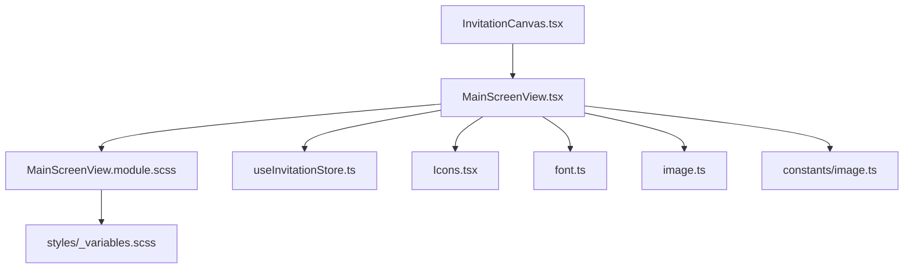
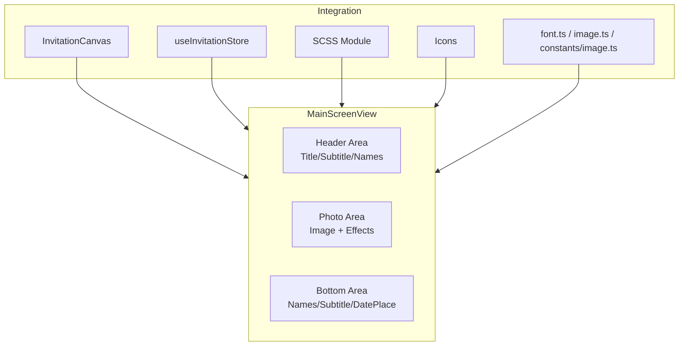
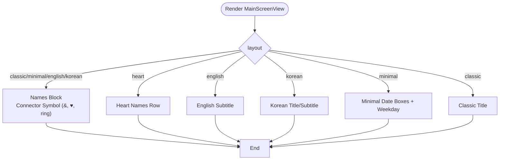
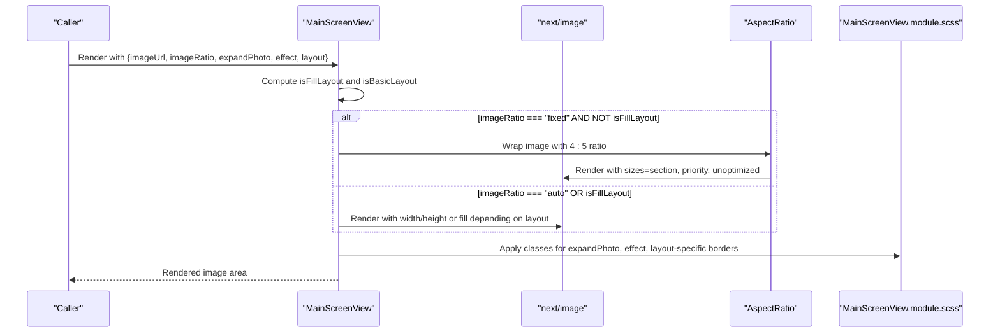
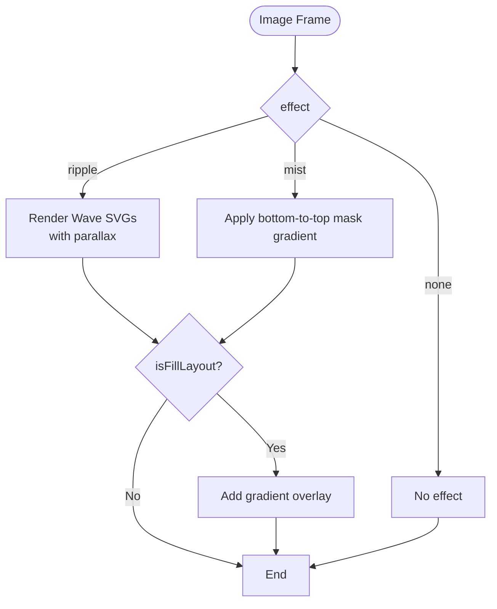
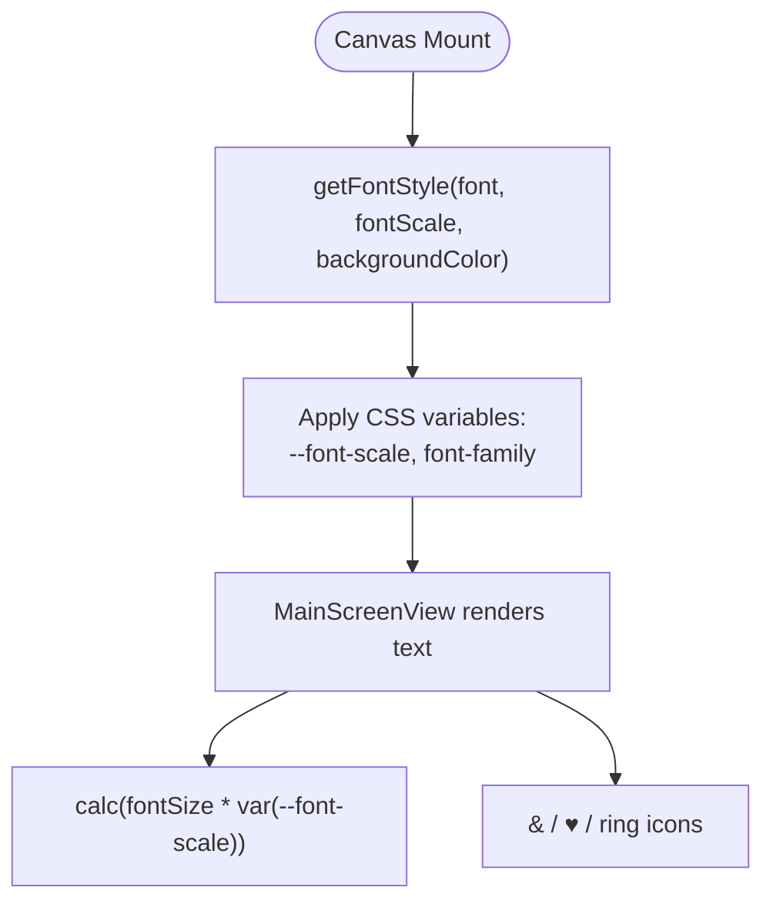
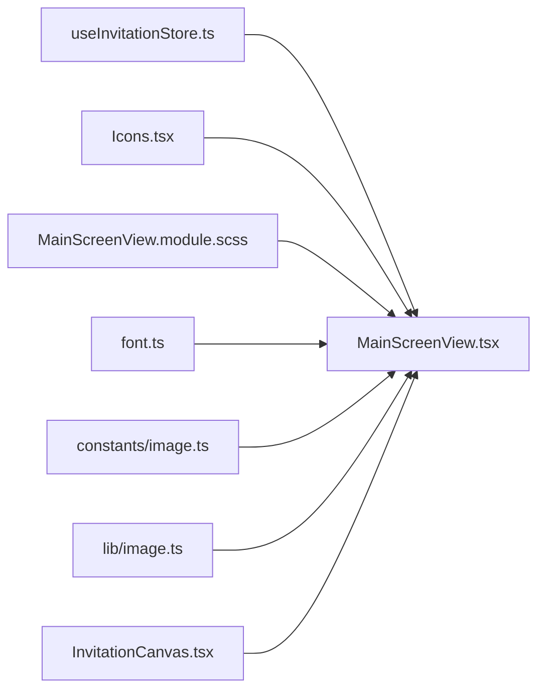

# Main Screen View

<cite>
**Referenced Files in This Document**
- [MainScreenView.tsx](file://src/components/preview/sections/MainScreenView.tsx)
- [MainScreenView.module.scss](file://src/components/preview/sections/MainScreenView.module.scss)
- [InvitationCanvas.tsx](file://src/components/preview/InvitationCanvas.tsx)
- [useInvitationStore.ts](file://src/store/useInvitationStore.ts)
- [Icons.tsx](file://src/components/common/Icons/Icons.tsx)
- [font.ts](file://src/lib/utils/font.ts)
- [image.ts](file://src/lib/image.ts)
- [image.ts](file://src/constants/image.ts)
- [variables.scss](file://src/styles/_variables.scss)
</cite>

## Table of Contents
1. [Introduction](#introduction)
2. [Project Structure](#project-structure)
3. [Core Components](#core-components)
4. [Architecture Overview](#architecture-overview)
5. [Detailed Component Analysis](#detailed-component-analysis)
6. [Dependency Analysis](#dependency-analysis)
7. [Performance Considerations](#performance-considerations)
8. [Troubleshooting Guide](#troubleshooting-guide)
9. [Conclusion](#conclusion)

## Introduction
This document explains the MainScreenView component, which renders the primary invitation display area. It covers:
- The 11-screen layout system and layout-specific rendering logic
- Dual-mode image handling (fixed vs. auto aspect ratios) and photo expansion effects
- Background gradient overlays and ripple/mist effects
- Typography system with responsive font scaling and connector symbols (&, ♥, ring icon)
- Practical examples for custom date/place formatting and conditional rendering
- Integration with theme colors and effects
- Performance optimizations for image loading, SVG icon rendering, and responsive design

## Project Structure
MainScreenView is part of the preview section and integrates with the InvitationCanvas and the global invitation store. Styles are scoped via module CSS, and icons are imported from a shared icon library.

**Diagram sources**
- [InvitationCanvas.tsx](file://src/components/preview/InvitationCanvas.tsx#L315-L329)
- [MainScreenView.tsx](file://src/components/preview/sections/MainScreenView.tsx#L1-L402)
- [MainScreenView.module.scss](file://src/components/preview/sections/MainScreenView.module.scss#L1-L500)
- [useInvitationStore.ts](file://src/store/useInvitationStore.ts#L62-L81)
- [Icons.tsx](file://src/components/common/Icons/Icons.tsx#L1-L53)
- [font.ts](file://src/lib/utils/font.ts#L34-L56)
- [image.ts](file://src/lib/image.ts#L1-L4)
- [image.ts](file://src/constants/image.ts#L1-L9)
- [variables.scss](file://src/styles/_variables.scss#L64-L96)

**Section sources**
- [InvitationCanvas.tsx](file://src/components/preview/InvitationCanvas.tsx#L315-L329)
- [MainScreenView.tsx](file://src/components/preview/sections/MainScreenView.tsx#L1-L402)
- [MainScreenView.module.scss](file://src/components/preview/sections/MainScreenView.module.scss#L1-L500)
- [useInvitationStore.ts](file://src/store/useInvitationStore.ts#L62-L81)
- [Icons.tsx](file://src/components/common/Icons/Icons.tsx#L1-L53)
- [font.ts](file://src/lib/utils/font.ts#L34-L56)
- [image.ts](file://src/lib/image.ts#L1-L4)
- [image.ts](file://src/constants/image.ts#L1-L9)
- [variables.scss](file://src/styles/_variables.scss#L64-L96)

## Core Components
- MainScreenView: Renders the header, image/photo area, and bottom content with layout-specific logic and effects.
- Styles: Provide layout variants, typography, spacing, and responsive behavior.
- Icons: AmpersandSVG, HeartSVG, RingIcon for connector symbols.
- InvitationCanvas: Passes theme and data to MainScreenView.
- Store: Supplies theme colors, layout options, and image settings.
- Utilities: Font scaling and image handling helpers.

Key responsibilities:
- Conditional rendering per layout type
- Dual-mode image sizing (fixed 4:5 via AspectRatio, auto via intrinsic sizing)
- Photo expansion and rounded corner adjustments
- Gradient overlay and ripple/mist effects
- Typography scaling with CSS variable --font-scale
- Connector symbol rendering (SVG or text)

**Section sources**
- [MainScreenView.tsx](file://src/components/preview/sections/MainScreenView.tsx#L113-L397)
- [MainScreenView.module.scss](file://src/components/preview/sections/MainScreenView.module.scss#L36-L483)
- [Icons.tsx](file://src/components/common/Icons/Icons.tsx#L6-L42)
- [InvitationCanvas.tsx](file://src/components/preview/InvitationCanvas.tsx#L315-L329)
- [useInvitationStore.ts](file://src/store/useInvitationStore.ts#L89-L101)

## Architecture Overview
The MainScreenView composes three major areas:
- Header area: Title/subtitle/name display with layout-specific formatting
- Photo area: Image with aspect ratio modes, expansion, borders, and effects
- Bottom area: Title, names, subtitle, and formatted date/place

**Diagram sources**
- [MainScreenView.tsx](file://src/components/preview/sections/MainScreenView.tsx#L135-L396)
- [InvitationCanvas.tsx](file://src/components/preview/InvitationCanvas.tsx#L315-L329)
- [useInvitationStore.ts](file://src/store/useInvitationStore.ts#L62-L81)
- [MainScreenView.module.scss](file://src/components/preview/sections/MainScreenView.module.scss#L36-L483)
- [Icons.tsx](file://src/components/common/Icons/Icons.tsx#L6-L42)
- [font.ts](file://src/lib/utils/font.ts#L34-L56)
- [image.ts](file://src/constants/image.ts#L1-L9)

## Detailed Component Analysis

### Layout System and Rendering Logic
MainScreenView supports 10 distinct layouts: classic, minimal, english, heart, korean, arch, oval, frame, fill, basic. Rendering is driven by conditional blocks keyed to the layout prop.

Highlights:
- Header visibility toggled for basic layouts
- Classic/minimal/english/korean share a names block with layout-specific styling
- Heart layout uses a dedicated row with a heart connector
- Fill/layout determines wrapper and content classes for spacing and centering
- Rounded corners and borders adapt to layout and imageShape
- ExpandPhoto removes rounded corners and sets full-width behavior

**Diagram sources**
- [MainScreenView.tsx](file://src/components/preview/sections/MainScreenView.tsx#L140-L251)

**Section sources**
- [MainScreenView.tsx](file://src/components/preview/sections/MainScreenView.tsx#L135-L251)
- [MainScreenView.module.scss](file://src/components/preview/sections/MainScreenView.module.scss#L36-L140)

### Dual-Mode Image Handling and Photo Expansion
Image rendering adapts to two modes:
- Fixed aspect ratio: Uses AspectRatio with 4:5 ratio for portrait-focused layouts
- Auto aspect ratio: Uses intrinsic image sizing with contain fit

Expansion:
- When expandPhoto is enabled, the image frame becomes full-width with zero border radius
- Rounded corners are removed for expanded state
- Frame layout adds a decorative border overlay

Effects:
- Mist effect: Removes shadows and applies a mask gradient
- Ripple effect: Renders animated wave SVGs layered over the image

**Diagram sources**
- [MainScreenView.tsx](file://src/components/preview/sections/MainScreenView.tsx#L254-L339)
- [MainScreenView.module.scss](file://src/components/preview/sections/MainScreenView.module.scss#L202-L343)
- [image.ts](file://src/constants/image.ts#L1-L9)

**Section sources**
- [MainScreenView.tsx](file://src/components/preview/sections/MainScreenView.tsx#L254-L339)
- [MainScreenView.module.scss](file://src/components/preview/sections/MainScreenView.module.scss#L202-L343)
- [image.ts](file://src/constants/image.ts#L1-L9)

### Background Gradient Overlays and Effects
- Fill layouts receive a gradient overlay to improve text readability
- Ripple effect uses layered SVG waves with varying opacities and delays
- Mist effect applies a mask gradient to simulate soft edges

**Diagram sources**
- [MainScreenView.tsx](file://src/components/preview/sections/MainScreenView.tsx#L326-L339)
- [MainScreenView.module.scss](file://src/components/preview/sections/MainScreenView.module.scss#L287-L343)

**Section sources**
- [MainScreenView.tsx](file://src/components/preview/sections/MainScreenView.tsx#L324-L339)
- [MainScreenView.module.scss](file://src/components/preview/sections/MainScreenView.module.scss#L287-L343)

### Typography System and Responsive Scaling
Typography relies on a CSS variable --font-scale controlled by the theme:
- Canvas computes styles with getFontStyle(theme.font, theme.fontScale, theme.backgroundColor)
- All text sizes in MainScreenView are expressed as calc(fontSize * var(--font-scale))
- Font families are mapped via CSS variables for flexible switching

Connector symbols:
- AmpersandSVG, HeartSVG, RingIcon are rendered inline with layout-specific transforms and sizes

**Diagram sources**
- [InvitationCanvas.tsx](file://src/components/preview/InvitationCanvas.tsx#L291-L294)
- [font.ts](file://src/lib/utils/font.ts#L34-L56)
- [MainScreenView.tsx](file://src/components/preview/sections/MainScreenView.tsx#L144-L224)
- [MainScreenView.module.scss](file://src/components/preview/sections/MainScreenView.module.scss#L454-L482)

**Section sources**
- [InvitationCanvas.tsx](file://src/components/preview/InvitationCanvas.tsx#L291-L294)
- [font.ts](file://src/lib/utils/font.ts#L34-L56)
- [MainScreenView.tsx](file://src/components/preview/sections/MainScreenView.tsx#L144-L224)
- [MainScreenView.module.scss](file://src/components/preview/sections/MainScreenView.module.scss#L454-L482)

### Practical Examples and Conditional Rendering
- Custom date/place formatting:
  - formatDatePlaceArea builds a localized HTML string combining date/time and location
  - Supports customDatePlace overrides and falls back to computed date/time
- Conditional rendering:
  - Header visibility toggled for basic layouts
  - Layout-specific blocks (minimal date boxes, heart row, english subtitle)
  - ExpandPhoto and imageShape influence border radius and background
- Theme integration:
  - accentColor applied to connectors and titles
  - bgColor used for ripple wave fills

**Section sources**
- [MainScreenView.tsx](file://src/components/preview/sections/MainScreenView.tsx#L77-L108)
- [MainScreenView.tsx](file://src/components/preview/sections/MainScreenView.tsx#L135-L251)
- [MainScreenView.tsx](file://src/components/preview/sections/MainScreenView.tsx#L254-L339)

## Dependency Analysis
- MainScreenView depends on:
  - Store for theme.accentColor and mainScreen configuration
  - Icons for ampersand, heart, and ring
  - Styles for layout variants and responsive units
  - Utilities for font scaling and image handling
- InvitationCanvas composes MainScreenView and passes down data and theme

**Diagram sources**
- [useInvitationStore.ts](file://src/store/useInvitationStore.ts#L89-L101)
- [Icons.tsx](file://src/components/common/Icons/Icons.tsx#L6-L42)
- [MainScreenView.module.scss](file://src/components/preview/sections/MainScreenView.module.scss#L1-L500)
- [font.ts](file://src/lib/utils/font.ts#L34-L56)
- [image.ts](file://src/constants/image.ts#L1-L9)
- [image.ts](file://src/lib/image.ts#L1-L4)
- [InvitationCanvas.tsx](file://src/components/preview/InvitationCanvas.tsx#L315-L329)

**Section sources**
- [useInvitationStore.ts](file://src/store/useInvitationStore.ts#L89-L101)
- [Icons.tsx](file://src/components/common/Icons/Icons.tsx#L6-L42)
- [MainScreenView.module.scss](file://src/components/preview/sections/MainScreenView.module.scss#L1-L500)
- [font.ts](file://src/lib/utils/font.ts#L34-L56)
- [image.ts](file://src/constants/image.ts#L1-L9)
- [image.ts](file://src/lib/image.ts#L1-L4)
- [InvitationCanvas.tsx](file://src/components/preview/InvitationCanvas.tsx#L315-L329)

## Performance Considerations
- Image optimization:
  - next/image with sizes for responsive selection
  - priority for above-the-fold hero image
  - unoptimized for blob URLs to avoid base64 overhead
- SVG rendering:
  - Inline SVGs for ampersand and heart reduce external asset requests
  - RingIcon uses static image; consider vectorization if needed
- Layout and effects:
  - Mist effect uses mask gradients; ripple uses lightweight SVG animations
  - ExpandPhoto removes rounded corners to minimize paint cost
- Responsive design:
  - CSS variables for font scaling avoid recalculating font sizes
  - SCSS variables define breakpoints and spacing consistently

Recommendations:
- Prefer fixed aspect ratio for portrait-heavy layouts to reduce layout shifts
- Defer non-critical effects (ripple) when targeting low-power devices
- Keep connector icons as inline SVGs for fast rendering

**Section sources**
- [MainScreenView.tsx](file://src/components/preview/sections/MainScreenView.tsx#L280-L314)
- [image.ts](file://src/constants/image.ts#L1-L9)
- [image.ts](file://src/lib/image.ts#L1-L4)
- [MainScreenView.module.scss](file://src/components/preview/sections/MainScreenView.module.scss#L311-L353)

## Troubleshooting Guide
- No image appears:
  - Check imageUrl presence and validity; fallback renders a placeholder with a heart icon and “No Image Selected”
- Incorrect aspect ratio:
  - Verify imageRatio prop and layout; fixed mode uses AspectRatio with 4:5
- Rounded corners not appearing:
  - Confirm expandPhoto is disabled; expanded mode removes border radius
- Connector symbol not displaying:
  - Ensure andText is one of '&', '♥', 'ring'; otherwise plain text is shown
- Text too small or too large:
  - Adjust theme.fontScale; all sizes scale with calc(fontSize * var(--font-scale))

**Section sources**
- [MainScreenView.tsx](file://src/components/preview/sections/MainScreenView.tsx#L316-L321)
- [MainScreenView.tsx](file://src/components/preview/sections/MainScreenView.tsx#L279-L315)
- [MainScreenView.tsx](file://src/components/preview/sections/MainScreenView.tsx#L218-L224)
- [font.ts](file://src/lib/utils/font.ts#L34-L56)

## Conclusion
MainScreenView orchestrates a flexible, theme-aware, and performance-conscious presentation of the invitation’s primary screen. Its layout system, dual image modes, and integrated effects provide rich customization while maintaining responsive behavior and efficient rendering. By leveraging CSS variables, SVG icons, and next/image optimizations, it balances visual fidelity with performance across devices.