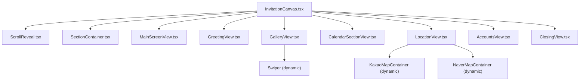
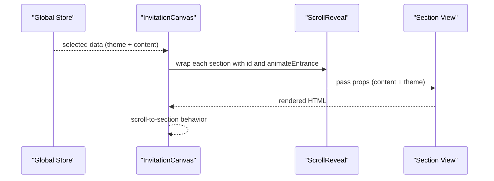
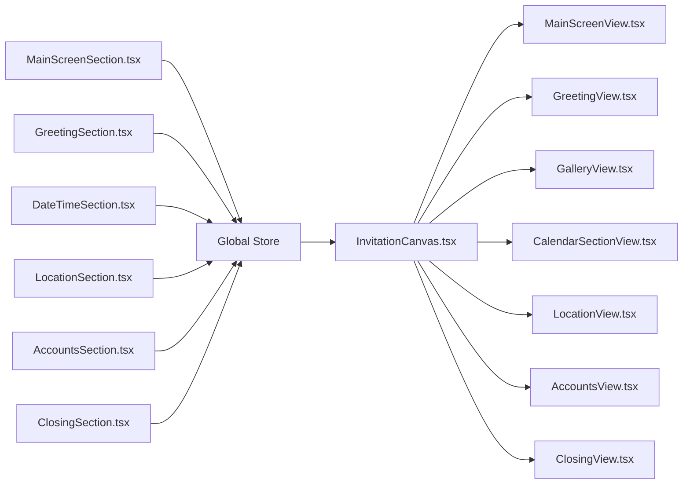
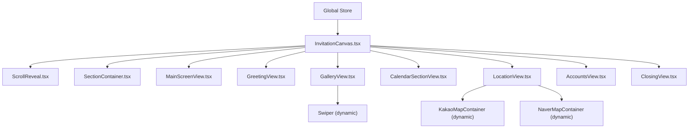

# Section Views

<cite>
**Referenced Files in This Document**
- [InvitationCanvas.tsx](file://src/components/preview/InvitationCanvas.tsx)
- [InvitationCanvas.module.scss](file://src/components/preview/InvitationCanvas.module.scss)
- [ScrollReveal.tsx](file://src/components/preview/ScrollReveal.tsx)
- [ScrollReveal.module.scss](file://src/components/preview/ScrollReveal.module.scss)
- [SectionContainer.tsx](file://src/components/preview/SectionContainer.tsx)
- [SectionContainer.module.scss](file://src/components/preview/SectionContainer.module.scss)
- [MainScreenView.tsx](file://src/components/preview/sections/MainScreenView.tsx)
- [GreetingView.tsx](file://src/components/preview/sections/GreetingView.tsx)
- [GalleryView.tsx](file://src/components/preview/sections/GalleryView.tsx)
- [CalendarSectionView.tsx](file://src/components/preview/sections/CalendarSectionView.tsx)
- [LocationView.tsx](file://src/components/preview/sections/LocationView.tsx)
- [AccountsView.tsx](file://src/components/preview/sections/AccountsView.tsx)
- [ClosingView.tsx](file://src/components/preview/sections/ClosingView.tsx)
- [MainScreenSection.tsx](file://src/components/builder/sections/MainScreenSection.tsx)
- [GreetingSection.tsx](file://src/components/builder/sections/GreetingSection.tsx)
- [GallerySection.tsx](file://src/components/builder/sections/GallerySection.tsx)
- [DateTimeSection.tsx](file://src/components/builder/sections/DateTimeSection.tsx)
- [LocationSection.tsx](file://src/components/builder/sections/LocationSection.tsx)
- [AccountsSection.tsx](file://src/components/builder/sections/AccountsSection.tsx)
- [ClosingSection.tsx](file://src/components/builder/sections/ClosingSection.tsx)
</cite>

## Table of Contents
1. [Introduction](#introduction)
2. [Project Structure](#project-structure)
3. [Core Components](#core-components)
4. [Architecture Overview](#architecture-overview)
5. [Detailed Component Analysis](#detailed-component-analysis)
6. [Dependency Analysis](#dependency-analysis)
7. [Performance Considerations](#performance-considerations)
8. [Troubleshooting Guide](#troubleshooting-guide)
9. [Conclusion](#conclusion)

## Introduction
This document explains the section views system that renders individual components within the invitation canvas. It focuses on how each section processes its data, applies responsive layouts, integrates styling and animations, and handles theme properties. It also documents prop interfaces, conditional rendering, fallback behaviors, customization examples, accessibility, and performance optimizations—especially for complex sections like galleries and maps.

## Project Structure
The preview canvas composes multiple section views in order. Each section view is a presentational component that receives normalized data from the global store and renders a consistent layout using shared wrappers and animations.

**Diagram sources**
- [InvitationCanvas.tsx](file://src/components/preview/InvitationCanvas.tsx#L315-L430)
- [ScrollReveal.tsx](file://src/components/preview/ScrollReveal.tsx#L17-L63)
- [SectionContainer.tsx](file://src/components/preview/SectionContainer.tsx#L21-L45)
- [MainScreenView.tsx](file://src/components/preview/sections/MainScreenView.tsx#L113-L397)
- [GreetingView.tsx](file://src/components/preview/sections/GreetingView.tsx#L43-L152)
- [GalleryView.tsx](file://src/components/preview/sections/GalleryView.tsx#L50-L305)
- [CalendarSectionView.tsx](file://src/components/preview/sections/CalendarSectionView.tsx#L26-L231)
- [LocationView.tsx](file://src/components/preview/sections/LocationView.tsx#L58-L201)
- [AccountsView.tsx](file://src/components/preview/sections/AccountsView.tsx#L36-L122)
- [ClosingView.tsx](file://src/components/preview/sections/ClosingView.tsx#L37-L192)

**Section sources**
- [InvitationCanvas.tsx](file://src/components/preview/InvitationCanvas.tsx#L1-L469)
- [InvitationCanvas.module.scss](file://src/components/preview/InvitationCanvas.module.scss#L1-L73)

## Core Components
- InvitationCanvas: Orchestrates the entire preview, selects and passes theme/data to each section, manages scroll-to-section behavior, and conditionally renders watermarks and modal portals.
- ScrollReveal: Handles intersection-based entrance animations with reduced-motion awareness.
- SectionContainer: Provides consistent padding, max widths, and wraps children in ScrollReveal.

Key responsibilities:
- Data normalization and selection for the canvas from the global store.
- Conditional rendering and fallbacks for missing data.
- Animation orchestration via ScrollReveal.
- Accessibility via focus traps and ARIA roles in interactive overlays.

**Section sources**
- [InvitationCanvas.tsx](file://src/components/preview/InvitationCanvas.tsx#L150-L451)
- [ScrollReveal.tsx](file://src/components/preview/ScrollReveal.tsx#L17-L63)
- [SectionContainer.tsx](file://src/components/preview/SectionContainer.tsx#L21-L45)

## Architecture Overview
The canvas composes sections in a fixed order. Each section receives theme-related props (accent color, animateEntrance) and content props. Sections use shared wrappers and optional dynamic imports for heavy components (gallery, maps).

**Diagram sources**
- [InvitationCanvas.tsx](file://src/components/preview/InvitationCanvas.tsx#L315-L430)
- [ScrollReveal.tsx](file://src/components/preview/ScrollReveal.tsx#L17-L63)

## Detailed Component Analysis

### MainScreenView
Purpose: Render the hero/main screen with multiple layout variants, optional images, and decorative effects.

Prop interface highlights:
- Layout variants, title/subtitle toggles, and connector styles.
- Image handling with ratio and effects (mist, ripple).
- Accent color for theming.

Styling and responsiveness:
- Uses CSS Modules with fluid font scaling via theme variables.
- Supports classic/minimal/english/korean/heart/fill/basic layouts with distinct typography and spacing.
- Gradient overlay and wave effects for fill layouts.

Fallback behavior:
- Gracefully renders placeholders when images are missing.
- Defaults for names and layout options.

Accessibility:
- Uses semantic headings and alt text for images.

Performance:
- Memoization of computed text and layout decisions.
- Dynamic image sizing and optimized blob handling.

**Section sources**
- [MainScreenView.tsx](file://src/components/preview/sections/MainScreenView.tsx#L19-L47)
- [MainScreenView.tsx](file://src/components/preview/sections/MainScreenView.tsx#L113-L397)

### GreetingView
Purpose: Display invitation message, optional greeting image, and family relation display or freeform names.

Prop interface highlights:
- Title/subtitle, rich text content, image URL/ratio.
- Options for showing names at bottom or enabling freeform names.

Styling and responsiveness:
- SectionContainer wrapper ensures consistent padding and max widths.
- Aspect ratio handling for images.

Fallback behavior:
- Empty state when no content is provided.

Accessibility:
- Rich text content sanitized via innerHTML; ensure sanitized input.

**Section sources**
- [GreetingView.tsx](file://src/components/preview/sections/GreetingView.tsx#L23-L38)
- [GreetingView.tsx](file://src/components/preview/sections/GreetingView.tsx#L43-L152)

### GalleryView
Purpose: Render photo galleries with multiple modes (swiper, thumbnail, grid), optional lightbox, and autoplay.

Prop interface highlights:
- Array of gallery items (normalized to objects), galleryType, preview mode, fade, autoplay, popup behavior.
- Accent color for active indicators.

Styling and responsiveness:
- Full-width swiper in preview mode; otherwise constrained.
- Grid layout for static display.

Animation and interaction:
- Swiper integration with navigation, pagination, fade effect, and autoplay.
- Lightbox modal via React Portal with focus trap and scroll lock.

Accessibility:
- Modal role dialog with aria-modal.
- Close button with aria-label.
- Focus trap to keep keyboard focus inside modal.

Performance:
- Dynamic import for Swiper modules to reduce initial bundle.
- Autoplay controlled based on modal open state.
- Memoized normalization of gallery items.

**Section sources**
- [GalleryView.tsx](file://src/components/preview/sections/GalleryView.tsx#L31-L43)
- [GalleryView.tsx](file://src/components/preview/sections/GalleryView.tsx#L50-L305)

### CalendarSectionView
Purpose: Display a monthly calendar highlighting the wedding date and a D-Day countdown.

Prop interface highlights:
- Date/time, showCalendar/showDday flags, and customizable D-Day message tokens.

Styling and responsiveness:
- Grid layout for calendar days with weekday headers.
- Timer grid for countdown.

Fallback behavior:
- Returns null if both show flags are false.

Accessibility:
- No interactive elements; relies on readable layout.

Performance:
- Memoized calculations for days grid and D-Day display.

**Section sources**
- [CalendarSectionView.tsx](file://src/components/preview/sections/CalendarSectionView.tsx#L9-L20)
- [CalendarSectionView.tsx](file://src/components/preview/sections/CalendarSectionView.tsx#L26-L231)

### LocationView
Purpose: Show venue name, address, contact, map, and optional sketch.

Prop interface highlights:
- Venue info, coordinates, map zoom/type, navigation toggles, sketch image/ratio, lock map.

Styling and responsiveness:
- Aspect ratio container for map area.
- Fixed/auto ratio for sketch image.

Dynamic loading:
- Maps loaded dynamically with skeleton loaders.

Accessibility:
- Buttons for navigation and copy actions with icons and labels.

Performance:
- Dynamic imports for map containers.
- Skeleton overlay while maps load.

**Section sources**
- [LocationView.tsx](file://src/components/preview/sections/LocationView.tsx#L18-L37)
- [LocationView.tsx](file://src/components/preview/sections/LocationView.tsx#L58-L201)

### AccountsView
Purpose: Display gift/account information grouped by groom/bride with copyable account numbers.

Prop interface highlights:
- List of accounts, group titles, description, color mode.

Styling and responsiveness:
- Uses PreviewAccordion with color modes aligned to theme.

Accessibility:
- Copy button triggers toast feedback.

Performance:
- Memoized component; efficient filtering of account lists.

**Section sources**
- [AccountsView.tsx](file://src/components/preview/sections/AccountsView.tsx#L19-L30)
- [AccountsView.tsx](file://src/components/preview/sections/AccountsView.tsx#L36-L122)

### ClosingView
Purpose: Final message, optional illustration, and sharing actions.

Prop interface highlights:
- Title/subtitle, rich text content, image URL/ratio, Kakao share configuration, and main image reference.

Styling and responsiveness:
- Optional fixed/auto ratio for image container.

Accessibility:
- Buttons with icons and labels.

Performance:
- Memoized component; safe image handling via utility checks.

**Section sources**
- [ClosingView.tsx](file://src/components/preview/sections/ClosingView.tsx#L16-L31)
- [ClosingView.tsx](file://src/components/preview/sections/ClosingView.tsx#L37-L192)

### Relationship to Builder Components
Builder sections manage state and form controls; preview section views consume normalized data and render visuals.

**Diagram sources**
- [MainScreenSection.tsx](file://src/components/builder/sections/MainScreenSection.tsx#L18-L59)
- [GreetingSection.tsx](file://src/components/builder/sections/GreetingSection.tsx#L24-L199)
- [DateTimeSection.tsx](file://src/components/builder/sections/DateTimeSection.tsx#L15-L95)
- [LocationSection.tsx](file://src/components/builder/sections/LocationSection.tsx#L8-L22)
- [AccountsSection.tsx](file://src/components/builder/sections/AccountsSection.tsx#L19-L305)
- [ClosingSection.tsx](file://src/components/builder/sections/ClosingSection.tsx#L25-L107)
- [InvitationCanvas.tsx](file://src/components/preview/InvitationCanvas.tsx#L315-L430)

## Dependency Analysis
- Canvas depends on theme and content slices from the store; it selects only necessary fields to minimize re-renders.
- ScrollReveal is a leaf-level animation enhancer used by SectionContainer and inline around major sections.
- GalleryView depends on Swiper modules; LocationView depends on dynamic map containers.
- SectionContainer composes ScrollReveal and provides consistent spacing.

**Diagram sources**
- [InvitationCanvas.tsx](file://src/components/preview/InvitationCanvas.tsx#L91-L144)
- [ScrollReveal.tsx](file://src/components/preview/ScrollReveal.tsx#L17-L63)
- [SectionContainer.tsx](file://src/components/preview/SectionContainer.tsx#L21-L45)
- [GalleryView.tsx](file://src/components/preview/sections/GalleryView.tsx#L23-L31)
- [LocationView.tsx](file://src/components/preview/sections/LocationView.tsx#L48-L56)

**Section sources**
- [InvitationCanvas.tsx](file://src/components/preview/InvitationCanvas.tsx#L91-L144)

## Performance Considerations
- Dynamic imports: GalleryView and map containers are lazy-loaded to reduce initial payload.
- Memoization: Several components use memoization to avoid unnecessary renders.
- IntersectionObserver: ScrollReveal defers animations until elements are near viewport.
- Reduced motion: Respects user preference to disable entrance animations.
- Scroll orchestration: Canvas scrolls to target sections with stable offsets and delays to avoid layout thrash.
- Image optimization: AspectRatio and image utilities ensure appropriate sizing and object-fit behavior.

Recommendations:
- Keep gallery arrays reasonably sized; virtualize if very large.
- Debounce map initialization if toggling between map types frequently.
- Prefer fixed ratios for images when aspect stability is required.

**Section sources**
- [InvitationCanvas.tsx](file://src/components/preview/InvitationCanvas.tsx#L21-L26)
- [ScrollReveal.tsx](file://src/components/preview/ScrollReveal.tsx#L17-L63)
- [GalleryView.tsx](file://src/components/preview/sections/GalleryView.tsx#L50-L305)
- [LocationView.tsx](file://src/components/preview/sections/LocationView.tsx#L48-L56)

## Troubleshooting Guide
Common issues and resolutions:
- Missing images: Sections render placeholders or skip images when URLs are null/undefined.
- Scroll jumping: Canvas uses offsetTop and a delayed readiness flag to stabilize initial scroll.
- Map not loading: Dynamic imports provide skeleton loaders; ensure map SDK keys are configured.
- Gallery autoplay conflicts: Autoplay stops when modal opens and resumes when closed.
- Accessibility in modals: Focus trap and ARIA modal attributes are applied in the gallery lightbox.

**Section sources**
- [MainScreenView.tsx](file://src/components/preview/sections/MainScreenView.tsx#L316-L321)
- [InvitationCanvas.tsx](file://src/components/preview/InvitationCanvas.tsx#L215-L288)
- [LocationView.tsx](file://src/components/preview/sections/LocationView.tsx#L39-L46)
- [GalleryView.tsx](file://src/components/preview/sections/GalleryView.tsx#L101-L114)
- [GalleryView.tsx](file://src/components/preview/sections/GalleryView.tsx#L242-L302)

## Conclusion
The section views system cleanly separates data orchestration (canvas/store) from presentation (individual views). Shared wrappers and animation utilities ensure consistent UX, while dynamic imports and memoization optimize performance. The system supports robust customization via theme props, responsive layouts, and accessibility features, with clear fallbacks for missing data.