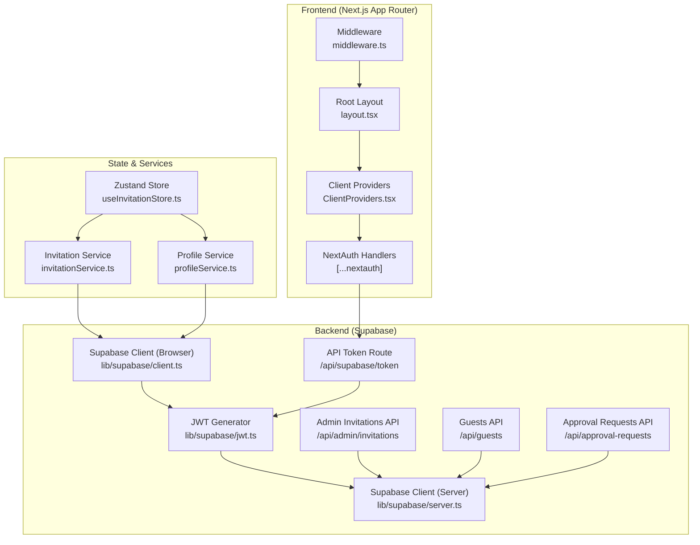
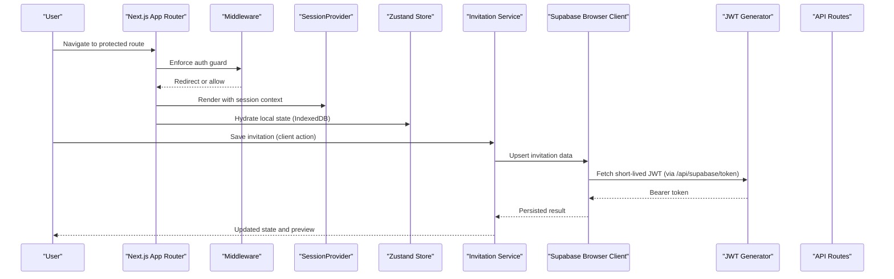
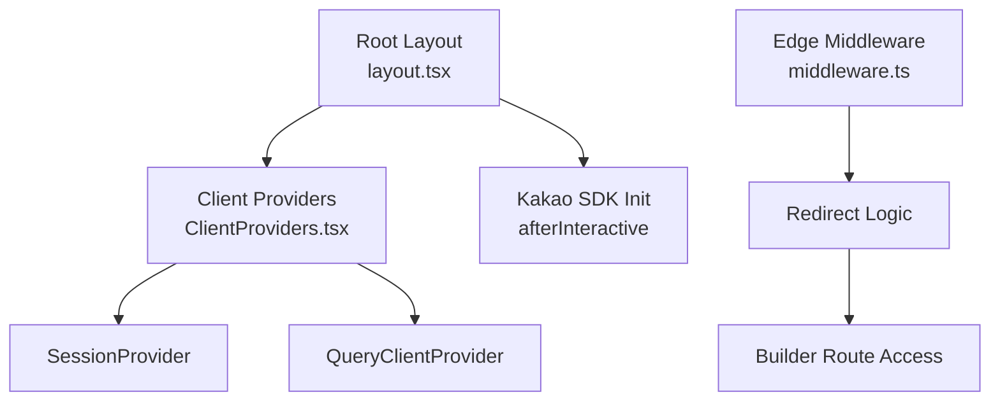
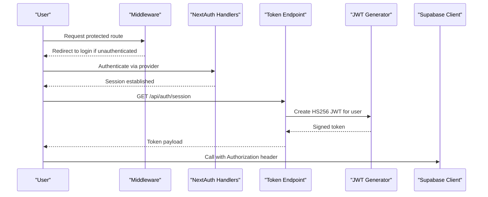
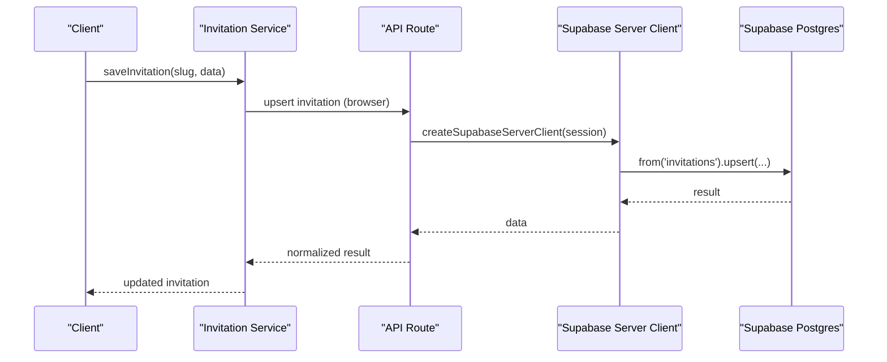
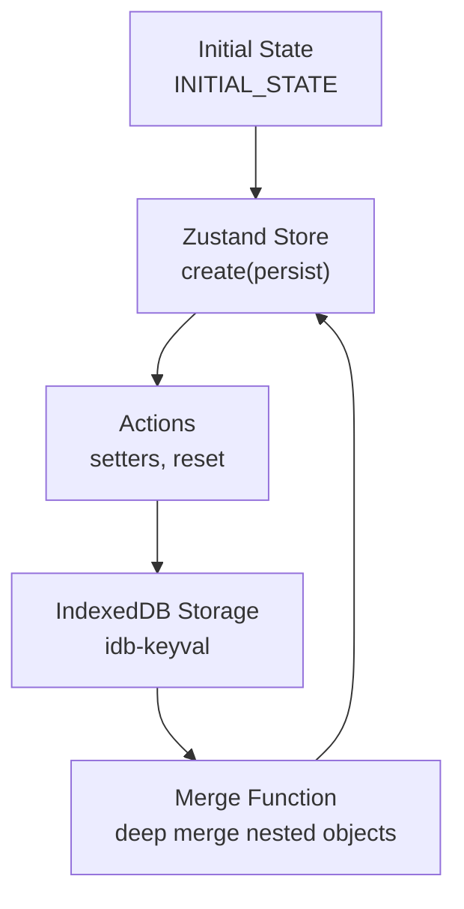
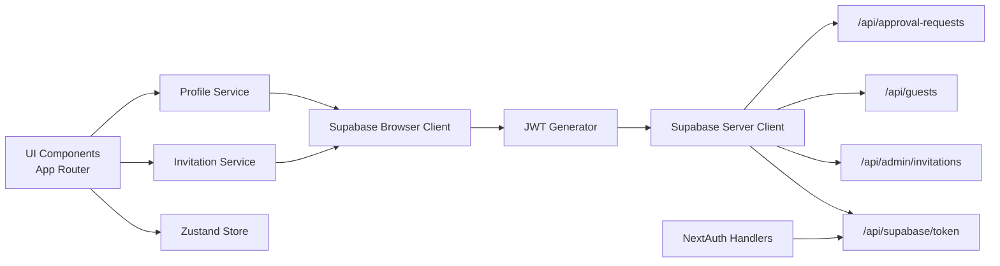

# Architecture Overview

<cite>
**Referenced Files in This Document**
- [layout.tsx](file://src/app/layout.tsx)
- [ClientProviders.tsx](file://src/app/ClientProviders.tsx)
- [middleware.ts](file://middleware.ts)
- [auth.ts](file://src/auth.ts)
- [auth-config.ts](file://src/auth-config.ts)
- [auth-edge.ts](file://src/auth-edge.ts)
- [client.ts](file://src/lib/supabase/client.ts)
- [server.ts](file://src/lib/supabase/server.ts)
- [jwt.ts](file://src/lib/supabase/jwt.ts)
- [useInvitationStore.ts](file://src/store/useInvitationStore.ts)
- [invitationService.ts](file://src/services/invitationService.ts)
- [profileService.ts](file://src/services/profileService.ts)
- [route.ts](file://src/app/api/supabase/token/route.ts)
- [route.ts](file://src/app/api/admin/invitations/route.ts)
- [route.ts](file://src/app/api/guests/route.ts)
- [route.ts](file://src/app/api/approval-requests/route.ts)
- [route.ts](file://src/app/api/auth/[...nextauth]/route.ts)
</cite>

## Table of Contents
1. [Introduction](#introduction)
2. [Project Structure](#project-structure)
3. [Core Components](#core-components)
4. [Architecture Overview](#architecture-overview)
5. [Detailed Component Analysis](#detailed-component-analysis)
6. [Dependency Analysis](#dependency-analysis)
7. [Performance Considerations](#performance-considerations)
8. [Troubleshooting Guide](#troubleshooting-guide)
9. [Conclusion](#conclusion)

## Introduction
This document presents a high-level architecture overview of the Banana Wedding platform. It explains the frontend built with Next.js App Router, the backend powered by Supabase, the state management strategy using Zustand with persistence, and the authentication and authorization model using NextAuth.js. It also covers component architecture grounded in atomic design principles, data flow patterns, and operational considerations for scalability and performance.

## Project Structure
The platform follows a modern full-stack architecture:
- Frontend: Next.js App Router with server components, client components, and server actions
- Backend: Supabase for database, Row Level Security (RLS), and API routes
- Authentication: NextAuth.js with edge middleware and session management
- State Management: Zustand store with IndexedDB-backed persistence
- Component Layer: Atomic design principles across shared UI primitives and domain-specific components

**Diagram sources**
- [layout.tsx](file://src/app/layout.tsx#L79-L155)
- [ClientProviders.tsx](file://src/app/ClientProviders.tsx#L8-L19)
- [middleware.ts](file://middleware.ts#L4-L17)
- [auth.ts](file://src/auth.ts#L1-L5)
- [client.ts](file://src/lib/supabase/client.ts#L41-L84)
- [server.ts](file://src/lib/supabase/server.ts#L9-L18)
- [jwt.ts](file://src/lib/supabase/jwt.ts#L5-L14)
- [useInvitationStore.ts](file://src/store/useInvitationStore.ts#L373-L533)
- [invitationService.ts](file://src/services/invitationService.ts#L9-L80)
- [profileService.ts](file://src/services/profileService.ts#L22-L100)
- [route.ts](file://src/app/api/supabase/token/route.ts#L5-L15)
- [route.ts](file://src/app/api/admin/invitations/route.ts#L8-L63)
- [route.ts](file://src/app/api/guests/route.ts#L15-L123)
- [route.ts](file://src/app/api/approval-requests/route.ts#L22-L336)

**Section sources**
- [layout.tsx](file://src/app/layout.tsx#L79-L155)
- [ClientProviders.tsx](file://src/app/ClientProviders.tsx#L8-L19)
- [middleware.ts](file://middleware.ts#L4-L17)
- [auth.ts](file://src/auth.ts#L1-L5)

## Core Components
- Frontend shell and providers: Root layout initializes metadata, scripts, and wraps children in providers that supply session context and query client.
- Client providers: Wraps the app with NextAuth’s SessionProvider and React Query’s QueryClientProvider, enabling optimistic UI and centralized caching.
- Middleware: Enforces route-level access control for protected areas (e.g., builder) and redirects based on authentication state.
- Authentication: NextAuth.js handles OAuth and session lifecycle; edge middleware protects routes; token endpoint generates short-lived JWTs for Supabase.
- Supabase clients: Browser client manages token refresh and reinitialization; server client attaches authenticated JWTs for RLS-secured operations.
- State management: Zustand store persists to IndexedDB via idb-keyval, enabling offline-friendly editing and fast hydration.
- Services: Typed service layer abstracts Supabase operations for invitations, guests, and profiles, returning normalized data to components.

**Section sources**
- [layout.tsx](file://src/app/layout.tsx#L79-L155)
- [ClientProviders.tsx](file://src/app/ClientProviders.tsx#L8-L19)
- [middleware.ts](file://middleware.ts#L4-L17)
- [client.ts](file://src/lib/supabase/client.ts#L41-L84)
- [server.ts](file://src/lib/supabase/server.ts#L9-L18)
- [jwt.ts](file://src/lib/supabase/jwt.ts#L5-L14)
- [useInvitationStore.ts](file://src/store/useInvitationStore.ts#L373-L533)
- [invitationService.ts](file://src/services/invitationService.ts#L9-L80)
- [profileService.ts](file://src/services/profileService.ts#L22-L100)

## Architecture Overview
The system is a single-page application with server-rendered pages and client-side interactivity. The frontend communicates with Supabase through typed services and API routes. Authentication is enforced at the edge and via API guards. Data is stored in Supabase with RLS policies, and the UI state is persisted locally for a responsive authoring experience.

**Diagram sources**
- [middleware.ts](file://middleware.ts#L4-L17)
- [ClientProviders.tsx](file://src/app/ClientProviders.tsx#L8-L19)
- [useInvitationStore.ts](file://src/store/useInvitationStore.ts#L373-L533)
- [invitationService.ts](file://src/services/invitationService.ts#L9-L80)
- [client.ts](file://src/lib/supabase/client.ts#L24-L39)
- [jwt.ts](file://src/lib/supabase/jwt.ts#L5-L14)
- [route.ts](file://src/app/api/supabase/token/route.ts#L5-L15)

## Detailed Component Analysis

### Frontend Architecture (Next.js App Router)
- Server components render pages and layouts; client components opt-in for interactivity.
- Providers initialize session and query client contexts at the root level.
- Edge middleware enforces route protection and redirects for authenticated/unauthenticated users.
- Kakao SDK initialization is deferred until after interactive hydration for performance.

**Diagram sources**
- [layout.tsx](file://src/app/layout.tsx#L79-L155)
- [ClientProviders.tsx](file://src/app/ClientProviders.tsx#L8-L19)
- [middleware.ts](file://middleware.ts#L4-L17)

**Section sources**
- [layout.tsx](file://src/app/layout.tsx#L79-L155)
- [ClientProviders.tsx](file://src/app/ClientProviders.tsx#L8-L19)
- [middleware.ts](file://middleware.ts#L4-L17)

### Authentication and Authorization
- NextAuth.js integrates with the app via exported handlers and edge-compatible auth utilities.
- The middleware enforces route-level protection for builder pages and login redirection.
- The token endpoint generates a short-lived JWT for the authenticated user, enabling Supabase client calls with RLS context.
- Admin checks combine email whitelist and database-backed profile flags.

**Diagram sources**
- [middleware.ts](file://middleware.ts#L4-L17)
- [auth.ts](file://src/auth.ts#L1-L5)
- [route.ts](file://src/app/api/auth/[...nextauth]/route.ts#L1-L3)
- [route.ts](file://src/app/api/supabase/token/route.ts#L5-L15)
- [jwt.ts](file://src/lib/supabase/jwt.ts#L5-L14)
- [client.ts](file://src/lib/supabase/client.ts#L64-L84)

**Section sources**
- [auth.ts](file://src/auth.ts#L1-L5)
- [auth-edge.ts](file://src/auth-edge.ts#L1-L200)
- [route.ts](file://src/app/api/auth/[...nextauth]/route.ts#L1-L3)
- [route.ts](file://src/app/api/supabase/token/route.ts#L5-L15)
- [jwt.ts](file://src/lib/supabase/jwt.ts#L5-L14)

### Backend and API Layer
- Supabase browser client encapsulates token refresh and client reinitialization to minimize network overhead.
- Server client composes authenticated Supabase instances using generated JWTs for RLS-secured operations.
- API routes implement CRUD and policy-gated operations:
  - Admin invitations: fetch pending invitations requiring review
  - Guests: submit RSVP and fetch guest lists
  - Approval requests: create, list, approve/reject, and cancel requests with role checks
- Validation uses Zod schemas to ensure data integrity.

**Diagram sources**
- [invitationService.ts](file://src/services/invitationService.ts#L9-L80)
- [server.ts](file://src/lib/supabase/server.ts#L9-L18)
- [route.ts](file://src/app/api/admin/invitations/route.ts#L8-L63)
- [route.ts](file://src/app/api/guests/route.ts#L15-L123)
- [route.ts](file://src/app/api/approval-requests/route.ts#L22-L336)

**Section sources**
- [client.ts](file://src/lib/supabase/client.ts#L41-L84)
- [server.ts](file://src/lib/supabase/server.ts#L9-L18)
- [invitationService.ts](file://src/services/invitationService.ts#L9-L80)
- [route.ts](file://src/app/api/admin/invitations/route.ts#L8-L63)
- [route.ts](file://src/app/api/guests/route.ts#L15-L123)
- [route.ts](file://src/app/api/approval-requests/route.ts#L22-L336)

### State Management Architecture (Zustand)
- The invitation store defines a comprehensive state shape for all builder sections and UI flags.
- Persistence uses IndexedDB via idb-keyval, enabling offline editing and large payloads beyond localStorage limits.
- The store merges persisted and current state, deep-merging nested objects to support evolving schemas.

**Diagram sources**
- [useInvitationStore.ts](file://src/store/useInvitationStore.ts#L373-L533)

**Section sources**
- [useInvitationStore.ts](file://src/store/useInvitationStore.ts#L373-L533)

### Component Architecture (Atomic Design)
- Shared UI primitives (buttons, inputs, dialogs) are organized under a common component library.
- Domain-specific components (builder sections, preview panels) compose primitives to implement features like galleries, accounts, and location sharing.
- Atomic design promotes reuse, testability, and consistent behavior across the application.

[No sources needed since this section describes general component organization without analyzing specific files]

### Data Flow Patterns
- Local-first editing: Zustand store updates trigger optimistic UI while background sync persists to Supabase.
- Service abstraction: Services encapsulate Supabase operations, normalize results, and expose typed APIs to components.
- API-driven collaboration: Guest and approval request APIs coordinate with Supabase to maintain data integrity and enforce access controls.

[No sources needed since this section synthesizes patterns without quoting specific files]

## Dependency Analysis
The following diagram highlights key dependencies among frontend, state, services, and backend layers.

**Diagram sources**
- [useInvitationStore.ts](file://src/store/useInvitationStore.ts#L373-L533)
- [invitationService.ts](file://src/services/invitationService.ts#L9-L80)
- [profileService.ts](file://src/services/profileService.ts#L22-L100)
- [client.ts](file://src/lib/supabase/client.ts#L41-L84)
- [server.ts](file://src/lib/supabase/server.ts#L9-L18)
- [jwt.ts](file://src/lib/supabase/jwt.ts#L5-L14)
- [route.ts](file://src/app/api/supabase/token/route.ts#L5-L15)
- [route.ts](file://src/app/api/admin/invitations/route.ts#L8-L63)
- [route.ts](file://src/app/api/guests/route.ts#L15-L123)
- [route.ts](file://src/app/api/approval-requests/route.ts#L22-L336)
- [auth.ts](file://src/auth.ts#L1-L5)

**Section sources**
- [useInvitationStore.ts](file://src/store/useInvitationStore.ts#L373-L533)
- [invitationService.ts](file://src/services/invitationService.ts#L9-L80)
- [profileService.ts](file://src/services/profileService.ts#L22-L100)
- [client.ts](file://src/lib/supabase/client.ts#L41-L84)
- [server.ts](file://src/lib/supabase/server.ts#L9-L18)
- [jwt.ts](file://src/lib/supabase/jwt.ts#L5-L14)
- [route.ts](file://src/app/api/supabase/token/route.ts#L5-L15)
- [route.ts](file://src/app/api/admin/invitations/route.ts#L8-L63)
- [route.ts](file://src/app/api/guests/route.ts#L15-L123)
- [route.ts](file://src/app/api/approval-requests/route.ts#L22-L336)
- [auth.ts](file://src/auth.ts#L1-L5)

## Performance Considerations
- Client hydration and token caching: The browser client caches tokens and reuses Supabase clients to reduce initialization overhead.
- Optimistic updates: Zustand enables immediate UI feedback during saves, with reconciliation on server acknowledgment.
- Query caching: React Query centralizes cache invalidation and refetch strategies for server data.
- Lazy initialization: Scripts like Kakao SDK load after interactive hydration to improve First Contentful Paint.
- IndexedDB persistence: Large invitation payloads are stored efficiently in IndexedDB to avoid localStorage limitations.

[No sources needed since this section provides general guidance]

## Troubleshooting Guide
- Authentication failures: Verify NextAuth handlers and middleware are configured and that the token endpoint returns a valid JWT for authenticated sessions.
- Supabase errors: Check RLS policies and service role keys; confirm server client attaches Authorization headers when available.
- API validation errors: Review Zod schemas and error responses for malformed payloads.
- Guest and approval request issues: Confirm session presence, admin checks, and database constraints for pending/rejected statuses.

**Section sources**
- [route.ts](file://src/app/api/supabase/token/route.ts#L5-L15)
- [jwt.ts](file://src/lib/supabase/jwt.ts#L5-L14)
- [route.ts](file://src/app/api/guests/route.ts#L15-L123)
- [route.ts](file://src/app/api/approval-requests/route.ts#L22-L336)

## Conclusion
The Banana Wedding platform combines a modern Next.js frontend with a robust Supabase backend and a pragmatic state management strategy. The architecture emphasizes clear separation of concerns, strong authentication and authorization, and scalable data flows. By leveraging edge middleware, server actions, and persistent client state, the platform delivers a responsive and reliable experience for creating and managing digital invitations.