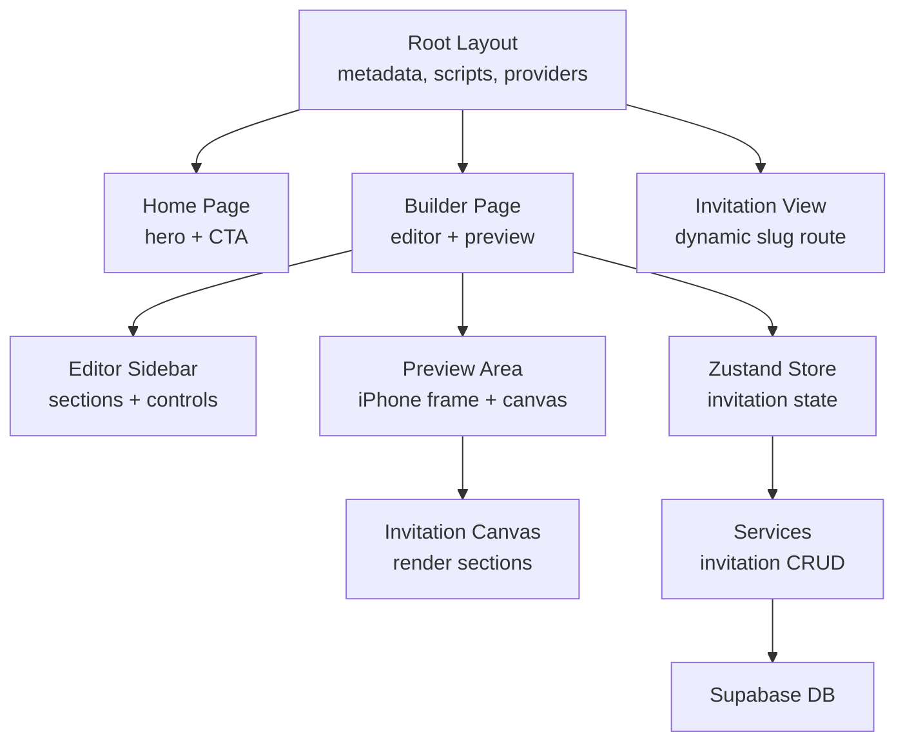
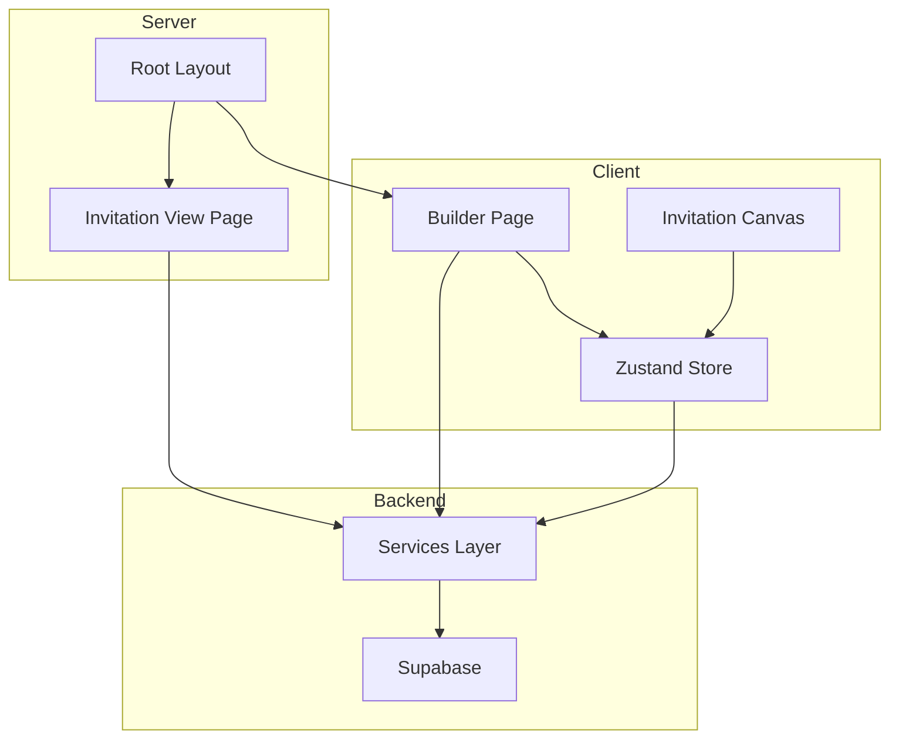
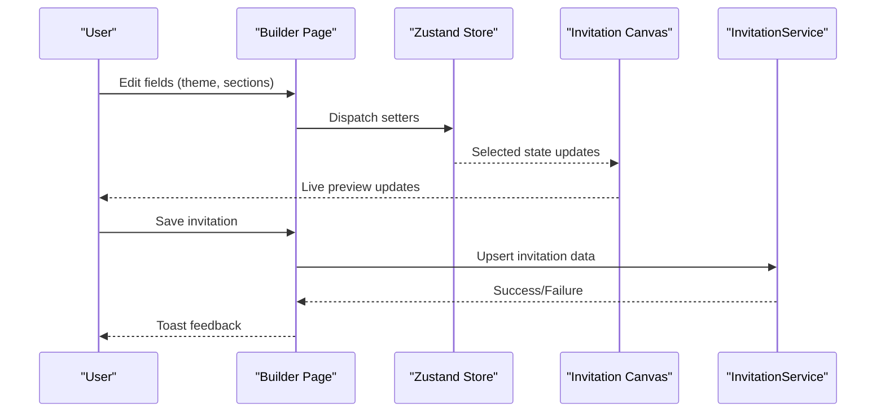
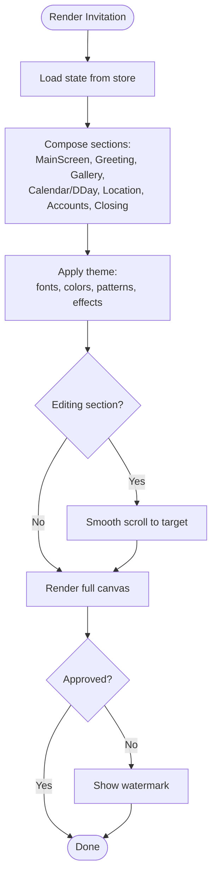
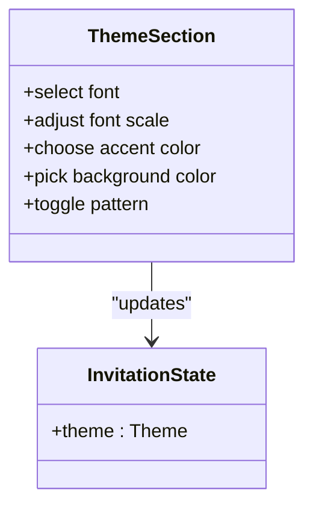
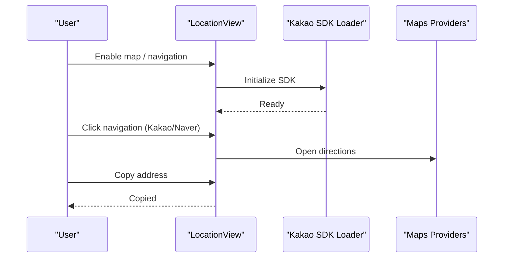
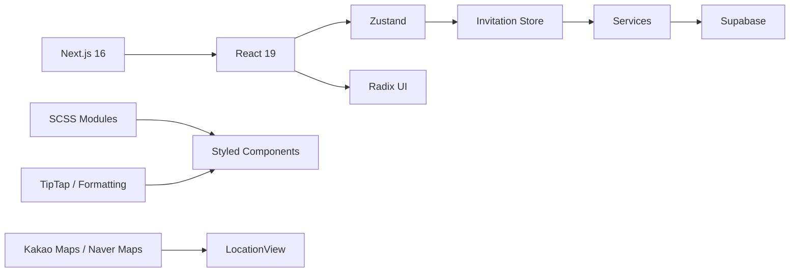

# Introduction

<cite>
**Referenced Files in This Document**
- [README.md](file://README.md)
- [package.json](file://package.json)
- [ARCHITECTURE.md](file://ARCHITECTURE.md)
- [src/app/layout.tsx](file://src/app/layout.tsx)
- [src/app/page.tsx](file://src/app/page.tsx)
- [src/app/builder/page.tsx](file://src/app/builder/page.tsx)
- [src/app/v/[slug]/page.tsx](file://src/app/v/[slug]/page.tsx)
- [src/components/preview/InvitationCanvas.tsx](file://src/components/preview/InvitationCanvas.tsx)
- [src/store/useInvitationStore.ts](file://src/store/useInvitationStore.ts)
- [src/services/invitationService.ts](file://src/services/invitationService.ts)
- [src/lib/utils/format.ts](file://src/lib/utils/format.ts)
- [src/components/builder/sections/ThemeSection.tsx](file://src/components/builder/sections/ThemeSection.tsx)
- [src/components/builder/sections/MainScreenSection.tsx](file://src/components/builder/sections/MainScreenSection.tsx)
- [src/components/preview/sections/LocationView.tsx](file://src/components/preview/sections/LocationView.tsx)
- [src/components/builder/sections/KakaoSdkLoader.tsx](file://src/components/builder/sections/KakaoSdkLoader.tsx)
</cite>

## Table of Contents
1. [Introduction](#introduction)
2. [Project Structure](#project-structure)
3. [Core Components](#core-components)
4. [Architecture Overview](#architecture-overview)
5. [Detailed Component Analysis](#detailed-component-analysis)
6. [Dependency Analysis](#dependency-analysis)
7. [Performance Considerations](#performance-considerations)
8. [Troubleshooting Guide](#troubleshooting-guide)
9. [Conclusion](#conclusion)

## Introduction
Banana Wedding is a digital invitation platform designed to modernize the traditional wedding invitation experience. It replaces paper-based invitations with a beautiful, interactive mobile-first digital format that couples and event coordinators can create, customize, and share instantly.

Mission and vision
- Mission: To revolutionize wedding invitations by delivering a delightful, efficient, and deeply personalized digital experience.
- Vision: A world where every couple can craft a meaningful, visually stunning invitation that reflects their story and brings joy to their guests.

The problem it solves
- Traditional paper invitations are costly, time-consuming to produce and distribute, and offer limited customization.
- Coordinating multiple versions, managing RSVPs, and keeping guests informed is complex and error-prone.
- Many couples struggle with balancing aesthetics, functionality, and ease-of-use when designing invitations.

Who it serves
- Couples planning weddings who want a seamless, creative, and shareable invitation solution.
- Event coordinators and vendors who need reliable tools for managing invitations and guest communications.

Core value proposition
- Personalized mobile invitations that feel crafted and special.
- Real-time collaboration between creators and guests.
- Social sharing optimized for popular platforms, enabling effortless distribution.

Unique features
- Instant preview: See changes reflected immediately as you edit.
- Theme customization: Fonts, colors, backgrounds, and seasonal effects.
- Guest management: Track RSVPs and manage guest lists.
- Mobile-first design: Optimized for phones and tablets with responsive layouts.
- Dual map integration: Support for both Kakao Maps and Naver Maps.
- Rich media: Galleries, animations, and customizable layouts.
- SEO and accessibility: Built-in SEO metadata and WCAG-compliant design.

Digital invitation trends and market position
- Digital invitations are gaining popularity due to cost-effectiveness, environmental benefits, and convenience.
- Banana Wedding positions itself as a premium, easy-to-use platform that combines creative freedom with practical functionality for modern couples and coordinators.

Accessible yet technically sophisticated
- For newcomers: intuitive drag-and-drop editing, guided sections, and instant previews make creating invitations straightforward.
- For developers: a modern React/Next.js stack, strict architecture guidelines, robust state management, and scalable integrations provide a strong foundation for extension and maintenance.

**Section sources**
- [README.md](file://README.md#L1-L400)
- [src/app/layout.tsx](file://src/app/layout.tsx#L18-L77)
- [src/app/page.tsx](file://src/app/page.tsx#L6-L52)

## Project Structure
At a high level, the platform follows Next.js App Router conventions with a clear separation of concerns:
- Application shell and metadata live in the root layout and page.
- The invitation builder is a dedicated page with a sidebar editor and live preview area.
- Preview rendering is handled by a reusable canvas component.
- State is managed centrally via a Zustand store with persistence.
- Services encapsulate data access and business logic.
- Components are organized by atomic, molecular, and organism layers.

**Diagram sources**
- [src/app/layout.tsx](file://src/app/layout.tsx#L79-L155)
- [src/app/page.tsx](file://src/app/page.tsx#L6-L52)
- [src/app/builder/page.tsx](file://src/app/builder/page.tsx#L42-L231)
- [src/app/v/[slug]/page.tsx](file://src/app/v/[slug]/page.tsx#L63-L107)
- [src/components/preview/InvitationCanvas.tsx](file://src/components/preview/InvitationCanvas.tsx#L462-L468)
- [src/store/useInvitationStore.ts](file://src/store/useInvitationStore.ts#L373-L533)
- [src/services/invitationService.ts](file://src/services/invitationService.ts#L9-L80)

**Section sources**
- [ARCHITECTURE.md](file://ARCHITECTURE.md#L100-L145)
- [package.json](file://package.json#L1-L107)

## Core Components
- InvitationCanvas: Renders the complete invitation in a mobile-friendly layout, composing individual sections (main screen, greeting, gallery, calendar/DDay, location, accounts, closing).
- Zustand Store: Centralized state for all invitation data, including personal info, theme, sections, and UI flags.
- InvitationService: Handles saving, loading, and listing invitations via Supabase.
- Builder Page: Provides the editing UI with a sidebar and live preview, including mobile drawer for preview.
- Invitation View Page: Server-rendered page that displays a finalized invitation by slug with SEO metadata.

Key capabilities
- Real-time editing with instant preview.
- Rich customization (fonts, colors, backgrounds, seasonal effects).
- Gallery management and map integration.
- SEO metadata generation and JSON-LD for events.

**Section sources**
- [src/components/preview/InvitationCanvas.tsx](file://src/components/preview/InvitationCanvas.tsx#L28-L148)
- [src/store/useInvitationStore.ts](file://src/store/useInvitationStore.ts#L4-L230)
- [src/services/invitationService.ts](file://src/services/invitationService.ts#L9-L80)
- [src/app/builder/page.tsx](file://src/app/builder/page.tsx#L42-L231)
- [src/app/v/[slug]/page.tsx](file://src/app/v/[slug]/page.tsx#L63-L107)

## Architecture Overview
Banana Wedding follows a modern, performance-focused architecture:
- Server Components with direct database access for reads.
- Server Actions for mutations.
- Strict component layering (Atomic → Molecular → Organism).
- Zustand for client-side state with IndexedDB persistence.
- Supabase for backend data and authentication.

**Diagram sources**
- [ARCHITECTURE.md](file://ARCHITECTURE.md#L6-L36)
- [src/app/layout.tsx](file://src/app/layout.tsx#L79-L155)
- [src/app/builder/page.tsx](file://src/app/builder/page.tsx#L42-L231)
- [src/app/v/[slug]/page.tsx](file://src/app/v/[slug]/page.tsx#L63-L107)
- [src/services/invitationService.ts](file://src/services/invitationService.ts#L9-L80)

**Section sources**
- [ARCHITECTURE.md](file://ARCHITECTURE.md#L1-L308)

## Detailed Component Analysis

### Builder Editing Workflow
The builder enables real-time editing with immediate preview updates. Users adjust settings in the sidebar, and the canvas reflects changes instantly. Mobile preview is available via a floating action button and a slide-out drawer.

**Diagram sources**
- [src/app/builder/page.tsx](file://src/app/builder/page.tsx#L87-L127)
- [src/store/useInvitationStore.ts](file://src/store/useInvitationStore.ts#L373-L533)
- [src/components/preview/InvitationCanvas.tsx](file://src/components/preview/InvitationCanvas.tsx#L455-L468)
- [src/services/invitationService.ts](file://src/services/invitationService.ts#L9-L24)

**Section sources**
- [src/app/builder/page.tsx](file://src/app/builder/page.tsx#L42-L231)
- [src/store/useInvitationStore.ts](file://src/store/useInvitationStore.ts#L244-L371)
- [src/components/preview/InvitationCanvas.tsx](file://src/components/preview/InvitationCanvas.tsx#L150-L288)

### Invitation Rendering Pipeline
The canvas composes multiple sections and applies theme settings. It supports smooth scrolling to the edited section and optional watermarks for unapproved live pages.

**Diagram sources**
- [src/components/preview/InvitationCanvas.tsx](file://src/components/preview/InvitationCanvas.tsx#L28-L148)
- [src/store/useInvitationStore.ts](file://src/store/useInvitationStore.ts#L373-L533)

**Section sources**
- [src/components/preview/InvitationCanvas.tsx](file://src/components/preview/InvitationCanvas.tsx#L150-L468)
- [src/store/useInvitationStore.ts](file://src/store/useInvitationStore.ts#L244-L371)

### Theme and Customization Controls
Theme customization includes fonts, sizes, background colors, and seasonal effects. These choices are applied to the canvas and persisted in the store.

**Diagram sources**
- [src/components/builder/sections/ThemeSection.tsx](file://src/components/builder/sections/ThemeSection.tsx#L22-L135)
- [src/store/useInvitationStore.ts](file://src/store/useInvitationStore.ts#L88-L101)

**Section sources**
- [src/components/builder/sections/ThemeSection.tsx](file://src/components/builder/sections/ThemeSection.tsx#L22-L135)
- [src/store/useInvitationStore.ts](file://src/store/useInvitationStore.ts#L330-L342)

### Location and Map Integration
The platform integrates dual maps (Kakao Maps and Naver Maps) with navigation links and address copy functionality, supporting both Korean map ecosystems.

**Diagram sources**
- [src/components/preview/sections/LocationView.tsx](file://src/components/preview/sections/LocationView.tsx#L142-L163)
- [src/components/builder/sections/KakaoSdkLoader.tsx](file://src/components/builder/sections/KakaoSdkLoader.tsx#L11-L31)

**Section sources**
- [src/components/preview/sections/LocationView.tsx](file://src/components/preview/sections/LocationView.tsx#L142-L163)
- [src/components/builder/sections/KakaoSdkLoader.tsx](file://src/components/builder/sections/KakaoSdkLoader.tsx#L11-L31)

## Dependency Analysis
Technology stack highlights
- Frontend: Next.js 16 App Router, React 19, TypeScript, Radix UI primitives, SCSS Modules.
- State: Zustand with IndexedDB persistence.
- Backend: Supabase for database and auth.
- Maps: Kakao Maps SDK and Naver Maps.
- Utilities: TipTap for rich text, html2canvas/jsPDF for exports, date formatting helpers.

**Diagram sources**
- [package.json](file://package.json#L17-L74)
- [src/components/preview/sections/LocationView.tsx](file://src/components/preview/sections/LocationView.tsx#L142-L163)
- [src/lib/utils/format.ts](file://src/lib/utils/format.ts#L5-L40)

**Section sources**
- [package.json](file://package.json#L17-L74)
- [src/lib/utils/format.ts](file://src/lib/utils/format.ts#L5-L40)

## Performance Considerations
- Server-first rendering: Reads use server components with direct DB access; writes leverage server actions.
- Lazy loading: Dynamic imports for heavy components (canvas, galleries) improve initial load.
- Memoization: Canvas content uses memoization and shallow selectors to minimize re-renders.
- Image optimization: Next.js Image with automatic format conversion and lazy loading.
- IndexedDB persistence: Reduces localStorage limitations and improves offline readiness.

[No sources needed since this section provides general guidance]

## Troubleshooting Guide
Common issues and resolutions
- Preview not updating: Ensure the store is initialized and the canvas subscribes to relevant state slices.
- Map SDK errors: Verify environment variables and SDK loader initialization.
- Slug conflicts: Confirm slug generation and uniqueness logic when saving invitations.
- SEO metadata missing: Check Open Graph and JSON-LD generation in the layout and view page.

**Section sources**
- [src/app/builder/page.tsx](file://src/app/builder/page.tsx#L87-L127)
- [src/components/builder/sections/KakaoSdkLoader.tsx](file://src/components/builder/sections/KakaoSdkLoader.tsx#L11-L31)
- [src/services/invitationService.ts](file://src/services/invitationService.ts#L9-L24)
- [src/app/layout.tsx](file://src/app/layout.tsx#L101-L148)
- [src/app/v/[slug]/page.tsx](file://src/app/v/[slug]/page.tsx#L16-L61)

## Conclusion
Banana Wedding transforms the wedding invitation process by combining modern web technologies with thoughtful UX design. It empowers couples and coordinators to create personalized, shareable invitations quickly and easily, while offering developers a solid, scalable architecture built on Next.js, Zustand, and Supabase.

[No sources needed since this section summarizes without analyzing specific files]