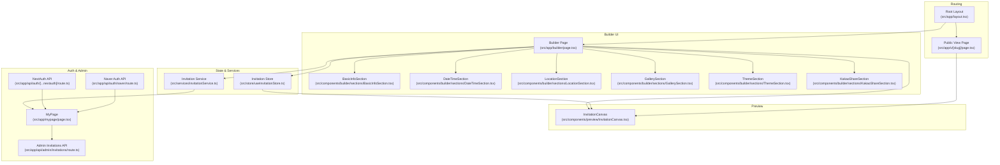
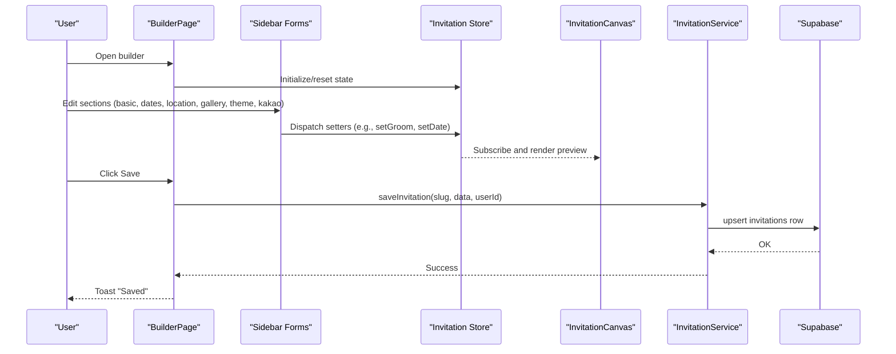
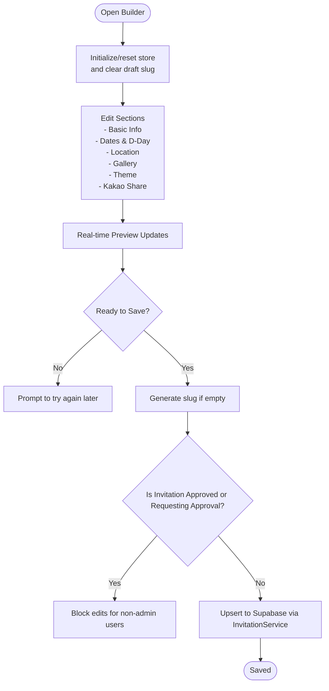
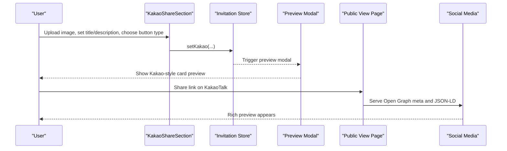
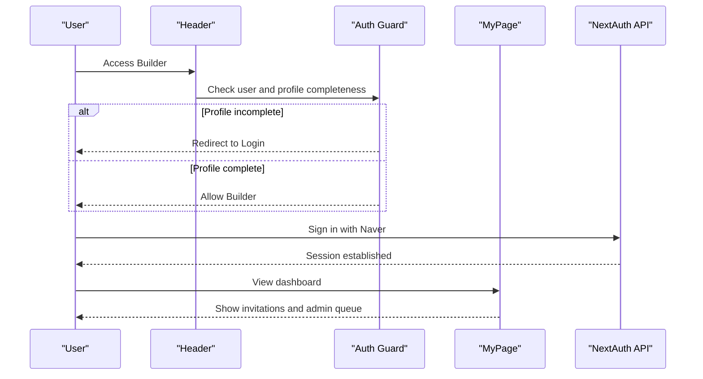
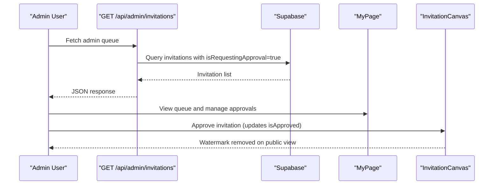
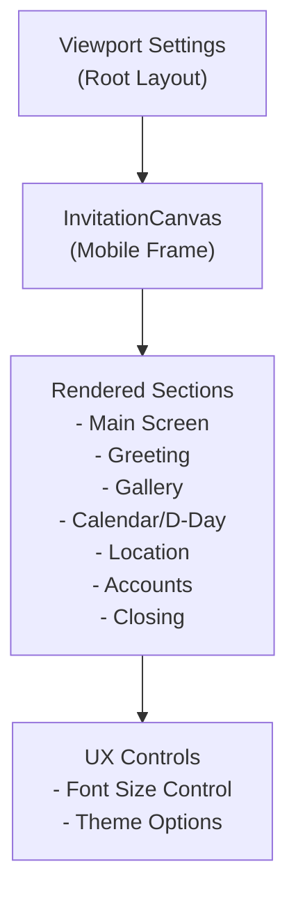
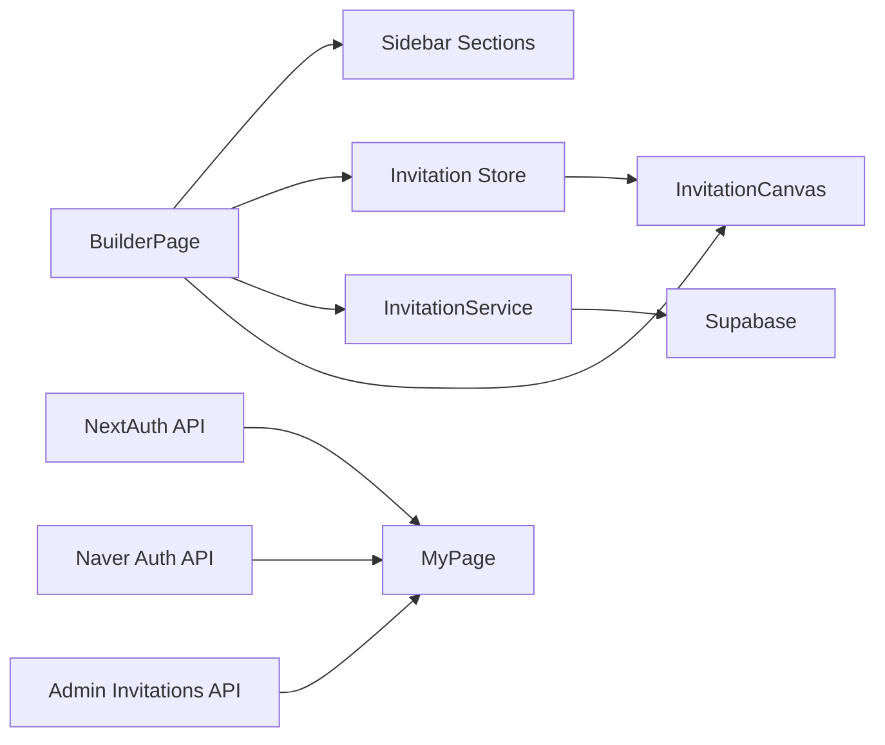

# Key Features

<cite>
**Referenced Files in This Document**
- [src/app/builder/page.tsx](file://src/app/builder/page.tsx)
- [src/components/builder/sections/BasicInfoSection.tsx](file://src/components/builder/sections/BasicInfoSection.tsx)
- [src/components/builder/sections/DateTimeSection.tsx](file://src/components/builder/sections/DateTimeSection.tsx)
- [src/components/builder/sections/LocationSection.tsx](file://src/components/builder/sections/LocationSection.tsx)
- [src/components/builder/sections/GallerySection.tsx](file://src/components/builder/sections/GallerySection.tsx)
- [src/components/builder/sections/ThemeSection.tsx](file://src/components/builder/sections/ThemeSection.tsx)
- [src/components/builder/sections/KakaoShareSection.tsx](file://src/components/builder/sections/KakaoShareSection.tsx)
- [src/components/preview/InvitationCanvas.tsx](file://src/components/preview/InvitationCanvas.tsx)
- [src/store/useInvitationStore.ts](file://src/store/useInvitationStore.ts)
- [src/services/invitationService.ts](file://src/services/invitationService.ts)
- [src/app/mypage/page.tsx](file://src/app/mypage/page.tsx)
- [src/app/api/admin/invitations/route.ts](file://src/app/api/admin/invitations/route.ts)
- [src/app/api/auth/[...nextauth]/route.ts](file://src/app/api/auth/[...nextauth]/route.ts)
- [src/app/api/auth/naver/route.ts](file://src/app/api/auth/naver/route.ts)
- [src/app/layout.tsx](file://src/app/layout.tsx)
- [src/components/common/Header/Header.tsx](file://src/components/common/Header/Header.tsx)
- [src/app/v/[slug]/page.tsx](file://src/app/v/[slug]/page.tsx)
</cite>

## Table of Contents
1. [Introduction](#introduction)
2. [Project Structure](#project-structure)
3. [Core Components](#core-components)
4. [Architecture Overview](#architecture-overview)
5. [Detailed Component Analysis](#detailed-component-analysis)
6. [Dependency Analysis](#dependency-analysis)
7. [Performance Considerations](#performance-considerations)
8. [Troubleshooting Guide](#troubleshooting-guide)
9. [Conclusion](#conclusion)

## Introduction
This document highlights the key features that define the Banana Wedding platform’s capabilities:
- Real-time invitation builder with multi-section editing (basic info, dates, locations, galleries, themes)
- Instant preview optimized for desktop and mobile
- Social sharing with KakaoTalk integration and Naver authentication
- User management with authentication, profile completion, guest management, and RSVP tracking
- Admin approval system for quality control
- Fully responsive design across devices

These features differentiate Banana Wedding from traditional invitation services by offering a modern, web-native, self-service experience with seamless social sharing and admin oversight.

## Project Structure
The platform is a Next.js application with a clear separation of concerns:
- Builder UI and real-time editing live under the builder page and reusable section components
- Preview rendering is handled by a dedicated canvas component
- State management is centralized in a zustand store persisted to IndexedDB
- Services abstract Supabase interactions for invitations and profiles
- Authentication integrates NextAuth.js and Naver OAuth
- Admin APIs manage approval queues and invitation moderation

**Diagram sources**
- [src/app/builder/page.tsx](file://src/app/builder/page.tsx#L1-L232)
- [src/components/builder/sections/BasicInfoSection.tsx](file://src/components/builder/sections/BasicInfoSection.tsx#L1-L134)
- [src/components/builder/sections/DateTimeSection.tsx](file://src/components/builder/sections/DateTimeSection.tsx#L1-L95)
- [src/components/builder/sections/LocationSection.tsx](file://src/components/builder/sections/LocationSection.tsx#L1-L25)
- [src/components/builder/sections/GallerySection.tsx](file://src/components/builder/sections/GallerySection.tsx#L1-L25)
- [src/components/builder/sections/ThemeSection.tsx](file://src/components/builder/sections/ThemeSection.tsx#L1-L136)
- [src/components/builder/sections/KakaoShareSection.tsx](file://src/components/builder/sections/KakaoShareSection.tsx#L1-L153)
- [src/components/preview/InvitationCanvas.tsx](file://src/components/preview/InvitationCanvas.tsx#L1-L469)
- [src/store/useInvitationStore.ts](file://src/store/useInvitationStore.ts#L1-L534)
- [src/services/invitationService.ts](file://src/services/invitationService.ts#L1-L81)
- [src/app/mypage/page.tsx](file://src/app/mypage/page.tsx#L1-L128)
- [src/app/api/admin/invitations/route.ts](file://src/app/api/admin/invitations/route.ts#L1-L64)
- [src/app/api/auth/[...nextauth]/route.ts](file://src/app/api/auth/[...nextauth]/route.ts#L1-L4)
- [src/app/api/auth/naver/route.ts](file://src/app/api/auth/naver/route.ts#L1-L10)
- [src/app/layout.tsx](file://src/app/layout.tsx#L1-L156)
- [src/app/v/[slug]/page.tsx](file://src/app/v/[slug]/page.tsx#L1-L108)

**Section sources**
- [src/app/builder/page.tsx](file://src/app/builder/page.tsx#L1-L232)
- [src/components/preview/InvitationCanvas.tsx](file://src/components/preview/InvitationCanvas.tsx#L1-L469)
- [src/store/useInvitationStore.ts](file://src/store/useInvitationStore.ts#L1-L534)
- [src/services/invitationService.ts](file://src/services/invitationService.ts#L1-L81)
- [src/app/mypage/page.tsx](file://src/app/mypage/page.tsx#L1-L128)
- [src/app/api/admin/invitations/route.ts](file://src/app/api/admin/invitations/route.ts#L1-L64)
- [src/app/api/auth/[...nextauth]/route.ts](file://src/app/api/auth/[...nextauth]/route.ts#L1-L4)
- [src/app/api/auth/naver/route.ts](file://src/app/api/auth/naver/route.ts#L1-L10)
- [src/app/layout.tsx](file://src/app/layout.tsx#L1-L156)
- [src/app/v/[slug]/page.tsx](file://src/app/v/[slug]/page.tsx#L1-L108)

## Core Components
- Invitation Builder Page: Orchestrates real-time editing, saving, and mobile preview
- Multi-section Editors: Dedicated forms for basic info, dates, locations, galleries, themes, and Kakao sharing
- Invitation Canvas: Renders the invitation in real time with responsive layouts
- State Store: Centralized, persisted state for all invitation data and UI flags
- Services: Encapsulate Supabase interactions for invitations and summaries
- Authentication: NextAuth.js with Naver OAuth and login guard
- Admin APIs: Approvals queue and admin-only invitation listing
- Public View: SEO-friendly public page with structured data and Open Graph

**Section sources**
- [src/app/builder/page.tsx](file://src/app/builder/page.tsx#L42-L232)
- [src/components/builder/sections/BasicInfoSection.tsx](file://src/components/builder/sections/BasicInfoSection.tsx#L15-L134)
- [src/components/builder/sections/DateTimeSection.tsx](file://src/components/builder/sections/DateTimeSection.tsx#L15-L95)
- [src/components/builder/sections/LocationSection.tsx](file://src/components/builder/sections/LocationSection.tsx#L8-L25)
- [src/components/builder/sections/GallerySection.tsx](file://src/components/builder/sections/GallerySection.tsx#L9-L25)
- [src/components/builder/sections/ThemeSection.tsx](file://src/components/builder/sections/ThemeSection.tsx#L22-L136)
- [src/components/builder/sections/KakaoShareSection.tsx](file://src/components/builder/sections/KakaoShareSection.tsx#L22-L153)
- [src/components/preview/InvitationCanvas.tsx](file://src/components/preview/InvitationCanvas.tsx#L28-L469)
- [src/store/useInvitationStore.ts](file://src/store/useInvitationStore.ts#L4-L534)
- [src/services/invitationService.ts](file://src/services/invitationService.ts#L9-L81)

## Architecture Overview
The builder uses a unidirectional data flow:
- Users edit sections in the sidebar
- Changes update the zustand store instantly
- The InvitationCanvas subscribes to store changes and renders previews
- Saving persists data to Supabase via the invitation service
- Admins review invitations through the admin API and manage approvals

**Diagram sources**
- [src/app/builder/page.tsx](file://src/app/builder/page.tsx#L87-L127)
- [src/store/useInvitationStore.ts](file://src/store/useInvitationStore.ts#L373-L473)
- [src/components/preview/InvitationCanvas.tsx](file://src/components/preview/InvitationCanvas.tsx#L455-L468)
- [src/services/invitationService.ts](file://src/services/invitationService.ts#L10-L24)

**Section sources**
- [src/app/builder/page.tsx](file://src/app/builder/page.tsx#L87-L127)
- [src/store/useInvitationStore.ts](file://src/store/useInvitationStore.ts#L373-L473)
- [src/components/preview/InvitationCanvas.tsx](file://src/components/preview/InvitationCanvas.tsx#L455-L468)
- [src/services/invitationService.ts](file://src/services/invitationService.ts#L10-L24)

## Detailed Component Analysis

### Invitation Builder System with Real-Time Customization
- Multi-section editing: Basic info, dates, locations, galleries, themes, and Kakao sharing are separate, collapsible sections with completion indicators.
- Real-time preview: The InvitationCanvas subscribes to the store and renders previews instantly as users edit.
- Mobile-optimized preview: A floating action button opens a slide-out drawer with a mobile frame for quick checks.
- Saving and slug generation: On save, the system generates a slug if missing, validates approval state, and persists to Supabase.

**Diagram sources**
- [src/app/builder/page.tsx](file://src/app/builder/page.tsx#L60-L127)
- [src/store/useInvitationStore.ts](file://src/store/useInvitationStore.ts#L244-L371)
- [src/services/invitationService.ts](file://src/services/invitationService.ts#L10-L24)

**Section sources**
- [src/app/builder/page.tsx](file://src/app/builder/page.tsx#L42-L232)
- [src/components/builder/sections/BasicInfoSection.tsx](file://src/components/builder/sections/BasicInfoSection.tsx#L15-L134)
- [src/components/builder/sections/DateTimeSection.tsx](file://src/components/builder/sections/DateTimeSection.tsx#L15-L95)
- [src/components/builder/sections/LocationSection.tsx](file://src/components/builder/sections/LocationSection.tsx#L8-L25)
- [src/components/builder/sections/GallerySection.tsx](file://src/components/builder/sections/GallerySection.tsx#L9-L25)
- [src/components/builder/sections/ThemeSection.tsx](file://src/components/builder/sections/ThemeSection.tsx#L22-L136)
- [src/components/builder/sections/KakaoShareSection.tsx](file://src/components/builder/sections/KakaoShareSection.tsx#L22-L153)
- [src/components/preview/InvitationCanvas.tsx](file://src/components/preview/InvitationCanvas.tsx#L150-L288)
- [src/store/useInvitationStore.ts](file://src/store/useInvitationStore.ts#L244-L371)
- [src/services/invitationService.ts](file://src/services/invitationService.ts#L10-L24)

### Social Sharing Features
- KakaoTalk integration: Dedicated section for thumbnail image, caption, description, and button style. Includes a preview modal matching Kakao’s card UI.
- Naver authentication: API routes forward to NextAuth’s Naver provider for seamless sign-in.
- Mobile-optimized sharing: The public view page generates Open Graph metadata and structured data for rich social previews.

**Diagram sources**
- [src/components/builder/sections/KakaoShareSection.tsx](file://src/components/builder/sections/KakaoShareSection.tsx#L22-L153)
- [src/store/useInvitationStore.ts](file://src/store/useInvitationStore.ts#L456-L467)
- [src/app/v/[slug]/page.tsx](file://src/app/v/[slug]/page.tsx#L16-L61)

**Section sources**
- [src/components/builder/sections/KakaoShareSection.tsx](file://src/components/builder/sections/KakaoShareSection.tsx#L22-L153)
- [src/app/api/auth/naver/route.ts](file://src/app/api/auth/naver/route.ts#L1-L10)
- [src/app/v/[slug]/page.tsx](file://src/app/v/[slug]/page.tsx#L16-L61)

### User Management and Authentication
- Login guard: Builder redirects unauthenticated or incomplete-profile users to login.
- NextAuth integration: Standard NextAuth API routes handle OAuth flows.
- MyPage: Lists invitations, admin queue, and approval requests; supports admin-only views.
- Profile completion: Required before accessing builder; enforced by guards.

**Diagram sources**
- [src/app/builder/page.tsx](file://src/app/builder/page.tsx#L71-L76)
- [src/components/common/Header/Header.tsx](file://src/components/common/Header/Header.tsx#L26-L196)
- [src/app/mypage/page.tsx](file://src/app/mypage/page.tsx#L22-L127)
- [src/app/api/auth/[...nextauth]/route.ts](file://src/app/api/auth/[...nextauth]/route.ts#L1-L4)

**Section sources**
- [src/app/builder/page.tsx](file://src/app/builder/page.tsx#L71-L76)
- [src/components/common/Header/Header.tsx](file://src/components/common/Header/Header.tsx#L26-L196)
- [src/app/mypage/page.tsx](file://src/app/mypage/page.tsx#L22-L127)
- [src/app/api/auth/[...nextauth]/route.ts](file://src/app/api/auth/[...nextauth]/route.ts#L1-L4)

### Admin Approval System
- Admin queue: Admins see invitations requesting approval via the admin API.
- Approval controls: The store tracks approval flags; the public view hides watermark for approved invitations.
- Quality control: Admins can review and approve invitations before public visibility.

**Diagram sources**
- [src/app/api/admin/invitations/route.ts](file://src/app/api/admin/invitations/route.ts#L8-L55)
- [src/store/useInvitationStore.ts](file://src/store/useInvitationStore.ts#L470-L472)
- [src/app/v/[slug]/page.tsx](file://src/app/v/[slug]/page.tsx#L98-L107)

**Section sources**
- [src/app/api/admin/invitations/route.ts](file://src/app/api/admin/invitations/route.ts#L8-L55)
- [src/store/useInvitationStore.ts](file://src/store/useInvitationStore.ts#L470-L472)
- [src/app/v/[slug]/page.tsx](file://src/app/v/[slug]/page.tsx#L98-L107)

### Responsive Design System
- Mobile-first canvas: The InvitationCanvas renders within a mobile frame for accurate previews.
- Dynamic font sizing: Font size control is exposed in preview mode for fine-tuning readability.
- Viewport configuration: Root layout enables scaling and sets theme color for optimal viewing.
- Conditional rendering: Sections adapt based on toggles (e.g., calendar, D-Day, map visibility).

**Diagram sources**
- [src/app/layout.tsx](file://src/app/layout.tsx#L10-L16)
- [src/components/preview/InvitationCanvas.tsx](file://src/components/preview/InvitationCanvas.tsx#L291-L449)

**Section sources**
- [src/app/layout.tsx](file://src/app/layout.tsx#L10-L16)
- [src/components/preview/InvitationCanvas.tsx](file://src/components/preview/InvitationCanvas.tsx#L291-L449)

## Dependency Analysis
- Builder depends on:
  - Sidebar sections for editing
  - Invitation store for state
  - Invitation service for persistence
  - Invitation canvas for preview
- Preview depends on:
  - Invitation store for live updates
  - Dynamic imports for performance
- Authentication depends on:
  - NextAuth API routes
  - Naver provider routing
- Admin depends on:
  - Admin API for approval queue
  - MyPage for admin UI

**Diagram sources**
- [src/app/builder/page.tsx](file://src/app/builder/page.tsx#L1-L232)
- [src/store/useInvitationStore.ts](file://src/store/useInvitationStore.ts#L1-L534)
- [src/services/invitationService.ts](file://src/services/invitationService.ts#L1-L81)
- [src/components/preview/InvitationCanvas.tsx](file://src/components/preview/InvitationCanvas.tsx#L1-L469)
- [src/app/api/auth/[...nextauth]/route.ts](file://src/app/api/auth/[...nextauth]/route.ts#L1-L4)
- [src/app/api/auth/naver/route.ts](file://src/app/api/auth/naver/route.ts#L1-L10)
- [src/app/mypage/page.tsx](file://src/app/mypage/page.tsx#L1-L128)
- [src/app/api/admin/invitations/route.ts](file://src/app/api/admin/invitations/route.ts#L1-L64)

**Section sources**
- [src/app/builder/page.tsx](file://src/app/builder/page.tsx#L1-L232)
- [src/store/useInvitationStore.ts](file://src/store/useInvitationStore.ts#L1-L534)
- [src/services/invitationService.ts](file://src/services/invitationService.ts#L1-L81)
- [src/components/preview/InvitationCanvas.tsx](file://src/components/preview/InvitationCanvas.tsx#L1-L469)
- [src/app/api/auth/[...nextauth]/route.ts](file://src/app/api/auth/[...nextauth]/route.ts#L1-L4)
- [src/app/api/auth/naver/route.ts](file://src/app/api/auth/naver/route.ts#L1-L10)
- [src/app/mypage/page.tsx](file://src/app/mypage/page.tsx#L1-L128)
- [src/app/api/admin/invitations/route.ts](file://src/app/api/admin/invitations/route.ts#L1-L64)

## Performance Considerations
- Dynamic imports: Canvas and gallery sections are dynamically imported to reduce initial bundle size and improve load performance.
- Memoization: InvitationCanvasContent is memoized to avoid unnecessary re-renders.
- IndexedDB persistence: The store uses IndexedDB for larger data (e.g., galleries) to exceed localStorage limits.
- Optimistic UI: Immediate store updates provide instant feedback; errors are surfaced via toasts.
- Scroll performance: Smooth scrolling to edited sections avoids layout thrashing by using offsets and timeouts.

[No sources needed since this section provides general guidance]

## Troubleshooting Guide
- Save blocked for approved/requesting invitations: Non-admin users cannot edit invitations that are approved or pending approval. Admins can override this restriction.
- Image upload conflicts: Saving is blocked while uploads are in progress; wait until uploads finish.
- Profile completion required: Unfinished profiles redirect to login; complete profile to continue.
- Admin access denied: Admin endpoints require verified admin status; ensure profile indicates admin rights.

**Section sources**
- [src/app/builder/page.tsx](file://src/app/builder/page.tsx#L113-L127)
- [src/components/common/Header/Header.tsx](file://src/components/common/Header/Header.tsx#L75-L85)
- [src/app/mypage/page.tsx](file://src/app/mypage/page.tsx#L34-L102)
- [src/app/api/admin/invitations/route.ts](file://src/app/api/admin/invitations/route.ts#L15-L30)

## Conclusion
Banana Wedding delivers a modern, web-native invitation experience with:
- Real-time builder and instant preview across devices
- Seamless social sharing via KakaoTalk and Naver
- Strong user and admin management with approval workflows
- Fully responsive design optimized for mobile consumption

These capabilities distinguish it from traditional services by combining ease-of-use, social integration, and quality assurance in a single platform.