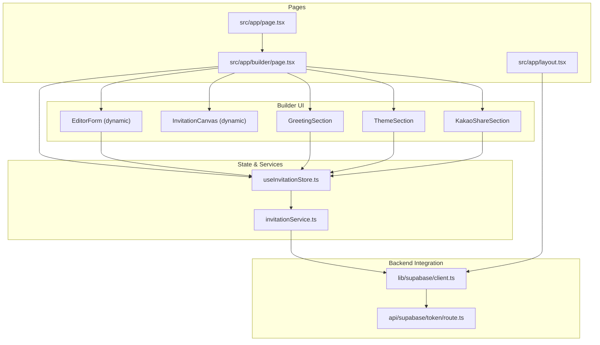
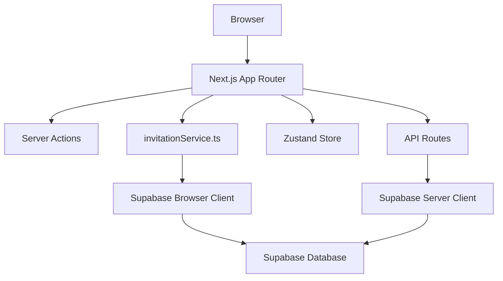
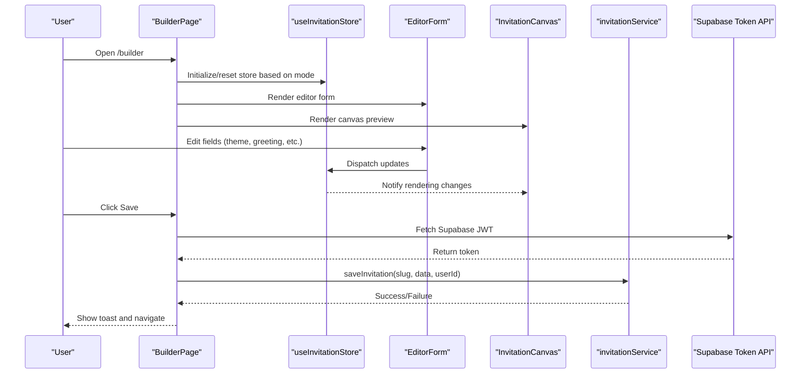
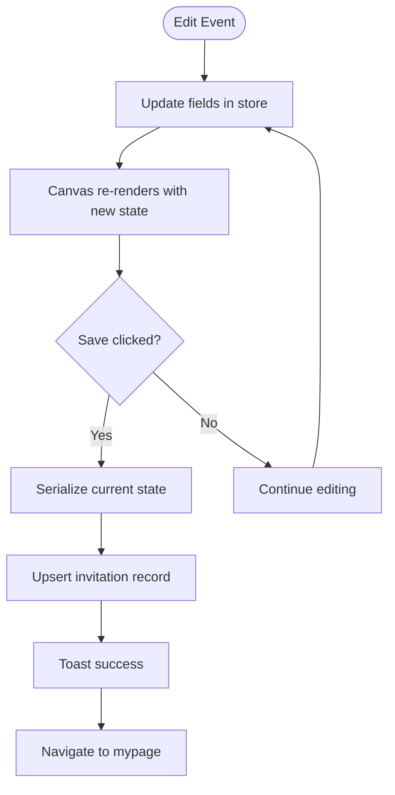
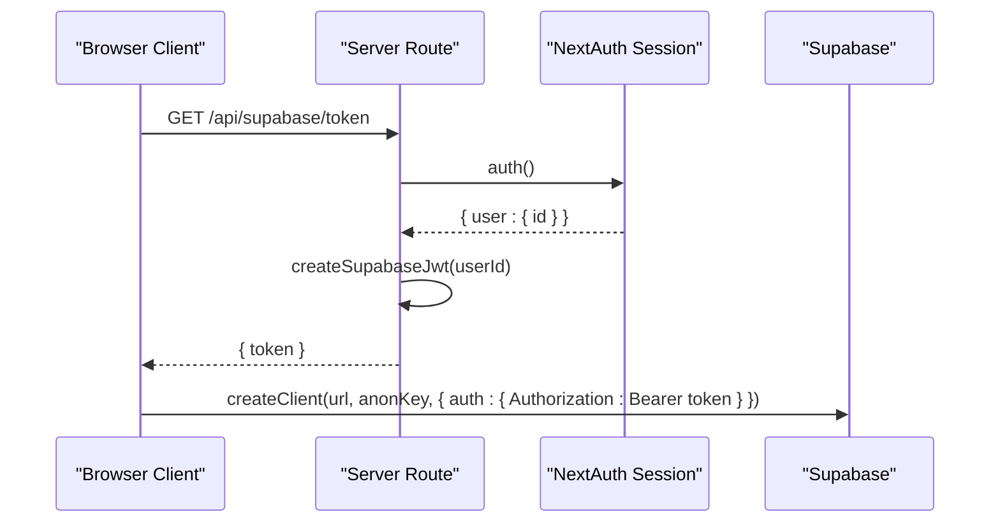
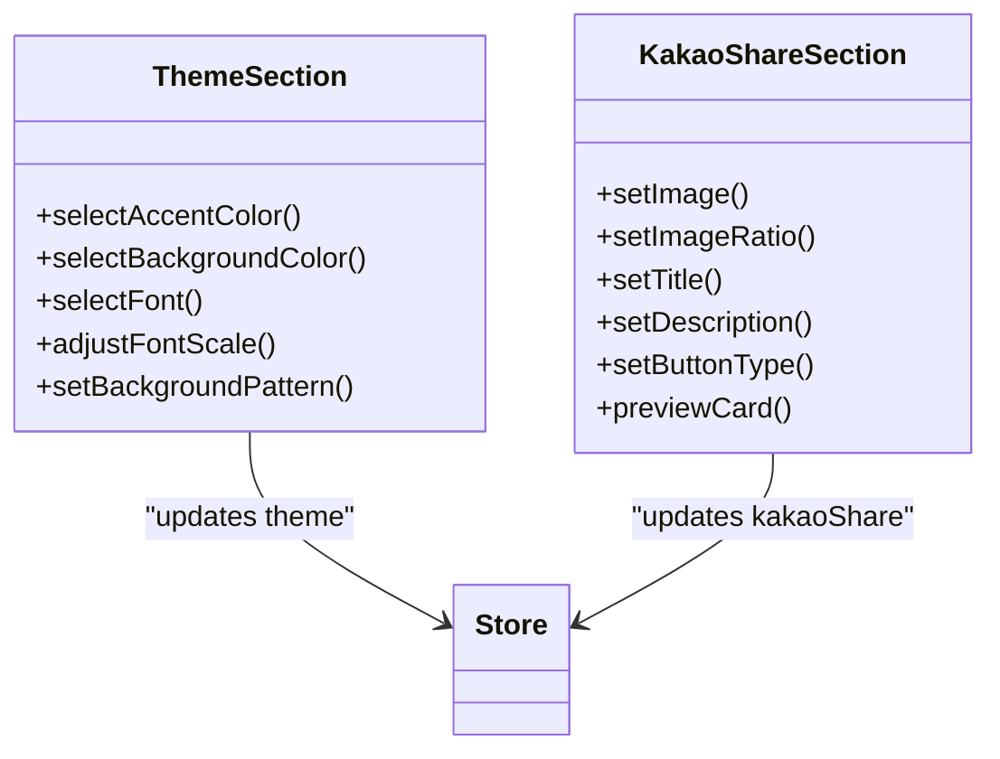
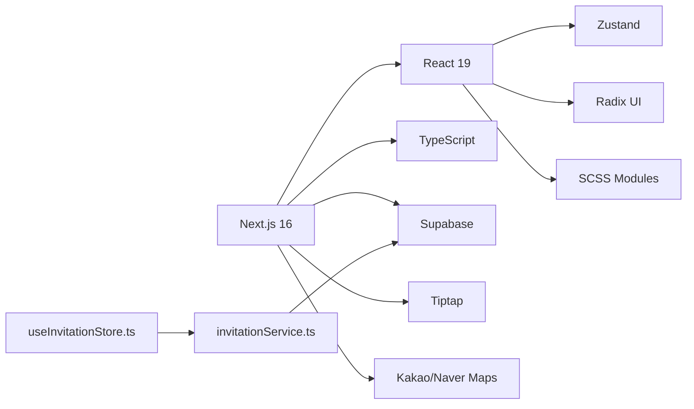

# Project Overview

<cite>
**Referenced Files in This Document**
- [README.md](file://README.md)
- [package.json](file://package.json)
- [src/app/layout.tsx](file://src/app/layout.tsx)
- [src/app/page.tsx](file://src/app/page.tsx)
- [src/app/builder/page.tsx](file://src/app/builder/page.tsx)
- [src/store/useInvitationStore.ts](file://src/store/useInvitationStore.ts)
- [src/services/invitationService.ts](file://src/services/invitationService.ts)
- [src/lib/supabase/client.ts](file://src/lib/supabase/client.ts)
- [src/app/api/supabase/token/route.ts](file://src/app/api/supabase/token/route.ts)
- [src/components/builder/sections/ThemeSection.tsx](file://src/components/builder/sections/ThemeSection.tsx)
- [src/components/builder/sections/GreetingSection.tsx](file://src/components/builder/sections/GreetingSection.tsx)
- [src/components/builder/sections/KakaoShareSection.tsx](file://src/components/builder/sections/KakaoShareSection.tsx)
- [src/lib/utils/format.ts](file://src/lib/utils/format.ts)
- [src/types/wedding.ts](file://src/types/wedding.ts)
</cite>

## Table of Contents
1. [Introduction](#introduction)
2. [Project Structure](#project-structure)
3. [Core Components](#core-components)
4. [Architecture Overview](#architecture-overview)
5. [Detailed Component Analysis](#detailed-component-analysis)
6. [Dependency Analysis](#dependency-analysis)
7. [Performance Considerations](#performance-considerations)
8. [Troubleshooting Guide](#troubleshooting-guide)
9. [Conclusion](#conclusion)

## Introduction
Banana Wedding is a modern mobile-first digital invitation platform designed to help couples create beautiful, shareable wedding invitations quickly and intuitively. Its purpose is to deliver a delightful, accessible, and highly customizable experience for crafting mobile-centric invitations that guests can enjoy on phones and share across social channels.

Core value proposition:
- Real-time customization: Make edits and see immediate visual updates in the invitation builder.
- Mobile-first design: Optimized canvas and preview tailored for mobile devices.
- Social sharing ready: Built-in support for generating optimized social share cards and deep links.
- Guest management preparedness: Structured domain types and services to support future guest RSVP and management features.

Key differentiators:
- Next.js 16 App Router with server components and streaming UI for fast, responsive experiences.
- Supabase integration for secure, scalable backend services and real-time capabilities.
- Rich editor and media tools for expressive content creation.
- Comprehensive theming and seasonal effects for immersive visual storytelling.

Target audience:
- Couples planning their weddings who want to create personalized, shareable digital invitations with minimal effort.

Primary use cases:
- Invitation builder: Compose and customize an entire digital invitation in real time.
- Social sharing: Generate and optimize shareable previews for popular platforms.
- Guest management: Prepare for future guest tracking and RSVP workflows.
- Preview and review: Iterate quickly with mobile and desktop previews.

## Project Structure
At a high level, the project follows Next.js App Router conventions with a clear separation between pages, components, services, and shared utilities. The builder page orchestrates the editing experience, while services and stores manage state and persistence. Supabase is integrated via a browser client and a dedicated API route to securely mint tokens for authenticated requests.

**Diagram sources**
- [src/app/page.tsx](file://src/app/page.tsx#L1-L53)
- [src/app/builder/page.tsx](file://src/app/builder/page.tsx#L1-L232)
- [src/store/useInvitationStore.ts](file://src/store/useInvitationStore.ts#L1-L534)
- [src/services/invitationService.ts](file://src/services/invitationService.ts#L1-L81)
- [src/lib/supabase/client.ts](file://src/lib/supabase/client.ts#L1-L85)
- [src/app/api/supabase/token/route.ts](file://src/app/api/supabase/token/route.ts#L1-L16)
- [src/app/layout.tsx](file://src/app/layout.tsx#L1-L156)

**Section sources**
- [README.md](file://README.md#L219-L250)
- [src/app/layout.tsx](file://src/app/layout.tsx#L1-L156)
- [src/app/builder/page.tsx](file://src/app/builder/page.tsx#L1-L232)

## Core Components
- Invitation builder: A real-time, mobile-focused editing surface that lets users compose messages, select themes, configure galleries, and prepare social share cards.
- Zustand store: Centralized state for the entire invitation model, including basic info, event details, theme, gallery, accounts, and share settings.
- Services: Typed service layer for saving, retrieving, and managing invitations backed by Supabase.
- Supabase integration: Secure token provisioning via a server route and a browser client that manages JWT lifetimes and client initialization.
- Preview system: Dedicated canvas and drawer/modal previews optimized for mobile and desktop viewing.

Practical examples:
- Social sharing: Configure a share card with title, description, image ratio, and button style; preview the card before sharing.
- Theme customization: Adjust accent color, background color, font family, font scale, and background pattern.
- Guest management preparation: The domain types define structured models for guests, invitations, and RSVPs, laying groundwork for future guest management features.

**Section sources**
- [src/app/builder/page.tsx](file://src/app/builder/page.tsx#L42-L232)
- [src/store/useInvitationStore.ts](file://src/store/useInvitationStore.ts#L1-L534)
- [src/services/invitationService.ts](file://src/services/invitationService.ts#L1-L81)
- [src/lib/supabase/client.ts](file://src/lib/supabase/client.ts#L1-L85)
- [src/components/builder/sections/KakaoShareSection.tsx](file://src/components/builder/sections/KakaoShareSection.tsx#L1-L153)
- [src/components/builder/sections/ThemeSection.tsx](file://src/components/builder/sections/ThemeSection.tsx#L1-L136)
- [src/types/wedding.ts](file://src/types/wedding.ts#L1-L389)

## Architecture Overview
The platform adopts a modern full-stack architecture built on Next.js 16 with server components and streaming UI. The frontend uses React 19 and TypeScript for strong typing and performance. Supabase powers authentication, database, and real-time features. The builder integrates rich editors, image uploaders, and map components to deliver a comprehensive authoring experience.

**Diagram sources**
- [src/app/builder/page.tsx](file://src/app/builder/page.tsx#L1-L232)
- [src/services/invitationService.ts](file://src/services/invitationService.ts#L1-L81)
- [src/lib/supabase/client.ts](file://src/lib/supabase/client.ts#L1-L85)
- [src/app/api/supabase/token/route.ts](file://src/app/api/supabase/token/route.ts#L1-L16)

## Detailed Component Analysis

### Invitation Builder Page
The builder page is the central editing experience. It dynamically loads the canvas for preview, renders the sidebar editor, and coordinates saving, previewing, and navigation. It also enforces mode-specific initialization and guards against unauthorized access.

**Diagram sources**
- [src/app/builder/page.tsx](file://src/app/builder/page.tsx#L42-L127)
- [src/services/invitationService.ts](file://src/services/invitationService.ts#L9-L24)
- [src/app/api/supabase/token/route.ts](file://src/app/api/supabase/token/route.ts#L5-L15)

**Section sources**
- [src/app/builder/page.tsx](file://src/app/builder/page.tsx#L42-L232)

### State Model and Real-Time Customization
The invitation state encapsulates all editable content and UI flags. Updates propagate instantly to the canvas and are persisted via the service layer. The store supports merging persisted data and IndexedDB-backed storage for large assets.

**Diagram sources**
- [src/store/useInvitationStore.ts](file://src/store/useInvitationStore.ts#L373-L473)
- [src/services/invitationService.ts](file://src/services/invitationService.ts#L10-L24)

**Section sources**
- [src/store/useInvitationStore.ts](file://src/store/useInvitationStore.ts#L1-L534)
- [src/services/invitationService.ts](file://src/services/invitationService.ts#L1-L81)

### Supabase Integration and Authentication Flow
The browser client manages token lifetimes and initializes the Supabase client with proper headers. A server route creates a signed JWT for the current user, enabling secure database access from the client.

**Diagram sources**
- [src/lib/supabase/client.ts](file://src/lib/supabase/client.ts#L41-L84)
- [src/app/api/supabase/token/route.ts](file://src/app/api/supabase/token/route.ts#L5-L15)

**Section sources**
- [src/lib/supabase/client.ts](file://src/lib/supabase/client.ts#L1-L85)
- [src/app/api/supabase/token/route.ts](file://src/app/api/supabase/token/route.ts#L1-L16)

### Theme Customization and Social Sharing
Theme customization allows selecting accent/background colors, fonts, and patterns. Social sharing enables configuring share card metadata and previewing the card before sending.

**Diagram sources**
- [src/components/builder/sections/ThemeSection.tsx](file://src/components/builder/sections/ThemeSection.tsx#L22-L136)
- [src/components/builder/sections/KakaoShareSection.tsx](file://src/components/builder/sections/KakaoShareSection.tsx#L22-L153)

**Section sources**
- [src/components/builder/sections/ThemeSection.tsx](file://src/components/builder/sections/ThemeSection.tsx#L1-L136)
- [src/components/builder/sections/KakaoShareSection.tsx](file://src/components/builder/sections/KakaoShareSection.tsx#L1-L153)

### Conceptual Overview
- Real-time customization: As users edit fields in the sidebar, the canvas updates immediately to reflect their choices.
- Mobile-first design: The builder emphasizes a mobile-friendly editing experience with a device-frame preview and a dedicated mobile drawer for quick checks.
- Social sharing: The share section lets users craft a compelling preview card optimized for social networks, with options for image ratio and button types.
- Guest management preparedness: The domain types define robust structures for guests, invitations, and RSVPs, enabling future expansion of guest-related features.

[No sources needed since this section doesn't analyze specific files]

## Dependency Analysis
The project leverages a cohesive tech stack centered around Next.js 16, React 19, and TypeScript. Supabase provides backend services, while Radix UI and SCSS Modules power the UI system. Zustand manages state, and the builder integrates rich text editing and media handling.

**Diagram sources**
- [package.json](file://package.json#L17-L75)
- [src/store/useInvitationStore.ts](file://src/store/useInvitationStore.ts#L1-L534)
- [src/services/invitationService.ts](file://src/services/invitationService.ts#L1-L81)

**Section sources**
- [package.json](file://package.json#L17-L75)
- [README.md](file://README.md#L78-L110)

## Performance Considerations
- Streaming UI and loading states: The builder uses suspense boundaries and loading spinners to progressively reveal content and maintain responsiveness during saves.
- Dynamic imports: Heavy components are loaded on demand to reduce initial bundle size.
- Image optimization: Next.js Image is used with automatic format conversion and lazy loading to improve Core Web Vitals.
- Memoization and shallow selectors: Zustand’s shallow selector minimizes unnecessary re-renders in the builder.

[No sources needed since this section provides general guidance]

## Troubleshooting Guide
Common issues and resolutions:
- Unauthorized access when saving: Ensure the user is authenticated and profile is complete; the builder redirects to login if not ready.
- Token fetch failures: Verify the Supabase token route returns a valid JWT for the current session.
- Saving blocked for approvals: If the invitation is under approval or already approved, saving is disabled for non-admin users.
- Preview not updating: Confirm the store is properly initialized and the editing section flag is set.

**Section sources**
- [src/app/builder/page.tsx](file://src/app/builder/page.tsx#L71-L127)
- [src/app/api/supabase/token/route.ts](file://src/app/api/supabase/token/route.ts#L5-L15)

## Conclusion
Banana Wedding delivers a modern, mobile-first digital invitation experience powered by Next.js 16, React 19, and Supabase. Its real-time builder, rich customization options, and social sharing features make it easy for couples to create and share meaningful invitations. The architecture balances performance, accessibility, and scalability, while the typed domain models and service layer lay a solid foundation for future guest management and advanced features.