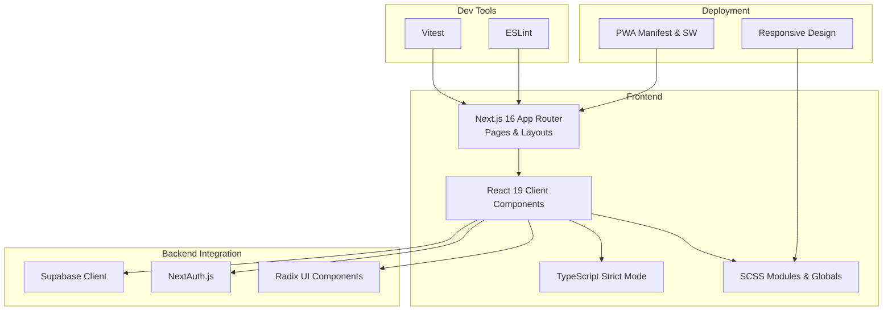
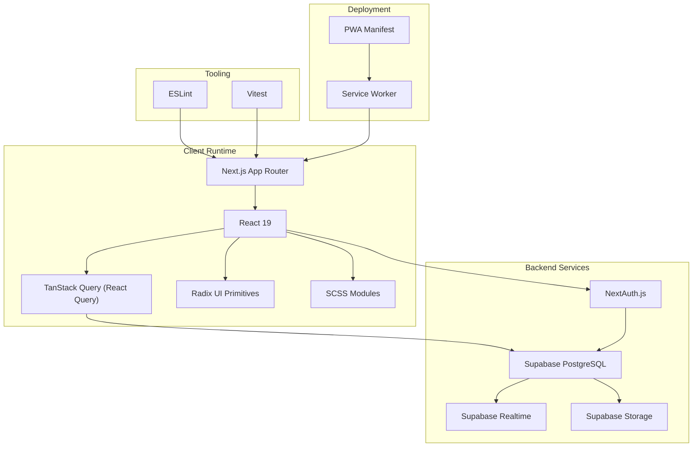
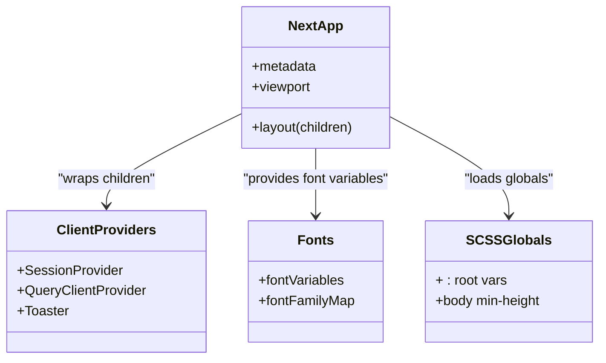
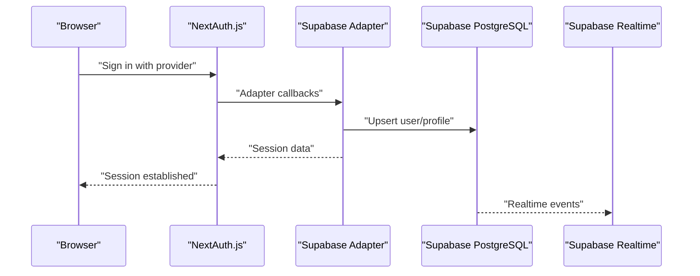
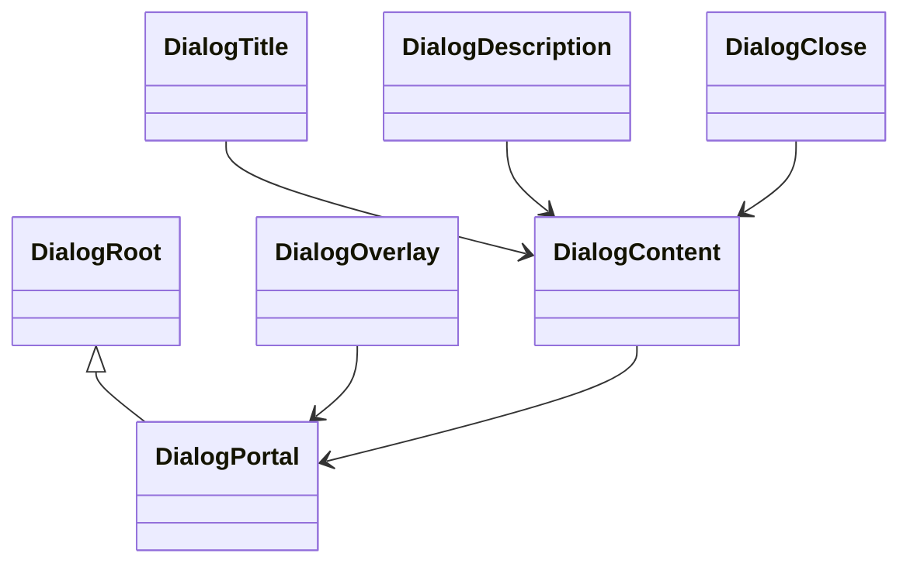
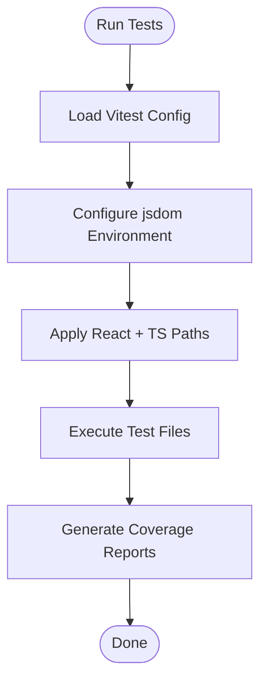
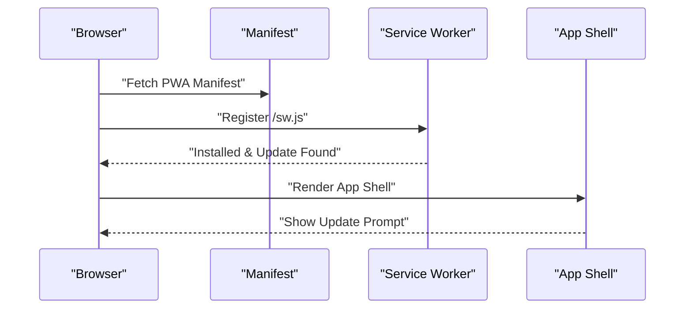
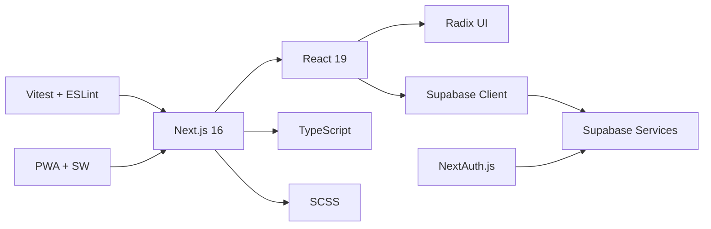

# Technology Stack

<cite>
**Referenced Files in This Document**
- [package.json](file://package.json)
- [next.config.ts](file://next.config.ts)
- [tsconfig.json](file://tsconfig.json)
- [vitest.config.ts](file://vitest.config.ts)
- [eslint.config.mjs](file://eslint.config.mjs)
- [supabase/config.toml](file://supabase/config.toml)
- [src/lib/supabase/client.ts](file://src/lib/supabase/client.ts)
- [src/auth-config.ts](file://src/auth-config.ts)
- [src/app/layout.tsx](file://src/app/layout.tsx)
- [src/app/ClientProviders.tsx](file://src/app/ClientProviders.tsx)
- [src/app/manifest.ts](file://src/app/manifest.ts)
- [src/app/sw.tsx](file://src/app/sw.tsx)
- [src/styles/globals.scss](file://src/styles/globals.scss)
- [src/components/ui/Button/Button.tsx](file://src/components/ui/Button/Button.tsx)
- [src/components/ui/Dialog/Dialog.tsx](file://src/components/ui/Dialog/Dialog.tsx)
- [src/lib/fonts.ts](file://src/lib/fonts.ts)
</cite>

## Table of Contents
1. [Introduction](#introduction)
2. [Project Structure](#project-structure)
3. [Core Components](#core-components)
4. [Architecture Overview](#architecture-overview)
5. [Detailed Component Analysis](#detailed-component-analysis)
6. [Dependency Analysis](#dependency-analysis)
7. [Performance Considerations](#performance-considerations)
8. [Troubleshooting Guide](#troubleshooting-guide)
9. [Conclusion](#conclusion)

## Introduction
This document describes the technology stack powering the Banana Wedding platform. It covers the frontend (Next.js 16 with App Router, React 19, TypeScript, SCSS), backend integration (Supabase with PostgreSQL, Realtime, Storage, and NextAuth.js), development tooling (Vitest, ESLint), and deployment assets (PWA, responsive design, and mobile optimization). It also outlines version compatibility, dependency relationships, and the rationale behind key architectural choices.

## Project Structure
The project follows a modern Next.js 16 App Router structure with a clear separation of concerns:
- Frontend pages and layouts under src/app
- Shared UI components under src/components and src/lib
- Styling via SCSS modules and global styles
- Supabase client initialization and SSR helpers under src/lib/supabase
- Authentication configuration under src/auth-config.ts
- PWA assets and service worker integration under src/app

**Section sources**
- [src/app/layout.tsx](file://src/app/layout.tsx#L1-L156)
- [src/app/ClientProviders.tsx](file://src/app/ClientProviders.tsx#L1-L20)
- [src/lib/supabase/client.ts](file://src/lib/supabase/client.ts#L1-L85)
- [src/auth-config.ts](file://src/auth-config.ts#L1-L227)

## Core Components
- Next.js 16 with App Router: Provides file-system routing, server-side rendering, static generation, and modern React features. The configuration enables strict mode, image optimization, CSP headers, and PWA integration in production.
- React 19: Latest React runtime with concurrent features and improved performance. Used in client components and UI primitives.
- TypeScript: Enforced strict type checking with Next-specific compiler options and plugin integration.
- SCSS: Modular styling with CSS modules for scoped components and global styles for shared variables and resets.
- Supabase: Backend-as-a-Service with PostgreSQL, Realtime, and Storage. Integrated via a browser client and server adapters.
- NextAuth.js: Authentication with multiple providers (Kakao, Naver, Credentials) and Supabase adapter for user persistence.
- Radix UI: Accessible UI primitives used to build dialogs, buttons, forms, and other interactive components.
- Development Tools: Vitest for unit and component tests, ESLint for code quality aligned with Next.js conventions.

**Section sources**
- [package.json](file://package.json#L1-L107)
- [next.config.ts](file://next.config.ts#L1-L110)
- [tsconfig.json](file://tsconfig.json#L1-L102)
- [eslint.config.mjs](file://eslint.config.mjs#L1-L38)
- [vitest.config.ts](file://vitest.config.ts#L1-L35)

## Architecture Overview
The frontend integrates tightly with Supabase for data and authentication, while leveraging Next.js for routing, SSR, and PWA capabilities. Radix UI ensures accessible components, and SCSS provides modular styling.

**Diagram sources**
- [src/app/layout.tsx](file://src/app/layout.tsx#L1-L156)
- [src/app/ClientProviders.tsx](file://src/app/ClientProviders.tsx#L1-L20)
- [src/lib/supabase/client.ts](file://src/lib/supabase/client.ts#L1-L85)
- [src/auth-config.ts](file://src/auth-config.ts#L1-L227)
- [src/app/manifest.ts](file://src/app/manifest.ts#L1-L26)
- [src/app/sw.tsx](file://src/app/sw.tsx#L1-L61)

## Detailed Component Analysis

### Frontend Stack: Next.js 16 + React 19 + TypeScript + SCSS
- Next.js 16 App Router: Implements file-system routing, metadata, viewport configuration, and structured app shell with ClientProviders for session and query caching.
- React 19: Enables concurrent features and client component patterns used across UI primitives and builders.
- TypeScript: Strict compiler options with Next plugin, path aliases, and isolated modules for reliable builds.
- SCSS: Modular styles per component with global variables and resets; fonts configured via next/font utilities.

**Diagram sources**
- [src/app/layout.tsx](file://src/app/layout.tsx#L1-L156)
- [src/app/ClientProviders.tsx](file://src/app/ClientProviders.tsx#L1-L20)
- [src/lib/fonts.ts](file://src/lib/fonts.ts#L1-L182)
- [src/styles/globals.scss](file://src/styles/globals.scss#L1-L14)

**Section sources**
- [src/app/layout.tsx](file://src/app/layout.tsx#L1-L156)
- [src/app/ClientProviders.tsx](file://src/app/ClientProviders.tsx#L1-L20)
- [src/lib/fonts.ts](file://src/lib/fonts.ts#L1-L182)
- [src/styles/globals.scss](file://src/styles/globals.scss#L1-L14)
- [tsconfig.json](file://tsconfig.json#L1-L102)
- [next.config.ts](file://next.config.ts#L1-L110)

### Backend Integration: Supabase + NextAuth.js
- Supabase Client: A browser client wrapper that fetches server-signed tokens and initializes a Supabase client with optional bearer auth, enabling secure access to PostgreSQL, Realtime, and Storage.
- NextAuth.js: Configured with Supabase adapter, multiple OAuth providers (Kakao, Naver), and a Credentials provider for admin access. Profiles are upserted on sign-in, including phone normalization and admin flagging.

**Diagram sources**
- [src/auth-config.ts](file://src/auth-config.ts#L1-L227)
- [src/lib/supabase/client.ts](file://src/lib/supabase/client.ts#L1-L85)

**Section sources**
- [src/lib/supabase/client.ts](file://src/lib/supabase/client.ts#L1-L85)
- [src/auth-config.ts](file://src/auth-config.ts#L1-L227)
- [supabase/config.toml](file://supabase/config.toml#L1-L385)

### UI Components: Radix UI + SCSS Modules
- Radix UI: Used for accessible dialogs, overlays, and primitive slots. Components are styled with SCSS modules for consistency and modularity.
- Button and Dialog components demonstrate composition with Radix UI primitives, slots, and SCSS styling.

**Diagram sources**
- [src/components/ui/Dialog/Dialog.tsx](file://src/components/ui/Dialog/Dialog.tsx#L1-L98)

**Section sources**
- [src/components/ui/Button/Button.tsx](file://src/components/ui/Button/Button.tsx#L1-L80)
- [src/components/ui/Dialog/Dialog.tsx](file://src/components/ui/Dialog/Dialog.tsx#L1-L98)

### Development Tools: Vitest + ESLint
- Vitest: Configured with React plugin, tsconfig paths, jsdom environment, and coverage reporting for component and utility tests.
- ESLint: Next.js core-web-vitals and TypeScript configs with a TS parser, ensuring lint rules align with modern React and Next.js standards.

**Diagram sources**
- [vitest.config.ts](file://vitest.config.ts#L1-L35)

**Section sources**
- [vitest.config.ts](file://vitest.config.ts#L1-L35)
- [eslint.config.mjs](file://eslint.config.mjs#L1-L38)

### Deployment Stack: PWA + Responsive Design + Mobile Optimization
- PWA: Manifest and service worker registration are integrated. The app registers a service worker and surfaces an update prompt when a new version is ready.
- Responsive Design: Viewport metadata and body-level antialiasing improve readability and scaling. SCSS globals define baseline styles and variables.
- Mobile Optimization: Next.js image optimization, SVG handling, and viewport configuration ensure fast, scalable experiences on mobile devices.

**Diagram sources**
- [src/app/manifest.ts](file://src/app/manifest.ts#L1-L26)
- [src/app/sw.tsx](file://src/app/sw.tsx#L1-L61)
- [src/app/layout.tsx](file://src/app/layout.tsx#L1-L156)

**Section sources**
- [src/app/manifest.ts](file://src/app/manifest.ts#L1-L26)
- [src/app/sw.tsx](file://src/app/sw.tsx#L1-L61)
- [src/app/layout.tsx](file://src/app/layout.tsx#L1-L156)
- [next.config.ts](file://next.config.ts#L1-L110)

## Dependency Analysis
The stack balances modern React features with robust backend services and developer productivity tools. Key relationships:
- Next.js 16 depends on React 19 for client components and App Router semantics.
- Supabase client encapsulates authentication and data access, integrating with NextAuth.js for session management.
- Radix UI composes with SCSS modules to provide accessible, styled primitives.
- Development tools (Vitest, ESLint) enforce quality and test coverage.

**Diagram sources**
- [package.json](file://package.json#L1-L107)
- [src/lib/supabase/client.ts](file://src/lib/supabase/client.ts#L1-L85)
- [src/auth-config.ts](file://src/auth-config.ts#L1-L227)
- [vitest.config.ts](file://vitest.config.ts#L1-L35)
- [eslint.config.mjs](file://eslint.config.mjs#L1-L38)

**Section sources**
- [package.json](file://package.json#L1-L107)

## Performance Considerations
- Next.js Image Optimization: Remote patterns, AVIF/WebP formats, and device sizes reduce bandwidth and improve loading performance.
- Strict TypeScript: Prevents runtime errors and improves build-time reliability.
- PWA Caching: Service workers and manifests enable offline readiness and faster reloads.
- Radix UI Composition: Lightweight primitives minimize bundle bloat while preserving accessibility.
- CSS Modules: Scoped styles avoid cascade conflicts and enable tree-shaking.

[No sources needed since this section provides general guidance]

## Troubleshooting Guide
- Supabase Token Fetch Failures: The browser client retries token retrieval and falls back to anonymous checks; verify API endpoint availability and environment variables.
- NextAuth Provider Issues: Confirm provider credentials and callback URLs; ensure Supabase service role key and schemas are configured.
- PWA Updates Not Applying: Ensure service worker registration and update event listeners are active; the UI component listens for updates and prompts users to apply.
- ESLint/TypeScript Errors: Align with Next.js recommended configs and strict mode; review tsconfig path aliases and plugin settings.

**Section sources**
- [src/lib/supabase/client.ts](file://src/lib/supabase/client.ts#L1-L85)
- [src/auth-config.ts](file://src/auth-config.ts#L1-L227)
- [src/app/sw.tsx](file://src/app/sw.tsx#L1-L61)
- [eslint.config.mjs](file://eslint.config.mjs#L1-L38)
- [tsconfig.json](file://tsconfig.json#L1-L102)

## Conclusion
The Banana Wedding platform leverages a cohesive stack: Next.js 16 with App Router for modern routing and SSR, React 19 for client components, TypeScript for type safety, and SCSS for modular styling. Supabase delivers PostgreSQL, Realtime, and Storage with a clean client wrapper, while NextAuth.js manages authentication across providers. Development tools (Vitest, ESLint) and PWA assets ensure quality, maintainability, and excellent user experience across devices.