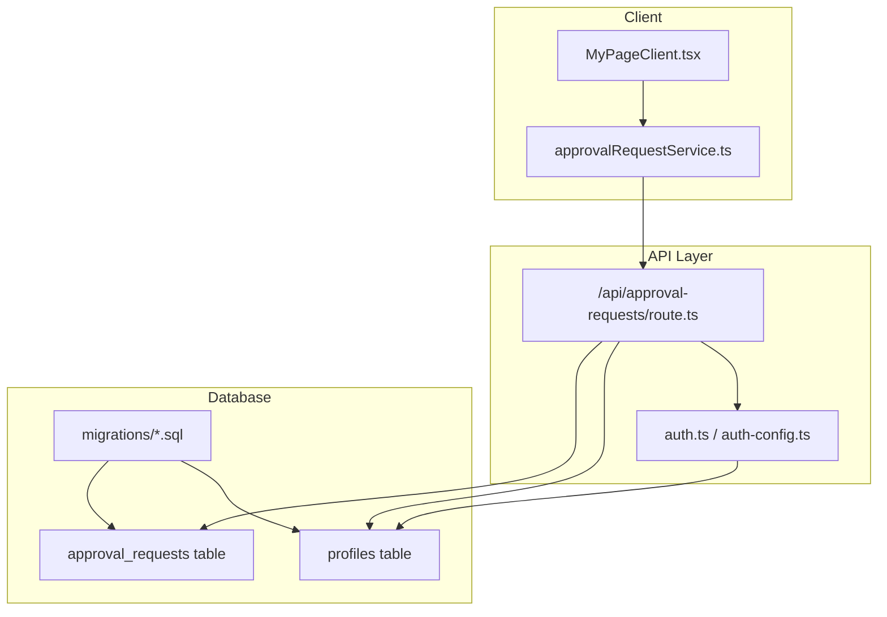
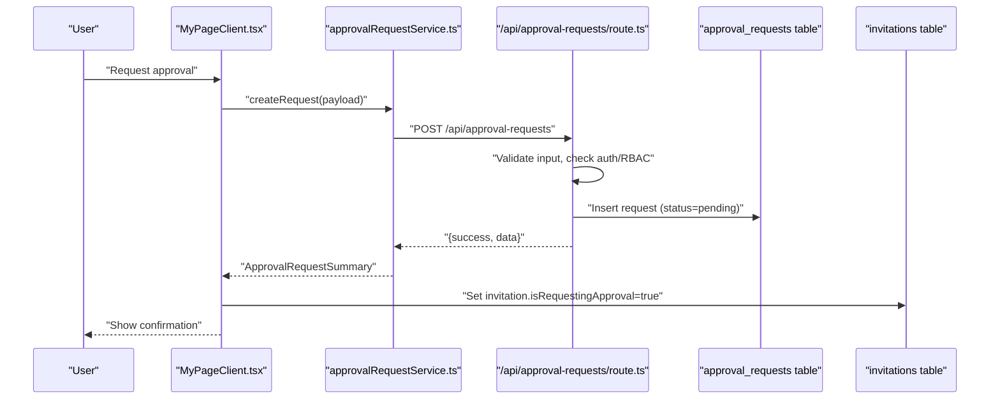
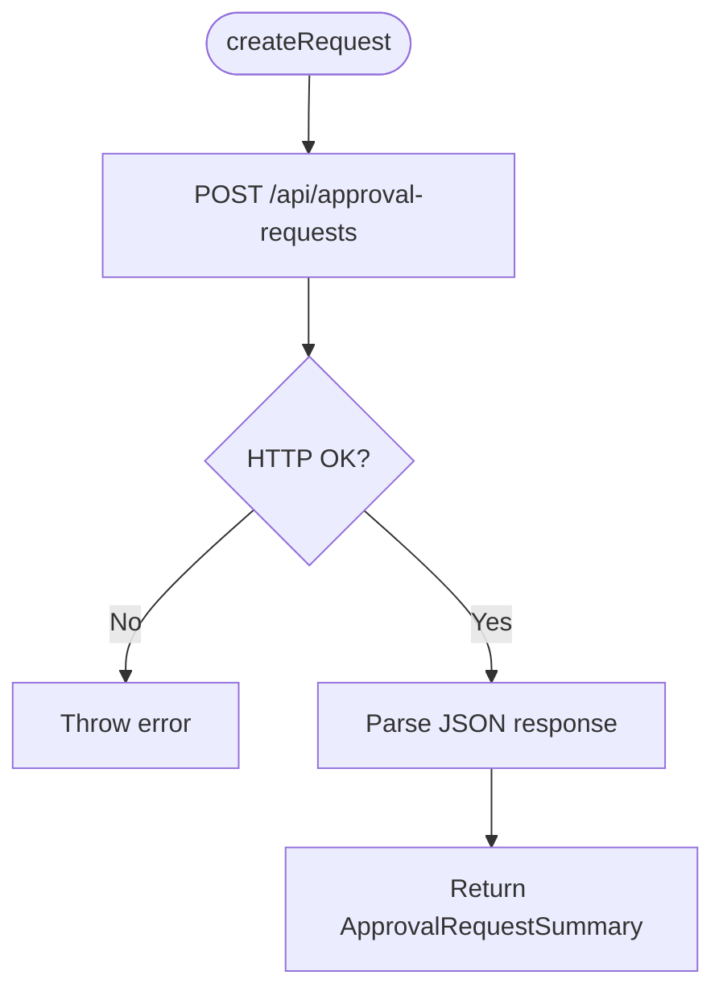
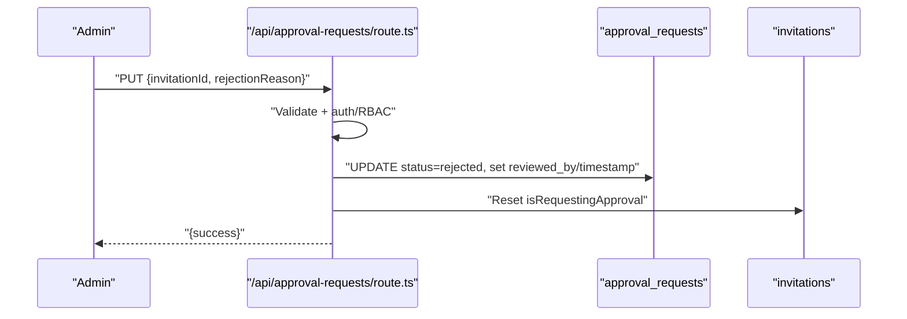
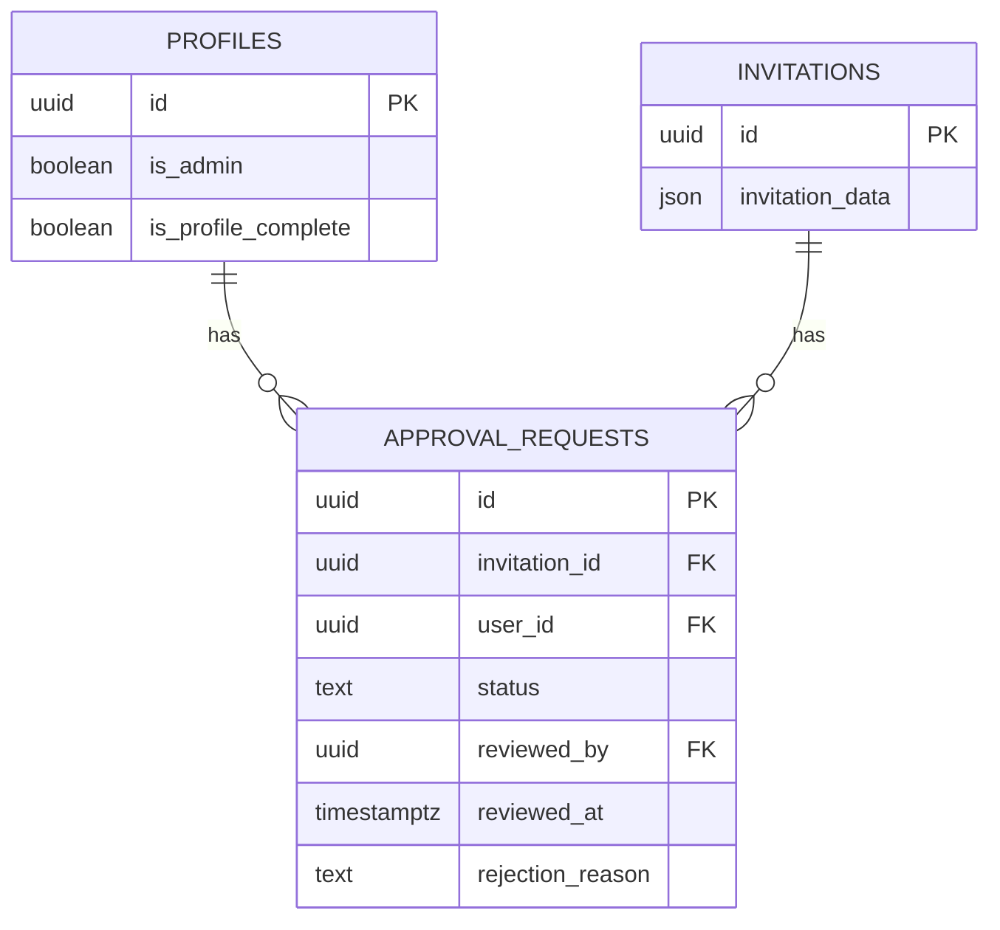
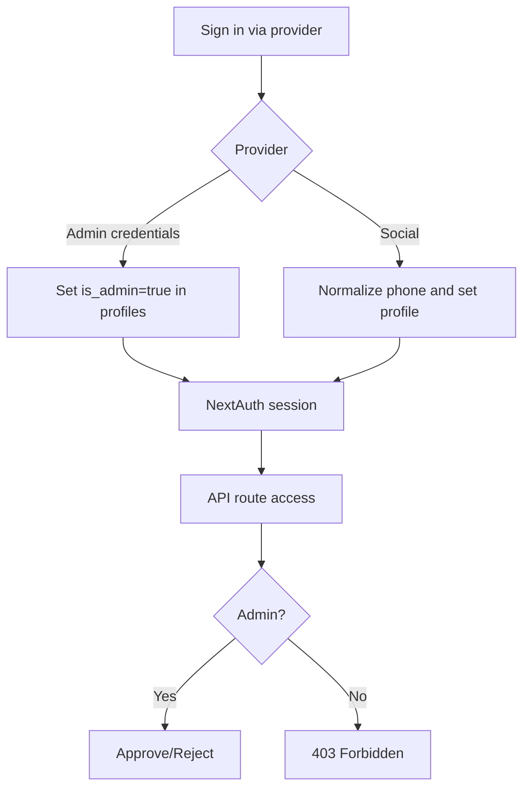
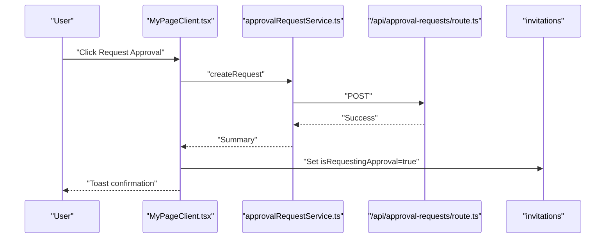
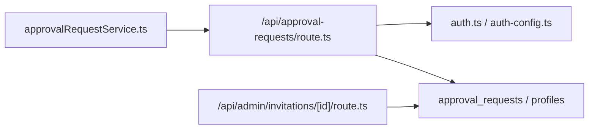

# Approval Request Service

<cite>
**Referenced Files in This Document**
- [approvalRequestService.ts](file://src/services/approvalRequestService.ts)
- [approval-requests route.ts](file://src/app/api/approval-requests/route.ts)
- [approval-request-summary.ts](file://src/lib/approval-request-summary.ts)
- [supabaseAdmin.ts](file://src/lib/supabaseAdmin.ts)
- [auth.ts](file://src/auth.ts)
- [auth-config.ts](file://src/auth-config.ts)
- [MyPageClient.tsx](file://src/app/mypage/MyPageClient.tsx)
- [admin invitation route.ts](file://src/app/api/admin/invitations/[id]/route.ts)
- [add_profiles_and_approval_requests.sql](file://supabase/migrations/20260114063537_add_profiles_and_approval_requests.sql)
- [fix_recursion_error.sql](file://supabase/migrations/20260114100000_fix_recursion_error.sql)
- [add_rejection_reason.sql](file://supabase/migrations/20260120000000_add_rejection_reason.sql)
</cite>

## Table of Contents
1. [Introduction](#introduction)
2. [Project Structure](#project-structure)
3. [Core Components](#core-components)
4. [Architecture Overview](#architecture-overview)
5. [Detailed Component Analysis](#detailed-component-analysis)
6. [Dependency Analysis](#dependency-analysis)
7. [Performance Considerations](#performance-considerations)
8. [Troubleshooting Guide](#troubleshooting-guide)
9. [Conclusion](#conclusion)
10. [Appendices](#appendices)

## Introduction
This document explains the approval request service implementation for managing administrative review of invitation publishing requests. It covers the admin approval workflow from request creation to decision handling, service methods for managing requests, status tracking, and integration with authentication and role-based access control. It also documents database schema, RLS policies, and outlines extension points for notifications, audit logging, queuing, batch processing, and escalation.

## Project Structure
The approval request feature spans client services, API routes, database schema, and authentication configuration:

- Client service: a lightweight wrapper around the approval request API
- API routes: HTTP endpoints implementing CRUD and admin review logic
- Database: approval_requests table with RLS policies and indexes
- Authentication: NextAuth integration with Supabase adapter and admin credentials provider
- UI integration: admin queue and user request flow in the mypage client

**Diagram sources**
- [approvalRequestService.ts](file://src/services/approvalRequestService.ts#L1-L78)
- [approval-requests route.ts](file://src/app/api/approval-requests/route.ts#L1-L337)
- [auth.ts](file://src/auth.ts#L1-L5)
- [auth-config.ts](file://src/auth-config.ts#L1-L227)
- [add_profiles_and_approval_requests.sql](file://supabase/migrations/20260114063537_add_profiles_and_approval_requests.sql#L114-L137)
- [add_profiles_and_approval_requests.sql](file://supabase/migrations/20260114063537_add_profiles_and_approval_requests.sql#L18-L38)

**Section sources**
- [approvalRequestService.ts](file://src/services/approvalRequestService.ts#L1-L78)
- [approval-requests route.ts](file://src/app/api/approval-requests/route.ts#L1-L337)
- [auth.ts](file://src/auth.ts#L1-L5)
- [auth-config.ts](file://src/auth-config.ts#L1-L227)
- [add_profiles_and_approval_requests.sql](file://supabase/migrations/20260114063537_add_profiles_and_approval_requests.sql#L1-L234)

## Core Components
- Client service: provides methods to create, cancel, reject, and list approval requests
- API route: validates input, enforces auth and RBAC, performs DB operations, and updates related invitation state
- Database schema: approval_requests table with status tracking and indexes; profiles table for admin roles
- Authentication: NextAuth with Supabase adapter and admin credentials provider; admin flag stored in profiles
- UI integration: admin queue displays pending requests; user flow submits requests and toggles invitation flags

Key responsibilities:
- Prevent duplicate pending requests per invitation
- Enforce admin-only access for reviewing and rejecting
- Track reviewer and timestamps
- Update invitation flags upon cancellation/rejection/approval

**Section sources**
- [approvalRequestService.ts](file://src/services/approvalRequestService.ts#L13-L77)
- [approval-requests route.ts](file://src/app/api/approval-requests/route.ts#L22-L94)
- [approval-requests route.ts](file://src/app/api/approval-requests/route.ts#L96-L181)
- [approval-requests route.ts](file://src/app/api/approval-requests/route.ts#L183-L271)
- [approval-requests route.ts](file://src/app/api/approval-requests/route.ts#L273-L337)
- [approval-request-summary.ts](file://src/lib/approval-request-summary.ts#L1-L22)
- [add_profiles_and_approval_requests.sql](file://supabase/migrations/20260114063537_add_profiles_and_approval_requests.sql#L114-L137)
- [auth-config.ts](file://src/auth-config.ts#L79-L128)

## Architecture Overview
The approval workflow integrates client, API, database, and auth layers:

**Diagram sources**
- [MyPageClient.tsx](file://src/app/mypage/MyPageClient.tsx#L358-L390)
- [approvalRequestService.ts](file://src/services/approvalRequestService.ts#L14-L27)
- [approval-requests route.ts](file://src/app/api/approval-requests/route.ts#L22-L94)
- [add_profiles_and_approval_requests.sql](file://supabase/migrations/20260114063537_add_profiles_and_approval_requests.sql#L114-L126)

## Detailed Component Analysis

### Client Service: approvalRequestService
Responsibilities:
- Create approval requests with payload validation
- Cancel user requests
- Reject requests (admin-only)
- Fetch all pending requests or user-only rejected requests

Behavior highlights:
- Throws on HTTP errors to propagate failures to UI
- Uses JSON serialization for request bodies
- Returns typed summaries for consumption by UI

**Diagram sources**
- [approvalRequestService.ts](file://src/services/approvalRequestService.ts#L14-L27)

**Section sources**
- [approvalRequestService.ts](file://src/services/approvalRequestService.ts#L13-L77)

### API Route: /api/approval-requests
Endpoints and responsibilities:
- POST: Create a new approval request
  - Validates payload with Zod
  - Checks session and user ID
  - Prevents duplicate pending requests per invitation
  - Inserts with status pending and returns summary
- GET: List requests
  - Supports user-only rejected list and admin pending list
  - Enforces admin-only access for admin view
- PUT: Reject a pending request (admin-only)
  - Updates status, reviewer, and timestamp
  - Resets invitation’s requesting flag
- DELETE: Cancel user request
  - Removes request and resets invitation’s requesting flag

Access control and validation:
- Uses NextAuth session and profile checks
- Admin detection via email or profiles.is_admin
- Zod validation for request body
- Error responses with appropriate status codes

**Diagram sources**
- [approval-requests route.ts](file://src/app/api/approval-requests/route.ts#L183-L271)
- [approval-requests route.ts](file://src/app/api/approval-requests/route.ts#L220-L253)

**Section sources**
- [approval-requests route.ts](file://src/app/api/approval-requests/route.ts#L22-L94)
- [approval-requests route.ts](file://src/app/api/approval-requests/route.ts#L96-L181)
- [approval-requests route.ts](file://src/app/api/approval-requests/route.ts#L183-L271)
- [approval-requests route.ts](file://src/app/api/approval-requests/route.ts#L273-L337)

### Database Schema and Policies
Tables and indexes:
- approval_requests: UUID primary key, foreign keys to invitations and auth.users, status enum, reviewer and timestamps, indexes on user_id, invitation_id, status
- profiles: stores is_admin flag and other user info

RLS policies:
- Users can view/update own profile; insert via trigger
- Admins can view all profiles and update any approval request
- Users can create and view own approval requests
- Admins can select and update any approval request

Indexes:
- Composite indexes on user_id, invitation_id, and status for efficient queries

**Diagram sources**
- [add_profiles_and_approval_requests.sql](file://supabase/migrations/20260114063537_add_profiles_and_approval_requests.sql#L18-L38)
- [add_profiles_and_approval_requests.sql](file://supabase/migrations/20260114063537_add_profiles_and_approval_requests.sql#L114-L137)
- [add_profiles_and_approval_requests.sql](file://supabase/migrations/20260114063537_add_profiles_and_approval_requests.sql#L138-L183)

**Section sources**
- [add_profiles_and_approval_requests.sql](file://supabase/migrations/20260114063537_add_profiles_and_approval_requests.sql#L18-L137)
- [fix_recursion_error.sql](file://supabase/migrations/20260114100000_fix_recursion_error.sql#L52-L80)
- [add_rejection_reason.sql](file://supabase/migrations/20260120000000_add_rejection_reason.sql#L1-L6)

### Authentication and Role-Based Access Control
- NextAuth configured with Supabase adapter and database sessions
- Providers: Naver, Kakao, and Admin credentials
- Admin credentials provider restricts to configured emails and sets is_admin on sign-in
- Profile upsert on social sign-ins; phone normalization handled for Kakao/Naver
- API routes check session, then verify admin via email or profiles.is_admin

**Diagram sources**
- [auth-config.ts](file://src/auth-config.ts#L31-L129)
- [auth-config.ts](file://src/auth-config.ts#L130-L226)
- [approval-requests route.ts](file://src/app/api/approval-requests/route.ts#L183-L216)

**Section sources**
- [auth.ts](file://src/auth.ts#L1-L5)
- [auth-config.ts](file://src/auth-config.ts#L1-L227)
- [approval-requests route.ts](file://src/app/api/approval-requests/route.ts#L183-L216)

### UI Integration: Admin Queue and User Flow
- Admin queue lists pending requests with requester info and timestamps
- User flow:
  - Validates profile completeness (name and phone)
  - Submits approval request via service
  - Sets invitation flag isRequestingApproval
  - Refreshes lists to reflect state
- Admin actions:
  - Approve: clears requesting flag and marks approved
  - Reject: updates request with rejection reason and resets flag
  - Revoke: removes approval while keeping request history

**Diagram sources**
- [MyPageClient.tsx](file://src/app/mypage/MyPageClient.tsx#L358-L390)
- [approvalRequestService.ts](file://src/services/approvalRequestService.ts#L14-L27)
- [approval-requests route.ts](file://src/app/api/approval-requests/route.ts#L54-L78)

**Section sources**
- [MyPageClient.tsx](file://src/app/mypage/MyPageClient.tsx#L350-L549)
- [MyPageClient.tsx](file://src/app/mypage/MyPageClient.tsx#L550-L606)
- [approvalRequestService.ts](file://src/services/approvalRequestService.ts#L13-L77)

## Dependency Analysis
High-level dependencies:
- Client service depends on API route endpoints
- API route depends on Supabase clients and NextAuth
- API route depends on database schema and RLS policies
- Authentication configuration underpins RBAC enforcement
- Admin deletion endpoint uses service role client for bypassing RLS

**Diagram sources**
- [approvalRequestService.ts](file://src/services/approvalRequestService.ts#L1-L78)
- [approval-requests route.ts](file://src/app/api/approval-requests/route.ts#L1-L337)
- [auth.ts](file://src/auth.ts#L1-L5)
- [auth-config.ts](file://src/auth-config.ts#L1-L227)
- [admin invitation route.ts](file://src/app/api/admin/invitations/[id]/route.ts#L1-L40)

**Section sources**
- [approvalRequestService.ts](file://src/services/approvalRequestService.ts#L1-L78)
- [approval-requests route.ts](file://src/app/api/approval-requests/route.ts#L1-L337)
- [admin invitation route.ts](file://src/app/api/admin/invitations/[id]/route.ts#L1-L40)

## Performance Considerations
- Indexes on approval_requests: user_id, invitation_id, status enable fast filtering and sorting
- Parallelization: API routes use Promise.all for concurrent checks and updates
- Minimal payload: API returns a concise summary to reduce bandwidth
- Duplicates prevention: pre-check prevents redundant pending requests

Recommendations:
- Add pagination for admin queues if request volume grows
- Consider background jobs for bulk rejections/approvals
- Monitor slow queries on status filters and indexes

**Section sources**
- [add_profiles_and_approval_requests.sql](file://supabase/migrations/20260114063537_add_profiles_and_approval_requests.sql#L133-L137)
- [approval-requests route.ts](file://src/app/api/approval-requests/route.ts#L25-L26)
- [approval-requests route.ts](file://src/app/api/approval-requests/route.ts#L220-L236)

## Troubleshooting Guide
Common issues and resolutions:
- Authentication failures:
  - Ensure user is signed in; API requires a valid session
  - Admin credentials must match configured emails
- Authorization errors:
  - Admin-only endpoints return 403 if caller is not admin
  - Verify profiles.is_admin is set for admin users
- Duplicate pending requests:
  - API prevents creating a second pending request for the same invitation
- Validation errors:
  - Zod validation rejects malformed payloads; check required fields
- Database errors:
  - API logs and returns structured error messages; inspect details field
- Service role configuration:
  - Admin endpoints relying on service role require SUPABASE_SERVICE_ROLE_KEY

Operational tips:
- Use userOnly=true to fetch rejected requests for auditing
- Confirm invitation flags are updated after cancellation/rejection/approval
- For admin-only deletions, ensure service role client is configured

**Section sources**
- [approval-requests route.ts](file://src/app/api/approval-requests/route.ts#L29-L34)
- [approval-requests route.ts](file://src/app/api/approval-requests/route.ts#L100-L105)
- [approval-requests route.ts](file://src/app/api/approval-requests/route.ts#L149-L154)
- [approval-requests route.ts](file://src/app/api/approval-requests/route.ts#L183-L216)
- [approval-requests route.ts](file://src/app/api/approval-requests/route.ts#L273-L292)
- [admin invitation route.ts](file://src/app/api/admin/invitations/[id]/route.ts#L8-L15)

## Conclusion
The approval request service provides a clear, secure workflow for managing invitation publishing requests. It leverages NextAuth for identity, Supabase RLS for access control, and a compact API surface to enforce admin-only decisions. The design supports user self-service for requests and admin oversight with rejection reasons and audit-friendly timestamps.

## Appendices

### API Definitions
- POST /api/approval-requests
  - Body: { invitationId: string(uuid), invitationSlug: string, requesterName: string, requesterPhone: string }
  - Responses: 201 Created with data, 400 Bad Request (validation), 401 Unauthorized, 500 Internal Server Error
- GET /api/approval-requests
  - Query: userOnly=true (optional) to fetch rejected requests for current user
  - Responses: 200 OK with array of summaries, 401 Unauthorized, 403 Forbidden, 500 Internal Server Error
- PUT /api/approval-requests
  - Body: { invitationId: string(uuid), rejectionReason: string }
  - Responses: 200 OK on success, 400 Bad Request (validation), 401 Unauthorized, 403 Forbidden, 500 Internal Server Error
- DELETE /api/approval-requests?invitationId={id}
  - Responses: 200 OK on success, 400 Bad Request (missing id), 401 Unauthorized, 500 Internal Server Error

**Section sources**
- [approval-requests route.ts](file://src/app/api/approval-requests/route.ts#L22-L94)
- [approval-requests route.ts](file://src/app/api/approval-requests/route.ts#L96-L181)
- [approval-requests route.ts](file://src/app/api/approval-requests/route.ts#L183-L271)
- [approval-requests route.ts](file://src/app/api/approval-requests/route.ts#L273-L337)

### Extension Guidelines
- Notifications:
  - Introduce a notifications table and enqueue job on request creation/rejection
  - Trigger email/SMS via external service or Supabase Edge Functions
- Audit Logging:
  - Add an audit_log table capturing admin actions with timestamps and reasons
- Queuing and Batch Processing:
  - Use a queue worker to process bulk approvals/rejections asynchronously
- Escalation:
  - Add escalation thresholds (time since creation) and notify higher admins
- Compliance Tracking:
  - Store rejectionReason and reviewer metadata for compliance reports

[No sources needed since this section provides general guidance]