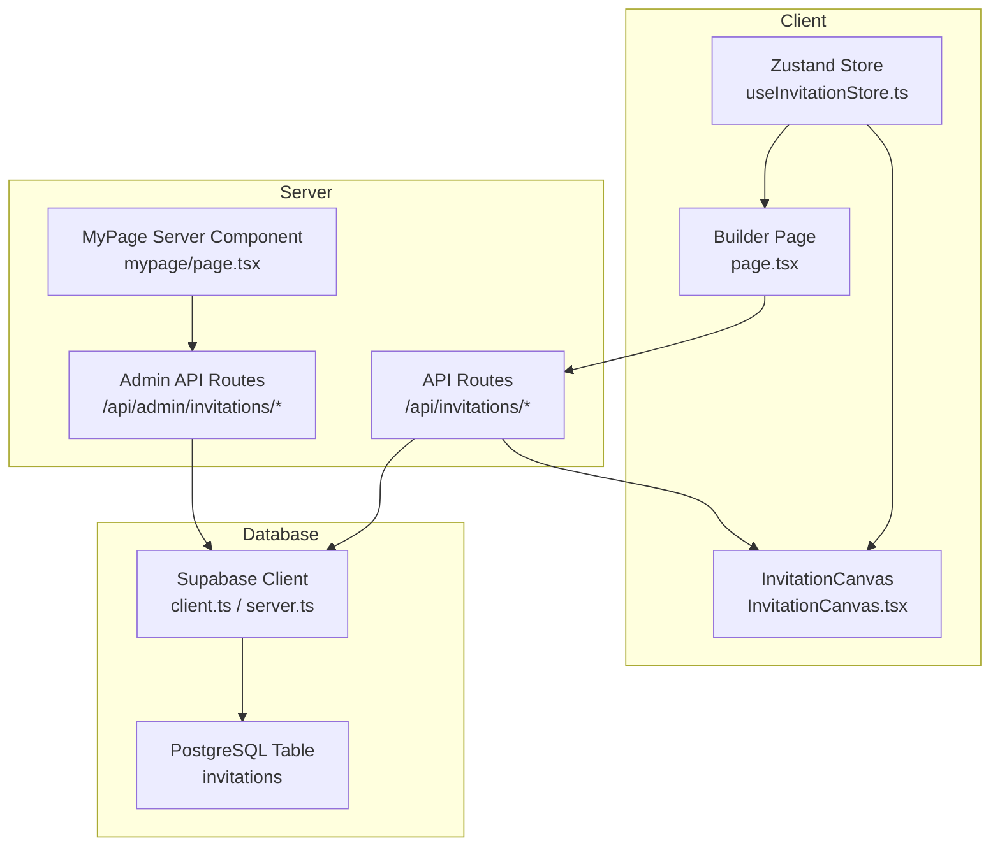
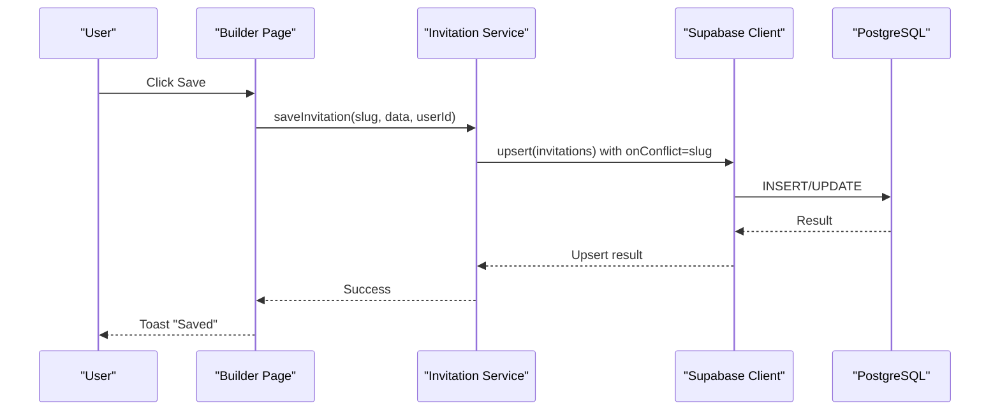
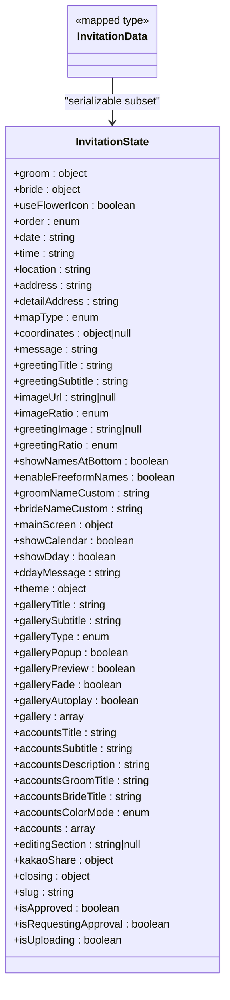
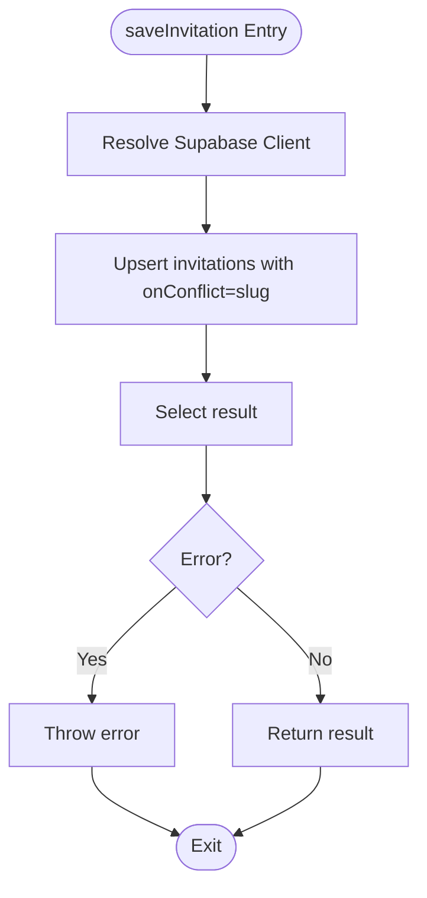
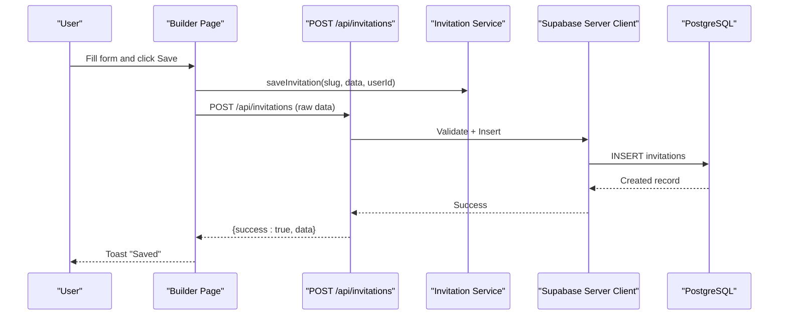
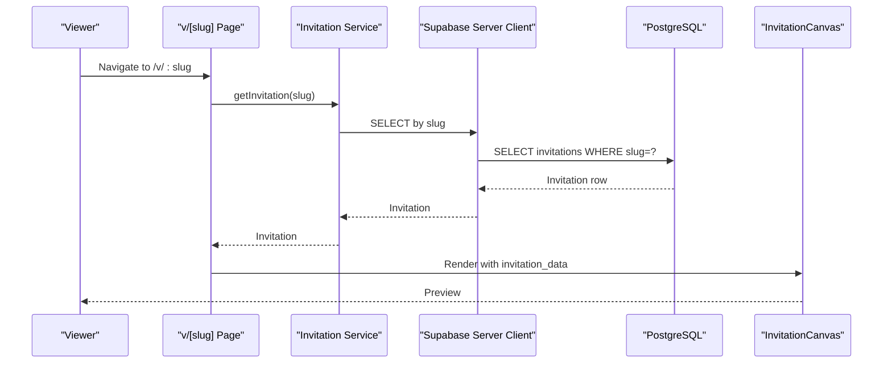
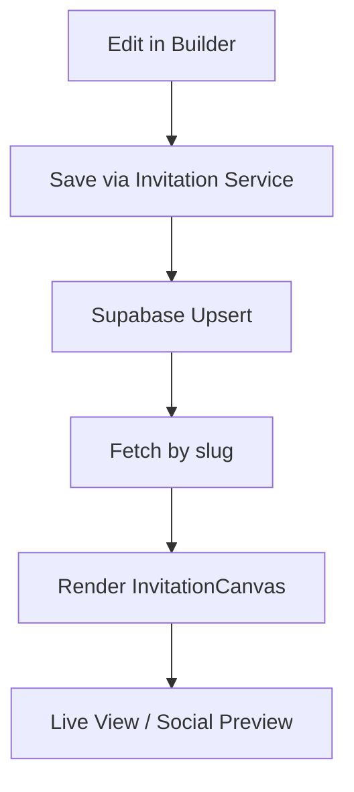
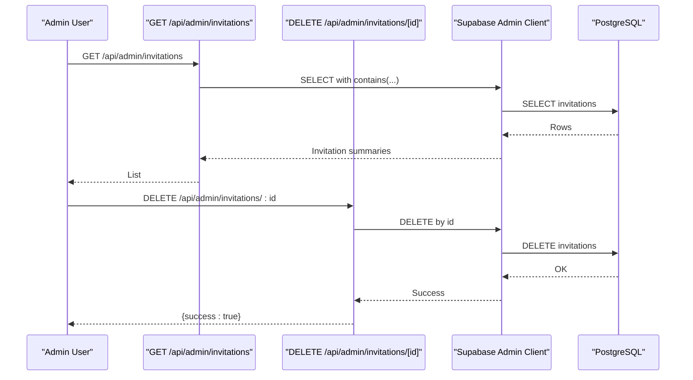
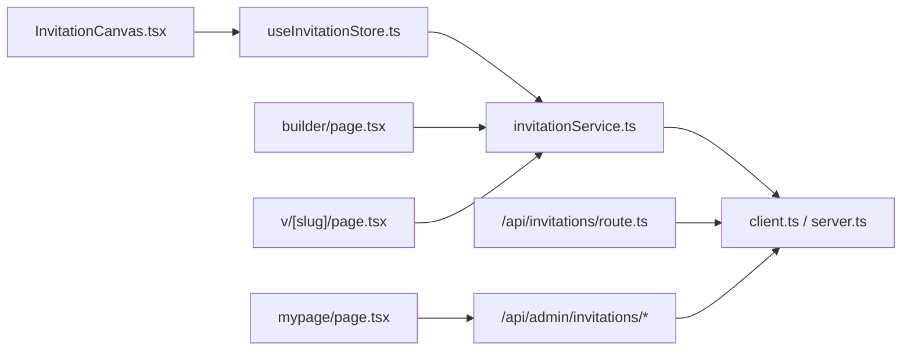

# Invitation Service

<cite>
**Referenced Files in This Document**
- [invitationService.ts](file://src/services/invitationService.ts)
- [client.ts](file://src/lib/supabase/client.ts)
- [server.ts](file://src/lib/supabase/server.ts)
- [useInvitationStore.ts](file://src/store/useInvitationStore.ts)
- [invitation-summary.ts](file://src/lib/invitation-summary.ts)
- [route.ts](file://src/app/api/invitations/route.ts)
- [page.tsx](file://src/app/builder/page.tsx)
- [page.tsx](file://src/app/v/[slug]/page.tsx)
- [page.tsx](file://src/app/preview/page.tsx)
- [InvitationCanvas.tsx](file://src/components/preview/InvitationCanvas.tsx)
- [route.ts](file://src/app/api/admin/invitations/route.ts)
- [route.ts](file://src/app/api/admin/invitations/[id]/route.ts)
- [page.tsx](file://src/app/mypage/page.tsx)
</cite>

## Table of Contents
1. [Introduction](#introduction)
2. [Project Structure](#project-structure)
3. [Core Components](#core-components)
4. [Architecture Overview](#architecture-overview)
5. [Detailed Component Analysis](#detailed-component-analysis)
6. [Dependency Analysis](#dependency-analysis)
7. [Performance Considerations](#performance-considerations)
8. [Troubleshooting Guide](#troubleshooting-guide)
9. [Conclusion](#conclusion)

## Introduction
This document describes the invitation service implementation, focusing on data management patterns, CRUD operations, real-time synchronization mechanisms, and preview generation. It explains how invitation data is structured, validated, stored, retrieved, and synchronized across the frontend and backend. It also documents integration with the Supabase client, server-side authentication, and server actions for secure mutations. Guidance is provided for extending functionality, maintaining data consistency, and optimizing performance.

## Project Structure
The invitation service spans client-side state management, server-side APIs, Supabase integration, and preview rendering components. Key areas include:
- Client-side state and data model: a comprehensive Zustand store defines the invitation data structure and setters.
- Server-side APIs: REST endpoints for creating and retrieving invitations, plus admin endpoints for managing invitations.
- Supabase integration: browser and server clients for authenticated database access.
- Preview pipeline: a canvas component renders invitation data for web and mobile previews.

**Diagram sources**
- [useInvitationStore.ts](file://src/store/useInvitationStore.ts#L1-L534)
- [page.tsx](file://src/app/builder/page.tsx#L1-L232)
- [InvitationCanvas.tsx](file://src/components/preview/InvitationCanvas.tsx#L1-L469)
- [route.ts](file://src/app/api/invitations/route.ts#L1-L115)
- [route.ts](file://src/app/api/admin/invitations/route.ts#L1-L64)
- [route.ts](file://src/app/api/admin/invitations/[id]/route.ts#L1-L40)
- [client.ts](file://src/lib/supabase/client.ts#L1-L85)
- [server.ts](file://src/lib/supabase/server.ts#L1-L19)

**Section sources**
- [useInvitationStore.ts](file://src/store/useInvitationStore.ts#L1-L534)
- [page.tsx](file://src/app/builder/page.tsx#L1-L232)
- [InvitationCanvas.tsx](file://src/components/preview/InvitationCanvas.tsx#L1-L469)
- [route.ts](file://src/app/api/invitations/route.ts#L1-L115)
- [route.ts](file://src/app/api/admin/invitations/route.ts#L1-L64)
- [route.ts](file://src/app/api/admin/invitations/[id]/route.ts#L1-L40)
- [client.ts](file://src/lib/supabase/client.ts#L1-L85)
- [server.ts](file://src/lib/supabase/server.ts#L1-L19)

## Core Components
- Invitation data model and state management:
  - The store defines a comprehensive InvitationState with nested sections for basic info, event info, theme, gallery, accounts, closing, and UI flags. It exposes typed setters for each field and a derived InvitationData type for serialization.
  - The store persists to IndexedDB via a JSON storage adapter and merges persisted data with defaults on load.
- Invitation service:
  - Provides methods to save, list, fetch by slug, and delete invitations. It supports optional Supabase client injection and uses upsert with conflict resolution on slug.
  - Includes admin listing and user-specific listing with summary projections and boolean normalization.
- Supabase clients:
  - Browser client manages token refresh and caching, injecting Authorization headers when available.
  - Server client creates a Supabase client bound to a NextAuth session, generating a JWT for authenticated requests.
- API routes:
  - Server action-like routes validate input, enforce uniqueness, and perform insertions or retrievals.
  - Admin routes provide admin-only listing and deletion using the Supabase admin client.
- Preview pipeline:
  - InvitationCanvas renders invitation data in a responsive, scrollable canvas, supporting preview modes and editing section highlighting.

**Section sources**
- [useInvitationStore.ts](file://src/store/useInvitationStore.ts#L1-L534)
- [invitationService.ts](file://src/services/invitationService.ts#L1-L81)
- [client.ts](file://src/lib/supabase/client.ts#L1-L85)
- [server.ts](file://src/lib/supabase/server.ts#L1-L19)
- [route.ts](file://src/app/api/invitations/route.ts#L1-L115)
- [route.ts](file://src/app/api/admin/invitations/route.ts#L1-L64)
- [route.ts](file://src/app/api/admin/invitations/[id]/route.ts#L1-L40)
- [InvitationCanvas.tsx](file://src/components/preview/InvitationCanvas.tsx#L1-L469)

## Architecture Overview
The invitation service follows a layered architecture:
- Presentation layer: Builder page and preview pages render the invitation canvas.
- Domain layer: Invitation service encapsulates CRUD operations and data transformations.
- Persistence layer: Supabase client handles database operations with server-side authentication and admin privileges for moderation.

**Diagram sources**
- [page.tsx](file://src/app/builder/page.tsx#L87-L127)
- [invitationService.ts](file://src/services/invitationService.ts#L10-L24)
- [client.ts](file://src/lib/supabase/client.ts#L41-L84)

**Section sources**
- [page.tsx](file://src/app/builder/page.tsx#L87-L127)
- [invitationService.ts](file://src/services/invitationService.ts#L1-L81)
- [client.ts](file://src/lib/supabase/client.ts#L1-L85)

## Detailed Component Analysis

### Invitation Data Model and State Management
- InvitationState defines all editable fields, including nested objects for groom/bride, theme, gallery, accounts, and closing. It includes UI flags such as editingSection, isApproved, isRequestingApproval, and isUploading.
- InvitationData is a mapped type excluding function properties, ensuring only serializable data is persisted and sent to the backend.
- The store uses IndexedDB-backed persistence with deep merge logic to handle schema evolution gracefully.

**Diagram sources**
- [useInvitationStore.ts](file://src/store/useInvitationStore.ts#L4-L236)

**Section sources**
- [useInvitationStore.ts](file://src/store/useInvitationStore.ts#L1-L534)

### Invitation Service Methods
- saveInvitation(slug, data, userId?, client?): Performs an upsert on the invitations table with conflict resolution on slug, returning the inserted/updated record.
- getAllInvitations(client?): Retrieves all invitations ordered by updated_at.
- getAdminInvitations(): Fetches admin invitation summaries via a dedicated API endpoint.
- getUserInvitations(userId, client?): Returns invitation summaries for a user with normalized booleans.
- getInvitation(slug, client?): Fetches a single invitation by slug.
- deleteInvitation(id, client?): Deletes an invitation by id.

**Diagram sources**
- [invitationService.ts](file://src/services/invitationService.ts#L10-L24)

**Section sources**
- [invitationService.ts](file://src/services/invitationService.ts#L1-L81)

### API Workflows

#### Invitation Creation Workflow
- The builder page collects current store state, generates a slug if missing, validates user session, and calls the invitation service to save.
- On the server, a new POST endpoint validates the payload, checks slug uniqueness, inserts the invitation, and returns the created record.

**Diagram sources**
- [page.tsx](file://src/app/builder/page.tsx#L87-L127)
- [route.ts](file://src/app/api/invitations/route.ts#L22-L77)
- [invitationService.ts](file://src/services/invitationService.ts#L10-L24)

**Section sources**
- [page.tsx](file://src/app/builder/page.tsx#L87-L127)
- [route.ts](file://src/app/api/invitations/route.ts#L1-L115)
- [invitationService.ts](file://src/services/invitationService.ts#L1-L81)

#### Invitation Retrieval and Preview
- The preview page fetches an invitation by slug using the server client and renders it via InvitationCanvas.
- Open Graph metadata is generated dynamically from invitation data for social sharing.

**Diagram sources**
- [page.tsx](file://src/app/v/[slug]/page.tsx#L11-L14)
- [page.tsx](file://src/app/v/[slug]/page.tsx#L63-L107)
- [InvitationCanvas.tsx](file://src/components/preview/InvitationCanvas.tsx#L462-L469)

**Section sources**
- [page.tsx](file://src/app/v/[slug]/page.tsx#L1-L108)
- [InvitationCanvas.tsx](file://src/components/preview/InvitationCanvas.tsx#L1-L469)

### Real-Time Synchronization and Preview Generation
- Client-side state synchronization:
  - The builder page saves to the backend and navigates to the user's page. There is no explicit real-time subscription in the provided code; changes propagate via the next navigation and subsequent fetches.
- Preview generation:
  - InvitationCanvas renders the invitation data passed to it. It supports preview mode, editing section highlighting, and watermarks for unapproved drafts.
  - The preview page renders the InvitationCanvas directly, while the builder page uses a mobile preview drawer for responsive testing.

**Diagram sources**
- [page.tsx](file://src/app/builder/page.tsx#L87-L127)
- [InvitationCanvas.tsx](file://src/components/preview/InvitationCanvas.tsx#L462-L469)
- [page.tsx](file://src/app/v/[slug]/page.tsx#L63-L107)

**Section sources**
- [page.tsx](file://src/app/builder/page.tsx#L1-L232)
- [InvitationCanvas.tsx](file://src/components/preview/InvitationCanvas.tsx#L1-L469)
- [page.tsx](file://src/app/v/[slug]/page.tsx#L1-L108)

### Admin Management and Moderation
- Admin listing:
  - Admins can list invitations requesting approval using a dedicated endpoint that filters by invitation_data JSONB field.
- Admin deletion:
  - Admins can delete invitations using the admin client, bypassing row-level security.

**Diagram sources**
- [route.ts](file://src/app/api/admin/invitations/route.ts#L8-L55)
- [route.ts](file://src/app/api/admin/invitations/[id]/route.ts#L4-L31)

**Section sources**
- [route.ts](file://src/app/api/admin/invitations/route.ts#L1-L64)
- [route.ts](file://src/app/api/admin/invitations/[id]/route.ts#L1-L40)

### Data Validation and Security
- Frontend validation:
  - The builder page enforces profile completion and admin restrictions before allowing saves.
- Backend validation:
  - The POST endpoint validates required fields and enforces slug uniqueness before insertion.
- Authentication and authorization:
  - Server client binds to NextAuth session and injects a JWT for authenticated Supabase access.
  - Admin endpoints verify admin status via database profile and service role key.

**Section sources**
- [page.tsx](file://src/app/builder/page.tsx#L71-L127)
- [route.ts](file://src/app/api/invitations/route.ts#L6-L20)
- [server.ts](file://src/lib/supabase/server.ts#L9-L18)
- [route.ts](file://src/app/api/admin/invitations/route.ts#L8-L30)

## Dependency Analysis
The invitation service relies on several key dependencies:
- Supabase client libraries for database operations.
- NextAuth for session-based authentication.
- Zustand for client-side state management.
- Zod for request validation.
- React components for rendering and preview.

**Diagram sources**
- [useInvitationStore.ts](file://src/store/useInvitationStore.ts#L1-L534)
- [invitationService.ts](file://src/services/invitationService.ts#L1-L81)
- [client.ts](file://src/lib/supabase/client.ts#L1-L85)
- [server.ts](file://src/lib/supabase/server.ts#L1-L19)
- [page.tsx](file://src/app/builder/page.tsx#L1-L232)
- [route.ts](file://src/app/api/invitations/route.ts#L1-L115)
- [route.ts](file://src/app/api/admin/invitations/route.ts#L1-L64)
- [page.tsx](file://src/app/v/[slug]/page.tsx#L1-L108)
- [InvitationCanvas.tsx](file://src/components/preview/InvitationCanvas.tsx#L1-L469)
- [page.tsx](file://src/app/mypage/page.tsx#L1-L128)

**Section sources**
- [useInvitationStore.ts](file://src/store/useInvitationStore.ts#L1-L534)
- [invitationService.ts](file://src/services/invitationService.ts#L1-L81)
- [client.ts](file://src/lib/supabase/client.ts#L1-L85)
- [server.ts](file://src/lib/supabase/server.ts#L1-L19)
- [page.tsx](file://src/app/builder/page.tsx#L1-L232)
- [route.ts](file://src/app/api/invitations/route.ts#L1-L115)
- [route.ts](file://src/app/api/admin/invitations/route.ts#L1-L64)
- [page.tsx](file://src/app/v/[slug]/page.tsx#L1-L108)
- [InvitationCanvas.tsx](file://src/components/preview/InvitationCanvas.tsx#L1-L469)
- [page.tsx](file://src/app/mypage/page.tsx#L1-L128)

## Performance Considerations
- Client-side persistence:
  - IndexedDB-backed Zustand store reduces server round-trips for draft data and improves offline resilience.
- Efficient database queries:
  - Summary projections and JSONB field aliases minimize payload sizes for listing and admin views.
- Token caching and refresh:
  - Browser client caches tokens and refreshes only when nearing expiration, reducing redundant network calls.
- Rendering optimization:
  - InvitationCanvas uses memoization and selective data extraction to avoid unnecessary re-renders.

[No sources needed since this section provides general guidance]

## Troubleshooting Guide
- Save fails with validation errors:
  - Verify required fields and slug length/format on the server endpoint.
- Slug already exists:
  - Ensure slug generation logic produces unique values or prompt the user to choose another slug.
- Unauthorized or forbidden:
  - Confirm NextAuth session and admin profile checks for admin endpoints.
- Preview not updating:
  - Ensure the slug is correct and the invitation exists. Check that the server client is properly configured.
- Token fetch failures:
  - Review the token endpoint availability and CORS settings.

**Section sources**
- [route.ts](file://src/app/api/invitations/route.ts#L22-L77)
- [route.ts](file://src/app/api/admin/invitations/route.ts#L8-L30)
- [client.ts](file://src/lib/supabase/client.ts#L24-L39)

## Conclusion
The invitation service provides a robust foundation for managing wedding invitation data across the frontend and backend. It leverages a comprehensive client-side state model, secure server actions for mutations, and efficient database operations with JSONB projections. While real-time synchronization is not implemented, the current design supports reliable preview generation, admin moderation, and scalable performance through caching and optimized queries. Extending the service involves adding new fields to the state model, updating validation schemas, and integrating additional server endpoints as needed.