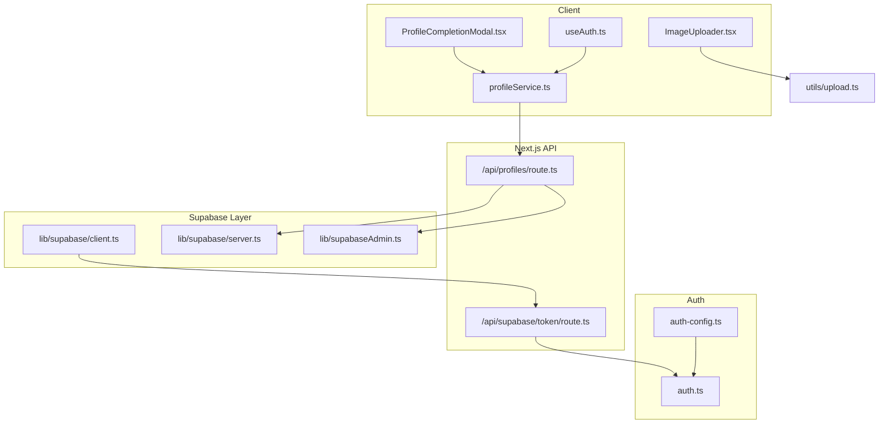
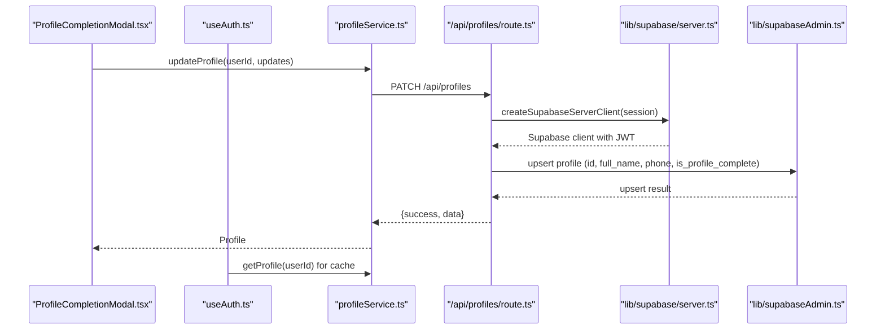
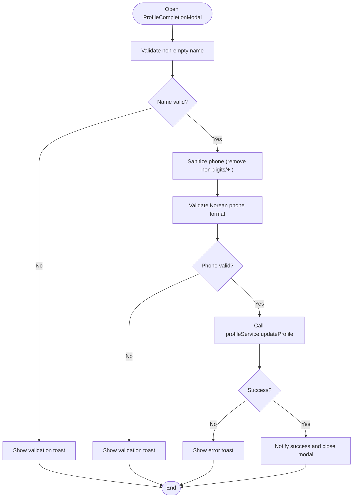
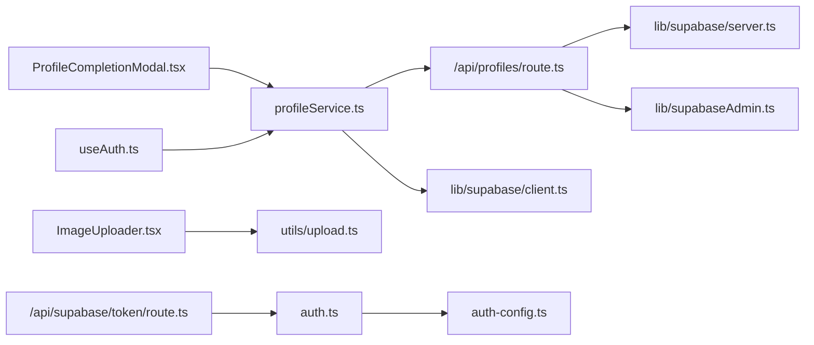

# Profile Service

<cite>
**Referenced Files in This Document**
- [profileService.ts](file://src/services/profileService.ts)
- [route.ts](file://src/app/api/profiles/route.ts)
- [client.ts](file://src/lib/supabase/client.ts)
- [server.ts](file://src/lib/supabase/server.ts)
- [supabaseAdmin.ts](file://src/lib/supabaseAdmin.ts)
- [ProfileCompletionModal.tsx](file://src/components/auth/ProfileCompletionModal.tsx)
- [useAuth.ts](file://src/hooks/useAuth.ts)
- [page.tsx](file://src/app/mypage/page.tsx)
- [route.ts](file://src/app/api/supabase/token/route.ts)
- [ImageUploader.tsx](file://src/components/common/ImageUploader/ImageUploader.tsx)
- [upload.ts](file://src/utils/upload.ts)
- [utils.ts](file://src/lib/utils.ts)
- [auth.ts](file://src/auth.ts)
- [auth-config.ts](file://src/auth-config.ts)
</cite>

## Table of Contents
1. [Introduction](#introduction)
2. [Project Structure](#project-structure)
3. [Core Components](#core-components)
4. [Architecture Overview](#architecture-overview)
5. [Detailed Component Analysis](#detailed-component-analysis)
6. [Dependency Analysis](#dependency-analysis)
7. [Performance Considerations](#performance-considerations)
8. [Troubleshooting Guide](#troubleshooting-guide)
9. [Conclusion](#conclusion)
10. [Appendices](#appendices)

## Introduction
This document explains the profile service implementation for user profile management. It covers profile creation, updates, and retrieval, along with authentication data handling, personal information management, and profile completion workflows. It also documents OAuth integration, user data synchronization, profile-image handling, privacy and compliance considerations, error handling, caching, performance optimization, and extension guidelines.

## Project Structure
The profile service spans client-side and server-side modules:
- Client service for browser interactions
- Next.js API routes for secure profile operations
- Supabase client utilities for token-based authentication
- UI components for profile completion and image handling
- Hooks for reactive profile state and admin checks

**Diagram sources**
- [profileService.ts](file://src/services/profileService.ts#L1-L101)
- [route.ts](file://src/app/api/profiles/route.ts#L1-L125)
- [client.ts](file://src/lib/supabase/client.ts#L1-L85)
- [server.ts](file://src/lib/supabase/server.ts#L1-L19)
- [supabaseAdmin.ts](file://src/lib/supabaseAdmin.ts#L1-L15)
- [ProfileCompletionModal.tsx](file://src/components/auth/ProfileCompletionModal.tsx#L1-L134)
- [useAuth.ts](file://src/hooks/useAuth.ts#L1-L55)
- [route.ts](file://src/app/api/supabase/token/route.ts#L1-L16)
- [ImageUploader.tsx](file://src/components/common/ImageUploader/ImageUploader.tsx#L1-L199)
- [upload.ts](file://src/utils/upload.ts#L1-L39)
- [auth.ts](file://src/auth.ts#L1-L5)
- [auth-config.ts](file://src/auth-config.ts#L161-L192)

**Section sources**
- [profileService.ts](file://src/services/profileService.ts#L1-L101)
- [route.ts](file://src/app/api/profiles/route.ts#L1-L125)
- [client.ts](file://src/lib/supabase/client.ts#L1-L85)
- [server.ts](file://src/lib/supabase/server.ts#L1-L19)
- [supabaseAdmin.ts](file://src/lib/supabaseAdmin.ts#L1-L15)
- [ProfileCompletionModal.tsx](file://src/components/auth/ProfileCompletionModal.tsx#L1-L134)
- [useAuth.ts](file://src/hooks/useAuth.ts#L1-L55)
- [route.ts](file://src/app/api/supabase/token/route.ts#L1-L16)
- [ImageUploader.tsx](file://src/components/common/ImageUploader/ImageUploader.tsx#L1-L199)
- [upload.ts](file://src/utils/upload.ts#L1-L39)
- [auth.ts](file://src/auth.ts#L1-L5)
- [auth-config.ts](file://src/auth-config.ts#L161-L192)

## Core Components
- Profile model and update payload define the shape of stored and mutable fields.
- Client service encapsulates profile retrieval and updates via API.
- API routes enforce authentication, validate inputs, and perform upserts.
- Supabase clients manage token-based access for server and browser contexts.
- UI components coordinate profile completion and image uploads.
- Hooks provide reactive profile state and admin checks.

Key responsibilities:
- Profile creation and updates through upsert semantics
- Profile completion detection based on required fields
- Admin flag evaluation from profile record
- Token-based Supabase client initialization
- Image upload pipeline with optimistic UI and fallback

**Section sources**
- [profileService.ts](file://src/services/profileService.ts#L3-L20)
- [route.ts](file://src/app/api/profiles/route.ts#L7-L11)
- [client.ts](file://src/lib/supabase/client.ts#L41-L84)
- [server.ts](file://src/lib/supabase/server.ts#L9-L18)
- [ProfileCompletionModal.tsx](file://src/components/auth/ProfileCompletionModal.tsx#L33-L62)
- [ImageUploader.tsx](file://src/components/common/ImageUploader/ImageUploader.tsx#L43-L83)

## Architecture Overview
The profile service follows a layered architecture:
- UI triggers profile completion and updates
- Client service delegates to Next.js API routes
- API routes validate session, parse inputs, and upsert profile data
- Supabase clients provide secure access using JWT tokens
- Image utilities support profile avatar storage and retrieval

**Diagram sources**
- [ProfileCompletionModal.tsx](file://src/components/auth/ProfileCompletionModal.tsx#L47-L50)
- [useAuth.ts](file://src/hooks/useAuth.ts#L29-L32)
- [profileService.ts](file://src/services/profileService.ts#L60-L81)
- [route.ts](file://src/app/api/profiles/route.ts#L57-L109)
- [server.ts](file://src/lib/supabase/server.ts#L9-L18)
- [supabaseAdmin.ts](file://src/lib/supabaseAdmin.ts#L7-L14)

## Detailed Component Analysis

### Profile Model and Payload
- Profile interface defines identifiers, personal info, avatar URL, optional OAuth identifiers, admin flag, completion flag, and timestamps.
- Update payload allows partial updates to name, phone, avatar URL, and completion flag.

Complexity and behavior:
- Retrieval is O(1) single-row lookup by ID.
- Upsert is O(1) single-row write with computed completion flag.

**Section sources**
- [profileService.ts](file://src/services/profileService.ts#L3-L20)

### Client Service: profileService
Responsibilities:
- Retrieve profile by user ID with robust error handling.
- Update profile via API route with structured error propagation.
- Compute profile completion and admin status from retrieved data.

Error handling:
- Catches and logs network exceptions.
- Treats specific database errors as missing records and returns null.

Caching and performance:
- Delegated to React Query via hook; service itself is stateless.

**Section sources**
- [profileService.ts](file://src/services/profileService.ts#L26-L52)
- [profileService.ts](file://src/services/profileService.ts#L60-L81)
- [profileService.ts](file://src/services/profileService.ts#L86-L99)

### API Routes: /api/profiles
Endpoints:
- GET: Returns current user’s profile or null if not found.
- PATCH: Validates inputs, computes completion flag, and upserts profile.

Validation:
- Zod schema enforces non-empty strings for name and phone, optional URL for avatar.

Upsert logic:
- If either name or phone is not provided, fetch current values to maintain completeness.
- Computed completion flag ensures integrity.

Security:
- Uses session-based auth; creates Supabase client with JWT for database access.
- Falls back to admin client when available.

Error handling:
- Returns structured errors for invalid inputs, unauthorized access, and server failures.

**Section sources**
- [route.ts](file://src/app/api/profiles/route.ts#L13-L54)
- [route.ts](file://src/app/api/profiles/route.ts#L56-L124)

### Supabase Clients
- Browser client: fetches a temporary JWT from the server and initializes a client with Authorization header; caches token and client to reduce overhead.
- Server client: creates a client bound to the authenticated session using a generated JWT.

Token lifecycle:
- Decodes JWT expiry to schedule refresh.
- Prevents frequent token requests via request deduplication.

**Section sources**
- [client.ts](file://src/lib/supabase/client.ts#L24-L39)
- [client.ts](file://src/lib/supabase/client.ts#L41-L84)
- [server.ts](file://src/lib/supabase/server.ts#L9-L18)
- [route.ts](file://src/app/api/supabase/token/route.ts#L5-L15)

### Profile Completion Modal
- Collects full name and phone number with client-side validation.
- Sanitizes phone input and validates Korean phone format.
- Submits updates via profile service and notifies user of success/failure.

UX considerations:
- Disabled submit until both fields are present.
- Persistent modal footer with optional logout action.

**Section sources**
- [ProfileCompletionModal.tsx](file://src/components/auth/ProfileCompletionModal.tsx#L28-L62)
- [utils.ts](file://src/lib/utils.ts#L59-L62)

### Authentication Integration
- NextAuth manages sessions; provider callbacks extract phone numbers from OAuth profiles.
- Phone normalization ensures consistent storage format across providers.

**Section sources**
- [auth.ts](file://src/auth.ts#L1-L5)
- [auth-config.ts](file://src/auth-config.ts#L161-L192)

### Image Handling for Profile Avatars
- ImageUploader supports drag-and-drop selection, optimistic preview, and background upload.
- uploadImage utility uploads to Supabase Storage and returns a public URL.
- Avatar URL is persisted in the profile record.

Privacy:
- Public URLs are served by Supabase Storage; ensure bucket policies restrict access appropriately.

**Section sources**
- [ImageUploader.tsx](file://src/components/common/ImageUploader/ImageUploader.tsx#L43-L83)
- [upload.ts](file://src/utils/upload.ts#L10-L38)
- [profileService.ts](file://src/services/profileService.ts#L15-L20)

### Admin and Ownership Verification
- Admin status is derived from the profile record’s admin flag.
- MyPage page fetches profile and admin queues conditionally based on identity and DB flag.
- Admin client is used for privileged operations.

**Section sources**
- [useAuth.ts](file://src/hooks/useAuth.ts#L40-L42)
- [page.tsx](file://src/app/mypage/page.tsx#L34-L102)
- [supabaseAdmin.ts](file://src/lib/supabaseAdmin.ts#L7-L14)

### Profile Completion Workflow

**Diagram sources**
- [ProfileCompletionModal.tsx](file://src/components/auth/ProfileCompletionModal.tsx#L33-L62)
- [utils.ts](file://src/lib/utils.ts#L59-L62)
- [profileService.ts](file://src/services/profileService.ts#L60-L81)

## Dependency Analysis

**Diagram sources**
- [profileService.ts](file://src/services/profileService.ts#L1-L101)
- [route.ts](file://src/app/api/profiles/route.ts#L1-L125)
- [client.ts](file://src/lib/supabase/client.ts#L1-L85)
- [server.ts](file://src/lib/supabase/server.ts#L1-L19)
- [supabaseAdmin.ts](file://src/lib/supabaseAdmin.ts#L1-L15)
- [ProfileCompletionModal.tsx](file://src/components/auth/ProfileCompletionModal.tsx#L1-L134)
- [useAuth.ts](file://src/hooks/useAuth.ts#L1-L55)
- [ImageUploader.tsx](file://src/components/common/ImageUploader/ImageUploader.tsx#L1-L199)
- [upload.ts](file://src/utils/upload.ts#L1-L39)
- [route.ts](file://src/app/api/supabase/token/route.ts#L1-L16)
- [auth.ts](file://src/auth.ts#L1-L5)
- [auth-config.ts](file://src/auth-config.ts#L161-L192)

**Section sources**
- [profileService.ts](file://src/services/profileService.ts#L1-L101)
- [route.ts](file://src/app/api/profiles/route.ts#L1-L125)
- [client.ts](file://src/lib/supabase/client.ts#L1-L85)
- [server.ts](file://src/lib/supabase/server.ts#L1-L19)
- [supabaseAdmin.ts](file://src/lib/supabaseAdmin.ts#L1-L15)
- [ProfileCompletionModal.tsx](file://src/components/auth/ProfileCompletionModal.tsx#L1-L134)
- [useAuth.ts](file://src/hooks/useAuth.ts#L1-L55)
- [ImageUploader.tsx](file://src/components/common/ImageUploader/ImageUploader.tsx#L1-L199)
- [upload.ts](file://src/utils/upload.ts#L1-L39)
- [route.ts](file://src/app/api/supabase/token/route.ts#L1-L16)
- [auth.ts](file://src/auth.ts#L1-L5)
- [auth-config.ts](file://src/auth-config.ts#L161-L192)

## Performance Considerations
- Token caching: Browser client caches JWT and reuses client until expiry; reduces redundant token fetches.
- React Query: Hook-based caching with a short stale time avoids stale data while minimizing requests.
- Optimistic UI: Image uploader previews immediately and reverts on failure, improving perceived performance.
- Parallelization: MyPage page fetches profile and related data concurrently when appropriate.

Recommendations:
- Add exponential backoff for retries on transient failures.
- Consider server-side caching for frequently accessed profile summaries.
- Monitor Supabase upsert latency and adjust client-side optimistic updates accordingly.

[No sources needed since this section provides general guidance]

## Troubleshooting Guide
Common issues and resolutions:
- Unauthorized access during profile updates: Ensure a valid session exists and the token endpoint returns a token.
- Validation errors on PATCH: Verify input shapes match the Zod schema; check that name and phone are non-empty when required.
- Missing profile records: GET returns null for missing records; initialize via PATCH with required fields.
- Image upload failures: Confirm bucket permissions and that the upload utility succeeds; revert to previous value on failure.
- Stale profile data: Invalidate React Query cache or trigger refetch after updates.

**Section sources**
- [route.ts](file://src/app/api/profiles/route.ts#L18-L23)
- [route.ts](file://src/app/api/profiles/route.ts#L111-L116)
- [client.ts](file://src/lib/supabase/client.ts#L24-L39)
- [ImageUploader.tsx](file://src/components/common/ImageUploader/ImageUploader.tsx#L63-L72)
- [useAuth.ts](file://src/hooks/useAuth.ts#L35-L37)

## Conclusion
The profile service integrates client-side UI, API routes, and Supabase securely to manage user profiles. It enforces validation, maintains data integrity via upserts, and supports OAuth-driven data synchronization. Image handling and caching improve UX, while hooks and admin checks streamline access control. The modular design enables straightforward extensions for additional fields and workflows.

[No sources needed since this section summarizes without analyzing specific files]

## Appendices

### API Definitions
- GET /api/profiles
  - Description: Retrieve current user’s profile
  - Authentication: Required
  - Response: { success: boolean, data: Profile | null }

- PATCH /api/profiles
  - Description: Update profile; upserts if record does not exist
  - Authentication: Required
  - Request body: Partial(ProfileUpdatePayload)
  - Response: { success: boolean, data: Profile }

**Section sources**
- [route.ts](file://src/app/api/profiles/route.ts#L13-L54)
- [route.ts](file://src/app/api/profiles/route.ts#L56-L124)

### Data Privacy and Compliance Notes
- Personal information (name, phone) is collected for profile completion and approval workflows.
- Ensure storage buckets and policies restrict public access to images.
- Consider data minimization and retention policies aligned with applicable regulations.

[No sources needed since this section provides general guidance]

### Extensibility Guidelines
- Add fields to Profile and ProfileUpdatePayload interfaces consistently.
- Extend Zod schema in API route to validate new fields.
- Update profile completion logic to reflect new required fields.
- Integrate OAuth callbacks to populate new fields from provider profiles.
- Update UI components and hooks to render and edit new fields.

**Section sources**
- [profileService.ts](file://src/services/profileService.ts#L3-L20)
- [route.ts](file://src/app/api/profiles/route.ts#L7-L11)
- [auth-config.ts](file://src/auth-config.ts#L161-L192)
- [useAuth.ts](file://src/hooks/useAuth.ts#L29-L32)