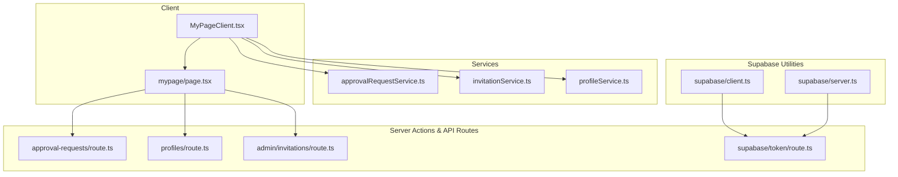
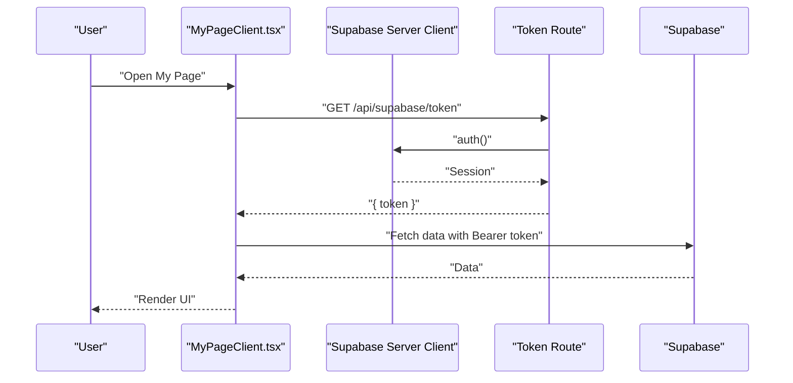
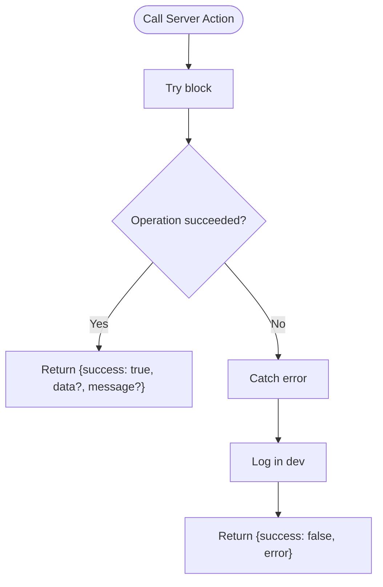
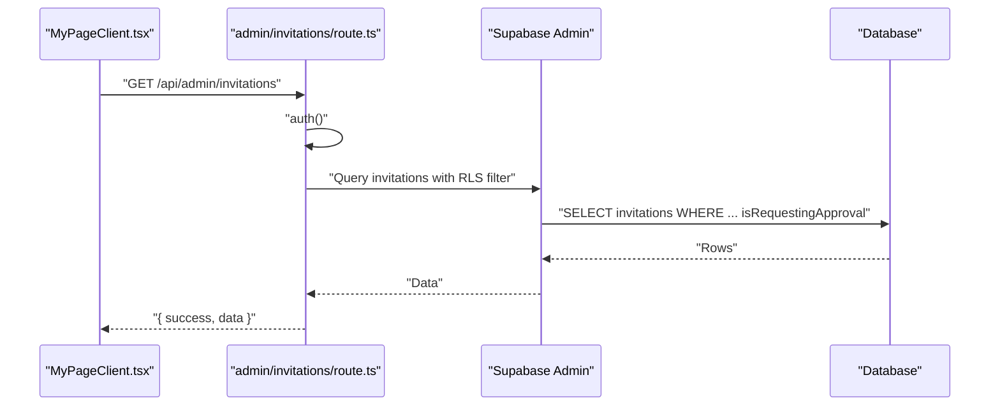
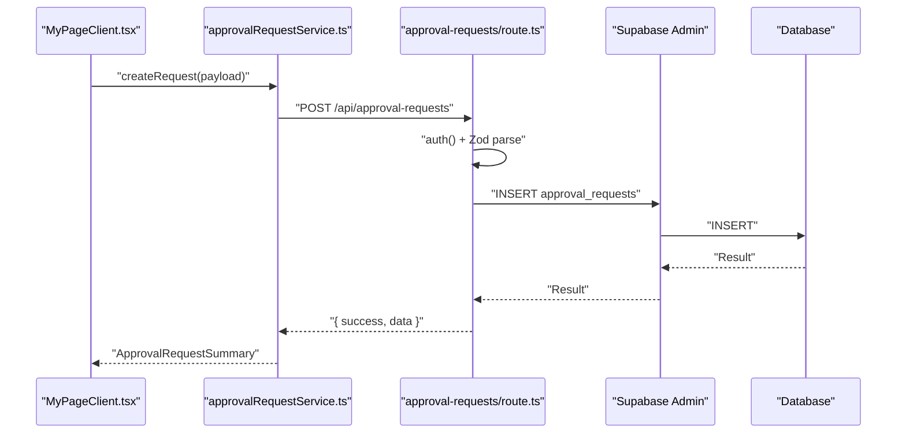
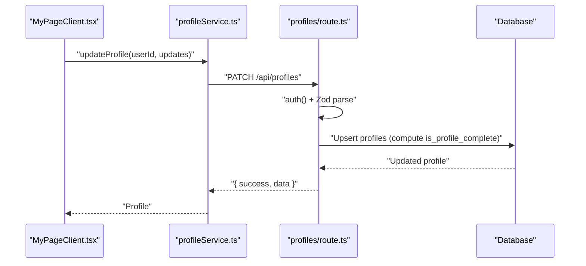
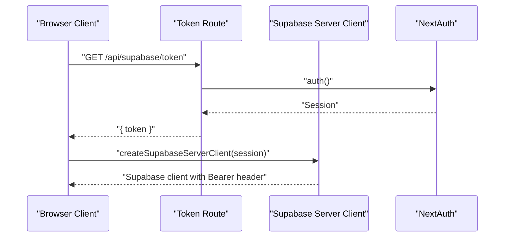
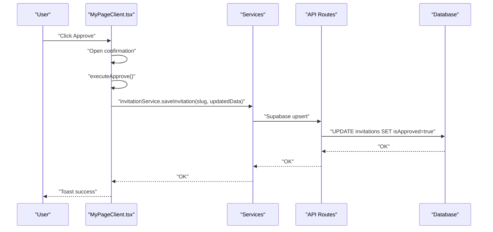
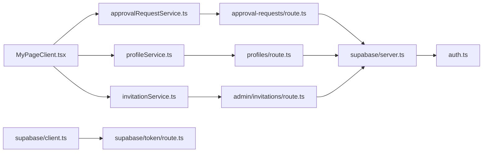

# Server Actions

<cite>
**Referenced Files in This Document**
- [src/lib/actions.ts](file://src/lib/actions.ts)
- [src/services/approvalRequestService.ts](file://src/services/approvalRequestService.ts)
- [src/services/invitationService.ts](file://src/services/invitationService.ts)
- [src/services/profileService.ts](file://src/services/profileService.ts)
- [src/lib/supabase/client.ts](file://src/lib/supabase/client.ts)
- [src/lib/supabase/server.ts](file://src/lib/supabase/server.ts)
- [src/app/api/admin/invitations/route.ts](file://src/app/api/admin/invitations/route.ts)
- [src/app/api/approval-requests/route.ts](file://src/app/api/approval-requests/route.ts)
- [src/app/api/profiles/route.ts](file://src/app/api/profiles/route.ts)
- [src/app/api/supabase/token/route.ts](file://src/app/api/supabase/token/route.ts)
- [src/app/mypage/page.tsx](file://src/app/mypage/page.tsx)
- [src/app/mypage/MyPageClient.tsx](file://src/app/mypage/MyPageClient.tsx)
- [src/auth.ts](file://src/auth.ts)
</cite>

## Table of Contents
1. [Introduction](#introduction)
2. [Project Structure](#project-structure)
3. [Core Components](#core-components)
4. [Architecture Overview](#architecture-overview)
5. [Detailed Component Analysis](#detailed-component-analysis)
6. [Dependency Analysis](#dependency-analysis)
7. [Performance Considerations](#performance-considerations)
8. [Troubleshooting Guide](#troubleshooting-guide)
9. [Conclusion](#conclusion)
10. [Appendices](#appendices)

## Introduction
This document explains the server actions implementation pattern in the project, focusing on Next.js server actions architecture, form submission handling, and secure data mutation patterns. It documents action functions for invitation management, profile updates, and approval operations, and demonstrates how client-server communication is structured. It also covers integration with Supabase for database operations, authentication validation, and real-time updates, along with security considerations, performance optimization, and progressive enhancement patterns.

## Project Structure
The server actions and related APIs are organized around:
- Client components that orchestrate user interactions
- Server action utilities for mutation responses and error handling
- API routes for authenticated mutations and admin operations
- Services that encapsulate Supabase interactions and HTTP calls
- Supabase client utilities for token-based authentication and browser client initialization

**Diagram sources**
- [src/app/mypage/MyPageClient.tsx](file://src/app/mypage/MyPageClient.tsx#L1-L659)
- [src/app/mypage/page.tsx](file://src/app/mypage/page.tsx#L1-L138)
- [src/app/api/approval-requests/route.ts](file://src/app/api/approval-requests/route.ts#L1-L337)
- [src/app/api/profiles/route.ts](file://src/app/api/profiles/route.ts#L1-L125)
- [src/app/api/admin/invitations/route.ts](file://src/app/api/admin/invitations/route.ts#L1-L64)
- [src/app/api/supabase/token/route.ts](file://src/app/api/supabase/token/route.ts#L1-L16)
- [src/services/approvalRequestService.ts](file://src/services/approvalRequestService.ts#L1-L78)
- [src/services/invitationService.ts](file://src/services/invitationService.ts#L1-L81)
- [src/services/profileService.ts](file://src/services/profileService.ts#L1-L101)
- [src/lib/supabase/client.ts](file://src/lib/supabase/client.ts#L1-L85)
- [src/lib/supabase/server.ts](file://src/lib/supabase/server.ts#L1-L19)

**Section sources**
- [src/app/mypage/MyPageClient.tsx](file://src/app/mypage/MyPageClient.tsx#L1-L659)
- [src/app/mypage/page.tsx](file://src/app/mypage/page.tsx#L1-L138)
- [src/app/api/approval-requests/route.ts](file://src/app/api/approval-requests/route.ts#L1-L337)
- [src/app/api/profiles/route.ts](file://src/app/api/profiles/route.ts#L1-L125)
- [src/app/api/admin/invitations/route.ts](file://src/app/api/admin/invitations/route.ts#L1-L64)
- [src/app/api/supabase/token/route.ts](file://src/app/api/supabase/token/route.ts#L1-L16)
- [src/services/approvalRequestService.ts](file://src/services/approvalRequestService.ts#L1-L78)
- [src/services/invitationService.ts](file://src/services/invitationService.ts#L1-L81)
- [src/services/profileService.ts](file://src/services/profileService.ts#L1-L101)
- [src/lib/supabase/client.ts](file://src/lib/supabase/client.ts#L1-L85)
- [src/lib/supabase/server.ts](file://src/lib/supabase/server.ts#L1-L19)

## Core Components
- Server action response contract: a standardized shape for all server-side mutations to ensure consistent client handling.
- Utility server actions: save, preview generation, export, send, RSVP update, image upload, event tracking, and validation helpers.
- Error handling utility: centralized error reporting and response shaping.
- API routes: authenticated endpoints for approvals, profiles, admin invitations, and token provisioning.
- Services: typed wrappers around Supabase and HTTP calls for invitations, approvals, and profiles.
- Supabase utilities: browser client initialization with token refresh and server client creation with JWT.

**Section sources**
- [src/lib/actions.ts](file://src/lib/actions.ts#L1-L200)
- [src/app/api/approval-requests/route.ts](file://src/app/api/approval-requests/route.ts#L1-L337)
- [src/app/api/profiles/route.ts](file://src/app/api/profiles/route.ts#L1-L125)
- [src/app/api/admin/invitations/route.ts](file://src/app/api/admin/invitations/route.ts#L1-L64)
- [src/app/api/supabase/token/route.ts](file://src/app/api/supabase/token/route.ts#L1-L16)
- [src/services/invitationService.ts](file://src/services/invitationService.ts#L1-L81)
- [src/services/approvalRequestService.ts](file://src/services/approvalRequestService.ts#L1-L78)
- [src/services/profileService.ts](file://src/services/profileService.ts#L1-L101)
- [src/lib/supabase/client.ts](file://src/lib/supabase/client.ts#L1-L85)
- [src/lib/supabase/server.ts](file://src/lib/supabase/server.ts#L1-L19)

## Architecture Overview
The system separates concerns across client, server actions/API routes, services, and Supabase utilities. Authentication is enforced at the API route level using NextAuth, and Supabase JWTs are minted server-side for secure client access.

**Diagram sources**
- [src/app/mypage/MyPageClient.tsx](file://src/app/mypage/MyPageClient.tsx#L1-L659)
- [src/app/api/supabase/token/route.ts](file://src/app/api/supabase/token/route.ts#L1-L16)
- [src/lib/supabase/server.ts](file://src/lib/supabase/server.ts#L1-L19)
- [src/lib/supabase/client.ts](file://src/lib/supabase/client.ts#L1-L85)

## Detailed Component Analysis

### Server Actions Utilities
- Standardized response shape for mutations ensures predictable client handling.
- Utility actions include saving invitations, generating previews, exporting assets, sending invitations, updating RSVP, uploading images, validating data, and tracking events.
- Centralized error handler logs and returns consistent error payloads.

**Diagram sources**
- [src/lib/actions.ts](file://src/lib/actions.ts#L1-L200)

**Section sources**
- [src/lib/actions.ts](file://src/lib/actions.ts#L1-L200)

### Invitation Management API
- Admin endpoint lists invitations requesting approval using service role and RLS-aware filters.
- Client-side services wrap Supabase operations for saving, listing, retrieving, and deleting invitations.

**Diagram sources**
- [src/app/mypage/MyPageClient.tsx](file://src/app/mypage/MyPageClient.tsx#L103-L121)
- [src/app/api/admin/invitations/route.ts](file://src/app/api/admin/invitations/route.ts#L1-L64)
- [src/services/invitationService.ts](file://src/services/invitationService.ts#L1-L81)

**Section sources**
- [src/app/api/admin/invitations/route.ts](file://src/app/api/admin/invitations/route.ts#L1-L64)
- [src/services/invitationService.ts](file://src/services/invitationService.ts#L1-L81)
- [src/app/mypage/MyPageClient.tsx](file://src/app/mypage/MyPageClient.tsx#L103-L121)

### Approval Operations API
- Creates approval requests with Zod validation, deduplicates pending requests, and enforces authorization.
- Retrieves all or user-specific rejected requests with admin checks.
- Rejects requests atomically and updates invitation state.
- Cancels requests and resets invitation flag.

**Diagram sources**
- [src/app/mypage/MyPageClient.tsx](file://src/app/mypage/MyPageClient.tsx#L358-L390)
- [src/services/approvalRequestService.ts](file://src/services/approvalRequestService.ts#L1-L78)
- [src/app/api/approval-requests/route.ts](file://src/app/api/approval-requests/route.ts#L1-L337)

**Section sources**
- [src/app/api/approval-requests/route.ts](file://src/app/api/approval-requests/route.ts#L1-L337)
- [src/services/approvalRequestService.ts](file://src/services/approvalRequestService.ts#L1-L78)
- [src/app/mypage/MyPageClient.tsx](file://src/app/mypage/MyPageClient.tsx#L358-L390)

### Profile Updates API
- Validates updates with Zod and upserts profile data, computing completeness from name and phone.
- Fetches profile with robust error handling for missing records and table absence.

**Diagram sources**
- [src/app/mypage/MyPageClient.tsx](file://src/app/mypage/MyPageClient.tsx#L413-L419)
- [src/services/profileService.ts](file://src/services/profileService.ts#L1-L101)
- [src/app/api/profiles/route.ts](file://src/app/api/profiles/route.ts#L1-L125)

**Section sources**
- [src/app/api/profiles/route.ts](file://src/app/api/profiles/route.ts#L1-L125)
- [src/services/profileService.ts](file://src/services/profileService.ts#L1-L101)
- [src/app/mypage/MyPageClient.tsx](file://src/app/mypage/MyPageClient.tsx#L413-L419)

### Supabase Authentication and Token Provision
- Token route validates session and mints a JWT for Supabase access.
- Browser client fetches tokens and initializes a Supabase client with cached tokens and expiration handling.
- Server client creates a Supabase client bound to the NextAuth session.

**Diagram sources**
- [src/lib/supabase/client.ts](file://src/lib/supabase/client.ts#L1-L85)
- [src/lib/supabase/server.ts](file://src/lib/supabase/server.ts#L1-L19)
- [src/app/api/supabase/token/route.ts](file://src/app/api/supabase/token/route.ts#L1-L16)
- [src/auth.ts](file://src/auth.ts#L1-L5)

**Section sources**
- [src/app/api/supabase/token/route.ts](file://src/app/api/supabase/token/route.ts#L1-L16)
- [src/lib/supabase/client.ts](file://src/lib/supabase/client.ts#L1-L85)
- [src/lib/supabase/server.ts](file://src/lib/supabase/server.ts#L1-L19)
- [src/auth.ts](file://src/auth.ts#L1-L5)

### Client-Server Communication Patterns
- MyPageClient orchestrates actions, opens confirmation dialogs, and executes API calls via services and direct fetch.
- Parallel data fetching optimizes load times for admin and user views.
- Toast notifications provide user feedback for success and failure.

**Diagram sources**
- [src/app/mypage/MyPageClient.tsx](file://src/app/mypage/MyPageClient.tsx#L202-L220)
- [src/services/invitationService.ts](file://src/services/invitationService.ts#L1-L81)
- [src/app/api/admin/invitations/route.ts](file://src/app/api/admin/invitations/route.ts#L1-L64)

**Section sources**
- [src/app/mypage/MyPageClient.tsx](file://src/app/mypage/MyPageClient.tsx#L1-L659)
- [src/services/invitationService.ts](file://src/services/invitationService.ts#L1-L81)

## Dependency Analysis
- Client depends on services for typed operations and on API routes for admin and profile mutations.
- API routes depend on Supabase server client creation and NextAuth for session validation.
- Supabase utilities depend on environment variables and NextAuth for token minting.

**Diagram sources**
- [src/app/mypage/MyPageClient.tsx](file://src/app/mypage/MyPageClient.tsx#L1-L659)
- [src/services/approvalRequestService.ts](file://src/services/approvalRequestService.ts#L1-L78)
- [src/services/invitationService.ts](file://src/services/invitationService.ts#L1-L81)
- [src/services/profileService.ts](file://src/services/profileService.ts#L1-L101)
- [src/app/api/approval-requests/route.ts](file://src/app/api/approval-requests/route.ts#L1-L337)
- [src/app/api/profiles/route.ts](file://src/app/api/profiles/route.ts#L1-L125)
- [src/app/api/admin/invitations/route.ts](file://src/app/api/admin/invitations/route.ts#L1-L64)
- [src/lib/supabase/server.ts](file://src/lib/supabase/server.ts#L1-L19)
- [src/lib/supabase/client.ts](file://src/lib/supabase/client.ts#L1-L85)
- [src/app/api/supabase/token/route.ts](file://src/app/api/supabase/token/route.ts#L1-L16)
- [src/auth.ts](file://src/auth.ts#L1-L5)

**Section sources**
- [src/app/mypage/MyPageClient.tsx](file://src/app/mypage/MyPageClient.tsx#L1-L659)
- [src/services/approvalRequestService.ts](file://src/services/approvalRequestService.ts#L1-L78)
- [src/services/invitationService.ts](file://src/services/invitationService.ts#L1-L81)
- [src/services/profileService.ts](file://src/services/profileService.ts#L1-L101)
- [src/app/api/approval-requests/route.ts](file://src/app/api/approval-requests/route.ts#L1-L337)
- [src/app/api/profiles/route.ts](file://src/app/api/profiles/route.ts#L1-L125)
- [src/app/api/admin/invitations/route.ts](file://src/app/api/admin/invitations/route.ts#L1-L64)
- [src/lib/supabase/server.ts](file://src/lib/supabase/server.ts#L1-L19)
- [src/lib/supabase/client.ts](file://src/lib/supabase/client.ts#L1-L85)
- [src/app/api/supabase/token/route.ts](file://src/app/api/supabase/token/route.ts#L1-L16)
- [src/auth.ts](file://src/auth.ts#L1-L5)

## Performance Considerations
- Parallelize client-side data fetching to reduce latency (e.g., admin queues and user invitations).
- Cache Supabase tokens in the browser client to avoid repeated token fetches and reduce network overhead.
- Use optimistic UI updates with fallback rollback on failure to improve perceived responsiveness.
- Minimize payload sizes by selecting only required fields and avoiding unnecessary re-renders.

[No sources needed since this section provides general guidance]

## Troubleshooting Guide
- Authentication failures: Verify session retrieval and token availability; ensure NextAuth is configured and the token route responds with 401 when unauthenticated.
- Supabase errors: Inspect error codes and messages; handle missing records and table absence gracefully in profile fetches.
- API route errors: Validate request bodies with Zod, enforce authorization checks, and return structured error responses.
- Client-side errors: Use toast notifications and controlled loading states; avoid crashing the app on transient failures.

**Section sources**
- [src/app/api/supabase/token/route.ts](file://src/app/api/supabase/token/route.ts#L1-L16)
- [src/lib/supabase/client.ts](file://src/lib/supabase/client.ts#L1-L85)
- [src/services/profileService.ts](file://src/services/profileService.ts#L1-L101)
- [src/app/api/approval-requests/route.ts](file://src/app/api/approval-requests/route.ts#L1-L337)
- [src/app/mypage/MyPageClient.tsx](file://src/app/mypage/MyPageClient.tsx#L167-L186)

## Conclusion
The project implements a robust server actions and API route architecture with clear separation of concerns, strong authentication and authorization, and resilient client-server communication. By leveraging Supabase for database operations and NextAuth for session management, it achieves secure, scalable data mutations while maintaining a responsive user experience.

[No sources needed since this section summarizes without analyzing specific files]

## Appendices

### Security Considerations
- Input validation: Use Zod schemas in API routes to sanitize and validate payloads.
- Authorization: Enforce user identity and admin roles at the route level; avoid relying solely on email-based checks.
- Token management: Mint short-lived JWTs server-side and cache them in the browser client with expiration handling.
- Error handling: Avoid leaking sensitive error details to clients; log internally and return generic messages.

**Section sources**
- [src/app/api/approval-requests/route.ts](file://src/app/api/approval-requests/route.ts#L1-L337)
- [src/app/api/profiles/route.ts](file://src/app/api/profiles/route.ts#L1-L125)
- [src/app/api/admin/invitations/route.ts](file://src/app/api/admin/invitations/route.ts#L1-L64)
- [src/lib/supabase/server.ts](file://src/lib/supabase/server.ts#L1-L19)
- [src/lib/supabase/client.ts](file://src/lib/supabase/client.ts#L1-L85)

### Guidelines for Reusable Action Patterns
- Define a consistent response interface for all server actions to simplify client handling.
- Encapsulate Supabase operations in typed services to centralize logic and improve testability.
- Use optimistic updates with controlled rollbacks and toast notifications for user feedback.
- Compose actions by chaining service calls and API routes, ensuring atomicity where possible.

**Section sources**
- [src/lib/actions.ts](file://src/lib/actions.ts#L1-L200)
- [src/services/invitationService.ts](file://src/services/invitationService.ts#L1-L81)
- [src/services/approvalRequestService.ts](file://src/services/approvalRequestService.ts#L1-L78)
- [src/services/profileService.ts](file://src/services/profileService.ts#L1-L101)

### Type Safety Across Boundaries
- Use Zod for runtime validation of request bodies in API routes.
- Export shared types from services and utilities to maintain consistency between client and server.
- Leverage TypeScript generics for service methods to preserve return types and error handling.

**Section sources**
- [src/app/api/approval-requests/route.ts](file://src/app/api/approval-requests/route.ts#L1-L337)
- [src/app/api/profiles/route.ts](file://src/app/api/profiles/route.ts#L1-L125)
- [src/services/profileService.ts](file://src/services/profileService.ts#L1-L101)
- [src/services/invitationService.ts](file://src/services/invitationService.ts#L1-L81)