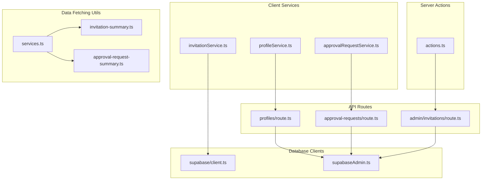
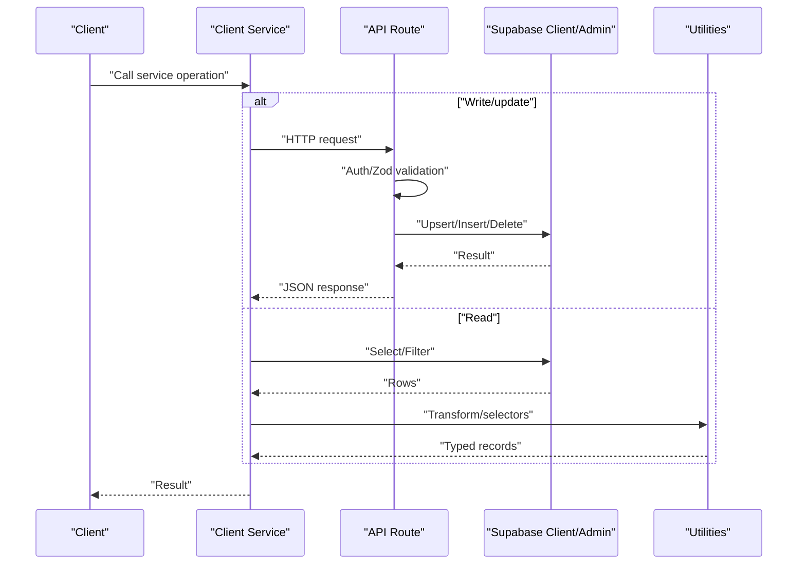
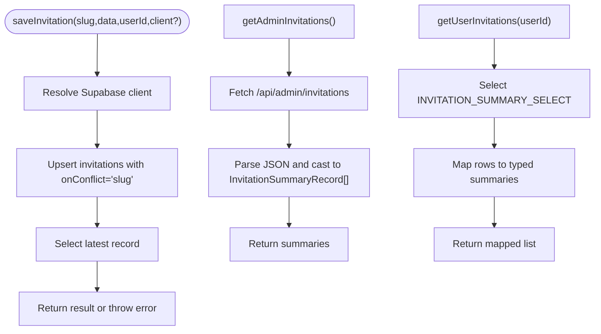
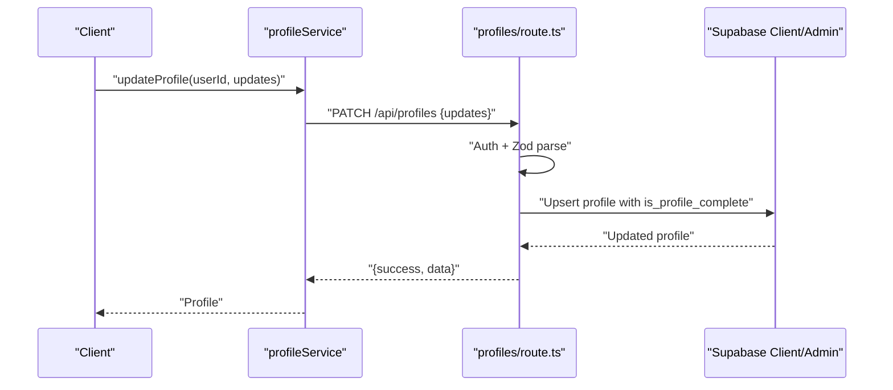
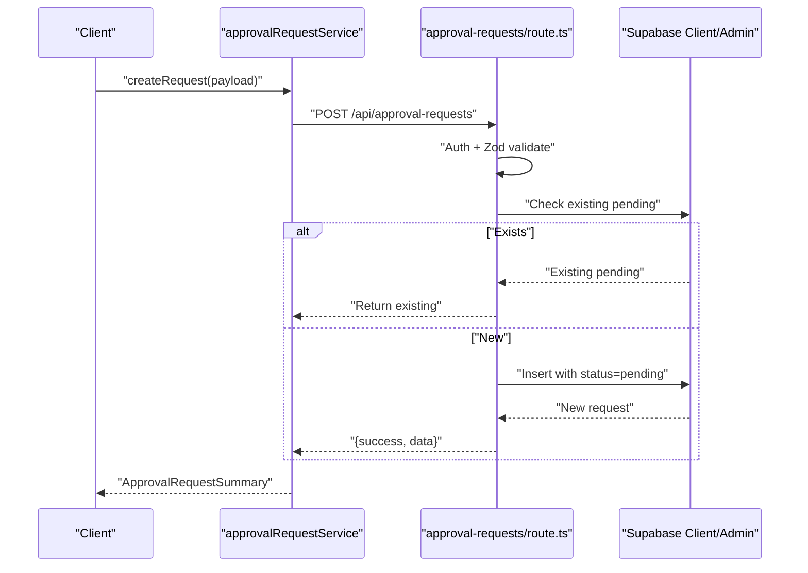
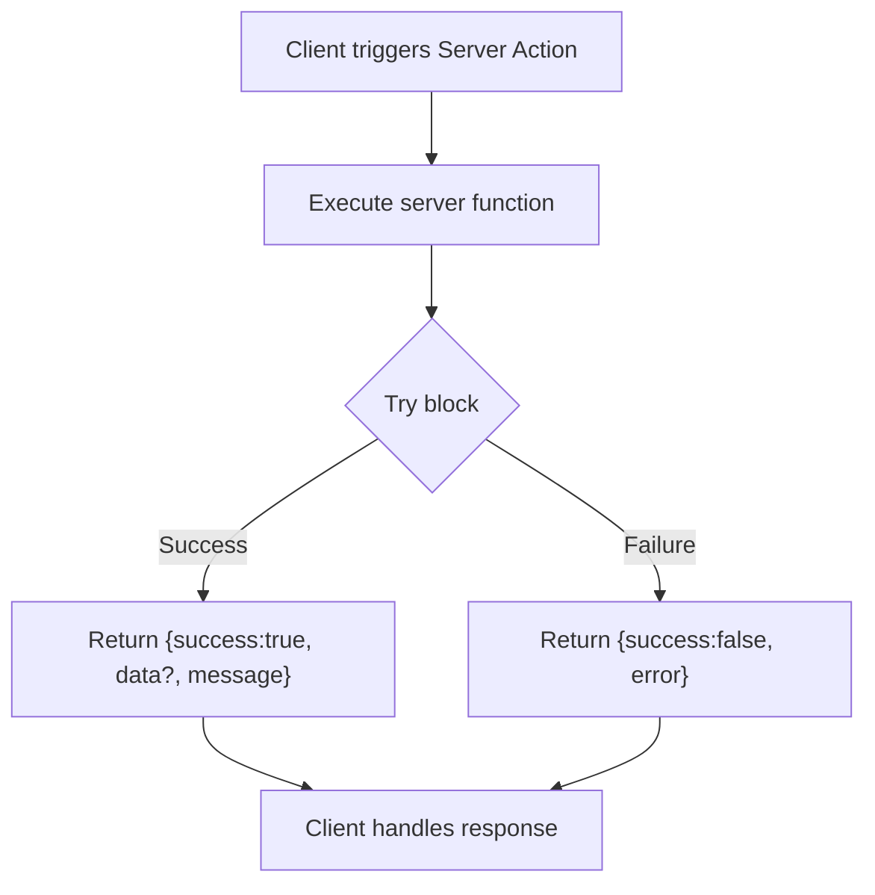
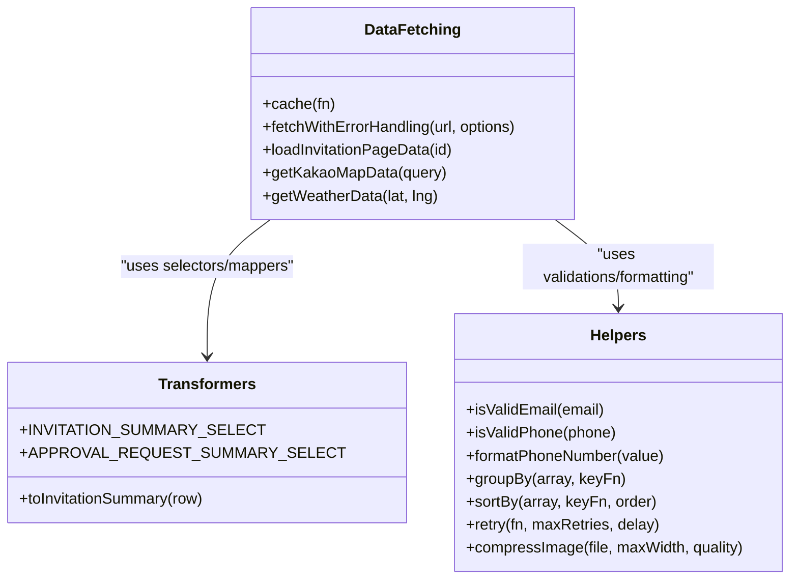
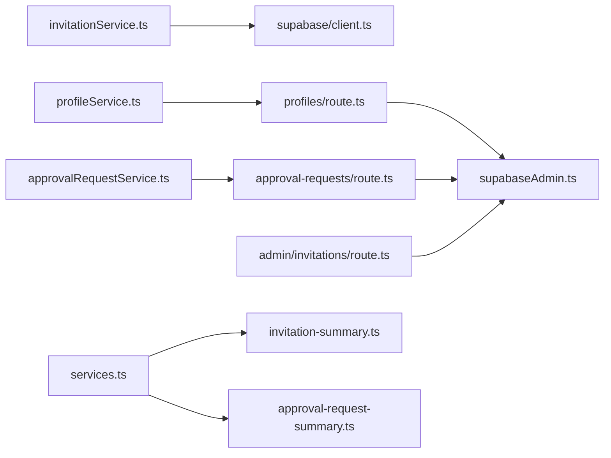

# Services Layer

<cite>
**Referenced Files in This Document**
- [invitationService.ts](file://src/services/invitationService.ts)
- [profileService.ts](file://src/services/profileService.ts)
- [approvalRequestService.ts](file://src/services/approvalRequestService.ts)
- [actions.ts](file://src/lib/actions.ts)
- [services.ts](file://src/lib/services.ts)
- [route.ts](file://src/app/api/profiles/route.ts)
- [route.ts](file://src/app/api/approval-requests/route.ts)
- [route.ts](file://src/app/api/admin/invitations/route.ts)
- [client.ts](file://src/lib/supabase/client.ts)
- [supabaseAdmin.ts](file://src/lib/supabaseAdmin.ts)
- [invitation-summary.ts](file://src/lib/invitation-summary.ts)
- [approval-request-summary.ts](file://src/lib/approval-request-summary.ts)
- [constants.ts](file://src/lib/constants.ts)
- [utils.ts](file://src/lib/utils.ts)
</cite>

## Table of Contents
1. [Introduction](#introduction)
2. [Project Structure](#project-structure)
3. [Core Components](#core-components)
4. [Architecture Overview](#architecture-overview)
5. [Detailed Component Analysis](#detailed-component-analysis)
6. [Dependency Analysis](#dependency-analysis)
7. [Performance Considerations](#performance-considerations)
8. [Troubleshooting Guide](#troubleshooting-guide)
9. [Conclusion](#conclusion)
10. [Appendices](#appendices)

## Introduction
This document explains the services layer responsible for business logic and data access patterns. It covers:
- Invitation service for CRUD operations and admin summaries
- Profile service for user profile retrieval and updates
- Approval request service for managing approval workflows
- Server actions pattern for secure data mutations
- Utility services and helpers supporting core operations
- Practical examples of service composition, error handling, and transaction management
- Integration with database clients, caching, and query optimization
- Testing patterns, mocking strategies, and performance monitoring
- Guidelines for extending the services layer while preserving separation of concerns

## Project Structure
The services layer is organized around three primary service modules and supporting libraries:
- Service modules: invitationService, profileService, approvalRequestService
- Server action utilities: actions for secure mutations
- Data-fetching utilities: optimized caching and parallel loading
- API routes: server-side endpoints implementing business logic and authorization
- Supabase clients: browser client and admin client for database access
- Shared DTOs and selectors for typed data transformation

**Diagram sources**
- [invitationService.ts](file://src/services/invitationService.ts#L1-L81)
- [profileService.ts](file://src/services/profileService.ts#L1-L101)
- [approvalRequestService.ts](file://src/services/approvalRequestService.ts#L1-L53)
- [actions.ts](file://src/lib/actions.ts#L1-L200)
- [services.ts](file://src/lib/services.ts#L1-L280)
- [route.ts](file://src/app/api/profiles/route.ts#L1-L125)
- [route.ts](file://src/app/api/approval-requests/route.ts#L1-L213)
- [route.ts](file://src/app/api/admin/invitations/route.ts#L1-L64)
- [client.ts](file://src/lib/supabase/client.ts#L1-L85)
- [supabaseAdmin.ts](file://src/lib/supabaseAdmin.ts#L1-L15)
- [invitation-summary.ts](file://src/lib/invitation-summary.ts#L1-L74)
- [approval-request-summary.ts](file://src/lib/approval-request-summary.ts#L1-L18)

**Section sources**
- [invitationService.ts](file://src/services/invitationService.ts#L1-L81)
- [profileService.ts](file://src/services/profileService.ts#L1-L101)
- [approvalRequestService.ts](file://src/services/approvalRequestService.ts#L1-L53)
- [actions.ts](file://src/lib/actions.ts#L1-L200)
- [services.ts](file://src/lib/services.ts#L1-L280)
- [route.ts](file://src/app/api/profiles/route.ts#L1-L125)
- [route.ts](file://src/app/api/approval-requests/route.ts#L1-L213)
- [route.ts](file://src/app/api/admin/invitations/route.ts#L1-L64)
- [client.ts](file://src/lib/supabase/client.ts#L1-L85)
- [supabaseAdmin.ts](file://src/lib/supabaseAdmin.ts#L1-L15)
- [invitation-summary.ts](file://src/lib/invitation-summary.ts#L1-L74)
- [approval-request-summary.ts](file://src/lib/approval-request-summary.ts#L1-L18)

## Core Components
- Invitation service: encapsulates saving, listing, retrieving, and deleting invitations; supports admin summaries via API and user-specific summaries via database queries.
- Profile service: retrieves and updates user profiles; exposes convenience checks for completeness and admin status; delegates updates to a server endpoint.
- Approval request service: creates, cancels, and lists approval requests; integrates with server endpoints for persistence and authorization.
- Server actions: provide secure mutation handlers executed on the server, returning structured responses and robust error handling.
- Data-fetching utilities: offer cached, parallelized data loading with request memoization and external service integrations.

**Section sources**
- [invitationService.ts](file://src/services/invitationService.ts#L9-L80)
- [profileService.ts](file://src/services/profileService.ts#L22-L100)
- [approvalRequestService.ts](file://src/services/approvalRequestService.ts#L13-L52)
- [actions.ts](file://src/lib/actions.ts#L3-L200)
- [services.ts](file://src/lib/services.ts#L7-L280)

## Architecture Overview
The services layer follows a clear separation:
- Client services orchestrate data access and transformations, delegating sensitive writes to server endpoints.
- Server endpoints enforce authentication, authorization, and validation before interacting with the database via Supabase clients.
- Admin operations use a dedicated service role client for privileged access.
- Data-fetching utilities leverage React cache and Next.js request memoization for performance.

**Diagram sources**
- [invitationService.ts](file://src/services/invitationService.ts#L10-L79)
- [profileService.ts](file://src/services/profileService.ts#L60-L81)
- [approvalRequestService.ts](file://src/services/approvalRequestService.ts#L14-L51)
- [route.ts](file://src/app/api/profiles/route.ts#L57-L124)
- [route.ts](file://src/app/api/approval-requests/route.ts#L17-L212)
- [client.ts](file://src/lib/supabase/client.ts#L41-L84)
- [supabaseAdmin.ts](file://src/lib/supabaseAdmin.ts#L7-L14)
- [invitation-summary.ts](file://src/lib/invitation-summary.ts#L1-L74)
- [approval-request-summary.ts](file://src/lib/approval-request-summary.ts#L1-L18)

## Detailed Component Analysis

### Invitation Service
Responsibilities:
- Save invitations with upsert semantics and conflict resolution
- List invitations with ordering
- Retrieve admin summaries via API
- Fetch user-specific summaries using PostgREST selectors and typed transformations
- Retrieve single invitation by slug
- Delete invitations by id

Key patterns:
- Optional client injection for testability and flexibility
- PostgREST JSON field selection and transformation for efficient reads
- Admin summaries fetched via a dedicated API route

**Diagram sources**
- [invitationService.ts](file://src/services/invitationService.ts#L10-L79)
- [invitation-summary.ts](file://src/lib/invitation-summary.ts#L1-L74)
- [route.ts](file://src/app/api/admin/invitations/route.ts#L8-L55)

**Section sources**
- [invitationService.ts](file://src/services/invitationService.ts#L9-L80)
- [invitation-summary.ts](file://src/lib/invitation-summary.ts#L1-L74)
- [route.ts](file://src/app/api/admin/invitations/route.ts#L1-L64)

### Profile Service
Responsibilities:
- Fetch profile by user id with resilient error handling
- Update profile via a server endpoint with Zod validation
- Convenience checks: profile completeness and admin status

Security and resilience:
- Graceful fallbacks for missing records and network errors
- Delegation of write operations to server endpoints for strict validation and auth

**Diagram sources**
- [profileService.ts](file://src/services/profileService.ts#L60-L81)
- [route.ts](file://src/app/api/profiles/route.ts#L57-L124)

**Section sources**
- [profileService.ts](file://src/services/profileService.ts#L22-L100)
- [route.ts](file://src/app/api/profiles/route.ts#L1-L125)

### Approval Request Service
Responsibilities:
- Create approval requests with deduplication for pending requests
- Cancel requests per invitation and user
- List all approval requests (admin-only)

Authorization and safety:
- Uses server endpoints to enforce auth and admin checks
- Prevents duplicate pending requests

**Diagram sources**
- [approvalRequestService.ts](file://src/services/approvalRequestService.ts#L14-L40)
- [route.ts](file://src/app/api/approval-requests/route.ts#L17-L89)

**Section sources**
- [approvalRequestService.ts](file://src/services/approvalRequestService.ts#L13-L52)
- [route.ts](file://src/app/api/approval-requests/route.ts#L1-L213)

### Server Actions Pattern
Purpose:
- Encapsulate secure, server-executed mutations with structured responses and centralized error handling.

Pattern highlights:
- Consistent response shape with success/error/message fields
- Centralized error logging and normalization
- Validation helpers for domain data
- Controlled side effects with timeouts for simulation

**Diagram sources**
- [actions.ts](file://src/lib/actions.ts#L3-L200)

**Section sources**
- [actions.ts](file://src/lib/actions.ts#L1-L200)

### Utility Services and Helpers
- Data-fetching utilities:
  - Cached fetch wrappers with request memoization and tags
  - Parallel loading with settled promises
  - External integrations (maps/weather) with caching and error handling
- Data transformation:
  - Invitation summary selectors and typed mappers
  - Approval request summary selectors
- General helpers:
  - Validation utilities, formatting, grouping, sorting, retry logic, image compression, device detection

**Diagram sources**
- [services.ts](file://src/lib/services.ts#L7-L280)
- [invitation-summary.ts](file://src/lib/invitation-summary.ts#L1-L74)
- [approval-request-summary.ts](file://src/lib/approval-request-summary.ts#L1-L18)
- [utils.ts](file://src/lib/utils.ts#L54-L294)

**Section sources**
- [services.ts](file://src/lib/services.ts#L1-L280)
- [invitation-summary.ts](file://src/lib/invitation-summary.ts#L1-L74)
- [approval-request-summary.ts](file://src/lib/approval-request-summary.ts#L1-L18)
- [utils.ts](file://src/lib/utils.ts#L1-L294)

## Dependency Analysis
- Client services depend on:
  - Browser Supabase client for read/write operations
  - API routes for profile updates and approval requests
  - Data transformation utilities for typed records
- API routes depend on:
  - Supabase admin client for privileged operations
  - Authentication guard and Zod validation
- Data-fetching utilities depend on:
  - Next.js cache and request tags
  - Environment variables for external services

**Diagram sources**
- [invitationService.ts](file://src/services/invitationService.ts#L1-L81)
- [profileService.ts](file://src/services/profileService.ts#L1-L101)
- [approvalRequestService.ts](file://src/services/approvalRequestService.ts#L1-L53)
- [route.ts](file://src/app/api/profiles/route.ts#L1-L125)
- [route.ts](file://src/app/api/approval-requests/route.ts#L1-L213)
- [route.ts](file://src/app/api/admin/invitations/route.ts#L1-L64)
- [client.ts](file://src/lib/supabase/client.ts#L1-L85)
- [supabaseAdmin.ts](file://src/lib/supabaseAdmin.ts#L1-L15)
- [services.ts](file://src/lib/services.ts#L1-L280)
- [invitation-summary.ts](file://src/lib/invitation-summary.ts#L1-L74)
- [approval-request-summary.ts](file://src/lib/approval-request-summary.ts#L1-L18)

**Section sources**
- [client.ts](file://src/lib/supabase/client.ts#L1-L85)
- [supabaseAdmin.ts](file://src/lib/supabaseAdmin.ts#L1-L15)
- [services.ts](file://src/lib/services.ts#L1-L280)

## Performance Considerations
- Request memoization and caching:
  - Use cached fetch wrappers for repeated reads
  - Configure revalidation intervals and tags for optimal freshness
- Parallel loading:
  - Load multiple resources concurrently and handle partial failures
- Database selectors:
  - Use targeted PostgREST selects to minimize payload sizes
  - Transform JSON fields server-side when possible
- External services:
  - Cache map and weather responses with appropriate TTLs
- Client initialization:
  - Reuse Supabase client instances and refresh tokens efficiently

**Section sources**
- [services.ts](file://src/lib/services.ts#L28-L121)
- [constants.ts](file://src/lib/constants.ts#L91-L103)
- [invitation-summary.ts](file://src/lib/invitation-summary.ts#L1-L15)
- [client.ts](file://src/lib/supabase/client.ts#L41-L84)

## Troubleshooting Guide
Common scenarios and strategies:
- Authentication failures:
  - Verify session presence and user id in server endpoints
  - Ensure proper auth guards before database access
- Validation errors:
  - Zod parsing errors return structured 400 responses with details
- Network and client errors:
  - Profile fetches return null on various error conditions to avoid crashes
  - Use retry utilities for transient failures
- Admin access:
  - Admin checks fall back to profile lookup if email-based flag is not sufficient
- Error normalization:
  - Server actions centralize error reporting and logging

**Section sources**
- [route.ts](file://src/app/api/profiles/route.ts#L14-L54)
- [route.ts](file://src/app/api/approval-requests/route.ts#L91-L146)
- [route.ts](file://src/app/api/admin/invitations/route.ts#L8-L30)
- [profileService.ts](file://src/services/profileService.ts#L26-L52)
- [utils.ts](file://src/lib/utils.ts#L155-L174)
- [actions.ts](file://src/lib/actions.ts#L191-L200)

## Conclusion
The services layer cleanly separates client-side convenience and resilience from server-side enforcement and privileged operations. It leverages caching, typed transformations, and robust error handling to deliver a reliable, maintainable foundation for business logic and data access.

## Appendices

### Service Composition Examples
- Compose invitation summaries with admin filters and user-specific lists
- Chain profile completeness checks before enabling advanced features
- Combine approval request creation with invitation state updates

**Section sources**
- [invitationService.ts](file://src/services/invitationService.ts#L37-L57)
- [profileService.ts](file://src/services/profileService.ts#L86-L91)
- [route.ts](file://src/app/api/approval-requests/route.ts#L173-L201)

### Transaction Management Notes
- Current implementation performs multiple operations across separate calls; consider wrapping critical sequences in a single server endpoint to ensure atomicity
- Use server actions or API routes to coordinate updates and rollbacks where necessary

**Section sources**
- [route.ts](file://src/app/api/approval-requests/route.ts#L173-L201)

### Testing Patterns and Mocking Strategies
- Mock Supabase client for unit tests of client services
- Stub API routes for integration tests
- Use cached fetch wrappers with deterministic responses in tests
- Validate server action responses with snapshot-style assertions

**Section sources**
- [client.ts](file://src/lib/supabase/client.ts#L41-L84)
- [services.ts](file://src/lib/services.ts#L28-L72)
- [actions.ts](file://src/lib/actions.ts#L10-L27)

### Performance Monitoring
- Instrument server endpoints with metrics for latency and error rates
- Track cache hit ratios and revalidation effectiveness
- Monitor external service call durations and failure rates

[No sources needed since this section provides general guidance]