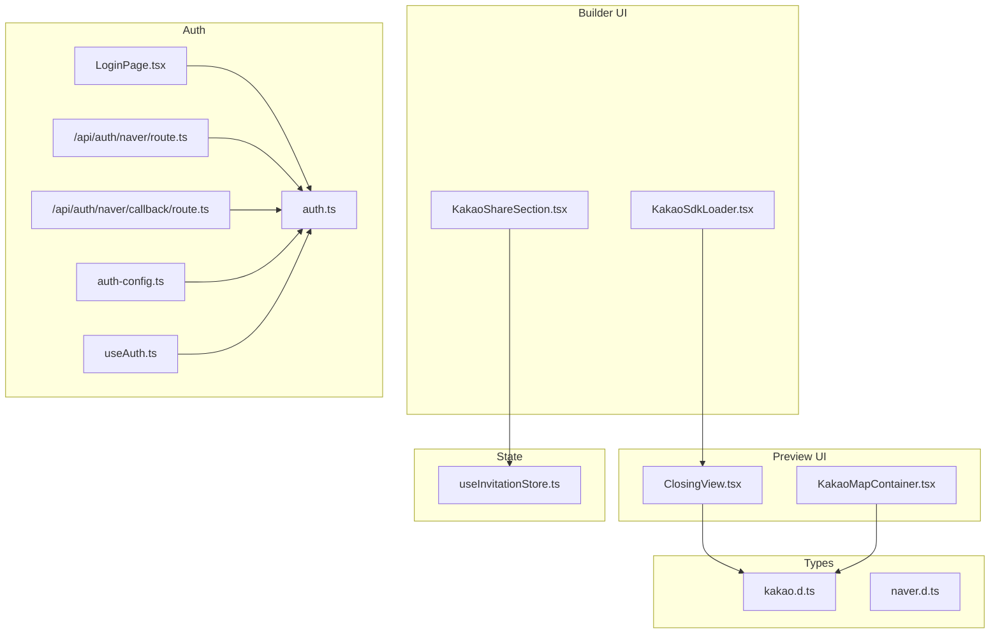
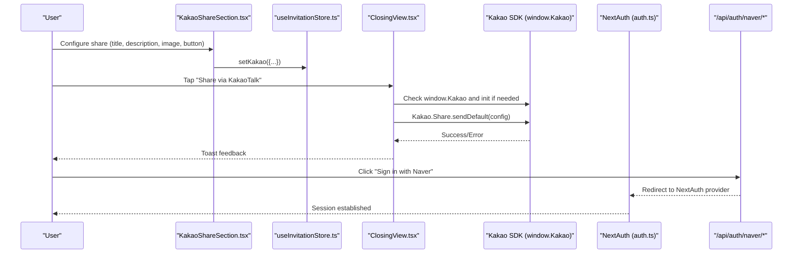
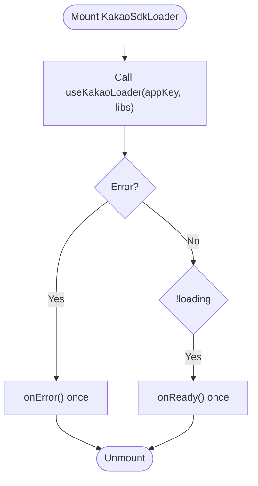
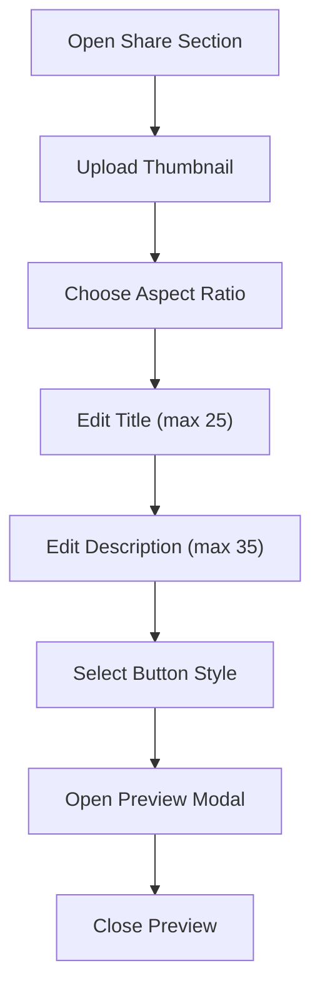
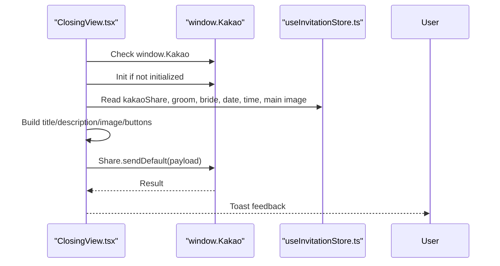
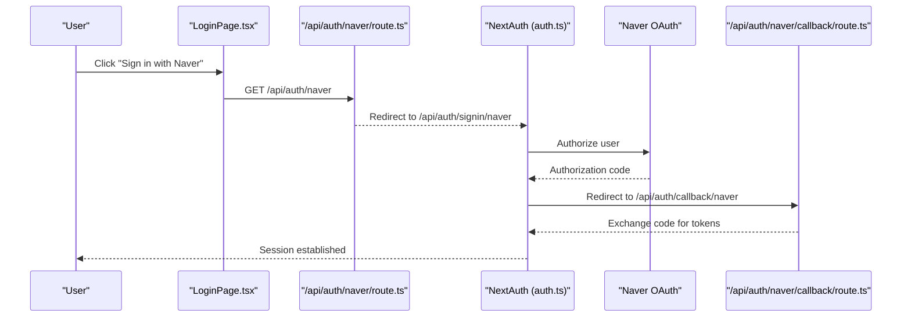
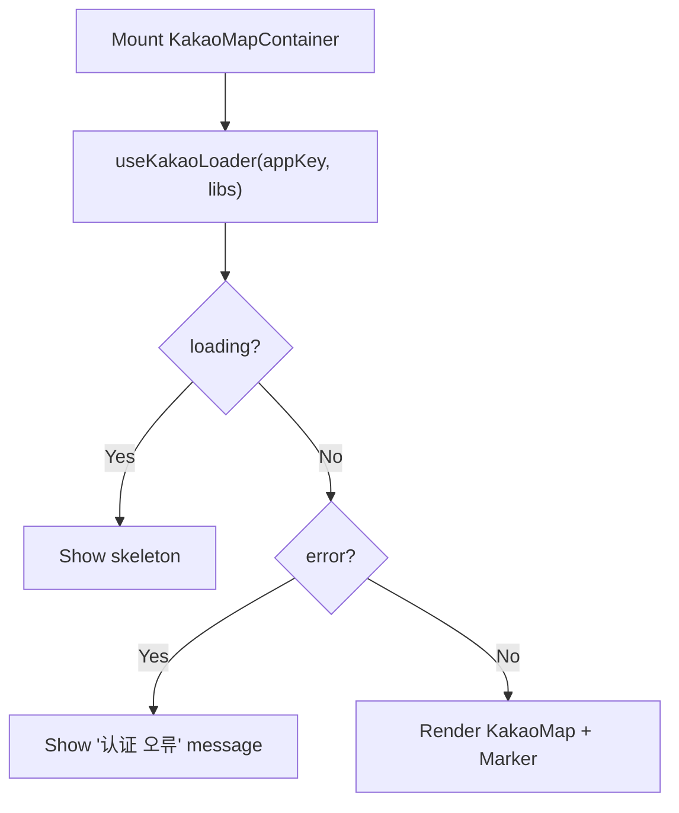
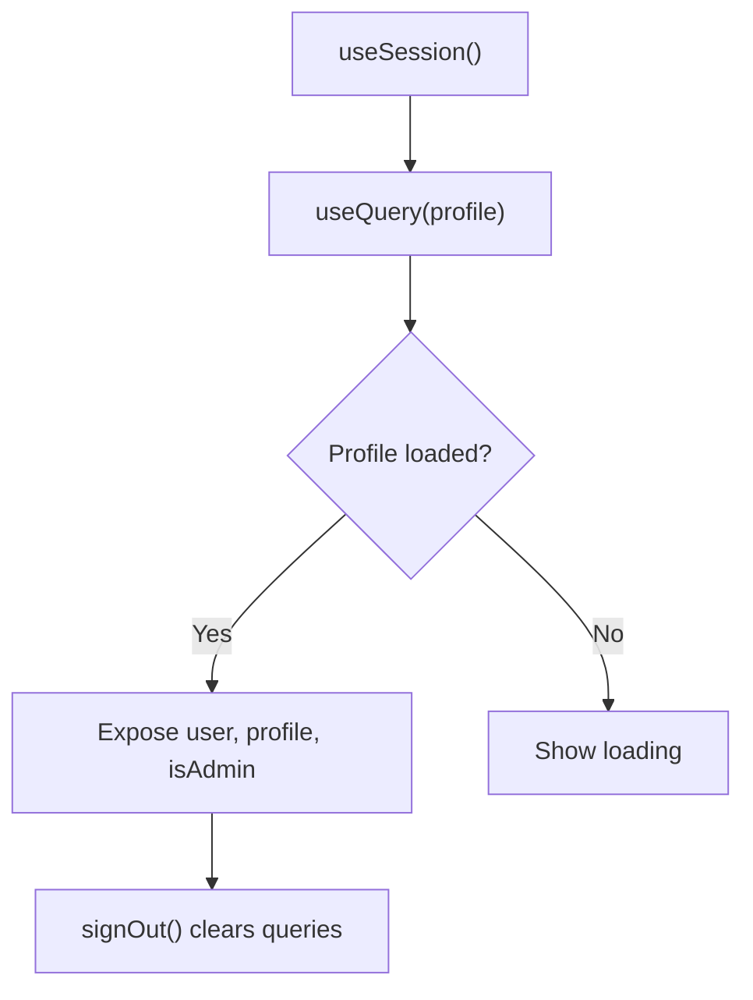
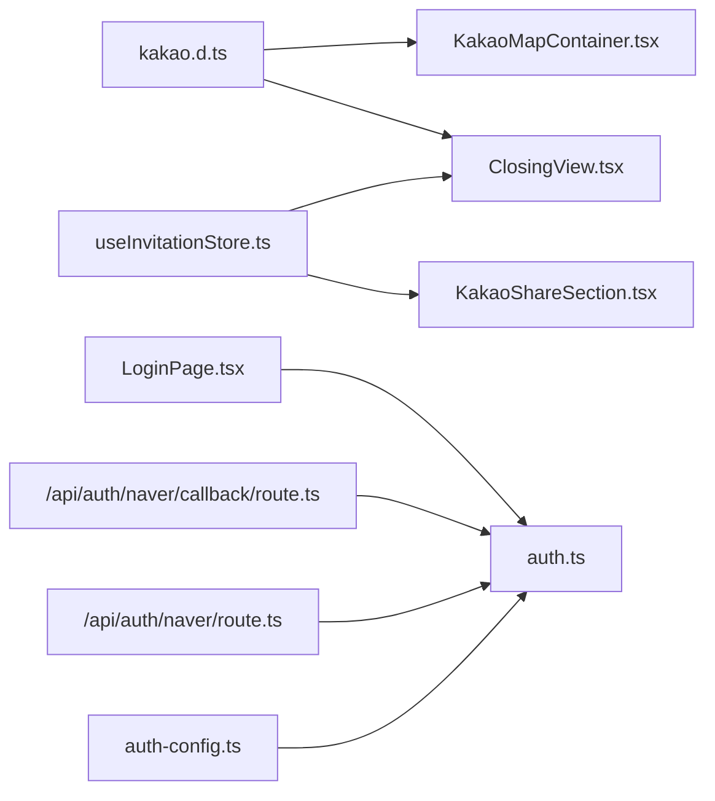

# Social Integration

<cite>
**Referenced Files in This Document**
- [KakaoSdkLoader.tsx](file://src/components/builder/sections/KakaoSdkLoader.tsx)
- [KakaoShareSection.tsx](file://src/components/builder/sections/KakaoShareSection.tsx)
- [ClosingView.tsx](file://src/components/preview/sections/ClosingView.tsx)
- [KakaoMapContainer.tsx](file://src/components/preview/sections/maps/KakaoMapContainer.tsx)
- [kakao.d.ts](file://src/types/kakao.d.ts)
- [naver.d.ts](file://src/types/naver.d.ts)
- [auth-config.ts](file://src/auth-config.ts)
- [auth.ts](file://src/auth.ts)
- [useAuth.ts](file://src/hooks/useAuth.ts)
- [route.ts](file://src/app/api/auth/naver/route.ts)
- [callback/route.ts](file://src/app/api/auth/naver/callback/route.ts)
- [LoginPage.tsx](file://src/app/login/LoginPage.tsx)
- [useInvitationStore.ts](file://src/store/useInvitationStore.ts)
</cite>

## Table of Contents
1. [Introduction](#introduction)
2. [Project Structure](#project-structure)
3. [Core Components](#core-components)
4. [Architecture Overview](#architecture-overview)
5. [Detailed Component Analysis](#detailed-component-analysis)
6. [Dependency Analysis](#dependency-analysis)
7. [Performance Considerations](#performance-considerations)
8. [Troubleshooting Guide](#troubleshooting-guide)
9. [Conclusion](#conclusion)

## Introduction
This document explains the social integration system for KakaoTalk sharing and Naver authentication. It covers:
- Kakao SDK integration for social sharing, including thumbnail configuration, share dialog management, and SDK loader patterns
- Naver OAuth implementation and its integration with the authentication system
- Mobile-first sharing experience and how invitations are optimized for social platforms
- Practical examples of share configuration, custom message templates, and analytics tracking
- Cross-platform compatibility, fallback mechanisms, and performance optimization
- Troubleshooting guidance for SDK initialization and sharing permission issues

## Project Structure
The social integration spans UI builder components, preview components, authentication configuration, and type definitions for Kakao/Naver SDKs.

**Diagram sources**
- [KakaoSdkLoader.tsx](file://src/components/builder/sections/KakaoSdkLoader.tsx#L1-L33)
- [KakaoShareSection.tsx](file://src/components/builder/sections/KakaoShareSection.tsx#L1-L153)
- [ClosingView.tsx](file://src/components/preview/sections/ClosingView.tsx#L1-L197)
- [KakaoMapContainer.tsx](file://src/components/preview/sections/maps/KakaoMapContainer.tsx#L1-L54)
- [auth-config.ts](file://src/auth-config.ts#L1-L227)
- [auth.ts](file://src/auth.ts#L1-L5)
- [useAuth.ts](file://src/hooks/useAuth.ts#L1-L55)
- [route.ts](file://src/app/api/auth/naver/route.ts#L1-L10)
- [callback/route.ts](file://src/app/api/auth/naver/callback/route.ts#L1-L10)
- [LoginPage.tsx](file://src/app/login/LoginPage.tsx#L97-L121)
- [kakao.d.ts](file://src/types/kakao.d.ts#L268-L304)
- [naver.d.ts](file://src/types/naver.d.ts#L410-L416)
- [useInvitationStore.ts](file://src/store/useInvitationStore.ts#L456-L467)

**Section sources**
- [KakaoSdkLoader.tsx](file://src/components/builder/sections/KakaoSdkLoader.tsx#L1-L33)
- [KakaoShareSection.tsx](file://src/components/builder/sections/KakaoShareSection.tsx#L1-L153)
- [ClosingView.tsx](file://src/components/preview/sections/ClosingView.tsx#L1-L197)
- [KakaoMapContainer.tsx](file://src/components/preview/sections/maps/KakaoMapContainer.tsx#L1-L54)
- [auth-config.ts](file://src/auth-config.ts#L1-L227)
- [auth.ts](file://src/auth.ts#L1-L5)
- [useAuth.ts](file://src/hooks/useAuth.ts#L1-L55)
- [route.ts](file://src/app/api/auth/naver/route.ts#L1-L10)
- [callback/route.ts](file://src/app/api/auth/naver/callback/route.ts#L1-L10)
- [LoginPage.tsx](file://src/app/login/LoginPage.tsx#L97-L121)
- [kakao.d.ts](file://src/types/kakao.d.ts#L268-L304)
- [naver.d.ts](file://src/types/naver.d.ts#L410-L416)
- [useInvitationStore.ts](file://src/store/useInvitationStore.ts#L456-L467)

## Core Components
- Kakao SDK Loader: Dynamically loads Kakao SDK with service libraries and notifies readiness or errors via callbacks.
- Kakao Share Section: Allows configuring share thumbnail, aspect ratio, title, description, and button style for KakaoTalk sharing.
- Closing View: Implements the mobile-first share experience with KakaoTalk and generic link copy actions.
- Kakao Map Container: Demonstrates SDK loader usage for map rendering with skeleton/error fallbacks.
- Naver OAuth: NextAuth providers for Naver, including profile mapping and database upsert logic.
- Authentication Hooks: Session and profile management for logged-in users.
- Store: Centralized state for Kakao share configuration persisted in IndexedDB.

**Section sources**
- [KakaoSdkLoader.tsx](file://src/components/builder/sections/KakaoSdkLoader.tsx#L11-L32)
- [KakaoShareSection.tsx](file://src/components/builder/sections/KakaoShareSection.tsx#L22-L98)
- [ClosingView.tsx](file://src/components/preview/sections/ClosingView.tsx#L63-L116)
- [KakaoMapContainer.tsx](file://src/components/preview/sections/maps/KakaoMapContainer.tsx#L15-L52)
- [auth-config.ts](file://src/auth-config.ts#L40-L78)
- [useAuth.ts](file://src/hooks/useAuth.ts#L9-L54)
- [useInvitationStore.ts](file://src/store/useInvitationStore.ts#L456-L467)

## Architecture Overview
The system integrates KakaoTalk sharing and Naver authentication across client-side UI and server-side auth providers.

**Diagram sources**
- [KakaoShareSection.tsx](file://src/components/builder/sections/KakaoShareSection.tsx#L22-L98)
- [useInvitationStore.ts](file://src/store/useInvitationStore.ts#L456-L467)
- [ClosingView.tsx](file://src/components/preview/sections/ClosingView.tsx#L63-L116)
- [auth.ts](file://src/auth.ts#L1-L5)
- [route.ts](file://src/app/api/auth/naver/route.ts#L5-L8)

## Detailed Component Analysis

### Kakao SDK Loader Pattern
- Loads Kakao SDK with required libraries and exposes ready/error callbacks.
- Prevents duplicate notifications using a ref guard.
- Environment-driven app key and library selection.

**Diagram sources**
- [KakaoSdkLoader.tsx](file://src/components/builder/sections/KakaoSdkLoader.tsx#L11-L32)

**Section sources**
- [KakaoSdkLoader.tsx](file://src/components/builder/sections/KakaoSdkLoader.tsx#L11-L32)

### Kakao Share Configuration and Preview
- Thumbnail upload with portrait/landscape aspect ratio selection.
- Title and description inputs with length constraints.
- Button style selection: location, RSVP, or none.
- Live preview modal mirrors the feed card shown in KakaoTalk.

**Diagram sources**
- [KakaoShareSection.tsx](file://src/components/builder/sections/KakaoShareSection.tsx#L44-L98)

**Section sources**
- [KakaoShareSection.tsx](file://src/components/builder/sections/KakaoShareSection.tsx#L22-L153)
- [useInvitationStore.ts](file://src/store/useInvitationStore.ts#L456-L467)

### KakaoTalk Sharing Implementation
- Validates SDK presence and initializes if needed.
- Builds share payload from store and defaults.
- Handles absolute image URLs and optional buttons.
- Uses try/catch and toast feedback for robust UX.

**Diagram sources**
- [ClosingView.tsx](file://src/components/preview/sections/ClosingView.tsx#L63-L116)
- [useInvitationStore.ts](file://src/store/useInvitationStore.ts#L456-L467)

**Section sources**
- [ClosingView.tsx](file://src/components/preview/sections/ClosingView.tsx#L63-L116)
- [kakao.d.ts](file://src/types/kakao.d.ts#L271-L304)

### Naver OAuth Integration
- NextAuth providers configured for Naver with explicit scopes and profile mapping.
- Redirect routes forward to NextAuth’s internal handlers.
- Callback routes normalize query parameters for NextAuth.

**Diagram sources**
- [LoginPage.tsx](file://src/app/login/LoginPage.tsx#L109-L120)
- [route.ts](file://src/app/api/auth/naver/route.ts#L5-L8)
- [callback/route.ts](file://src/app/api/auth/naver/callback/route.ts#L5-L8)
- [auth.ts](file://src/auth.ts#L1-L5)

**Section sources**
- [auth-config.ts](file://src/auth-config.ts#L40-L78)
- [route.ts](file://src/app/api/auth/naver/route.ts#L1-L10)
- [callback/route.ts](file://src/app/api/auth/naver/callback/route.ts#L1-L10)
- [auth.ts](file://src/auth.ts#L1-L5)

### Kakao Map Container (SDK Loader Example)
- Demonstrates SDK loader usage with skeleton/error fallbacks.
- Converts zoom levels to Kakao map levels.

**Diagram sources**
- [KakaoMapContainer.tsx](file://src/components/preview/sections/maps/KakaoMapContainer.tsx#L15-L52)

**Section sources**
- [KakaoMapContainer.tsx](file://src/components/preview/sections/maps/KakaoMapContainer.tsx#L15-L52)

### Authentication Hooks and Profile Upsert
- Session and profile queries with caching and refresh helpers.
- Admin credentials and social login profile upsert logic persists user metadata.

**Diagram sources**
- [useAuth.ts](file://src/hooks/useAuth.ts#L9-L54)
- [auth-config.ts](file://src/auth-config.ts#L131-L218)

**Section sources**
- [useAuth.ts](file://src/hooks/useAuth.ts#L9-L54)
- [auth-config.ts](file://src/auth-config.ts#L131-L218)

## Dependency Analysis
- Kakao SDK types define the global window.Kakao interface and share options.
- Kakao share logic depends on store-managed configuration and preview UI.
- Naver OAuth depends on NextAuth providers and redirect routes.
- Kakao map container reuses the same SDK loader pattern.

**Diagram sources**
- [kakao.d.ts](file://src/types/kakao.d.ts#L268-L304)
- [ClosingView.tsx](file://src/components/preview/sections/ClosingView.tsx#L63-L116)
- [KakaoMapContainer.tsx](file://src/components/preview/sections/maps/KakaoMapContainer.tsx#L15-L52)
- [useInvitationStore.ts](file://src/store/useInvitationStore.ts#L456-L467)
- [auth-config.ts](file://src/auth-config.ts#L40-L78)
- [auth.ts](file://src/auth.ts#L1-L5)
- [route.ts](file://src/app/api/auth/naver/route.ts#L5-L8)
- [callback/route.ts](file://src/app/api/auth/naver/callback/route.ts#L5-L8)
- [LoginPage.tsx](file://src/app/login/LoginPage.tsx#L109-L120)

**Section sources**
- [kakao.d.ts](file://src/types/kakao.d.ts#L268-L304)
- [ClosingView.tsx](file://src/components/preview/sections/ClosingView.tsx#L63-L116)
- [KakaoMapContainer.tsx](file://src/components/preview/sections/maps/KakaoMapContainer.tsx#L15-L52)
- [useInvitationStore.ts](file://src/store/useInvitationStore.ts#L456-L467)
- [auth-config.ts](file://src/auth-config.ts#L40-L78)
- [auth.ts](file://src/auth.ts#L1-L5)
- [route.ts](file://src/app/api/auth/naver/route.ts#L5-L8)
- [callback/route.ts](file://src/app/api/auth/naver/callback/route.ts#L5-L8)
- [LoginPage.tsx](file://src/app/login/LoginPage.tsx#L109-L120)

## Performance Considerations
- SDK lazy-loading: Use dynamic imports and loaders to avoid blocking initial render.
- Store persistence: IndexedDB-backed store reduces memory pressure for large assets.
- Image handling: Normalize image URLs to absolute paths to prevent CSP issues.
- Toast feedback: Provide immediate user feedback to reduce retries and improve perceived performance.
- Map zoom conversion: Precompute map levels to avoid repeated calculations.

[No sources needed since this section provides general guidance]

## Troubleshooting Guide
Common issues and resolutions:
- SDK Initialization Failures
  - Symptoms: “Kakao SDK loading” warnings or share disabled.
  - Causes: Missing NEXT_PUBLIC_KAKAO_APP_KEY, ad-blockers, or network errors.
  - Resolution: Verify environment variable, whitelist Kakao domains, and ensure loader callbacks fire.

- Share Dialog Not Appearing
  - Symptoms: No error toast but nothing happens.
  - Causes: window.Kakao.Share.sendDefault missing or blocked.
  - Resolution: Confirm SDK initialization, check browser console for errors, and verify image URL accessibility.

- Naver OAuth Redirect Loop
  - Symptoms: Redirects to /api/auth/signin/naver repeatedly.
  - Causes: Incorrect client credentials or mismatched redirect URIs.
  - Resolution: Validate NAVER_CLIENT_ID/SECRET and ensure NextAuth trustHost is configured.

- Profile Upsert Errors
  - Symptoms: Users log in but profile not saved.
  - Causes: Supabase schema mismatch or network issues.
  - Resolution: Check next_auth/public schema permissions and retry profile upsert.

- Map Rendering Fails
  - Symptoms: “Cannot load Kakao map” message.
  - Causes: SDK loader error or invalid app key.
  - Resolution: Confirm loader libraries and app key; verify CORS and network access.

**Section sources**
- [KakaoSdkLoader.tsx](file://src/components/builder/sections/KakaoSdkLoader.tsx#L18-L29)
- [ClosingView.tsx](file://src/components/preview/sections/ClosingView.tsx#L63-L116)
- [auth-config.ts](file://src/auth-config.ts#L11-L13)
- [auth-config.ts](file://src/auth-config.ts#L131-L218)
- [KakaoMapContainer.tsx](file://src/components/preview/sections/maps/KakaoMapContainer.tsx#L34-L40)

## Conclusion
The social integration system combines a robust Kakao SDK loader, configurable share UI, and Naver OAuth through NextAuth. The preview component delivers a mobile-first sharing experience with immediate feedback, while the builder section enables fine-grained customization of share content. The architecture emphasizes performance, resilience, and developer clarity through typed SDK interfaces and centralized state management.