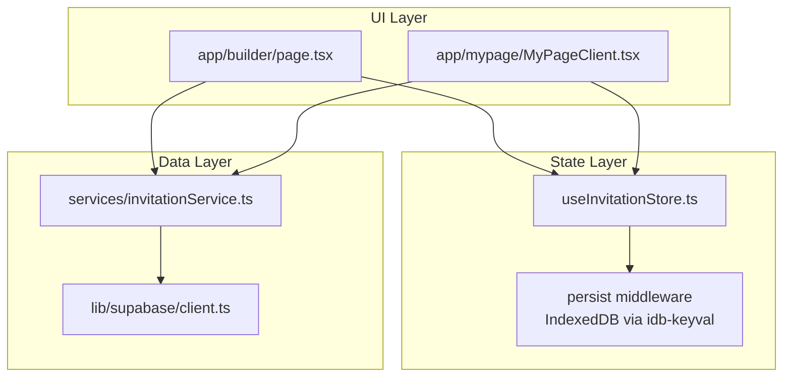
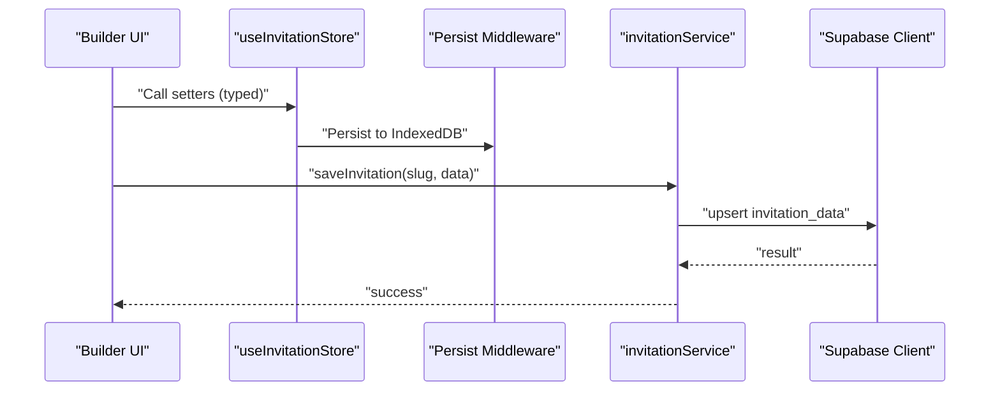
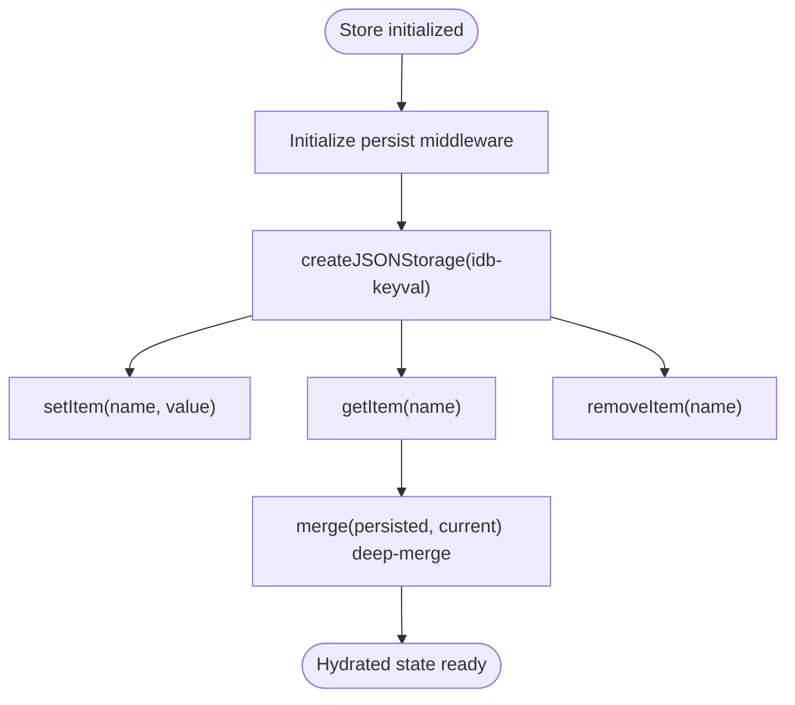
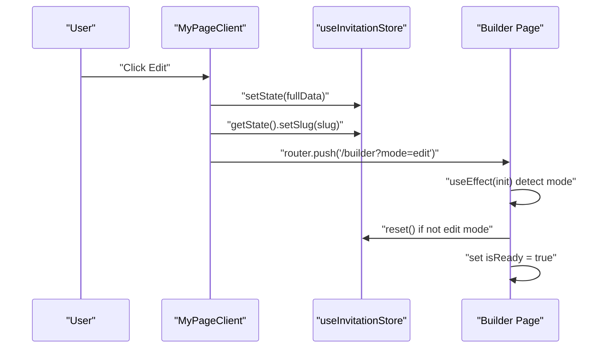
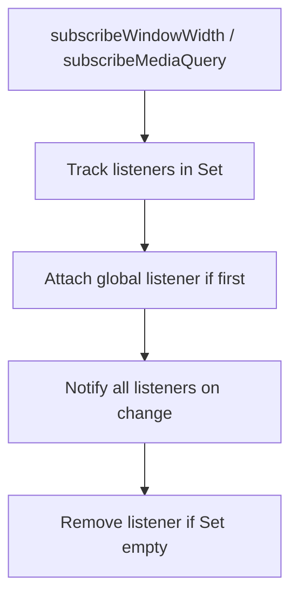
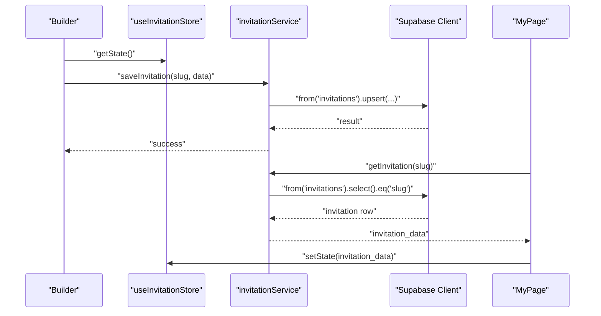
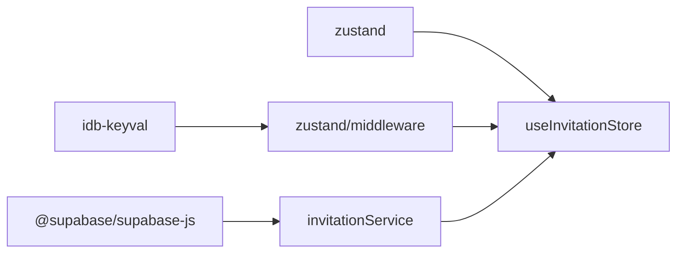

# State Management

<cite>
**Referenced Files in This Document**
- [useInvitationStore.ts](file://src/store/useInvitationStore.ts)
- [page.tsx](file://src/app/builder/page.tsx)
- [MyPageClient.tsx](file://src/app/mypage/MyPageClient.tsx)
- [client-subscriptions.ts](file://src/lib/client-subscriptions.ts)
- [invitationService.ts](file://src/services/invitationService.ts)
- [client.ts](file://src/lib/supabase/client.ts)
- [package.json](file://package.json)
- [ARCHITECTURE.md](file://ARCHITECTURE.md)
</cite>

## Table of Contents
1. [Introduction](#introduction)
2. [Project Structure](#project-structure)
3. [Core Components](#core-components)
4. [Architecture Overview](#architecture-overview)
5. [Detailed Component Analysis](#detailed-component-analysis)
6. [Dependency Analysis](#dependency-analysis)
7. [Performance Considerations](#performance-considerations)
8. [Troubleshooting Guide](#troubleshooting-guide)
9. [Conclusion](#conclusion)

## Introduction
This document explains the state management system built with Zustand for the wedding invitation builder. It covers the useInvitationStore architecture, IndexedDB persistence via zustand/persist and idb-keyval, URL-based mode differentiation for edit vs create workflows, client subscription utilities for responsive UI, and practical patterns for selectors, hydration, error handling, and debugging. It also outlines how the system persists state across browser sessions and integrates with Supabase for data synchronization.

## Project Structure
The state management is centered around a single Zustand store that encapsulates the entire invitation model and exposes typed setters for each domain. Persistence is handled by zustand/persist with IndexedDB-backed storage. Pages coordinate workflows via URL query parameters and selectors to minimize re-renders.

**Diagram sources**
- [useInvitationStore.ts](file://src/store/useInvitationStore.ts#L373-L533)
- [page.tsx](file://src/app/builder/page.tsx#L42-L127)
- [MyPageClient.tsx](file://src/app/mypage/MyPageClient.tsx#L133-L145)
- [invitationService.ts](file://src/services/invitationService.ts#L9-L24)
- [client.ts](file://src/lib/supabase/client.ts#L41-L84)

**Section sources**
- [useInvitationStore.ts](file://src/store/useInvitationStore.ts#L1-L534)
- [page.tsx](file://src/app/builder/page.tsx#L1-L232)
- [MyPageClient.tsx](file://src/app/mypage/MyPageClient.tsx#L1-L604)
- [invitationService.ts](file://src/services/invitationService.ts#L1-L81)
- [client.ts](file://src/lib/supabase/client.ts#L1-L85)

## Core Components
- useInvitationStore: A Zustand store with:
  - Strongly typed state shape covering all invitation sections (basic info, event info, theme, gallery, accounts, main screen, closing, sharing, etc.)
  - Action setters for each domain
  - Persist middleware with IndexedDB-backed storage via idb-keyval
  - Deep merge strategy for nested objects during hydration
- Builder Page: Orchestrates create/edit modes via URL query parameter, guards initialization, and saves state to Supabase.
- MyPage Client: Loads full invitation data, sets it into the store, and navigates to edit mode.
- Client Subscriptions: Lightweight utilities for responsive UI subscriptions (window width and media queries).
- Supabase Client: Browser-side client factory with token caching and lazy module loading.

**Section sources**
- [useInvitationStore.ts](file://src/store/useInvitationStore.ts#L4-L230)
- [useInvitationStore.ts](file://src/store/useInvitationStore.ts#L373-L533)
- [page.tsx](file://src/app/builder/page.tsx#L42-L127)
- [MyPageClient.tsx](file://src/app/mypage/MyPageClient.tsx#L133-L145)
- [client-subscriptions.ts](file://src/lib/client-subscriptions.ts#L1-L94)
- [client.ts](file://src/lib/supabase/client.ts#L41-L84)

## Architecture Overview
The system follows a unidirectional data flow:
- UI components update the Zustand store via typed actions.
- The store persists to IndexedDB automatically via the persist middleware.
- On save, the store’s current state is serialized and upserted into Supabase.
- On load, full invitation data is fetched from Supabase and hydrated into the store.

**Diagram sources**
- [useInvitationStore.ts](file://src/store/useInvitationStore.ts#L373-L533)
- [page.tsx](file://src/app/builder/page.tsx#L87-L127)
- [invitationService.ts](file://src/services/invitationService.ts#L10-L24)
- [client.ts](file://src/lib/supabase/client.ts#L41-L84)

## Detailed Component Analysis

### useInvitationStore: State Structure, Actions, and Middleware
- State structure:
  - Nested domains: basic info, event info, theme, gallery, accounts, main screen, closing, sharing, license approval, and UI flags.
  - Primitive and object fields with strict typing for enums and shapes.
- Actions:
  - Field-specific setters for each domain (e.g., setGroom, setBride, setTheme, setMainScreen, setAccounts).
  - Utility setters (e.g., reset, setEditingSection, setIsUploading).
  - Deep partial updates for nested objects (e.g., theme, mainScreen, groom/bride parents).
- Middleware:
  - Persist with IndexedDB via idb-keyval for large payloads (gallery images).
  - Custom merge function ensures backward compatibility when adding new fields.
  - Storage adapter implements getItem/setItem/removeItem using idb-keyval.

```mermaid
classDiagram
class InvitationState {
+groom
+bride
+useFlowerIcon
+order
+date
+time
+location
+address
+detailAddress
+mapType
+coordinates
+message
+greetingTitle
+greetingSubtitle
+imageUrl
+imageRatio
+greetingImage
+greetingRatio
+showNamesAtBottom
+enableFreeformNames
+groomNameCustom
+brideNameCustom
+mainScreen
+showCalendar
+showDday
+ddayMessage
+theme
+galleryTitle
+gallerySubtitle
+galleryType
+galleryPopup
+galleryPreview
+galleryFade
+galleryAutoplay
+gallery
+accountsTitle
+accountsSubtitle
+accountsDescription
+accountsGroomTitle
+accountsBrideTitle
+accountsColorMode
+accounts
+editingSection
+kakaoShare
+closing
+slug
+isApproved
+isRequestingApproval
+isUploading
}
class StoreActions {
+setGroom(data)
+setBride(data)
+setGroomParents(type, data)
+setBrideParents(type, data)
+setUseFlowerIcon(use)
+setOrder(order)
+setDate(date)
+setTime(time)
+setLocation(location)
+setAddress(address)
+setDetailAddress(detail)
+setCoordinates(lat, lng)
+setLocationTitle(title)
+setLocationSubtitle(subtitle)
+setLocationContact(contact)
+setShowMap(show)
+setLockMap(lock)
+setShowNavigation(show)
+setMapHeight(height)
+setMapZoom(zoom)
+setMapType(type)
+setShowSketch(show)
+setSketchUrl(url)
+setSketchRatio(ratio)
+setMessage(message)
+setGreetingTitle(title)
+setGreetingSubtitle(subtitle)
+setShowNamesAtBottom(show)
+setEnableFreeformNames(enable)
+setGroomNameCustom(name)
+setBrideNameCustom(name)
+setImageUrl(url)
+setImageRatio(ratio)
+setGreetingImage(url)
+setGreetingRatio(ratio)
+setTheme(theme)
+setGallery(images)
+setGalleryTitle(title)
+setGallerySubtitle(subtitle)
+setGalleryType(type)
+setGalleryPopup(popup)
+setGalleryPreview(preview)
+setGalleryFade(fade)
+setGalleryAutoplay(autoplay)
+setAccountsTitle(title)
+setAccountsSubtitle(subtitle)
+setAccountsDescription(description)
+setAccountsGroomTitle(title)
+setAccountsBrideTitle(title)
+setAccountsColorMode(mode)
+setAccounts(accounts)
+setMainScreen(data)
+setShowCalendar(show)
+setShowDday(show)
+setDdayMessage(message)
+setEditingSection(section)
+setKakao(data)
+setClosing(data)
+setSlug(slug)
+setIsApproved(approved)
+setIsRequestingApproval(requesting)
+setIsUploading(uploading)
+reset()
}
InvitationState <.. StoreActions : "actions mutate state"
```

**Diagram sources**
- [useInvitationStore.ts](file://src/store/useInvitationStore.ts#L4-L230)
- [useInvitationStore.ts](file://src/store/useInvitationStore.ts#L373-L473)

**Section sources**
- [useInvitationStore.ts](file://src/store/useInvitationStore.ts#L4-L230)
- [useInvitationStore.ts](file://src/store/useInvitationStore.ts#L373-L533)

### IndexedDB Persistence Strategy
- Storage backend: idb-keyval via zustand/persist createJSONStorage.
- Benefits:
  - IndexedDB supports larger payloads than localStorage, enabling gallery and image URLs to be persisted reliably.
- Hydration:
  - Custom merge function deep-merges persisted nested objects (mainScreen, theme, closing, kakaoShare, groom/bride parents) to preserve backward compatibility.
- Storage adapter:
  - getItem/setItem/removeItem dynamically import idb-keyval to avoid SSR issues.

**Diagram sources**
- [useInvitationStore.ts](file://src/store/useInvitationStore.ts#L474-L533)

**Section sources**
- [useInvitationStore.ts](file://src/store/useInvitationStore.ts#L474-L533)

### URL-Based Mode Differentiation (Edit vs Create)
- Mode detection:
  - Builder reads the mode query parameter to decide whether to reset the store (create) or keep existing state (edit).
- Initialization guard:
  - Uses a ref to prevent double initialization under React StrictMode and a readiness flag to block user actions until initialization completes.
- Navigation:
  - MyPage loads full invitation data, hydrates the store, sets the slug, and navigates to edit mode.

**Diagram sources**
- [MyPageClient.tsx](file://src/app/mypage/MyPageClient.tsx#L133-L145)
- [page.tsx](file://src/app/builder/page.tsx#L57-L69)
- [ARCHITECTURE.md](file://ARCHITECTURE.md#L227-L281)

**Section sources**
- [page.tsx](file://src/app/builder/page.tsx#L53-L69)
- [MyPageClient.tsx](file://src/app/mypage/MyPageClient.tsx#L133-L145)
- [ARCHITECTURE.md](file://ARCHITECTURE.md#L227-L281)

### Client Subscription System (Responsive UI)
- Purpose:
  - Efficiently subscribe to window resize and media query changes without redundant listeners.
- Features:
  - subscribeWindowWidth(callback) manages a shared set of listeners and attaches/removes a single resize handler.
  - subscribeMediaQuery(query, callback) lazily creates entries per query string and toggles change listeners accordingly.
  - Snapshot helpers getWindowWidthSnapshot() and getMediaQuerySnapshot(query) provide current state.

**Diagram sources**
- [client-subscriptions.ts](file://src/lib/client-subscriptions.ts#L1-L94)

**Section sources**
- [client-subscriptions.ts](file://src/lib/client-subscriptions.ts#L1-L94)

### Data Synchronization with Supabase
- Save:
  - Builder serializes the current store state (excluding functions) and upserts it into the invitations table keyed by slug.
- Load:
  - MyPage fetches full invitation data by slug and hydrates the store before navigating to edit mode.
- Client:
  - getBrowserSupabaseClient caches tokens and initializes the client lazily, attaching a Bearer token header when available.

**Diagram sources**
- [page.tsx](file://src/app/builder/page.tsx#L87-L127)
- [invitationService.ts](file://src/services/invitationService.ts#L9-L24)
- [client.ts](file://src/lib/supabase/client.ts#L41-L84)
- [MyPageClient.tsx](file://src/app/mypage/MyPageClient.tsx#L125-L145)

**Section sources**
- [page.tsx](file://src/app/builder/page.tsx#L87-L127)
- [invitationService.ts](file://src/services/invitationService.ts#L9-L24)
- [client.ts](file://src/lib/supabase/client.ts#L41-L84)
- [MyPageClient.tsx](file://src/app/mypage/MyPageClient.tsx#L125-L145)

## Dependency Analysis
- Zustand and zustand/middleware:
  - Core store creation and persist middleware.
- idb-keyval:
  - IndexedDB-backed storage for persist middleware.
- Supabase JS:
  - Browser client and SSR utilities for database operations.
- Radix UI and other UI libraries:
  - Used by pages and components; not part of state management but interact with the store.

**Diagram sources**
- [package.json](file://package.json#L57-L74)
- [useInvitationStore.ts](file://src/store/useInvitationStore.ts#L1-L2)
- [invitationService.ts](file://src/services/invitationService.ts#L1-L5)

**Section sources**
- [package.json](file://package.json#L17-L74)
- [useInvitationStore.ts](file://src/store/useInvitationStore.ts#L1-L2)
- [invitationService.ts](file://src/services/invitationService.ts#L1-L5)

## Performance Considerations
- Selector patterns:
  - Use shallow selectors to reduce re-renders when subscribing to only a subset of state.
  - Prefer extracting only the needed fields (e.g., editingSection, reset) to avoid unnecessary updates.
- Persist strategy:
  - Deep merge prevents overwriting new fields; ensure new nested keys are added to the merge function to avoid losing data.
- IndexedDB limits:
  - IndexedDB can store larger payloads than localStorage; keep images and galleries persisted here to avoid quota issues.
- Token caching:
  - Browser Supabase client caches tokens and avoids frequent re-initialization, reducing overhead.

**Section sources**
- [page.tsx](file://src/app/builder/page.tsx#L47-L50)
- [useInvitationStore.ts](file://src/store/useInvitationStore.ts#L491-L530)
- [client.ts](file://src/lib/supabase/client.ts#L41-L84)

## Troubleshooting Guide
- Hydration mismatch:
  - Ensure the merge function covers all nested objects to prevent data loss after schema updates.
- Initialization race conditions:
  - Use initRef and isReady to guard against double initialization and early user actions.
- Save restrictions:
  - Prevent saving while approvals are requested or granted for non-admin users.
- IndexedDB errors:
  - Verify idb-keyval is imported dynamically and storage adapter is configured correctly.
- Supabase token issues:
  - Confirm token endpoint returns a valid JWT and client re-initializes when token changes.

**Section sources**
- [useInvitationStore.ts](file://src/store/useInvitationStore.ts#L491-L530)
- [page.tsx](file://src/app/builder/page.tsx#L57-L69)
- [page.tsx](file://src/app/builder/page.tsx#L113-L127)
- [client.ts](file://src/lib/supabase/client.ts#L24-L62)

## Conclusion
The state management system leverages Zustand for a compact, typed store, zustand/persist with IndexedDB for robust persistence, and Supabase for cross-session synchronization. URL-based mode differentiation cleanly separates create and edit flows, while shallow selectors and careful hydration strategies maintain performance and reliability. The client subscription utilities support responsive UI updates efficiently.