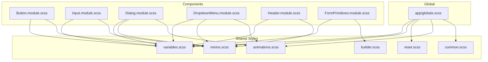
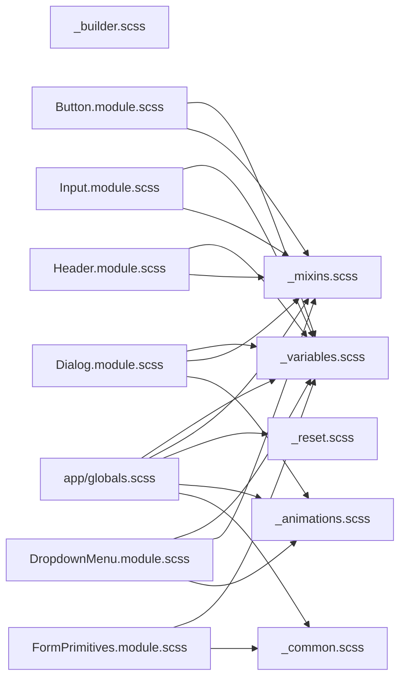

# Styling System

<cite>
**Referenced Files in This Document**
- [globals.scss](file://src/app/globals.scss)
- [variables.scss](file://src/styles/_variables.scss)
- [mixins.scss](file://src/styles/_mixins.scss)
- [animations.scss](file://src/styles/_animations.scss)
- [reset.scss](file://src/styles/_reset.scss)
- [common.scss](file://src/styles/_common.scss)
- [builder.scss](file://src/styles/_builder.scss)
- [Button.module.scss](file://src/components/ui/Button/Button.module.scss)
- [Input.module.scss](file://src/components/ui/Input/Input.module.scss)
- [Dialog.module.scss](file://src/components/ui/Dialog/Dialog.module.scss)
- [DropdownMenu.module.scss](file://src/components/ui/DropdownMenu/DropdownMenu.module.scss)
- [Header.module.scss](file://src/components/common/Header/Header.module.scss)
- [FormPrimitives.module.scss](file://src/components/common/FormPrimitives/FormPrimitives.module.scss)
- [globals.scss](file://src/app/globals.scss)
- [ARCHITECTURE.md](file://ARCHITECTURE.md)
</cite>

## Table of Contents
1. [Introduction](#introduction)
2. [Project Structure](#project-structure)
3. [Core Components](#core-components)
4. [Architecture Overview](#architecture-overview)
5. [Detailed Component Analysis](#detailed-component-analysis)
6. [Dependency Analysis](#dependency-analysis)
7. [Performance Considerations](#performance-considerations)
8. [Troubleshooting Guide](#troubleshooting-guide)
9. [Conclusion](#conclusion)
10. [Appendices](#appendices)

## Introduction
This document describes the styling system built with SCSS and CSS modules, anchored by a centralized design token system. It explains the modular SCSS architecture, BEM-based class naming, and how Radix UI primitives are styled while preserving accessibility. It also documents the design tokens for colors, typography, spacing, transitions, and animations, along with responsive design patterns and practical examples for theme customization and dark mode readiness. Finally, it covers performance considerations and guidelines for maintaining design consistency.

## Project Structure
The styling system is organized around a small set of shared SCSS partials and per-component CSS modules:
- Shared tokens and utilities live under src/styles:
  - Design tokens: variables
  - Utilities and mixins: mixins
  - Global resets and base styles: reset
  - Animation definitions and helpers: animations
  - Common patterns and helpers: common
  - Builder-specific layout and tokens: builder
- Global application styles live under src/app/globals.scss and import the shared partials.
- Component-level styles use CSS modules (.module.scss) and import shared tokens and mixins.

**Diagram sources**
- [globals.scss](file://src/app/globals.scss#L1-L176)
- [variables.scss](file://src/styles/_variables.scss#L1-L127)
- [mixins.scss](file://src/styles/_mixins.scss#L1-L278)
- [animations.scss](file://src/styles/_animations.scss#L1-L215)
- [reset.scss](file://src/styles/_reset.scss#L1-L41)
- [common.scss](file://src/styles/_common.scss#L1-L71)
- [builder.scss](file://src/styles/_builder.scss#L1-L261)
- [Button.module.scss](file://src/components/ui/Button/Button.module.scss#L1-L157)
- [Input.module.scss](file://src/components/ui/Input/Input.module.scss#L1-L36)
- [Dialog.module.scss](file://src/components/ui/Dialog/Dialog.module.scss#L1-L113)
- [DropdownMenu.module.scss](file://src/components/ui/DropdownMenu/DropdownMenu.module.scss#L1-L78)
- [Header.module.scss](file://src/components/common/Header/Header.module.scss#L1-L96)
- [FormPrimitives.module.scss](file://src/components/common/FormPrimitives/FormPrimitives.module.scss#L1-L80)

**Section sources**
- [globals.scss](file://src/app/globals.scss#L1-L176)
- [variables.scss](file://src/styles/_variables.scss#L1-L127)
- [mixins.scss](file://src/styles/_mixins.scss#L1-L278)
- [animations.scss](file://src/styles/_animations.scss#L1-L215)
- [reset.scss](file://src/styles/_reset.scss#L1-L41)
- [common.scss](file://src/styles/_common.scss#L1-L71)
- [builder.scss](file://src/styles/_builder.scss#L1-L261)

## Core Components
- Design tokens: centralized color palettes, typography scales, spacing units, z-index layers, transitions, and animation motion tokens.
- Mixins: reusable utilities for breakpoints, flexbox, focus rings, hover media queries, input/button base styles, toggles, and accessibility helpers.
- Animations: reusable keyframes and motion tokens for dialogs, sheets, overlays, and custom popups.
- Reset: normalized baseline styles and font defaults.
- Common patterns: background patterns, rich text content styles, and animation helpers.
- Builder system: specialized layout mixins and tokens for the invitation builder UI.

Key responsibilities:
- variables.scss defines all tokens consumed by components and global styles.
- mixins.scss encapsulates reusable styles and responsive patterns.
- animations.scss centralizes motion definitions and exposes motion classes for Radix UI components.
- reset.scss ensures consistent baseline across browsers.
- common.scss provides shared helpers and rich text formatting.
- builder.scss extends tokens and mixins for builder-specific layouts.

**Section sources**
- [variables.scss](file://src/styles/_variables.scss#L1-L127)
- [mixins.scss](file://src/styles/_mixins.scss#L1-L278)
- [animations.scss](file://src/styles/_animations.scss#L1-L215)
- [reset.scss](file://src/styles/_reset.scss#L1-L41)
- [common.scss](file://src/styles/_common.scss#L1-L71)
- [builder.scss](file://src/styles/_builder.scss#L1-L261)

## Architecture Overview
The styling architecture follows a layered approach:
- Global layer: app/globals.scss imports shared partials and exports CSS variables for runtime theming.
- Component layer: each UI component uses CSS modules to scope styles and composes shared mixins and tokens.
- Radix UI integration: primitives are styled via SCSS modules while retaining accessibility attributes and data-states.

```mermaid
graph TB
G["app/globals.scss"]
V["styles/_variables.scss"]
M["styles/_mixins.scss"]
A["styles/_animations.scss"]
R["styles/_reset.scss"]
C["styles/_common.scss"]
BTN["components/ui/Button/Button.module.scss"]
INP["components/ui/Input/Input.module.scss"]
DLG["components/ui/Dialog/Dialog.module.scss"]
DDM["components/ui/DropdownMenu/DropdownMenu.module.scss"]
HDR["components/common/Header/Header.module.scss"]
FPR["components/common/FormPrimitives/FormPrimitives.module.scss"]
G --> V
G --> M
G --> R
G --> A
G --> C
BTN --> V
BTN --> M
INP --> V
INP --> M
DLG --> V
DLG --> M
DLG --> A
DDM --> V
DDM --> M
DDM --> A
HDR --> V
HDR --> M
FPR --> V
FPR --> C
```

**Diagram sources**
- [globals.scss](file://src/app/globals.scss#L1-L176)
- [variables.scss](file://src/styles/_variables.scss#L1-L127)
- [mixins.scss](file://src/styles/_mixins.scss#L1-L278)
- [animations.scss](file://src/styles/_animations.scss#L1-L215)
- [reset.scss](file://src/styles/_reset.scss#L1-L41)
- [common.scss](file://src/styles/_common.scss#L1-L71)
- [Button.module.scss](file://src/components/ui/Button/Button.module.scss#L1-L157)
- [Input.module.scss](file://src/components/ui/Input/Input.module.scss#L1-L36)
- [Dialog.module.scss](file://src/components/ui/Dialog/Dialog.module.scss#L1-L113)
- [DropdownMenu.module.scss](file://src/components/ui/DropdownMenu/DropdownMenu.module.scss#L1-L78)
- [Header.module.scss](file://src/components/common/Header/Header.module.scss#L1-L96)
- [FormPrimitives.module.scss](file://src/components/common/FormPrimitives/FormPrimitives.module.scss#L1-L80)

## Detailed Component Analysis

### Design Token System
- Color palette: primary yellow, background/foreground, muted tones, borders, and destructive states. Includes named scales (primary, zinc) and overlay colors.
- Typography: font families exported as CSS variables and tokenized sizes (xs to xl).
- Spacing and layout: radius tokens, input height, mobile breakpoint, canvas max width, z-index layers.
- Transitions and motion: fast/normal/slow durations and smooth easing; popup animation tokens; motion tokens for overlays and sheets.

Usage pattern:
- Components import variables.scss and reference tokens for colors, typography, spacing, and transitions.
- Global app/globals.scss exports CSS variables for runtime theming and motion overrides.

**Section sources**
- [variables.scss](file://src/styles/_variables.scss#L1-L127)
- [globals.scss](file://src/app/globals.scss#L14-L42)

### Responsive Design and Breakpoints
- Mobile-first approach: mixins define mobile and desktop breakpoints using the shared mobile token.
- Hover-aware interactions: a dedicated mixin targets hover-capable devices to avoid unintended hover effects on touch devices.
- Adaptive layouts: components adjust paddings and typography at desktop breakpoint using the mixin.

Example references:
- Breakpoint mixins and hover media query: [mixins.scss](file://src/styles/_mixins.scss#L6-L16), [mixins.scss](file://src/styles/_mixins.scss#L110-L116)
- Desktop-specific adjustments in Header: [Header.module.scss](file://src/components/common/Header/Header.module.scss#L19-L21)

**Section sources**
- [mixins.scss](file://src/styles/_mixins.scss#L6-L16)
- [mixins.scss](file://src/styles/_mixins.scss#L110-L116)
- [Header.module.scss](file://src/components/common/Header/Header.module.scss#L19-L21)

### Component Styling with BEM and CSS Modules
- Each component uses a .module.scss file scoped to the component.
- BEM-like naming: base element class plus modifiers (variants and sizes) for buttons and inputs.
- Compose mixins for consistent base styles and hover/focus/disabled states.

Examples:
- Button variants and sizes: [Button.module.scss](file://src/components/ui/Button/Button.module.scss#L44-L126)
- Input base and special-case file input: [Input.module.scss](file://src/components/ui/Input/Input.module.scss#L4-L35)
- Dialog overlay/content and animations: [Dialog.module.scss](file://src/components/ui/Dialog/Dialog.module.scss#L4-L43)
- Dropdown menu items and separators: [DropdownMenu.module.scss](file://src/components/ui/DropdownMenu/DropdownMenu.module.scss#L5-L64)

**Section sources**
- [Button.module.scss](file://src/components/ui/Button/Button.module.scss#L1-L157)
- [Input.module.scss](file://src/components/ui/Input/Input.module.scss#L1-L36)
- [Dialog.module.scss](file://src/components/ui/Dialog/Dialog.module.scss#L1-L113)
- [DropdownMenu.module.scss](file://src/components/ui/DropdownMenu/DropdownMenu.module.scss#L1-L78)

### Radix UI Integration and Custom Styles
- Components like Dialog and DropdownMenu are styled entirely in SCSS modules while relying on Radix’s data-state attributes for animations.
- Motion tokens and keyframes are reused to match native-feeling transitions.
- Accessibility mixins (focus ring, visually hidden) are applied consistently.

Integration references:
- Dialog animations and overlay: [Dialog.module.scss](file://src/components/ui/Dialog/Dialog.module.scss#L4-L43)
- Dropdown popup animation: [DropdownMenu.module.scss](file://src/components/ui/DropdownMenu/DropdownMenu.module.scss#L16)
- Global motion classes and reduced-motion handling: [globals.scss](file://src/app/globals.scss#L112-L171)

**Section sources**
- [Dialog.module.scss](file://src/components/ui/Dialog/Dialog.module.scss#L1-L113)
- [DropdownMenu.module.scss](file://src/components/ui/DropdownMenu/DropdownMenu.module.scss#L1-L78)
- [globals.scss](file://src/app/globals.scss#L112-L171)

### Practical Examples

#### Theming and Dark Mode Support
- Export CSS variables at the root for runtime switching: [globals.scss](file://src/app/globals.scss#L14-L42)
- Define tokens for light/dark variants in variables.scss and switch CSS variable values at root to flip themes.
- Prefer CSS variables for colors and backgrounds to enable programmatic theme switching without rebuilding styles.

**Section sources**
- [globals.scss](file://src/app/globals.scss#L14-L42)
- [variables.scss](file://src/styles/_variables.scss#L1-L127)

#### Builder Layout Patterns
- Use builder mixins for consistent spacing, grids, rows, and cards: [builder.scss](file://src/styles/_builder.scss#L45-L100)
- Apply builder tokens for typography and borders within builder sections: [builder.scss](file://src/styles/_builder.scss#L24-L42)
- Compose builder mixins inside components like FormPrimitives: [FormPrimitives.module.scss](file://src/components/common/FormPrimitives/FormPrimitives.module.scss#L73-L79)

**Section sources**
- [builder.scss](file://src/styles/_builder.scss#L1-L261)
- [FormPrimitives.module.scss](file://src/components/common/FormPrimitives/FormPrimitives.module.scss#L73-L79)

#### Animation Tokens and Motion Classes
- Motion tokens for overlays, sheets, and dialogs are defined and applied via global classes: [globals.scss](file://src/app/globals.scss#L112-L161)
- Custom popup animations reuse motion tokens: [animations.scss](file://src/styles/_animations.scss#L207-L214)

**Section sources**
- [globals.scss](file://src/app/globals.scss#L112-L161)
- [animations.scss](file://src/styles/_animations.scss#L207-L214)

## Dependency Analysis
The following diagram shows how components depend on shared styles and how global styles orchestrate them.

**Diagram sources**
- [globals.scss](file://src/app/globals.scss#L1-L176)
- [variables.scss](file://src/styles/_variables.scss#L1-L127)
- [mixins.scss](file://src/styles/_mixins.scss#L1-L278)
- [animations.scss](file://src/styles/_animations.scss#L1-L215)
- [reset.scss](file://src/styles/_reset.scss#L1-L41)
- [common.scss](file://src/styles/_common.scss#L1-L71)
- [builder.scss](file://src/styles/_builder.scss#L1-L261)
- [Button.module.scss](file://src/components/ui/Button/Button.module.scss#L1-L157)
- [Input.module.scss](file://src/components/ui/Input/Input.module.scss#L1-L36)
- [Dialog.module.scss](file://src/components/ui/Dialog/Dialog.module.scss#L1-L113)
- [DropdownMenu.module.scss](file://src/components/ui/DropdownMenu/DropdownMenu.module.scss#L1-L78)
- [Header.module.scss](file://src/components/common/Header/Header.module.scss#L1-L96)
- [FormPrimitives.module.scss](file://src/components/common/FormPrimitives/FormPrimitives.module.scss#L1-L80)

**Section sources**
- [globals.scss](file://src/app/globals.scss#L1-L176)
- [variables.scss](file://src/styles/_variables.scss#L1-L127)
- [mixins.scss](file://src/styles/_mixins.scss#L1-L278)
- [animations.scss](file://src/styles/_animations.scss#L1-L215)
- [reset.scss](file://src/styles/_reset.scss#L1-L41)
- [common.scss](file://src/styles/_common.scss#L1-L71)
- [builder.scss](file://src/styles/_builder.scss#L1-L261)

## Performance Considerations
- CSS optimization
  - Keep all component styles in CSS modules to minimize global scope and reduce selector conflicts.
  - Prefer CSS variables for colors and motion tokens to enable runtime switching without duplicating styles.
  - Consolidate animations in a single partial to avoid duplication across components.
- Critical path styling
  - Import only essential partials in globals.scss to keep the initial CSS minimal.
  - Defer non-critical animations and patterns to component-level usage.
- Bundle size management
  - Avoid duplicating keyframes; reuse shared animations.
  - Limit heavy backdrop filters and transforms to overlay contexts.
  - Use motion tokens to tune performance-sensitive animations.

[No sources needed since this section provides general guidance]

## Troubleshooting Guide
- Hover interactions on touch devices
  - Use the hover mixin to guard hover styles on devices with limited pointer precision: [mixins.scss](file://src/styles/_mixins.scss#L110-L116)
- Focus visibility
  - Apply the focus-ring mixin to ensure visible focus styles: [mixins.scss](file://src/styles/_mixins.scss#L70-L75)
- Reduced motion compliance
  - Respect prefers-reduced-motion by disabling animations on matching media queries: [globals.scss](file://src/app/globals.scss#L163-L171)
- Z-index stacking
  - Use shared z-index tokens to prevent overlap issues across modals and overlays: [variables.scss](file://src/styles/_variables.scss#L98-L102)
- Accessibility helpers
  - Use visually-hidden mixin for screen-reader-only text: [mixins.scss](file://src/styles/_mixins.scss#L228-L238)

**Section sources**
- [mixins.scss](file://src/styles/_mixins.scss#L70-L75)
- [mixins.scss](file://src/styles/_mixins.scss#L110-L116)
- [mixins.scss](file://src/styles/_mixins.scss#L228-L238)
- [globals.scss](file://src/app/globals.scss#L163-L171)
- [variables.scss](file://src/styles/_variables.scss#L98-L102)

## Conclusion
The styling system leverages a strict separation of concerns: centralized design tokens, reusable mixins, and scoped CSS modules. It integrates Radix UI primitives with custom animations and motion tokens while maintaining accessibility and responsiveness. By following BEM-like naming and composing shared mixins, teams can extend the system predictably and consistently.

[No sources needed since this section summarizes without analyzing specific files]

## Appendices

### Guidelines for Maintaining Design Consistency
- Centralize all tokens in variables.scss; components must import and use tokens exclusively.
- Prefer mixins for base styles (inputs, buttons, toggles) to ensure uniform behavior.
- Use builder mixins for builder UI to maintain consistent spacing and layout.
- Apply motion tokens and keyframes from animations.scss for consistent transitions.
- Export CSS variables at root for theme switching and ensure fallbacks for non-CSS-variable properties.

**Section sources**
- [variables.scss](file://src/styles/_variables.scss#L1-L127)
- [mixins.scss](file://src/styles/_mixins.scss#L1-L278)
- [animations.scss](file://src/styles/_animations.scss#L1-L215)
- [builder.scss](file://src/styles/_builder.scss#L1-L261)
- [globals.scss](file://src/app/globals.scss#L14-L42)

### Extending the Styling System
- Add new tokens to variables.scss and export CSS variables in globals.scss if runtime switching is needed.
- Create new mixins in mixins.scss for repeated patterns.
- Introduce new animation keyframes in animations.scss and expose motion classes for Radix components.
- For new UI components, use CSS modules and compose existing mixins; avoid introducing utility classes outside the module scope.

**Section sources**
- [variables.scss](file://src/styles/_variables.scss#L1-L127)
- [mixins.scss](file://src/styles/_mixins.scss#L1-L278)
- [animations.scss](file://src/styles/_animations.scss#L1-L215)
- [globals.scss](file://src/app/globals.scss#L14-L42)