# Testing Strategy

<cite>
**Referenced Files in This Document**
- [vitest.config.ts](file://vitest.config.ts)
- [vitest.setup.ts](file://vitest.setup.ts)
- [package.json](file://package.json)
- [src/test-utils.tsx](file://src/test-utils.tsx)
- [src/test/accessibility.test.ts](file://src/test/accessibility.test.ts)
- [src/app/__tests__/page.test.tsx](file://src/app/__tests__/page.test.tsx)
- [src/hooks/__tests__/useAuth.test.tsx](file://src/hooks/__tests__/useAuth.test.tsx)
- [src/lib/__tests__/env.test.ts](file://src/lib/__tests__/env.test.ts)
- [src/services/__tests__/profileService.test.ts](file://src/services/__tests__/profileService.test.ts)
- [src/services/approvalRequestService.ts](file://src/services/approvalRequestService.ts)
- [src/services/invitationService.ts](file://src/services/invitationService.ts)
- [src/hooks/useAccessibility.tsx](file://src/hooks/useAccessibility.tsx)
- [src/lib/a11y.ts](file://src/lib/a11y.ts)
</cite>

## Table of Contents
1. [Introduction](#introduction)
2. [Project Structure](#project-structure)
3. [Core Components](#core-components)
4. [Architecture Overview](#architecture-overview)
5. [Detailed Component Analysis](#detailed-component-analysis)
6. [Dependency Analysis](#dependency-analysis)
7. [Performance Considerations](#performance-considerations)
8. [Troubleshooting Guide](#troubleshooting-guide)
9. [Conclusion](#conclusion)
10. [Appendices](#appendices)

## Introduction
This document defines a comprehensive testing strategy for unit testing, integration testing, and accessibility testing. It explains the Vitest configuration and testing environment setup, documents testing patterns for React components, hooks, and services, and outlines an approach for accessibility testing aligned with WCAG principles. It also provides practical examples of test writing, mock strategies, and test utilities, along with guidelines for continuous integration testing, coverage reporting, and performance testing.

## Project Structure
The project uses Vitest with JSDOM for DOM APIs, TypeScript path mapping, and a dedicated setup file to ensure cleanup after each test. Testing utilities wrap components with React Query providers and expose helpers for rendering and user interactions.

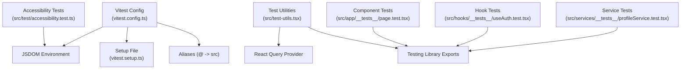

**Diagram sources**
- [vitest.config.ts](file://vitest.config.ts#L6-L34)
- [vitest.setup.ts](file://vitest.setup.ts#L1-L6)
- [src/test-utils.tsx](file://src/test-utils.tsx#L1-L49)
- [src/test/accessibility.test.ts](file://src/test/accessibility.test.ts#L1-L112)
- [src/app/__tests__/page.test.tsx](file://src/app/__tests__/page.test.tsx#L1-L32)
- [src/hooks/__tests__/useAuth.test.tsx](file://src/hooks/__tests__/useAuth.test.tsx#L1-L74)
- [src/services/__tests__/profileService.test.ts](file://src/services/__tests__/profileService.test.ts#L1-L71)

**Section sources**
- [vitest.config.ts](file://vitest.config.ts#L1-L35)
- [vitest.setup.ts](file://vitest.setup.ts#L1-L6)
- [src/test-utils.tsx](file://src/test-utils.tsx#L1-L49)

## Core Components
- Vitest configuration enables global APIs, JSDOM environment, CSS support, and coverage reporting with V8 provider. Aliases map @ to src for clean imports.
- Setup file ensures DOM cleanup after each test to prevent leaks.
- Test utilities provide a React Query wrapper and a render helper that composes providers for component tests.
- Accessibility tests demonstrate DOM-level checks for headings, ARIA labels, focus management, alt attributes, and landmarks.

**Section sources**
- [vitest.config.ts](file://vitest.config.ts#L8-L28)
- [vitest.setup.ts](file://vitest.setup.ts#L4-L6)
- [src/test-utils.tsx](file://src/test-utils.tsx#L6-L37)
- [src/test/accessibility.test.ts](file://src/test/accessibility.test.ts#L13-L110)

## Architecture Overview
The testing architecture centers around Vitest’s JSDOM environment and Testing Library. Components are rendered with providers via test utilities, mocks isolate external dependencies, and service tests validate integration points.

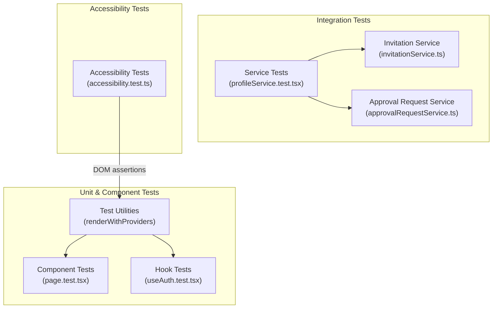

**Diagram sources**
- [src/test-utils.tsx](file://src/test-utils.tsx#L31-L37)
- [src/app/__tests__/page.test.tsx](file://src/app/__tests__/page.test.tsx#L1-L32)
- [src/hooks/__tests__/useAuth.test.tsx](file://src/hooks/__tests__/useAuth.test.tsx#L1-L74)
- [src/services/__tests__/profileService.test.ts](file://src/services/__tests__/profileService.test.ts#L1-L71)
- [src/services/invitationService.ts](file://src/services/invitationService.ts#L9-L80)
- [src/services/approvalRequestService.ts](file://src/services/approvalRequestService.ts#L13-L52)
- [src/test/accessibility.test.ts](file://src/test/accessibility.test.ts#L1-L112)

## Detailed Component Analysis

### Vitest Configuration and Environment
- Globals enabled for concise test syntax.
- JSDOM environment supports DOM APIs required by Testing Library.
- Setup file runs cleanup after each test to avoid cross-test pollution.
- Coverage configured with V8 provider and HTML/text/json reporters; excludes generated files and config directories.
- Path aliases simplify imports in tests.

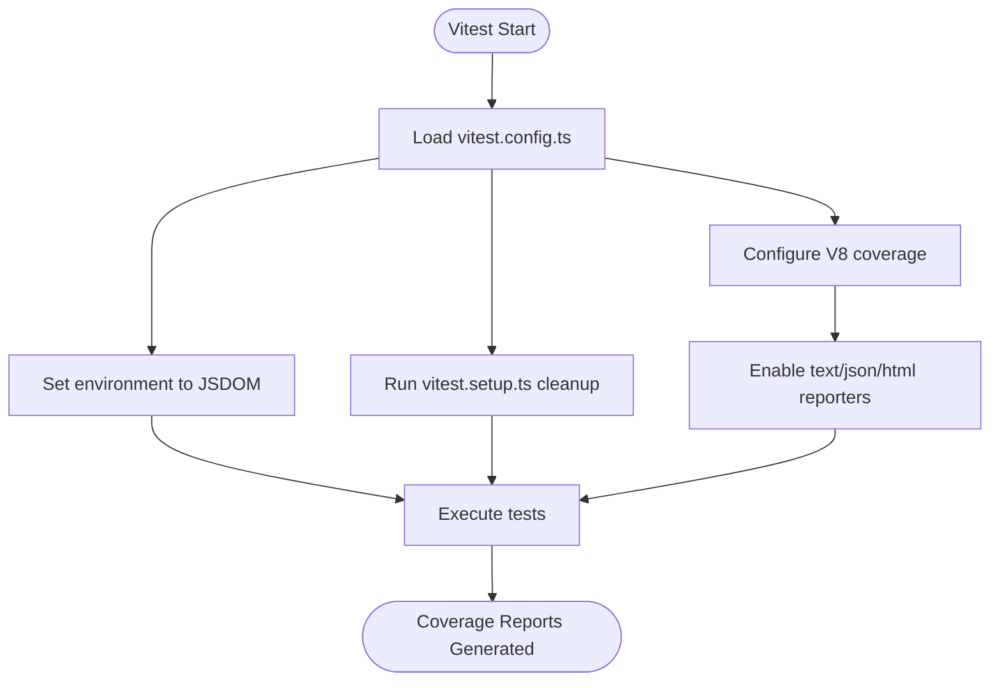

**Diagram sources**
- [vitest.config.ts](file://vitest.config.ts#L8-L28)
- [vitest.setup.ts](file://vitest.setup.ts#L4-L6)

**Section sources**
- [vitest.config.ts](file://vitest.config.ts#L8-L28)
- [vitest.setup.ts](file://vitest.setup.ts#L1-L6)

### Test Utilities and Rendering Helpers
- Provides a React Query provider wrapper with disabled retries for deterministic tests.
- Exposes a render helper that composes providers and allows custom wrappers.
- Re-exports Testing Library APIs and user-event for interactions.

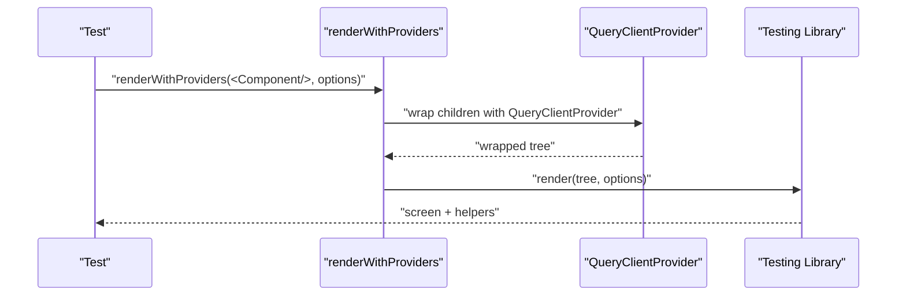

**Diagram sources**
- [src/test-utils.tsx](file://src/test-utils.tsx#L6-L37)

**Section sources**
- [src/test-utils.tsx](file://src/test-utils.tsx#L6-L37)

### Component Testing Patterns
- Render the component under test and assert roles, text content, and attributes using Testing Library selectors.
- Example: Home page tests assert headings, descriptions, links, and footer content.

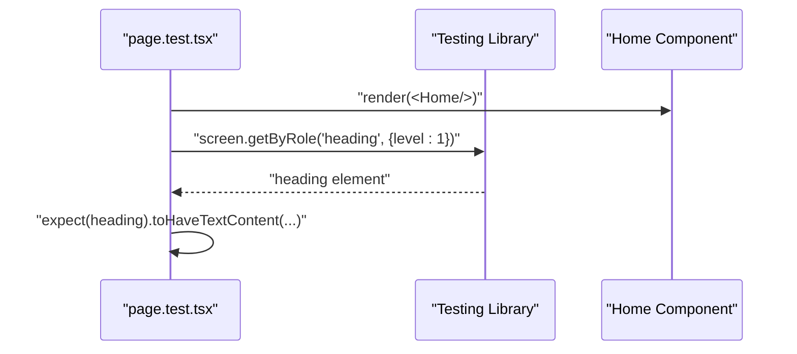

**Diagram sources**
- [src/app/__tests__/page.test.tsx](file://src/app/__tests__/page.test.tsx#L5-L11)

**Section sources**
- [src/app/__tests__/page.test.tsx](file://src/app/__tests__/page.test.tsx#L1-L32)

### Hook Testing Patterns
- Mock external dependencies (e.g., NextAuth hooks and profile service) using hoisted mocks.
- Render a test component that consumes the hook and assert derived state via data attributes.
- Use waitFor to handle asynchronous effects.

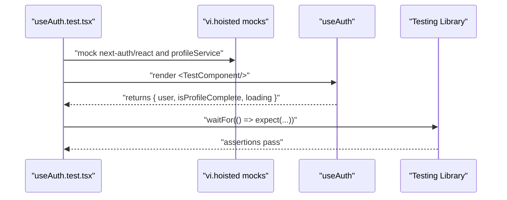

**Diagram sources**
- [src/hooks/__tests__/useAuth.test.tsx](file://src/hooks/__tests__/useAuth.test.tsx#L6-L24)
- [src/hooks/__tests__/useAuth.test.tsx](file://src/hooks/__tests__/useAuth.test.tsx#L43-L72)

**Section sources**
- [src/hooks/__tests__/useAuth.test.tsx](file://src/hooks/__tests__/useAuth.test.tsx#L1-L74)

### Service Testing Patterns
- Hoist and mock database client methods to simulate Supabase interactions.
- Verify query and mutation method calls and their arguments.
- Restore mocks after each test to avoid side effects.

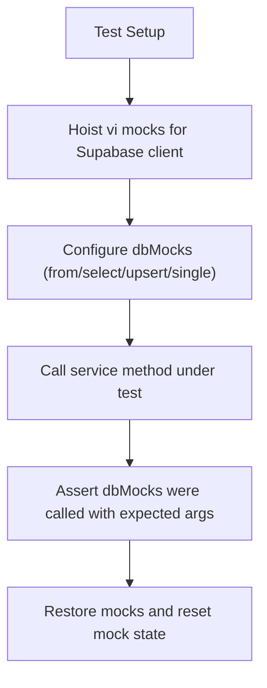

**Diagram sources**
- [src/services/__tests__/profileService.test.ts](file://src/services/__tests__/profileService.test.ts#L4-L44)

**Section sources**
- [src/services/__tests__/profileService.test.ts](file://src/services/__tests__/profileService.test.ts#L1-L71)

### Accessibility Testing Approach
- Current tests validate DOM-level accessibility characteristics using JSDOM.
- Tests check heading hierarchy, ARIA labels, focusable elements, alt attributes, and landmark roles.
- To align with axe-core and WCAG, expand tests to programmatically scan DOM nodes and assert WCAG criteria.

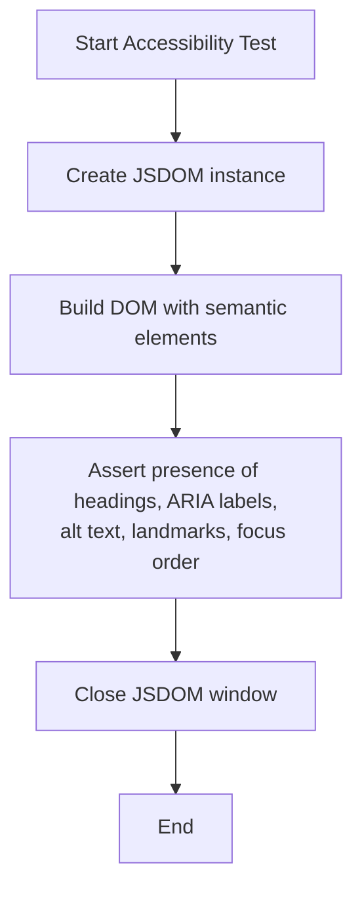

**Diagram sources**
- [src/test/accessibility.test.ts](file://src/test/accessibility.test.ts#L13-L110)

**Section sources**
- [src/test/accessibility.test.ts](file://src/test/accessibility.test.ts#L1-L112)

### Accessibility Hooks and Utilities
- Focus trap hook manages focus within a container and moves focus to the first/last focusable element when Tab is pressed.
- Utility exports a focusable selector and a helper to focus the first focusable element in a container.
- These utilities support building accessible dialogs, modals, and forms.

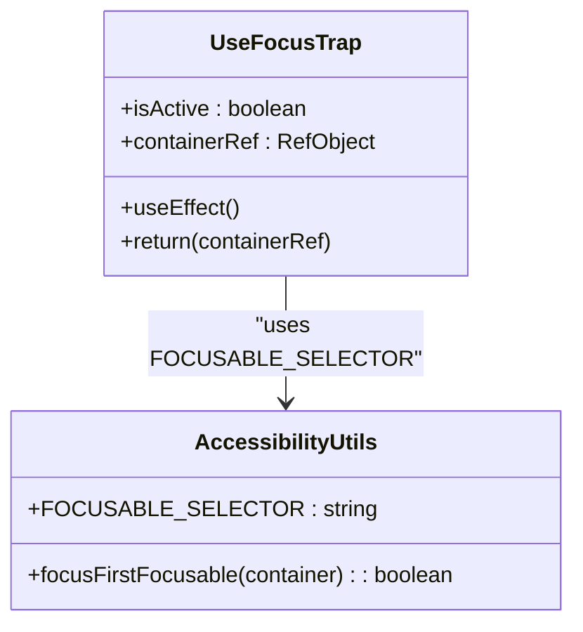

**Diagram sources**
- [src/hooks/useAccessibility.tsx](file://src/hooks/useAccessibility.tsx#L22-L62)
- [src/lib/a11y.ts](file://src/lib/a11y.ts#L1-L19)

**Section sources**
- [src/hooks/useAccessibility.tsx](file://src/hooks/useAccessibility.tsx#L1-L77)
- [src/lib/a11y.ts](file://src/lib/a11y.ts#L1-L20)

### Integration Testing Services
- Invitation service methods integrate with Supabase client and API endpoints. Tests should validate:
  - Upsert/save behavior with conflict handling.
  - Fetching lists and single records.
  - Deletion operations.
- Approval request service integrates with API endpoints and validates CRUD operations.

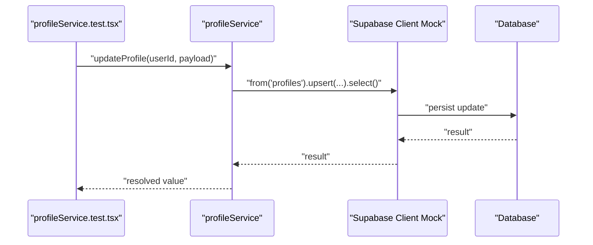

**Diagram sources**
- [src/services/__tests__/profileService.test.ts](file://src/services/__tests__/profileService.test.ts#L17-L69)
- [src/services/invitationService.ts](file://src/services/invitationService.ts#L9-L24)
- [src/services/approvalRequestService.ts](file://src/services/approvalRequestService.ts#L13-L41)

**Section sources**
- [src/services/invitationService.ts](file://src/services/invitationService.ts#L1-L81)
- [src/services/approvalRequestService.ts](file://src/services/approvalRequestService.ts#L1-L53)

## Dependency Analysis
- Test utilities depend on Testing Library and React Query to compose providers.
- Component and hook tests depend on the rendering utilities and mock external modules.
- Service tests depend on mocked database clients and service methods.
- Accessibility tests depend on JSDOM for DOM creation and assertion.

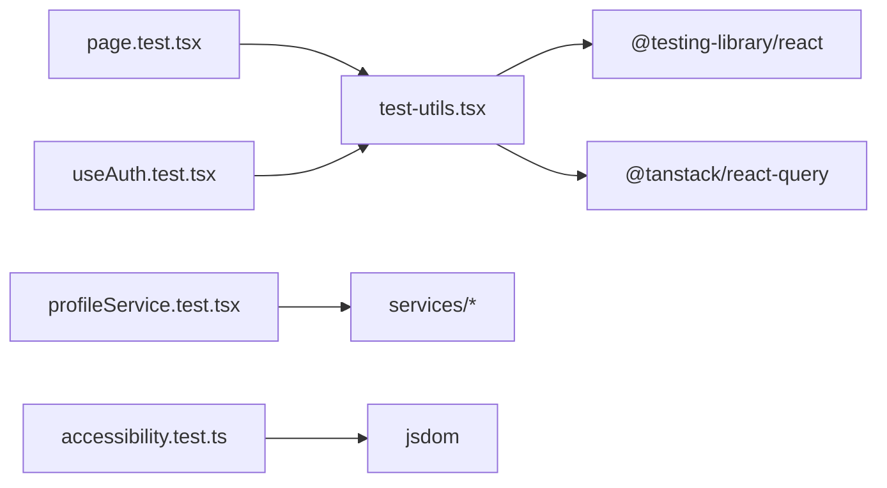

**Diagram sources**
- [src/test-utils.tsx](file://src/test-utils.tsx#L1-L49)
- [src/app/__tests__/page.test.tsx](file://src/app/__tests__/page.test.tsx#L1-L32)
- [src/hooks/__tests__/useAuth.test.tsx](file://src/hooks/__tests__/useAuth.test.tsx#L1-L74)
- [src/services/__tests__/profileService.test.ts](file://src/services/__tests__/profileService.test.ts#L1-L71)
- [src/test/accessibility.test.ts](file://src/test/accessibility.test.ts#L1-L112)

**Section sources**
- [src/test-utils.tsx](file://src/test-utils.tsx#L1-L49)
- [src/app/__tests__/page.test.tsx](file://src/app/__tests__/page.test.tsx#L1-L32)
- [src/hooks/__tests__/useAuth.test.tsx](file://src/hooks/__tests__/useAuth.test.tsx#L1-L74)
- [src/services/__tests__/profileService.test.ts](file://src/services/__tests__/profileService.test.ts#L1-L71)
- [src/test/accessibility.test.ts](file://src/test/accessibility.test.ts#L1-L112)

## Performance Considerations
- Disable retries in React Query provider to avoid flaky waits during tests.
- Prefer targeted DOM queries and avoid unnecessary rerenders by rendering minimal trees.
- Use hoisted mocks to reduce overhead and improve determinism.
- Keep tests focused and fast; avoid heavy network requests by mocking services.

[No sources needed since this section provides general guidance]

## Troubleshooting Guide
- If tests fail due to DOM leaks, ensure cleanup runs after each test via the setup file.
- For React Query-related errors, confirm the QueryClientProvider wrapper is applied in tests.
- When mocking external libraries, hoist mocks to avoid module initialization timing issues.
- For environment variable validation, ensure mocks define required keys and formats.

**Section sources**
- [vitest.setup.ts](file://vitest.setup.ts#L4-L6)
- [src/test-utils.tsx](file://src/test-utils.tsx#L6-L25)
- [src/hooks/__tests__/useAuth.test.tsx](file://src/hooks/__tests__/useAuth.test.tsx#L6-L24)
- [src/lib/__tests__/env.test.ts](file://src/lib/__tests__/env.test.ts#L5-L12)

## Conclusion
This testing strategy leverages Vitest with JSDOM, Testing Library, and React Query to deliver reliable unit, integration, and accessibility tests. By using test utilities, hoisted mocks, and focused assertions, teams can maintain a robust and efficient test suite. Extending accessibility tests to use axe-core and WCAG rules will further strengthen inclusive quality assurance.

[No sources needed since this section summarizes without analyzing specific files]

## Appendices

### Continuous Integration and Coverage
- Scripts for running tests and coverage are defined in the project configuration.
- Coverage is reported in text, JSON, and HTML formats using the V8 provider.

**Section sources**
- [package.json](file://package.json#L12-L15)
- [vitest.config.ts](file://vitest.config.ts#L15-L27)

### Practical Examples Index
- Component tests: [src/app/__tests__/page.test.tsx](file://src/app/__tests__/page.test.tsx#L1-L32)
- Hook tests: [src/hooks/__tests__/useAuth.test.tsx](file://src/hooks/__tests__/useAuth.test.tsx#L1-L74)
- Service tests: [src/services/__tests__/profileService.test.ts](file://src/services/__tests__/profileService.test.ts#L1-L71)
- Accessibility tests: [src/test/accessibility.test.ts](file://src/test/accessibility.test.ts#L1-L112)