# Common Components

<cite>
**Referenced Files in This Document**
- [Header.tsx](file://src/components/common/Header/Header.tsx)
- [Header.module.scss](file://src/components/common/Header/Header.module.scss)
- [HeaderAction.tsx](file://src/components/common/HeaderAction/HeaderAction.tsx)
- [HeaderAction.module.scss](file://src/components/common/HeaderAction/HeaderAction.module.scss)
- [LoadingSpinner.tsx](file://src/components/common/LoadingSpinner/LoadingSpinner.tsx)
- [LoadingSpinner.module.scss](file://src/components/common/LoadingSpinner/LoadingSpinner.module.scss)
- [Icons.tsx](file://src/components/common/Icons/Icons.tsx)
- [ResponsiveModal.tsx](file://src/components/common/ResponsiveModal/ResponsiveModal.tsx)
- [ResponsiveModal.module.scss](file://src/components/common/ResponsiveModal/ResponsiveModal.module.scss)
- [ExampleSelectorModal.tsx](file://src/components/common/ExampleSelectorModal/ExampleSelectorModal.tsx)
- [ExampleSelectorModal.module.scss](file://src/components/common/ExampleSelectorModal/ExampleSelectorModal.module.scss)
- [ImageUploader.tsx](file://src/components/common/ImageUploader/ImageUploader.tsx)
- [ImageUploader.module.scss](file://src/components/common/ImageUploader/ImageUploader.module.scss)
- [EditorForm.tsx](file://src/components/common/EditorForm/EditorForm.tsx)
- [EditorForm.module.scss](file://src/components/common/EditorForm/EditorForm.module.scss)
</cite>

## Table of Contents
1. [Introduction](#introduction)
2. [Project Structure](#project-structure)
3. [Core Components](#core-components)
4. [Architecture Overview](#architecture-overview)
5. [Detailed Component Analysis](#detailed-component-analysis)
6. [Dependency Analysis](#dependency-analysis)
7. [Performance Considerations](#performance-considerations)
8. [Troubleshooting Guide](#troubleshooting-guide)
9. [Conclusion](#conclusion)
10. [Appendices](#appendices)

## Introduction
This document describes the common component library used across the application for building reusable UI elements. It focuses on:
- Header with navigation and branding
- HeaderAction for interactive buttons
- LoadingSpinner for async operations
- Icons system for consistent iconography
- ResponsiveModal and ExampleSelectorModal for dynamic content presentation
- ImageUploader for media handling
- EditorForm wrapper for form management

It explains component APIs, prop interfaces, styling approaches, and usage patterns, and provides practical examples and responsive behavior guidance.

## Project Structure
The common components live under src/components/common and are organized by feature. Each component includes:
- A TypeScript/React implementation file
- A dedicated SCSS module for styling
- An index.ts export for convenient imports

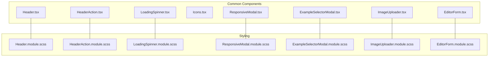

**Diagram sources**
- [Header.tsx](file://src/components/common/Header/Header.tsx#L1-L196)
- [Header.module.scss](file://src/components/common/Header/Header.module.scss#L1-L96)
- [HeaderAction.tsx](file://src/components/common/HeaderAction/HeaderAction.tsx#L1-L40)
- [HeaderAction.module.scss](file://src/components/common/HeaderAction/HeaderAction.module.scss#L1-L35)
- [LoadingSpinner.tsx](file://src/components/common/LoadingSpinner/LoadingSpinner.tsx#L1-L19)
- [LoadingSpinner.module.scss](file://src/components/common/LoadingSpinner/LoadingSpinner.module.scss#L1-L70)
- [ResponsiveModal.tsx](file://src/components/common/ResponsiveModal/ResponsiveModal.tsx#L1-L229)
- [ResponsiveModal.module.scss](file://src/components/common/ResponsiveModal/ResponsiveModal.module.scss#L1-L122)
- [ExampleSelectorModal.tsx](file://src/components/common/ExampleSelectorModal/ExampleSelectorModal.tsx#L1-L108)
- [ExampleSelectorModal.module.scss](file://src/components/common/ExampleSelectorModal/ExampleSelectorModal.module.scss#L1-L235)
- [ImageUploader.tsx](file://src/components/common/ImageUploader/ImageUploader.tsx#L1-L199)
- [ImageUploader.module.scss](file://src/components/common/ImageUploader/ImageUploader.module.scss#L1-L169)
- [EditorForm.tsx](file://src/components/common/EditorForm/EditorForm.tsx#L1-L109)
- [EditorForm.module.scss](file://src/components/common/EditorForm/EditorForm.module.scss#L1-L80)

**Section sources**
- [Header.tsx](file://src/components/common/Header/Header.tsx#L1-L196)
- [HeaderAction.tsx](file://src/components/common/HeaderAction/HeaderAction.tsx#L1-L40)
- [LoadingSpinner.tsx](file://src/components/common/LoadingSpinner/LoadingSpinner.tsx#L1-L19)
- [Icons.tsx](file://src/components/common/Icons/Icons.tsx#L1-L84)
- [ResponsiveModal.tsx](file://src/components/common/ResponsiveModal/ResponsiveModal.tsx#L1-L229)
- [ExampleSelectorModal.tsx](file://src/components/common/ExampleSelectorModal/ExampleSelectorModal.tsx#L1-L108)
- [ImageUploader.tsx](file://src/components/common/ImageUploader/ImageUploader.tsx#L1-L199)
- [EditorForm.tsx](file://src/components/common/EditorForm/EditorForm.tsx#L1-L109)

## Core Components
This section summarizes the primary components and their responsibilities.

- Header: Sticky header bar with logo, user actions, save button, and a reset confirmation dialog.
- HeaderAction: Small, labeled action button with an icon for compact controls.
- LoadingSpinner: Full-screen overlay spinner with decorative background elements.
- Icons: SVG and image-based icon primitives for branding and map-related icons.
- ResponsiveModal: Adaptive dialog/drawer with optional action buttons and scroll masking.
- ExampleSelectorModal: Scrollable list modal with gradient masks and item selection.
- ImageUploader: Dragless click-to-upload with optimistic updates, aspect ratio control, and remove capability.
- EditorForm: Sectioned editor built from multiple builder sections with accordion and skeleton loading.

**Section sources**
- [Header.tsx](file://src/components/common/Header/Header.tsx#L20-L24)
- [HeaderAction.tsx](file://src/components/common/HeaderAction/HeaderAction.tsx#L7-L12)
- [LoadingSpinner.tsx](file://src/components/common/LoadingSpinner/LoadingSpinner.tsx#L5-L18)
- [Icons.tsx](file://src/components/common/Icons/Icons.tsx#L6-L83)
- [ResponsiveModal.tsx](file://src/components/common/ResponsiveModal/ResponsiveModal.tsx#L26-L49)
- [ExampleSelectorModal.tsx](file://src/components/common/ExampleSelectorModal/ExampleSelectorModal.tsx#L7-L23)
- [ImageUploader.tsx](file://src/components/common/ImageUploader/ImageUploader.tsx#L15-L25)
- [EditorForm.tsx](file://src/components/common/EditorForm/EditorForm.tsx#L22-L33)

## Architecture Overview
The common components integrate with UI primitives and shared stores/hooks. The Header composes UI buttons and a modal; the ImageUploader integrates with the invitation store and uploads utilities; the EditorForm composes multiple builder sections.

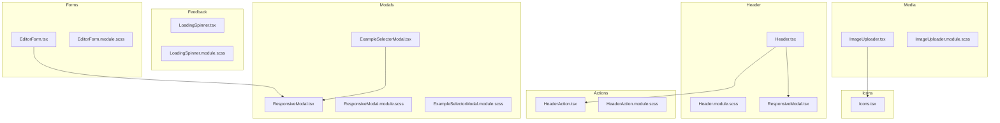

**Diagram sources**
- [Header.tsx](file://src/components/common/Header/Header.tsx#L1-L196)
- [Header.module.scss](file://src/components/common/Header/Header.module.scss#L1-L96)
- [HeaderAction.tsx](file://src/components/common/HeaderAction/HeaderAction.tsx#L1-L40)
- [HeaderAction.module.scss](file://src/components/common/HeaderAction/HeaderAction.module.scss#L1-L35)
- [LoadingSpinner.tsx](file://src/components/common/LoadingSpinner/LoadingSpinner.tsx#L1-L19)
- [LoadingSpinner.module.scss](file://src/components/common/LoadingSpinner/LoadingSpinner.module.scss#L1-L70)
- [Icons.tsx](file://src/components/common/Icons/Icons.tsx#L1-L84)
- [ResponsiveModal.tsx](file://src/components/common/ResponsiveModal/ResponsiveModal.tsx#L1-L229)
- [ResponsiveModal.module.scss](file://src/components/common/ResponsiveModal/ResponsiveModal.module.scss#L1-L122)
- [ExampleSelectorModal.tsx](file://src/components/common/ExampleSelectorModal/ExampleSelectorModal.tsx#L1-L108)
- [ExampleSelectorModal.module.scss](file://src/components/common/ExampleSelectorModal/ExampleSelectorModal.module.scss#L1-L235)
- [ImageUploader.tsx](file://src/components/common/ImageUploader/ImageUploader.tsx#L1-L199)
- [ImageUploader.module.scss](file://src/components/common/ImageUploader/ImageUploader.module.scss#L1-L169)
- [EditorForm.tsx](file://src/components/common/EditorForm/EditorForm.tsx#L1-L109)
- [EditorForm.module.scss](file://src/components/common/EditorForm/EditorForm.module.scss#L1-L80)

## Detailed Component Analysis

### Header
- Purpose: Provides branding, user actions, save trigger, and a reset confirmation flow.
- Props:
  - onSave: Optional callback invoked by the save action.
  - onLogin: Optional callback invoked by the login action.
  - isLoading: Optional flag to indicate save operation state.
- Behavior:
  - Conditionally renders user actions or login button depending on authentication state.
  - Save action checks upload state and shows a toast if uploading is in progress.
  - New invitation flow prompts a reset confirmation modal when there is existing content.
- Accessibility: Uses aria-labels on interactive elements.
- Styling: Sticky header with logo, action spacing, and save button active state.

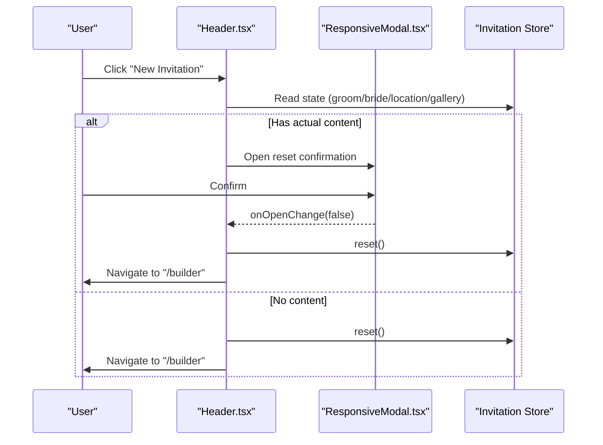

**Diagram sources**
- [Header.tsx](file://src/components/common/Header/Header.tsx#L44-L73)
- [ResponsiveModal.tsx](file://src/components/common/ResponsiveModal/ResponsiveModal.tsx#L72-L95)

**Section sources**
- [Header.tsx](file://src/components/common/Header/Header.tsx#L20-L24)
- [Header.tsx](file://src/components/common/Header/Header.tsx#L44-L85)
- [Header.tsx](file://src/components/common/Header/Header.tsx#L162-L192)
- [Header.module.scss](file://src/components/common/Header/Header.module.scss#L4-L26)

### HeaderAction
- Purpose: Compact labeled action button with an icon for quick actions.
- Props:
  - icon: Lucide icon component.
  - label: Button text.
  - onClick: Handler called on click.
  - className: Optional extra class names.
- Behavior:
  - Stops event propagation to avoid interfering with parent components like accordions.
  - Renders with a small size and secondary variant.
- Styling: Minimal rounded pill shape with hover/active states.

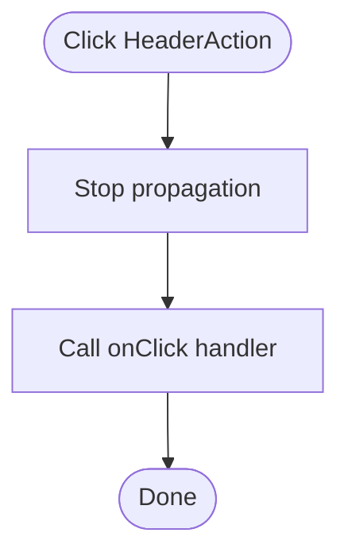

**Diagram sources**
- [HeaderAction.tsx](file://src/components/common/HeaderAction/HeaderAction.tsx#L20-L32)

**Section sources**
- [HeaderAction.tsx](file://src/components/common/HeaderAction/HeaderAction.tsx#L7-L12)
- [HeaderAction.tsx](file://src/components/common/HeaderAction/HeaderAction.tsx#L14-L39)
- [HeaderAction.module.scss](file://src/components/common/HeaderAction/HeaderAction.module.scss#L4-L35)

### LoadingSpinner
- Purpose: Full-screen overlay indicating asynchronous work.
- Props: None.
- Behavior:
  - Fixed overlay with backdrop blur and subtle background blobs.
  - Rotating icon animation.
- Styling: Centered layout with animations and blurred backgrounds.

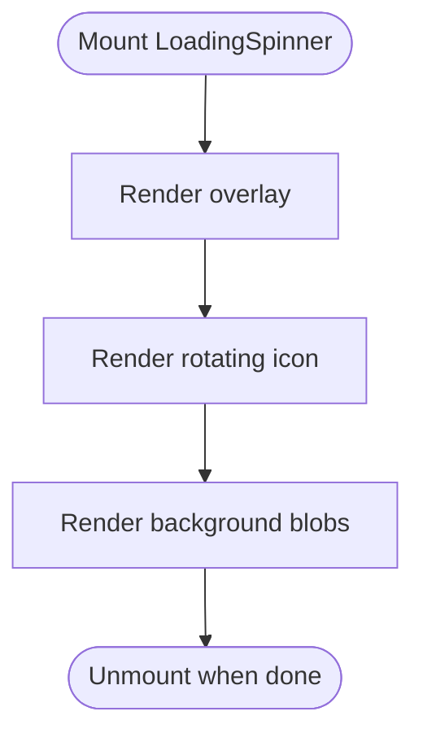

**Diagram sources**
- [LoadingSpinner.tsx](file://src/components/common/LoadingSpinner/LoadingSpinner.tsx#L5-L18)
- [LoadingSpinner.module.scss](file://src/components/common/LoadingSpinner/LoadingSpinner.module.scss#L3-L26)

**Section sources**
- [LoadingSpinner.tsx](file://src/components/common/LoadingSpinner/LoadingSpinner.tsx#L5-L18)
- [LoadingSpinner.module.scss](file://src/components/common/LoadingSpinner/LoadingSpinner.module.scss#L3-L70)

### Icons
- Purpose: Centralized iconography for branding and map integrations.
- Exports:
  - AmpersandSVG, HeartSVG, RingIcon for decorative/branding use.
  - NaverIcon, KakaoIcon with optional background and animated gradients.
- Styling: Inline sizing and vertical alignment via className/style.

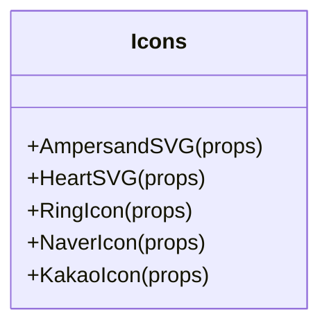

**Diagram sources**
- [Icons.tsx](file://src/components/common/Icons/Icons.tsx#L6-L83)

**Section sources**
- [Icons.tsx](file://src/components/common/Icons/Icons.tsx#L6-L83)

### ResponsiveModal
- Purpose: Unified dialog/drawer with adaptive behavior based on viewport.
- Props:
  - open, onOpenChange, trigger, title, description, children, footer, className, contentClassName
  - confirmText, cancelText, onConfirm, onCancel, showCancel, confirmVariant, confirmDisabled, confirmLoading
  - dismissible, onScroll, scrollRef
- Behavior:
  - Desktop: Dialog with header/content/footer.
  - Mobile: Drawer with scroll area and footer.
  - Dismissible toggle prevents closing when set to false.
  - Footer supports custom content or default action buttons.
- Styling: Separate styles for dialog and drawer layouts, button heights, and masks.

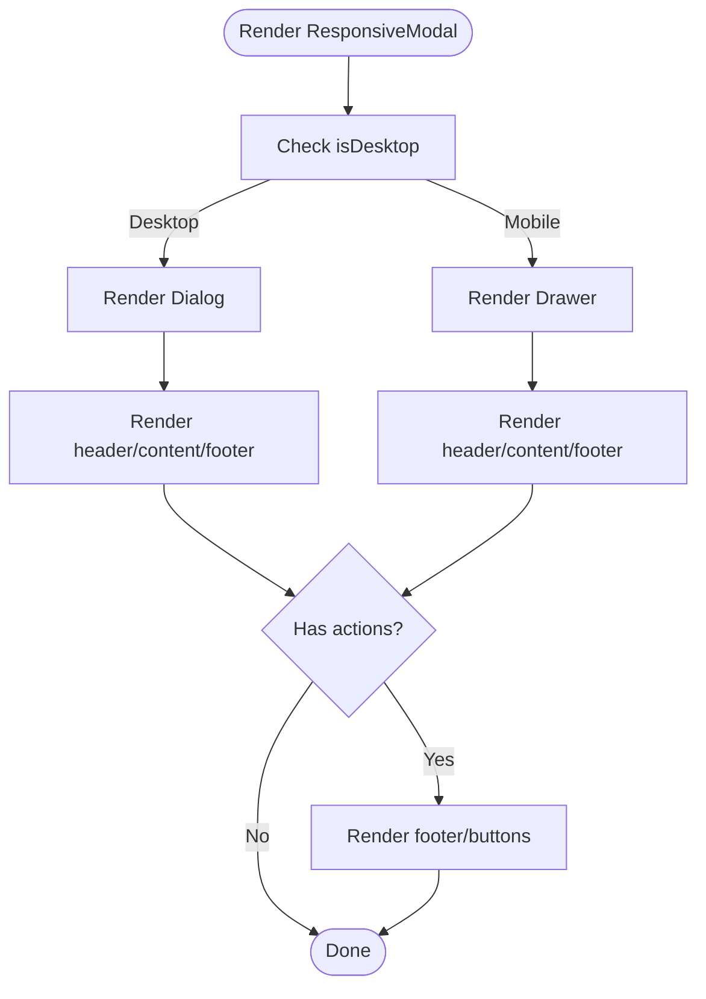

**Diagram sources**
- [ResponsiveModal.tsx](file://src/components/common/ResponsiveModal/ResponsiveModal.tsx#L72-L157)
- [ResponsiveModal.tsx](file://src/components/common/ResponsiveModal/ResponsiveModal.tsx#L160-L227)
- [ResponsiveModal.module.scss](file://src/components/common/ResponsiveModal/ResponsiveModal.module.scss#L8-L121)

**Section sources**
- [ResponsiveModal.tsx](file://src/components/common/ResponsiveModal/ResponsiveModal.tsx#L26-L49)
- [ResponsiveModal.tsx](file://src/components/common/ResponsiveModal/ResponsiveModal.tsx#L72-L227)
- [ResponsiveModal.module.scss](file://src/components/common/ResponsiveModal/ResponsiveModal.module.scss#L8-L122)

### ExampleSelectorModal
- Purpose: Presents a scrollable list of selectable examples with badges and content previews.
- Props:
  - isOpen, onClose, title, items, onSelect, className
  - items: Array of ExampleItem with id/title/content/badge/subtitle and extras.
- Behavior:
  - Computes scroll state to apply gradient masks (top, bottom, both).
  - Auto-focuses the first item for keyboard navigation.
  - Uses Dangerous innerHTML for content rendering.
- Styling: Masks applied conditionally via contentClassName; custom scrollbar styling.

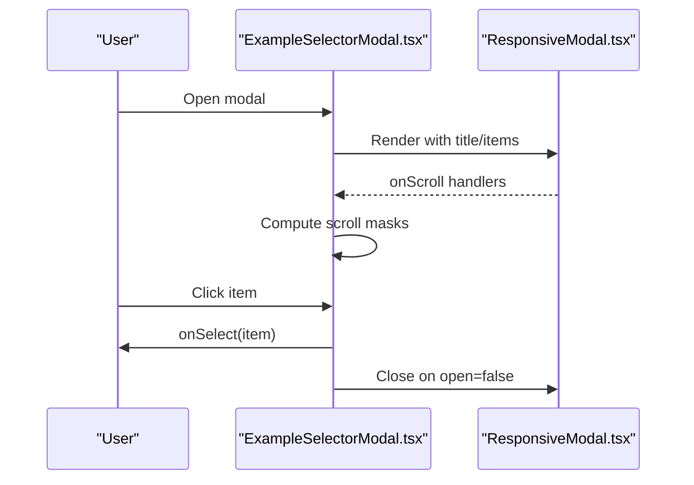

**Diagram sources**
- [ExampleSelectorModal.tsx](file://src/components/common/ExampleSelectorModal/ExampleSelectorModal.tsx#L34-L62)
- [ExampleSelectorModal.tsx](file://src/components/common/ExampleSelectorModal/ExampleSelectorModal.tsx#L64-L105)
- [ResponsiveModal.tsx](file://src/components/common/ResponsiveModal/ResponsiveModal.tsx#L72-L157)

**Section sources**
- [ExampleSelectorModal.tsx](file://src/components/common/ExampleSelectorModal/ExampleSelectorModal.tsx#L7-L23)
- [ExampleSelectorModal.tsx](file://src/components/common/ExampleSelectorModal/ExampleSelectorModal.tsx#L25-L107)
- [ExampleSelectorModal.module.scss](file://src/components/common/ExampleSelectorModal/ExampleSelectorModal.module.scss#L93-L141)

### ImageUploader
- Purpose: Handles image selection, optimistic preview, background upload, and removal.
- Props:
  - value, onChange, label, placeholder, className, aspectRatio, ratio, onRatioChange, uploadFolder
- Behavior:
  - Optimistic UI: Immediately shows a Blob URL while uploading continues.
  - Stores global uploading state and disables remove during upload.
  - On error, reverts to previous value and shows a toast.
  - Supports fixed/auto aspect ratio modes.
- Styling: Empty/filled states, overlay spinner, remove button with backdrop blur.

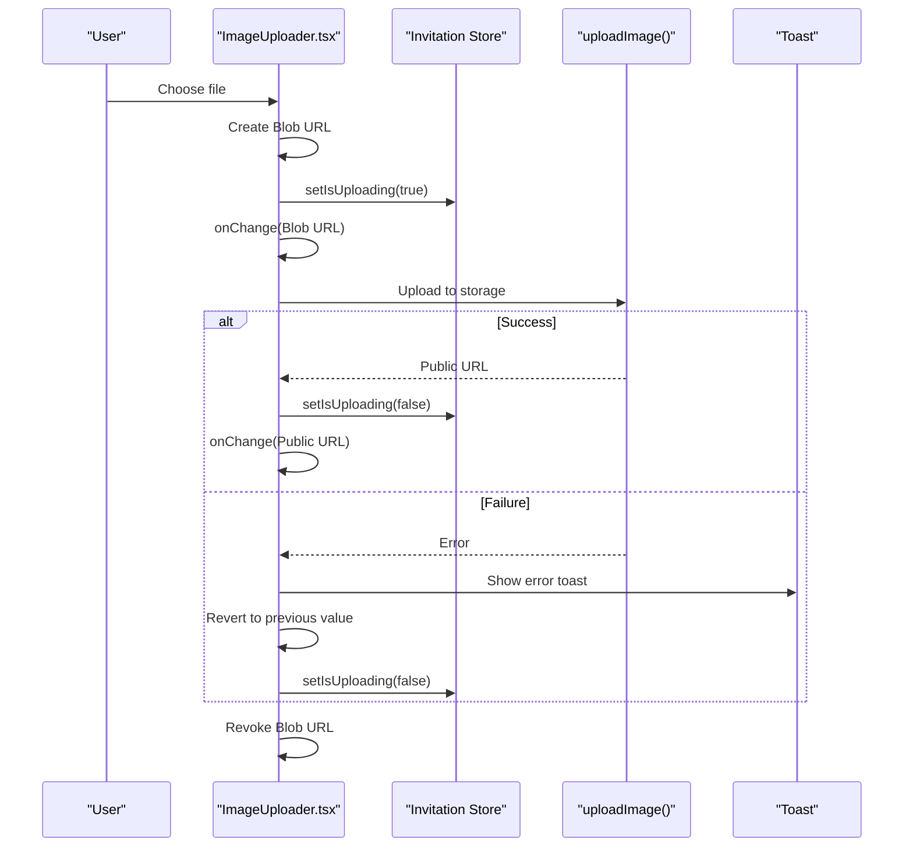

**Diagram sources**
- [ImageUploader.tsx](file://src/components/common/ImageUploader/ImageUploader.tsx#L43-L83)
- [ImageUploader.module.scss](file://src/components/common/ImageUploader/ImageUploader.module.scss#L71-L116)

**Section sources**
- [ImageUploader.tsx](file://src/components/common/ImageUploader/ImageUploader.tsx#L15-L25)
- [ImageUploader.tsx](file://src/components/common/ImageUploader/ImageUploader.tsx#L43-L83)
- [ImageUploader.tsx](file://src/components/common/ImageUploader/ImageUploader.tsx#L85-L93)
- [ImageUploader.module.scss](file://src/components/common/ImageUploader/ImageUploader.module.scss#L19-L116)

### EditorForm
- Purpose: Wraps builder sections in an accordion with skeleton loading and editing section tracking.
- Props: None.
- Behavior:
  - Pre-imports all builder sections to avoid icon pop-in and improve perceived performance.
  - Tracks editing section via the invitation store to keep preview synchronized.
  - Renders skeleton placeholders until ready.
- Styling: Animated fade-in and skeleton rows.

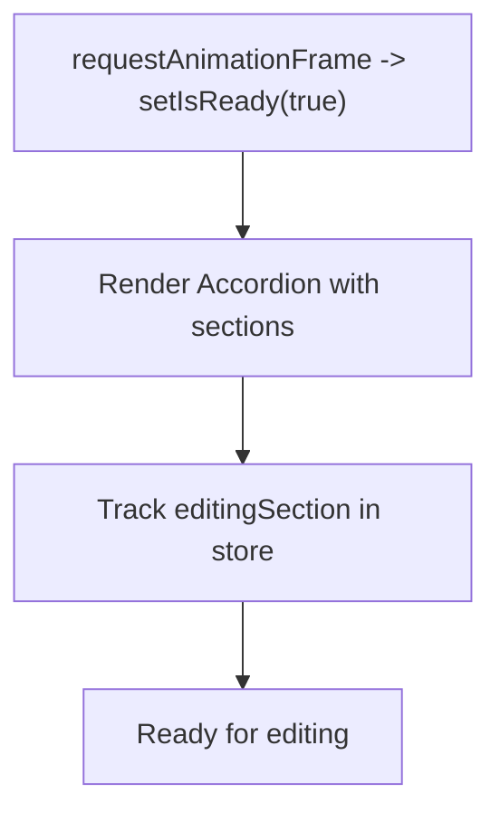

**Diagram sources**
- [EditorForm.tsx](file://src/components/common/EditorForm/EditorForm.tsx#L62-L65)
- [EditorForm.tsx](file://src/components/common/EditorForm/EditorForm.tsx#L86-L103)
- [EditorForm.module.scss](file://src/components/common/EditorForm/EditorForm.module.scss#L15-L80)

**Section sources**
- [EditorForm.tsx](file://src/components/common/EditorForm/EditorForm.tsx#L22-L33)
- [EditorForm.tsx](file://src/components/common/EditorForm/EditorForm.tsx#L35-L65)
- [EditorForm.tsx](file://src/components/common/EditorForm/EditorForm.tsx#L86-L104)
- [EditorForm.module.scss](file://src/components/common/EditorForm/EditorForm.module.scss#L3-L80)

## Dependency Analysis
- Header depends on:
  - UI primitives (IconButton, Button)
  - ResponsiveModal for reset confirmation
  - Hooks (useAuth, useToast, useShallow)
  - Invitation store for state and reset
- ImageUploader depends on:
  - UI primitives (Label, IconButton, AspectRatio, SegmentedControl)
  - Store for theme/accent color and uploading state
  - Utilities for upload and blob URL handling
- EditorForm composes multiple builder sections and uses the invitation store for editing state.
- ResponsiveModal composes UI Dialog/Drawer and uses a media query hook for responsiveness.

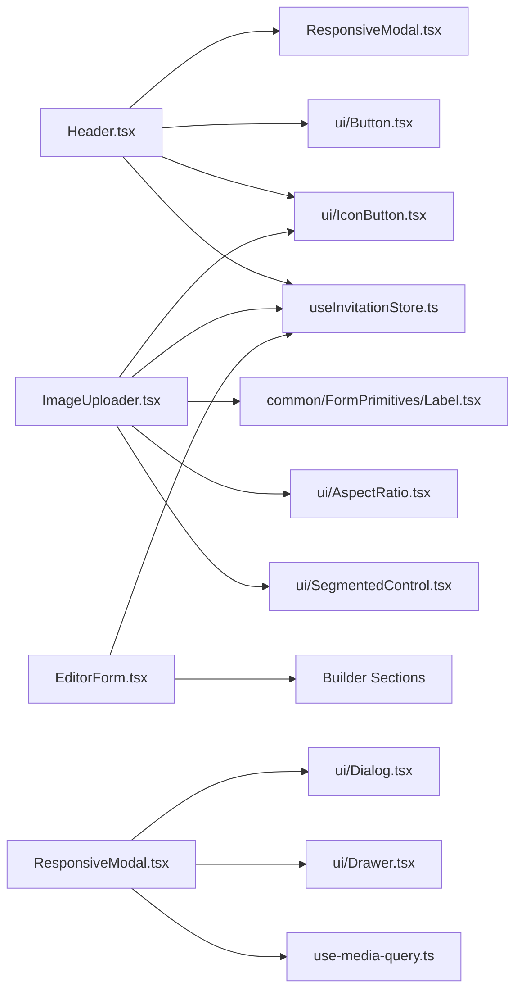

**Diagram sources**
- [Header.tsx](file://src/components/common/Header/Header.tsx#L1-L196)
- [ImageUploader.tsx](file://src/components/common/ImageUploader/ImageUploader.tsx#L1-L199)
- [EditorForm.tsx](file://src/components/common/EditorForm/EditorForm.tsx#L1-L109)
- [ResponsiveModal.tsx](file://src/components/common/ResponsiveModal/ResponsiveModal.tsx#L1-L229)

**Section sources**
- [Header.tsx](file://src/components/common/Header/Header.tsx#L1-L196)
- [ImageUploader.tsx](file://src/components/common/ImageUploader/ImageUploader.tsx#L1-L199)
- [EditorForm.tsx](file://src/components/common/EditorForm/EditorForm.tsx#L1-L109)
- [ResponsiveModal.tsx](file://src/components/common/ResponsiveModal/ResponsiveModal.tsx#L1-L229)

## Performance Considerations
- Lazy loading: Header lazily imports Button to avoid preload warnings inside modal.
- Pre-loading: EditorForm pre-imports builder sections to reduce icon pop-in.
- Optimistic UI: ImageUploader immediately shows a Blob URL to reduce perceived latency.
- RequestAnimationFrame: EditorForm delays rendering to ensure smooth icon appearance.
- Conditional mounting: ResponsiveModal guards desktop/mobile render paths and mounts only once.

**Section sources**
- [Header.tsx](file://src/components/common/Header/Header.tsx#L17-L18)
- [EditorForm.tsx](file://src/components/common/EditorForm/EditorForm.tsx#L62-L65)
- [ImageUploader.tsx](file://src/components/common/ImageUploader/ImageUploader.tsx#L46-L53)
- [ResponsiveModal.tsx](file://src/components/common/ResponsiveModal/ResponsiveModal.tsx#L87-L95)

## Troubleshooting Guide
- Save button disabled during upload:
  - The Header save action checks the global uploading state and shows a toast if uploading is in progress.
- Upload failures:
  - ImageUploader reverts to the previous value and displays a destructive toast on upload errors.
- Modal cannot be dismissed:
  - Set dismissible to false to prevent accidental closures; cancel still forces close.
- Scroll masks not appearing:
  - Ensure the content is scrollable and the scrollRef is passed to the modal.

**Section sources**
- [Header.tsx](file://src/components/common/Header/Header.tsx#L75-L85)
- [ImageUploader.tsx](file://src/components/common/ImageUploader/ImageUploader.tsx#L63-L72)
- [ResponsiveModal.tsx](file://src/components/common/ResponsiveModal/ResponsiveModal.tsx#L76-L85)
- [ExampleSelectorModal.module.scss](file://src/components/common/ExampleSelectorModal/ExampleSelectorModal.module.scss#L93-L107)

## Conclusion
The common component library provides a cohesive set of reusable UI elements that emphasize responsive behavior, optimistic UX, and consistent styling. Components are designed to integrate with shared stores and UI primitives, enabling predictable interactions across screens and use cases.

## Appendices

### Component APIs and Prop Interfaces

- HeaderProps
  - onSave?: () => void
  - onLogin?: () => void
  - isLoading?: boolean

- HeaderActionProps
  - icon: LucideIcon
  - label: string
  - onClick: () => void
  - className?: string

- ResponsiveModalProps
  - open?: boolean
  - onOpenChange?: (open: boolean) => void
  - trigger?: React.ReactNode
  - title?: React.ReactNode
  - description?: React.ReactNode
  - children?: React.ReactNode
  - footer?: React.ReactNode
  - className?: string
  - contentClassName?: string
  - confirmText?: string
  - cancelText?: string
  - onConfirm?: () => void
  - onCancel?: () => void
  - showCancel?: boolean
  - confirmVariant?: 'default' | 'destructive' | 'solid'
  - confirmDisabled?: boolean
  - confirmLoading?: boolean
  - dismissible?: boolean
  - onScroll?: (e: React.UIEvent<HTMLDivElement>) => void
  - scrollRef?: React.Ref<HTMLDivElement>

- ExampleSelectorModalProps<T extends ExampleItem>
  - isOpen: boolean
  - onClose: () => void
  - title: string
  - items: T[]
  - onSelect: (item: T) => void
  - className?: string

- ExampleItem
  - id?: string | number
  - title: string
  - content: string
  - badge?: string
  - subtitle?: string
  - [key: string]: unknown

- ImageUploaderProps
  - value: string | null
  - onChange: (value: string | null) => void
  - label?: string
  - placeholder?: string
  - className?: string
  - aspectRatio?: '16/9' | '1/1' | '3/4' | '4/3' | '4/5'
  - ratio?: 'fixed' | 'auto'
  - onRatioChange?: (value: 'fixed' | 'auto') => void
  - uploadFolder?: string

- Icons
  - AmpersandSVG, HeartSVG, RingIcon, NaverIcon, KakaoIcon with size/className/style props

**Section sources**
- [Header.tsx](file://src/components/common/Header/Header.tsx#L20-L24)
- [HeaderAction.tsx](file://src/components/common/HeaderAction/HeaderAction.tsx#L7-L12)
- [ResponsiveModal.tsx](file://src/components/common/ResponsiveModal/ResponsiveModal.tsx#L26-L49)
- [ExampleSelectorModal.tsx](file://src/components/common/ExampleSelectorModal/ExampleSelectorModal.tsx#L16-L23)
- [ImageUploader.tsx](file://src/components/common/ImageUploader/ImageUploader.tsx#L15-L25)
- [Icons.tsx](file://src/components/common/Icons/Icons.tsx#L6-L83)

### Usage Patterns and Customization
- Header
  - Integrate save and login callbacks from the parent page.
  - Use isLoading to reflect save progress.
- HeaderAction
  - Wrap with stopPropagation to avoid interfering with parent containers.
  - Customize label and icon per context.
- LoadingSpinner
  - Mount conditionally around long-running operations.
- Icons
  - Use brand icons for decorative elements; map icons for location sharing.
- ResponsiveModal
  - Provide custom footer for complex actions; use confirmLoading for async confirmations.
- ExampleSelectorModal
  - Pass items with HTML content via content; customize badges and subtitles.
- ImageUploader
  - Control aspect ratio via ratio/fixed mode; handle uploadFolder for storage organization.
- EditorForm
  - Compose with builder sections; rely on store-driven editing section tracking.

**Section sources**
- [Header.tsx](file://src/components/common/Header/Header.tsx#L26-L85)
- [HeaderAction.tsx](file://src/components/common/HeaderAction/HeaderAction.tsx#L14-L39)
- [LoadingSpinner.tsx](file://src/components/common/LoadingSpinner/LoadingSpinner.tsx#L5-L18)
- [Icons.tsx](file://src/components/common/Icons/Icons.tsx#L6-L83)
- [ResponsiveModal.tsx](file://src/components/common/ResponsiveModal/ResponsiveModal.tsx#L51-L72)
- [ExampleSelectorModal.tsx](file://src/components/common/ExampleSelectorModal/ExampleSelectorModal.tsx#L25-L32)
- [ImageUploader.tsx](file://src/components/common/ImageUploader/ImageUploader.tsx#L27-L34)
- [EditorForm.tsx](file://src/components/common/EditorForm/EditorForm.tsx#L35-L65)

### Responsive Behavior
- Breakpoint: Desktop vs mobile determined by a media query at 768px.
- Desktop: Dialog with centered content and action buttons.
- Mobile: Drawer with scroll area and larger action buttons.
- ExampleSelectorModal applies gradient masks based on scroll position to indicate overflow.

**Section sources**
- [ResponsiveModal.tsx](file://src/components/common/ResponsiveModal/ResponsiveModal.tsx#L73-L74)
- [ResponsiveModal.module.scss](file://src/components/common/ResponsiveModal/ResponsiveModal.module.scss#L8-L121)
- [ExampleSelectorModal.module.scss](file://src/components/common/ExampleSelectorModal/ExampleSelectorModal.module.scss#L93-L107)