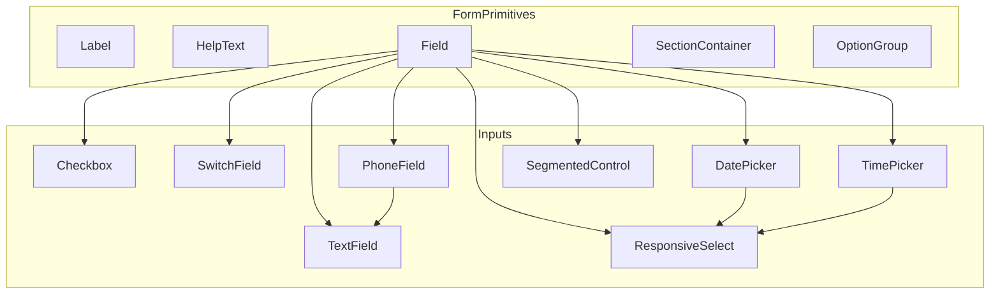
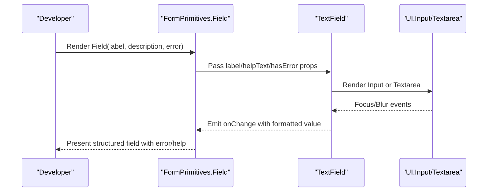
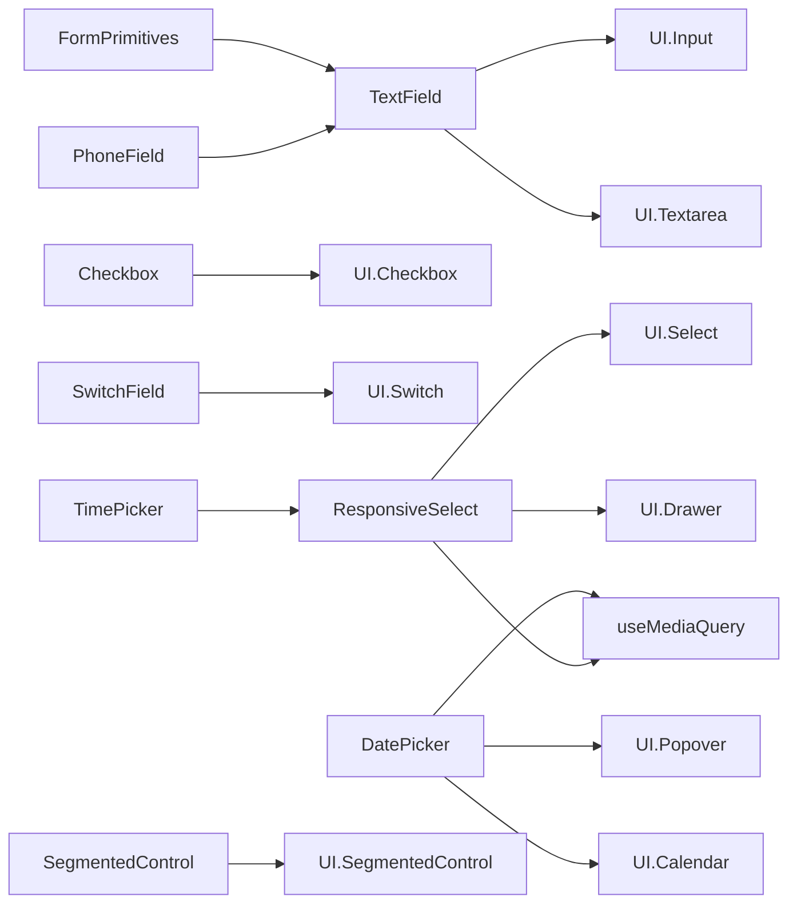

# Form Components

<cite>
**Referenced Files in This Document**
- [FormPrimitives.tsx](file://src/components/common/FormPrimitives/FormPrimitives.tsx)
- [FormPrimitives.module.scss](file://src/components/common/FormPrimitives/FormPrimitives.module.scss)
- [TextField.tsx](file://src/components/common/TextField/TextField.tsx)
- [TextField.module.scss](file://src/components/common/TextField/TextField.module.scss)
- [Checkbox.tsx](file://src/components/common/Checkbox/Checkbox.tsx)
- [Checkbox.module.scss](file://src/components/common/Checkbox/Checkbox.module.scss)
- [SwitchField.tsx](file://src/components/common/SwitchField/SwitchField.tsx)
- [SwitchField.module.scss](file://src/components/common/SwitchField/SwitchField.module.scss)
- [PhoneField.tsx](file://src/components/common/PhoneField/PhoneField.tsx)
- [DatePicker.tsx](file://src/components/common/DatePicker/DatePicker.tsx)
- [DatePicker.module.scss](file://src/components/common/DatePicker/DatePicker.module.scss)
- [TimePicker.tsx](file://src/components/common/TimePicker/TimePicker.tsx)
- [TimePicker.module.scss](file://src/components/common/TimePicker/TimePicker.module.scss)
- [SegmentedControl.tsx](file://src/components/common/SegmentedControl/SegmentedControl.tsx)
- [SegmentedControl.module.scss](file://src/components/common/SegmentedControl/SegmentedControl.module.scss)
- [ResponsiveSelect.tsx](file://src/components/common/ResponsiveSelect/ResponsiveSelect.tsx)
- [ResponsiveSelect.module.scss](file://src/components/common/ResponsiveSelect/ResponsiveSelect.module.scss)
- [index.ts (FormPrimitives)](file://src/components/common/FormPrimitives/index.ts)
- [index.ts (TextField)](file://src/components/common/TextField/index.ts)
- [index.ts (Checkbox)](file://src/components/common/Checkbox/index.ts)
- [index.ts (SwitchField)](file://src/components/common/SwitchField/index.ts)
- [index.ts (PhoneField)](file://src/components/common/PhoneField/index.ts)
- [index.ts (DatePicker)](file://src/components/common/DatePicker/index.ts)
- [index.ts (TimePicker)](file://src/components/common/TimePicker/index.ts)
- [index.ts (SegmentedControl)](file://src/components/common/SegmentedControl/index.ts)
- [index.ts (ResponsiveSelect)](file://src/components/common/ResponsiveSelect/index.ts)
</cite>

## Table of Contents
1. [Introduction](#introduction)
2. [Project Structure](#project-structure)
3. [Core Components](#core-components)
4. [Architecture Overview](#architecture-overview)
5. [Detailed Component Analysis](#detailed-component-analysis)
6. [Dependency Analysis](#dependency-analysis)
7. [Performance Considerations](#performance-considerations)
8. [Troubleshooting Guide](#troubleshooting-guide)
9. [Conclusion](#conclusion)
10. [Appendices](#appendices)

## Introduction
This document describes the form component system used for building input controls and managing forms. It focuses on the FormPrimitives foundation and individual form components: TextField for text input, Checkbox for boolean selections, SwitchField for toggle controls, PhoneField for phone number formatting, DatePicker and TimePicker for date/time selection, SegmentedControl for grouped options, and ResponsiveSelect for dropdown menus. The guide covers validation patterns, accessibility features, error handling, styling approaches, responsive behavior, customization options, and composition patterns for a consistent user experience.

## Project Structure
The form components are organized under a shared common components directory with dedicated modules for each control and a central FormPrimitives module that standardizes labels, help text, field containers, and section grouping. Each component exports a primary component and an index file for convenient imports.

**Diagram sources**
- [FormPrimitives.tsx](file://src/components/common/FormPrimitives/FormPrimitives.tsx#L1-L119)
- [TextField.tsx](file://src/components/common/TextField/TextField.tsx#L1-L77)
- [Checkbox.tsx](file://src/components/common/Checkbox/Checkbox.tsx#L1-L113)
- [SwitchField.tsx](file://src/components/common/SwitchField/SwitchField.tsx#L1-L48)
- [PhoneField.tsx](file://src/components/common/PhoneField/PhoneField.tsx#L1-L40)
- [DatePicker.tsx](file://src/components/common/DatePicker/DatePicker.tsx#L1-L116)
- [TimePicker.tsx](file://src/components/common/TimePicker/TimePicker.tsx#L1-L104)
- [SegmentedControl.tsx](file://src/components/common/SegmentedControl/SegmentedControl.tsx#L1-L49)
- [ResponsiveSelect.tsx](file://src/components/common/ResponsiveSelect/ResponsiveSelect.tsx#L1-L182)

**Section sources**
- [FormPrimitives.tsx](file://src/components/common/FormPrimitives/FormPrimitives.tsx#L1-L119)
- [index.ts (FormPrimitives)](file://src/components/common/FormPrimitives/index.ts)
- [index.ts (TextField)](file://src/components/common/TextField/index.ts)
- [index.ts (Checkbox)](file://src/components/common/Checkbox/index.ts)
- [index.ts (SwitchField)](file://src/components/common/SwitchField/index.ts)
- [index.ts (PhoneField)](file://src/components/common/PhoneField/index.ts)
- [index.ts (DatePicker)](file://src/components/common/DatePicker/index.ts)
- [index.ts (TimePicker)](file://src/components/common/TimePicker/index.ts)
- [index.ts (SegmentedControl)](file://src/components/common/SegmentedControl/index.ts)
- [index.ts (ResponsiveSelect)](file://src/components/common/ResponsiveSelect/index.ts)

## Core Components
This section introduces the foundational building blocks for form layouts and labeling.

- Label: Renders a labeled element with optional required indicator.
- HelpText: Provides contextual info or warning messages with icons and variants.
- Field: A form group container that pairs a label, child input(s), description, and error messaging.
- SectionContainer: A section wrapper for grouping related fields.
- OptionGroup: A layout container for grouped options.

Key behaviors:
- Required asterisk rendering for labels.
- Variants for help text (info/warning).
- Unified spacing and alignment via shared SCSS utilities.
- Accessibility-ready base components (labels bound to inputs via id/name).

**Section sources**
- [FormPrimitives.tsx](file://src/components/common/FormPrimitives/FormPrimitives.tsx#L7-L119)
- [FormPrimitives.module.scss](file://src/components/common/FormPrimitives/FormPrimitives.module.scss#L1-L80)

## Architecture Overview
The form system composes primitive containers with specialized input components. Inputs integrate with shared UI primitives and apply consistent styling and responsive behavior. Some components adapt their presentation and interaction model depending on device breakpoints.

**Diagram sources**
- [FormPrimitives.tsx](file://src/components/common/FormPrimitives/FormPrimitives.tsx#L54-L93)
- [TextField.tsx](file://src/components/common/TextField/TextField.tsx#L18-L77)

## Detailed Component Analysis

### TextField
Purpose: Single-line or multi-line text input with optional right-side adornment and help text.

Highlights:
- Accepts label, help text, error state, multiline support, and rows.
- Wraps UI Input or Textarea and applies error styles and right-aligned adornments.
- Inherits label-to-input association via id/name.

Validation and error handling:
- Error state toggles border and focus styles.
- Label color adapts when errors are present.

Styling and responsiveness:
- Right-side icon area reserved with padding.
- Consistent spacing and typography inherited from shared styles.

Customization:
- Container and input class names passed through.
- Multiline textarea support with explicit rows.

**Section sources**
- [TextField.tsx](file://src/components/common/TextField/TextField.tsx#L1-L77)
- [TextField.module.scss](file://src/components/common/TextField/TextField.module.scss#L1-L47)

### Checkbox
Purpose: Boolean selection with circle or line variants and optional label.

Highlights:
- Supports controlled and uncontrolled modes.
- Legacy compatibility: accepts boolean onChange callbacks and normalizes to boolean.
- Uses unique ids for accessibility and label association.

Variants:
- Circle: rounded appearance.
- Line: default square appearance.

Accessibility:
- Proper label association via htmlFor and unique id generation.

**Section sources**
- [Checkbox.tsx](file://src/components/common/Checkbox/Checkbox.tsx#L1-L113)
- [Checkbox.module.scss](file://src/components/common/Checkbox/Checkbox.module.scss#L1-L25)

### SwitchField
Purpose: Toggle switch with optional label and click-to-toggle behavior.

Highlights:
- Container handles click to toggle state when not disabled.
- Switch component is rendered for accessibility and keyboard support.
- Label click is prevented from bubbling to avoid double-triggering.

Accessibility:
- Click area encapsulates entire row for touch-friendly toggling.
- Disabled state visually and semantically indicates inactive state.

**Section sources**
- [SwitchField.tsx](file://src/components/common/SwitchField/SwitchField.tsx#L1-L48)
- [SwitchField.module.scss](file://src/components/common/SwitchField/SwitchField.module.scss#L1-L51)

### PhoneField
Purpose: Phone number input with automatic formatting and optional icon.

Highlights:
- Wraps TextField and intercepts onChange to format phone numbers.
- Enforces maximum length suitable for phone numbers.
- Optional phone icon displayed on the right side.

Integration:
- Delegates onChange to parent while passing formatted value.

**Section sources**
- [PhoneField.tsx](file://src/components/common/PhoneField/PhoneField.tsx#L1-L40)

### DatePicker
Purpose: Date picker with desktop popover and mobile drawer.

Highlights:
- Desktop: popover-triggered calendar.
- Mobile: drawer-triggered calendar with focus management.
- Parses and formats dates to ISO-like strings.

Responsive behavior:
- Uses media query hook to switch between popover and drawer.
- Drawer header includes screen-reader-only descriptions.

Accessibility:
- Focus moves into drawer content on open to prevent aria warnings.
- Calendar receives focus for keyboard navigation.

**Section sources**
- [DatePicker.tsx](file://src/components/common/DatePicker/DatePicker.tsx#L1-L116)
- [DatePicker.module.scss](file://src/components/common/DatePicker/DatePicker.module.scss#L1-L72)

### TimePicker
Purpose: Time picker composed of two segmented selections: period+hour and minutes.

Highlights:
- Converts 24-hour input to 12-hour display with AM/PM.
- Generates period+hour options and minute options.
- Reconstructs 24-hour time string on change.

Composition:
- Uses ResponsiveSelect internally for both segments.
- ResponsiveSelect provides desktop popover and mobile drawer behavior.

**Section sources**
- [TimePicker.tsx](file://src/components/common/TimePicker/TimePicker.tsx#L1-L104)
- [TimePicker.module.scss](file://src/components/common/TimePicker/TimePicker.module.scss#L1-L22)

### SegmentedControl
Purpose: Grouped option selector with optional icons.

Highlights:
- Generic component supporting string or number values.
- Maps options to items with label and optional icon.
- Size prop maps to small/large variants.

Accessibility:
- Uses underlying segmented control primitives for keyboard navigation.

**Section sources**
- [SegmentedControl.tsx](file://src/components/common/SegmentedControl/SegmentedControl.tsx#L1-L49)
- [SegmentedControl.module.scss](file://src/components/common/SegmentedControl/SegmentedControl.module.scss#L1-L9)

### ResponsiveSelect
Purpose: Cross-device select component with desktop popover and mobile drawer.

Highlights:
- Desktop: standard select with trigger and content.
- Mobile: drawer with scrollable list and selected item highlighting.
- Optimistic value updates to improve perceived responsiveness.
- Scrolls selected item into view when drawer opens.

Accessibility:
- Drawer header includes screen-reader-only descriptions.
- Focus management ensures drawer content receives focus on open.
- Keyboard navigation supported via underlying primitives.

**Section sources**
- [ResponsiveSelect.tsx](file://src/components/common/ResponsiveSelect/ResponsiveSelect.tsx#L1-L182)
- [ResponsiveSelect.module.scss](file://src/components/common/ResponsiveSelect/ResponsiveSelect.module.scss#L1-L92)

## Dependency Analysis
The components depend on shared UI primitives and a responsive media query hook. Some components wrap others to compose behavior and styling.

**Diagram sources**
- [FormPrimitives.tsx](file://src/components/common/FormPrimitives/FormPrimitives.tsx#L1-L119)
- [TextField.tsx](file://src/components/common/TextField/TextField.tsx#L1-L77)
- [Checkbox.tsx](file://src/components/common/Checkbox/Checkbox.tsx#L1-L113)
- [SwitchField.tsx](file://src/components/common/SwitchField/SwitchField.tsx#L1-L48)
- [PhoneField.tsx](file://src/components/common/PhoneField/PhoneField.tsx#L1-L40)
- [DatePicker.tsx](file://src/components/common/DatePicker/DatePicker.tsx#L1-L116)
- [TimePicker.tsx](file://src/components/common/TimePicker/TimePicker.tsx#L1-L104)
- [SegmentedControl.tsx](file://src/components/common/SegmentedControl/SegmentedControl.tsx#L1-L49)
- [ResponsiveSelect.tsx](file://src/components/common/ResponsiveSelect/ResponsiveSelect.tsx#L1-L182)

**Section sources**
- [DatePicker.tsx](file://src/components/common/DatePicker/DatePicker.tsx#L1-L116)
- [ResponsiveSelect.tsx](file://src/components/common/ResponsiveSelect/ResponsiveSelect.tsx#L1-L182)

## Performance Considerations
- Prefer controlled components to minimize re-renders and keep state centralized.
- Use optimistic updates for mobile drawers to reduce perceived latency.
- Avoid heavy computations in render paths; memoize derived values (e.g., formatted phone numbers).
- Limit DOM nodes inside drawers; render only visible options when possible.
- Debounce or throttle frequent updates (e.g., real-time formatting) to balance UX and performance.

## Troubleshooting Guide
Common issues and resolutions:
- Label not associated with input: Ensure id/name is set on the input so the label’s htmlFor matches.
- Error state not visible: Verify hasError prop is passed to TextField and that error text is provided to Field.
- Phone number formatting not applied: Confirm onChange is intercepted and formatted value is forwarded to parent.
- Drawer does not focus on open: Check that onOpenAutoFocus prevents default and focuses the intended element.
- Mobile drawer scroll alignment: Ensure selected item ref is set and scrollIntoView logic runs after open.

**Section sources**
- [TextField.tsx](file://src/components/common/TextField/TextField.tsx#L18-L77)
- [PhoneField.tsx](file://src/components/common/PhoneField/PhoneField.tsx#L10-L40)
- [DatePicker.tsx](file://src/components/common/DatePicker/DatePicker.tsx#L77-L114)
- [ResponsiveSelect.tsx](file://src/components/common/ResponsiveSelect/ResponsiveSelect.tsx#L120-L182)

## Conclusion
The form component system provides a cohesive, accessible, and responsive foundation for building forms. FormPrimitives standardizes layout and semantics, while specialized components encapsulate behavior and styling. By composing these primitives and following the recommended patterns, developers can deliver consistent, user-friendly forms across devices.

## Appendices

### Validation Patterns
- Centralize validation in parent components and pass error messages to Field.
- Use TextField’s hasError to signal invalid states and update help text accordingly.
- For phone numbers, validate post-formatting to ensure consistent lengths and formats.

### Accessibility Features
- Always pair labels with inputs using id/name and htmlFor.
- Provide screen-reader-only descriptions for complex widgets (drawers, calendars).
- Ensure focus moves into interactive regions on open (drawers, popovers).
- Support keyboard navigation and ARIA roles via underlying UI primitives.

### Integration with Form Libraries
- Wrap each component with a form library adapter to manage submission and validation.
- Keep onChange handlers pure and delegate side effects to form library callbacks.
- Use Field to group inputs with labels, descriptions, and errors for consistent UX.

### Styling and Customization
- Extend container and input class names via props to customize appearance.
- Use shared SCSS variables and mixins for consistent spacing and typography.
- Override styles carefully to preserve accessibility and responsive behavior.

### Composition Examples
- Build a contact section using Field and TextField for name/email/phone.
- Compose DatePicker and TimePicker within a datetime section using SectionContainer.
- Use SegmentedControl for grouped preferences and ResponsiveSelect for hierarchical choices.