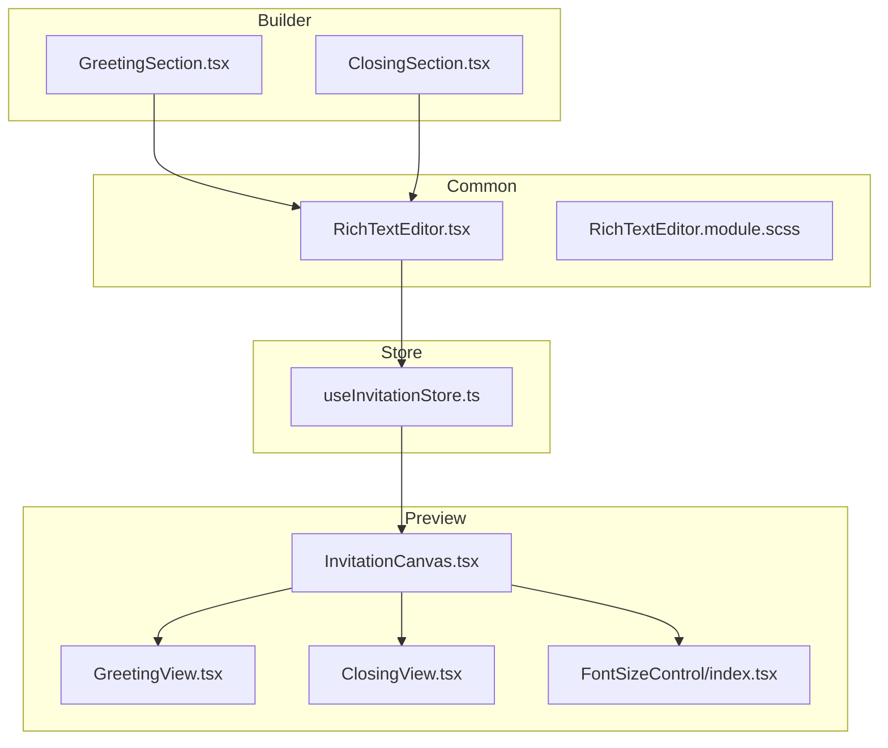
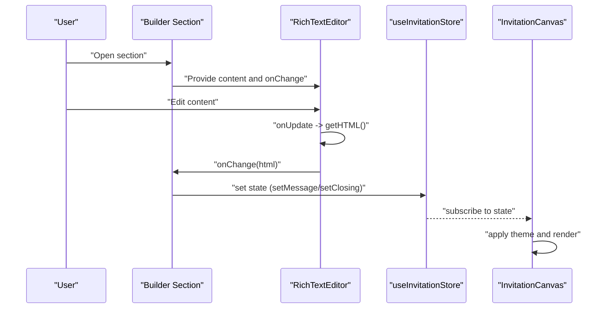
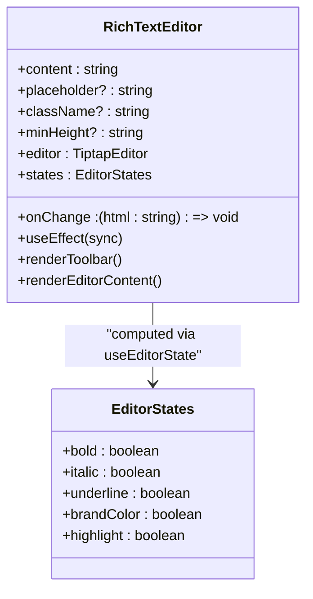
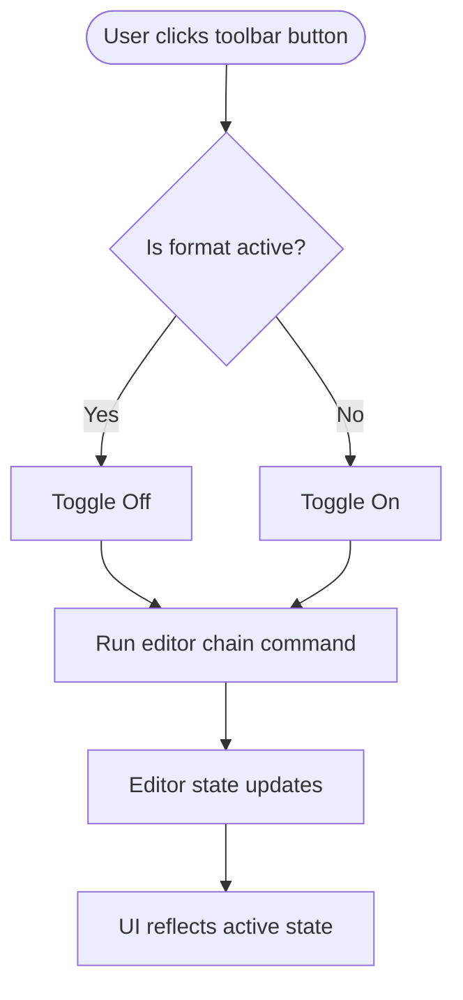
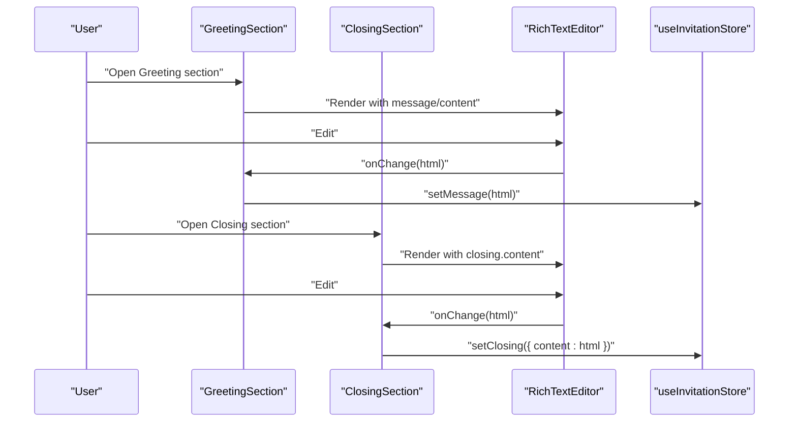
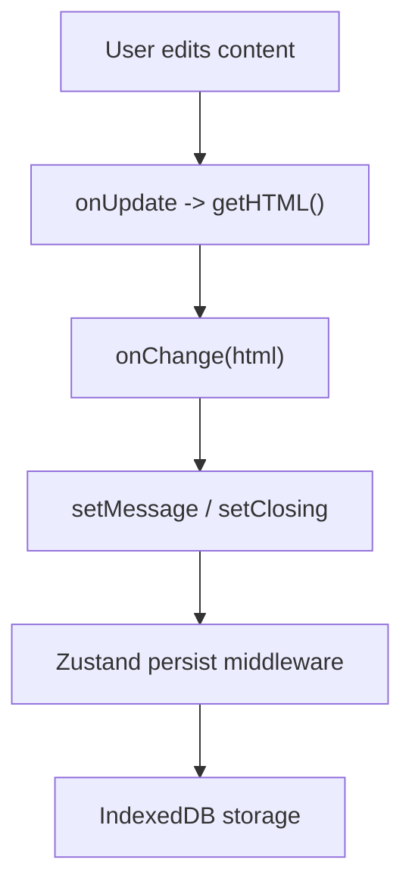
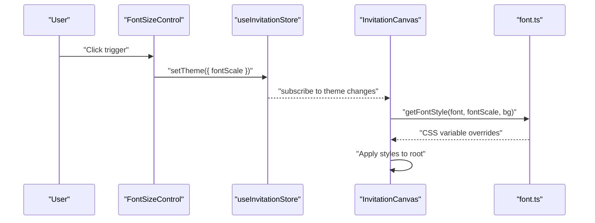
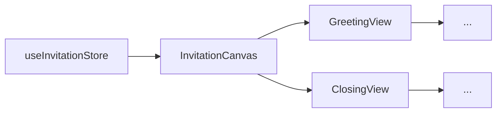
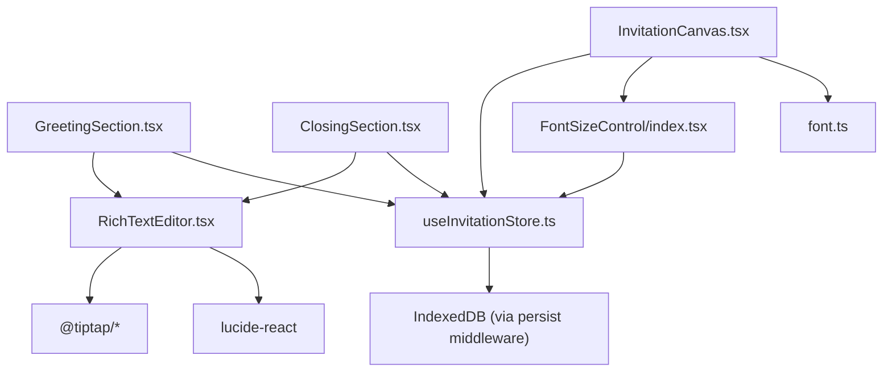

# Rich Text Editor

<cite>
**Referenced Files in This Document**
- [RichTextEditor.tsx](file://src/components/common/RichTextEditor/RichTextEditor.tsx)
- [RichTextEditor.module.scss](file://src/components/common/RichTextEditor/RichTextEditor.module.scss)
- [index.ts](file://src/components/common/RichTextEditor/index.ts)
- [GreetingSection.tsx](file://src/components/builder/sections/GreetingSection.tsx)
- [ClosingSection.tsx](file://src/components/builder/sections/ClosingSection.tsx)
- [useInvitationStore.ts](file://src/store/useInvitationStore.ts)
- [InvitationCanvas.tsx](file://src/components/preview/InvitationCanvas.tsx)
- [GreetingView.tsx](file://src/components/preview/sections/GreetingView.tsx)
- [ClosingView.tsx](file://src/components/preview/sections/ClosingView.tsx)
- [FontSizeControl/index.tsx](file://src/components/preview/elements/FontSizeControl/index.tsx)
- [FontSizeControl.module.scss](file://src/components/preview/elements/FontSizeControl/FontSizeControl.module.scss)
- [font.ts](file://src/lib/utils/font.ts)
- [utils.ts](file://src/lib/utils.ts)
</cite>

## Table of Contents
1. [Introduction](#introduction)
2. [Project Structure](#project-structure)
3. [Core Components](#core-components)
4. [Architecture Overview](#architecture-overview)
5. [Detailed Component Analysis](#detailed-component-analysis)
6. [Dependency Analysis](#dependency-analysis)
7. [Performance Considerations](#performance-considerations)
8. [Troubleshooting Guide](#troubleshooting-guide)
9. [Conclusion](#conclusion)
10. [Appendices](#appendices)

## Introduction
This document explains the Rich Text Editor component built with Tiptap, focusing on content creation and editing within the invitation builder. It covers toolbar customization, formatting controls, integration with the invitation builder sections, content serialization via HTML, validation and persistence using a centralized store, typography adjustments through FontSizeControl, and preview integration. Accessibility and mobile responsiveness are addressed alongside configuration options for allowed formats and custom extensions.

## Project Structure
The Rich Text Editor is implemented as a reusable component and integrated into builder sections and preview views. The editor’s state is managed by a Zustand store and persisted to IndexedDB for offline-friendly editing.

**Diagram sources**
- [GreetingSection.tsx](file://src/components/builder/sections/GreetingSection.tsx#L126-L135)
- [ClosingSection.tsx](file://src/components/builder/sections/ClosingSection.tsx#L72-L78)
- [RichTextEditor.tsx](file://src/components/common/RichTextEditor/RichTextEditor.tsx#L30-L146)
- [useInvitationStore.ts](file://src/store/useInvitationStore.ts#L420-L473)
- [InvitationCanvas.tsx](file://src/components/preview/InvitationCanvas.tsx#L332-L448)
- [GreetingView.tsx](file://src/components/preview/sections/GreetingView.tsx#L96-L100)
- [ClosingView.tsx](file://src/components/preview/sections/ClosingView.tsx#L166-L171)
- [FontSizeControl/index.tsx](file://src/components/preview/elements/FontSizeControl/index.tsx#L9-L66)

**Section sources**
- [GreetingSection.tsx](file://src/components/builder/sections/GreetingSection.tsx#L1-L199)
- [ClosingSection.tsx](file://src/components/builder/sections/ClosingSection.tsx#L1-L107)
- [RichTextEditor.tsx](file://src/components/common/RichTextEditor/RichTextEditor.tsx#L1-L173)
- [useInvitationStore.ts](file://src/store/useInvitationStore.ts#L1-L534)
- [InvitationCanvas.tsx](file://src/components/preview/InvitationCanvas.tsx#L1-L469)
- [GreetingView.tsx](file://src/components/preview/sections/GreetingView.tsx#L1-L158)
- [ClosingView.tsx](file://src/components/preview/sections/ClosingView.tsx#L1-L197)
- [FontSizeControl/index.tsx](file://src/components/preview/elements/FontSizeControl/index.tsx#L1-L67)

## Core Components
- RichTextEditor: A Tiptap-based editor with a minimal toolbar supporting bold, italic, underline, brand color, and highlight. It serializes content to HTML and exposes a controlled onChange handler.
- GreetingSection and ClosingSection: Builder sections that embed the editor for message composition.
- useInvitationStore: Centralized state for invitation data, including message content and theme settings. Persists to IndexedDB for reliability.
- InvitationCanvas and preview views: Renderers that consume stored HTML content and apply typography and effects.
- FontSizeControl: A preview-time UI to adjust font scaling globally.

**Section sources**
- [RichTextEditor.tsx](file://src/components/common/RichTextEditor/RichTextEditor.tsx#L22-L146)
- [GreetingSection.tsx](file://src/components/builder/sections/GreetingSection.tsx#L126-L135)
- [ClosingSection.tsx](file://src/components/builder/sections/ClosingSection.tsx#L72-L78)
- [useInvitationStore.ts](file://src/store/useInvitationStore.ts#L420-L473)
- [InvitationCanvas.tsx](file://src/components/preview/InvitationCanvas.tsx#L291-L294)
- [FontSizeControl/index.tsx](file://src/components/preview/elements/FontSizeControl/index.tsx#L9-L66)

## Architecture Overview
The editor participates in a unidirectional data flow:
- Builder sections pass content and callbacks to RichTextEditor.
- RichTextEditor updates the content via Tiptap’s onUpdate and emits HTML to the parent.
- Parent sections update the Zustand store.
- InvitationCanvas reads from the store and renders previews, applying theme and typography.

**Diagram sources**
- [GreetingSection.tsx](file://src/components/builder/sections/GreetingSection.tsx#L126-L135)
- [ClosingSection.tsx](file://src/components/builder/sections/ClosingSection.tsx#L72-L78)
- [RichTextEditor.tsx](file://src/components/common/RichTextEditor/RichTextEditor.tsx#L53-L55)
- [useInvitationStore.ts](file://src/store/useInvitationStore.ts#L420-L473)
- [InvitationCanvas.tsx](file://src/components/preview/InvitationCanvas.tsx#L455-L468)

## Detailed Component Analysis

### RichTextEditor Implementation
- Tiptap setup: Uses StarterKit, TextStyle, Color, Highlight, and Placeholder. Content is initialized from props and serialized to HTML on update.
- Toolbar: Three toggle buttons for bold, italic, underline; two more for brand color and highlight. States are derived reactively from editor.isActive checks.
- Styling: SCSS module scoping with focus styles, separators, and responsive layout. Editor content inherits theme typography and placeholder behavior.
- State synchronization: A dedicated effect ensures the editor reflects external content changes without triggering updates.

**Diagram sources**
- [RichTextEditor.tsx](file://src/components/common/RichTextEditor/RichTextEditor.tsx#L30-L146)

**Section sources**
- [RichTextEditor.tsx](file://src/components/common/RichTextEditor/RichTextEditor.tsx#L22-L146)
- [RichTextEditor.module.scss](file://src/components/common/RichTextEditor/RichTextEditor.module.scss#L4-L130)

### Toolbar Customization and Formatting Controls
- Buttons: Bold, Italic, Underline, Brand Color, Highlight.
- Behavior: Each button toggles the corresponding Tiptap command. Brand color uses a predefined brand color; highlight uses a brand highlight color.
- Active state: Derived from editor.isActive for each format.

**Diagram sources**
- [RichTextEditor.tsx](file://src/components/common/RichTextEditor/RichTextEditor.tsx#L96-L137)

**Section sources**
- [RichTextEditor.tsx](file://src/components/common/RichTextEditor/RichTextEditor.tsx#L96-L137)

### Integration with Invitation Builder Sections
- GreetingSection: Embeds the editor under the “Content” field. Updates message in the store via setMessage.
- ClosingSection: Embeds the editor for closing content. Updates closing.content via setClosing.
- Both sections conditionally render the editor only when their accordion is open to optimize performance.

**Diagram sources**
- [GreetingSection.tsx](file://src/components/builder/sections/GreetingSection.tsx#L126-L135)
- [ClosingSection.tsx](file://src/components/builder/sections/ClosingSection.tsx#L72-L78)
- [useInvitationStore.ts](file://src/store/useInvitationStore.ts#L420-L473)

**Section sources**
- [GreetingSection.tsx](file://src/components/builder/sections/GreetingSection.tsx#L126-L135)
- [ClosingSection.tsx](file://src/components/builder/sections/ClosingSection.tsx#L72-L78)

### Content Serialization, Validation, and Storage
- Serialization: The editor emits HTML via editor.getHTML() on each update.
- Validation: No explicit runtime validation is performed in the editor; validation can be added at the section level if needed.
- Storage: Content is stored in the Zustand store and persisted to IndexedDB via a storage middleware. The store merges persisted data with defaults and supports deep merging of nested objects.

**Diagram sources**
- [RichTextEditor.tsx](file://src/components/common/RichTextEditor/RichTextEditor.tsx#L53-L55)
- [useInvitationStore.ts](file://src/store/useInvitationStore.ts#L420-L473)
- [useInvitationStore.ts](file://src/store/useInvitationStore.ts#L474-L533)

**Section sources**
- [RichTextEditor.tsx](file://src/components/common/RichTextEditor/RichTextEditor.tsx#L53-L55)
- [useInvitationStore.ts](file://src/store/useInvitationStore.ts#L474-L533)

### Typography Adjustments with FontSizeControl
- Purpose: Allows users to adjust font scale in preview mode. Changes update the theme.fontScale in the store.
- Integration: InvitationCanvas mounts FontSizeControl and applies the scale via getFontStyle, which sets CSS variables for font family and scale.
- Preview-only UX: The control appears only in preview mode and does not affect builder content.

**Diagram sources**
- [FontSizeControl/index.tsx](file://src/components/preview/elements/FontSizeControl/index.tsx#L9-L66)
- [InvitationCanvas.tsx](file://src/components/preview/InvitationCanvas.tsx#L291-L294)
- [font.ts](file://src/lib/utils/font.ts#L34-L56)

**Section sources**
- [FontSizeControl/index.tsx](file://src/components/preview/elements/FontSizeControl/index.tsx#L9-L66)
- [FontSizeControl.module.scss](file://src/components/preview/elements/FontSizeControl/FontSizeControl.module.scss#L1-L93)
- [InvitationCanvas.tsx](file://src/components/preview/InvitationCanvas.tsx#L291-L294)
- [font.ts](file://src/lib/utils/font.ts#L34-L56)

### Preview Integration
- GreetingView and ClosingView render rich-text content using dangerouslySetInnerHTML with a shared class for consistent styling.
- InvitationCanvas composes sections and applies theme, effects, and animations. It also hosts FontSizeControl for preview font scaling.

**Diagram sources**
- [useInvitationStore.ts](file://src/store/useInvitationStore.ts#L420-L473)
- [InvitationCanvas.tsx](file://src/components/preview/InvitationCanvas.tsx#L332-L448)
- [GreetingView.tsx](file://src/components/preview/sections/GreetingView.tsx#L96-L100)
- [ClosingView.tsx](file://src/components/preview/sections/ClosingView.tsx#L166-L171)

**Section sources**
- [GreetingView.tsx](file://src/components/preview/sections/GreetingView.tsx#L96-L100)
- [ClosingView.tsx](file://src/components/preview/sections/ClosingView.tsx#L166-L171)
- [InvitationCanvas.tsx](file://src/components/preview/InvitationCanvas.tsx#L332-L448)

### Accessibility Features
- Focus management: EditorContent receives focus:outline-none via editorProps, while toolbar buttons support focus-visible styling.
- Keyboard operable: Buttons use native button semantics and data-state attributes for visual feedback.
- ARIA: The FontSizeControl trigger uses aria-label for screen reader support.

**Section sources**
- [RichTextEditor.tsx](file://src/components/common/RichTextEditor/RichTextEditor.tsx#L56-L60)
- [RichTextEditor.module.scss](file://src/components/common/RichTextEditor/RichTextEditor.module.scss#L90-L95)
- [FontSizeControl/index.tsx](file://src/components/preview/elements/FontSizeControl/index.tsx#L60-L61)

### Mobile-Responsive Design Considerations
- Toolbar layout: Flex wrap and compact spacing accommodate narrow screens.
- Editor content: Minimum height and padding ensure readability on small devices.
- Preview font scaling: FontSizeControl provides quick adjustments for readability.

**Section sources**
- [RichTextEditor.module.scss](file://src/components/common/RichTextEditor/RichTextEditor.module.scss#L18-L40)
- [RichTextEditor.module.scss](file://src/components/common/RichTextEditor/RichTextEditor.module.scss#L97-L130)
- [FontSizeControl.module.scss](file://src/components/preview/elements/FontSizeControl/FontSizeControl.module.scss#L4-L13)

### Configuration Options
- Allowed formats: The editor uses Tiptap StarterKit, enabling basic inline formatting (bold, italic, underline) and block nodes. Additional extensions can be added to expand capabilities.
- Custom extensions: The editor’s extensions array is the place to add custom nodes or marks (e.g., lists, code, links).
- Placeholder: Configurable via props; defaults to localized text.
- Styling hooks: EditorContent receives a class for consistent styling across builder and preview.

**Section sources**
- [RichTextEditor.tsx](file://src/components/common/RichTextEditor/RichTextEditor.tsx#L41-L61)
- [RichTextEditor.tsx](file://src/components/common/RichTextEditor/RichTextEditor.tsx#L140-L143)

## Dependency Analysis
- RichTextEditor depends on Tiptap packages and Lucide icons for toolbar visuals.
- Builder sections depend on the editor and Zustand store for state management.
- Preview components depend on the store and typography utilities for rendering.
- FontSizeControl depends on the store for theme updates and SCSS for animations.

**Diagram sources**
- [RichTextEditor.tsx](file://src/components/common/RichTextEditor/RichTextEditor.tsx#L3-L17)
- [GreetingSection.tsx](file://src/components/builder/sections/GreetingSection.tsx#L1-L20)
- [ClosingSection.tsx](file://src/components/builder/sections/ClosingSection.tsx#L1-L21)
- [useInvitationStore.ts](file://src/store/useInvitationStore.ts#L474-L533)
- [InvitationCanvas.tsx](file://src/components/preview/InvitationCanvas.tsx#L19-L19)
- [FontSizeControl/index.tsx](file://src/components/preview/elements/FontSizeControl/index.tsx#L1-L6)
- [font.ts](file://src/lib/utils/font.ts#L1-L57)

**Section sources**
- [RichTextEditor.tsx](file://src/components/common/RichTextEditor/RichTextEditor.tsx#L3-L17)
- [useInvitationStore.ts](file://src/store/useInvitationStore.ts#L474-L533)
- [InvitationCanvas.tsx](file://src/components/preview/InvitationCanvas.tsx#L19-L19)
- [font.ts](file://src/lib/utils/font.ts#L1-L57)

## Performance Considerations
- Conditional rendering: Editor is mounted only when the section is open to reduce initial bundle and DOM work.
- Immediate render disabled: useEditor.immediatelyRender=false reduces SSR overhead.
- Efficient updates: useEditorState computes toolbar states without full re-renders.
- Preview font scaling: CSS variables minimize reflows when adjusting scale.

**Section sources**
- [GreetingSection.tsx](file://src/components/builder/sections/GreetingSection.tsx#L128-L134)
- [RichTextEditor.tsx](file://src/components/common/RichTextEditor/RichTextEditor.tsx#L52-L61)
- [InvitationCanvas.tsx](file://src/components/preview/InvitationCanvas.tsx#L291-L294)

## Troubleshooting Guide
- Content not updating: Ensure the editor’s content prop is synchronized; a dedicated effect resets content when external changes occur.
- Placeholder not visible: Verify Placeholder extension configuration and that the editor is not focused.
- Styling inconsistencies: Confirm the shared class for rich-text content is applied in both builder and preview components.
- Preview font not changing: Check that theme.fontScale is updated and getFontStyle is applied to the canvas wrapper.

**Section sources**
- [RichTextEditor.tsx](file://src/components/common/RichTextEditor/RichTextEditor.tsx#L84-L88)
- [RichTextEditor.tsx](file://src/components/common/RichTextEditor/RichTextEditor.tsx#L47-L49)
- [GreetingView.tsx](file://src/components/preview/sections/GreetingView.tsx#L96-L100)
- [ClosingView.tsx](file://src/components/preview/sections/ClosingView.tsx#L166-L171)
- [InvitationCanvas.tsx](file://src/components/preview/InvitationCanvas.tsx#L291-L294)

## Conclusion
The Rich Text Editor provides a robust, accessible, and customizable content authoring experience integrated into the invitation builder. Its HTML-based serialization, store-backed persistence, and preview-time typography control deliver a cohesive authoring-to-preview pipeline. Extensibility is straightforward through Tiptap extensions, and the component’s modular design supports reuse across sections.

## Appendices
- Example usage paths:
  - Greeting message editor: [GreetingSection.tsx](file://src/components/builder/sections/GreetingSection.tsx#L126-L135)
  - Closing message editor: [ClosingSection.tsx](file://src/components/builder/sections/ClosingSection.tsx#L72-L78)
  - Editor component: [RichTextEditor.tsx](file://src/components/common/RichTextEditor/RichTextEditor.tsx#L30-L146)
  - Store persistence: [useInvitationStore.ts](file://src/store/useInvitationStore.ts#L474-L533)
  - Preview rendering: [InvitationCanvas.tsx](file://src/components/preview/InvitationCanvas.tsx#L332-L448)
  - Typography control: [FontSizeControl/index.tsx](file://src/components/preview/elements/FontSizeControl/index.tsx#L9-L66)