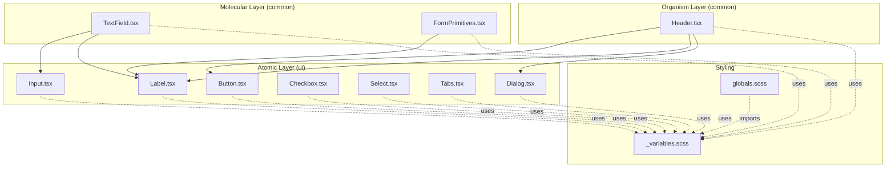
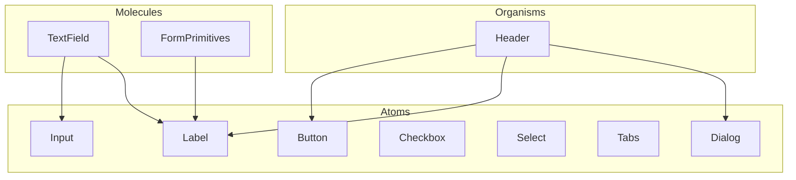
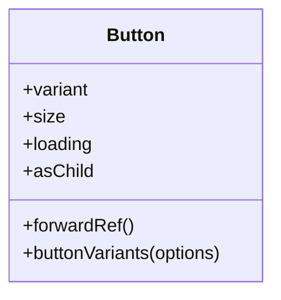
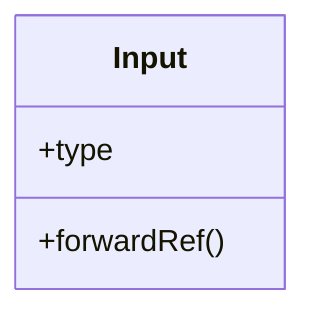
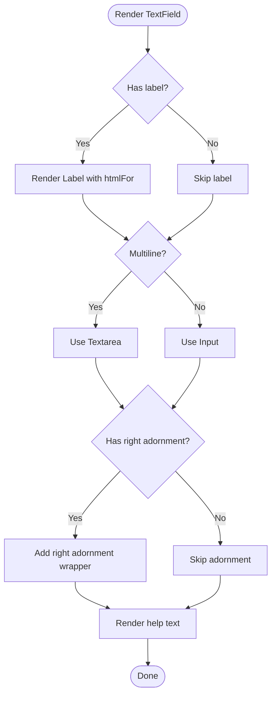
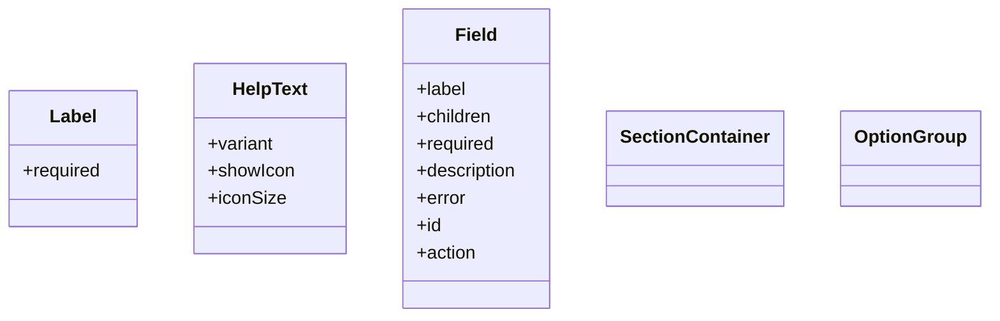
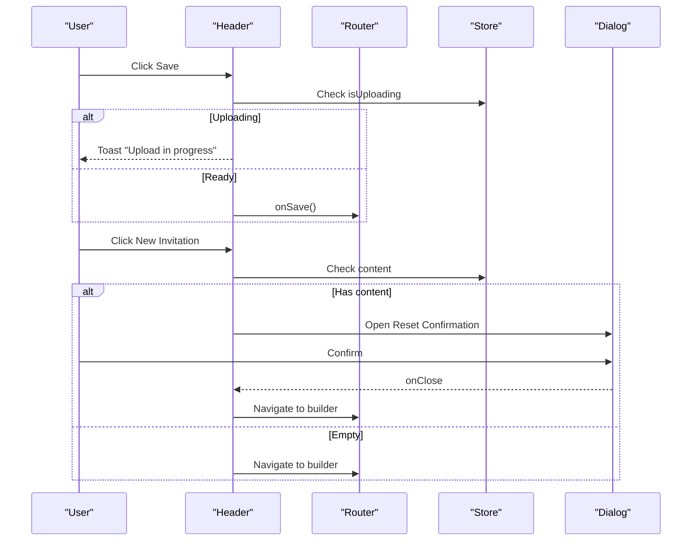
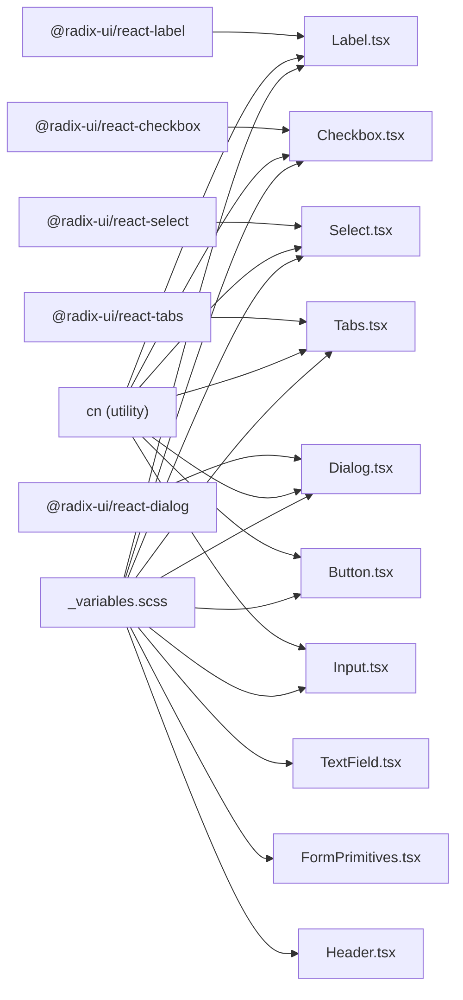

# UI Components

<cite>
**Referenced Files in This Document**
- [Button.tsx](file://src/components/ui/Button/Button.tsx)
- [Button.module.scss](file://src/components/ui/Button/Button.module.scss)
- [Input.tsx](file://src/components/ui/Input/Input.tsx)
- [Label.tsx](file://src/components/ui/Label/Label.tsx)
- [Checkbox.tsx](file://src/components/ui/Checkbox/Checkbox.tsx)
- [Select.tsx](file://src/components/ui/Select/Select.tsx)
- [Tabs.tsx](file://src/components/ui/Tabs/Tabs.tsx)
- [Dialog.tsx](file://src/components/ui/Dialog/Dialog.tsx)
- [TextField.tsx](file://src/components/common/TextField/TextField.tsx)
- [FormPrimitives.tsx](file://src/components/common/FormPrimitives/FormPrimitives.tsx)
- [Header.tsx](file://src/components/common/Header/Header.tsx)
- [_variables.scss](file://src/styles/_variables.scss)
- [globals.scss](file://src/styles/globals.scss)
- [useAccessibility.tsx](file://src/hooks/useAccessibility.tsx)
- [accessibility.test.ts](file://src/test/accessibility.test.ts)
</cite>

## Table of Contents
1. [Introduction](#introduction)
2. [Project Structure](#project-structure)
3. [Core Components](#core-components)
4. [Architecture Overview](#architecture-overview)
5. [Detailed Component Analysis](#detailed-component-analysis)
6. [Dependency Analysis](#dependency-analysis)
7. [Performance Considerations](#performance-considerations)
8. [Troubleshooting Guide](#troubleshooting-guide)
9. [Conclusion](#conclusion)
10. [Appendices](#appendices)

## Introduction
This document describes the UI component system built with atomic design principles and integrated with the TDS Mobile-inspired design system. The system is composed of:
- Atoms: Primitive UI elements such as Button, Input, Label, Checkbox, Select, Tabs, and Dialog.
- Molecules: Composed components like TextField and FormPrimitives that combine atoms into functional groups.
- Organisms: Higher-order components such as Header that orchestrate molecules and atoms into cohesive UI sections.

The foundation leverages Radix UI primitives for accessible base behavior and SCSS modules for styling. The design system defines theme tokens via SCSS variables and applies consistent spacing, typography, transitions, and z-index layers. Accessibility is embedded through explicit ARIA attributes, focus management utilities, and screen-reader announcements.

## Project Structure
The component system is organized by atomic levels under src/components:
- ui/: Atomic components built on Radix UI primitives with SCSS modules.
- common/: Molecules and organisms that compose atoms into form controls and page sections.
- styles/: Shared SCSS variables and global styles that define the design system tokens.

**Diagram sources**
- [Button.tsx](file://src/components/ui/Button/Button.tsx#L1-L80)
- [Input.tsx](file://src/components/ui/Input/Input.tsx#L1-L21)
- [Label.tsx](file://src/components/ui/Label/Label.tsx#L1-L21)
- [Checkbox.tsx](file://src/components/ui/Checkbox/Checkbox.tsx#L1-L28)
- [Select.tsx](file://src/components/ui/Select/Select.tsx#L1-L181)
- [Tabs.tsx](file://src/components/ui/Tabs/Tabs.tsx#L1-L47)
- [Dialog.tsx](file://src/components/ui/Dialog/Dialog.tsx#L1-L98)
- [TextField.tsx](file://src/components/common/TextField/TextField.tsx#L1-L77)
- [FormPrimitives.tsx](file://src/components/common/FormPrimitives/FormPrimitives.tsx#L1-L119)
- [Header.tsx](file://src/components/common/Header/Header.tsx#L1-L196)
- [_variables.scss](file://src/styles/_variables.scss#L1-L127)
- [globals.scss](file://src/styles/globals.scss#L1-L14)

**Section sources**
- [Button.tsx](file://src/components/ui/Button/Button.tsx#L1-L80)
- [Input.tsx](file://src/components/ui/Input/Input.tsx#L1-L21)
- [Label.tsx](file://src/components/ui/Label/Label.tsx#L1-L21)
- [Checkbox.tsx](file://src/components/ui/Checkbox/Checkbox.tsx#L1-L28)
- [Select.tsx](file://src/components/ui/Select/Select.tsx#L1-L181)
- [Tabs.tsx](file://src/components/ui/Tabs/Tabs.tsx#L1-L47)
- [Dialog.tsx](file://src/components/ui/Dialog/Dialog.tsx#L1-L98)
- [TextField.tsx](file://src/components/common/TextField/TextField.tsx#L1-L77)
- [FormPrimitives.tsx](file://src/components/common/FormPrimitives/FormPrimitives.tsx#L1-L119)
- [Header.tsx](file://src/components/common/Header/Header.tsx#L1-L196)
- [_variables.scss](file://src/styles/_variables.scss#L1-L127)
- [globals.scss](file://src/styles/globals.scss#L1-L14)

## Core Components
This section documents the atomic components and their composition into molecules and organisms.

- Button
  - Purpose: Action trigger with variants, sizes, and loading state.
  - Props: variant, size, loading, asChild, plus standard button attributes.
  - Behavior: Renders a slot or button element; disables on loading; exposes a variants helper for external consumers.
  - Styling: Uses SCSS module classes keyed by variant and size.
  - Accessibility: Inherits native button semantics; supports aria attributes via spread.

- Input
  - Purpose: Low-level text input primitive.
  - Props: type, plus standard input attributes.
  - Styling: SCSS module class applied via utility.

- Label
  - Purpose: Associates text with form controls.
  - Props: Inherits Radix Label props.
  - Accessibility: Uses Radix primitive for correct labeling semantics.

- Checkbox
  - Purpose: Two-state selection control.
  - Props: Inherits Radix Checkbox props.
  - Styling: Indicator renders a checkmark icon.

- Select
  - Purpose: Accessible dropdown with trigger, content, items, and scroll indicators.
  - Features: Auto-fade overlays on scroll, popper positioning, portal rendering.
  - Props: Trigger, Content, Item, Label, Separator, Scroll buttons.
  - Accessibility: Uses Radix Select primitives; supports keyboard navigation and ARIA.

- Tabs
  - Purpose: Tabbed interface with list, triggers, and content panes.
  - Props: Root, List, Trigger, Content.
  - Accessibility: Uses Radix Tabs for keyboard navigation and ARIA roles.

- Dialog
  - Purpose: Modal overlay with close button and optional header/footer/title/description slots.
  - Features: Portal rendering, overlay, close button with screen-reader text.
  - Props: Root, Portal, Overlay, Close, Trigger, Content, Header, Footer, Title, Description.
  - Accessibility: Proper ARIA roles and focus management.

- TextField (Molecule)
  - Purpose: Labeled input wrapper supporting single-line and multi-line modes, help text, error state, and right-aligned adornments.
  - Composition: Uses Input or Textarea, Label, and HelpText.
  - Props: label, helpText, hasError, right, multiline, rows, plus input attributes.

- FormPrimitives (Molecule)
  - Purpose: Shared form building blocks: Label (with required indicator), HelpText (info/warning), Field (group container), SectionContainer, OptionGroup.
  - Props: Variants and attributes mirror underlying components.

- Header (Organism)
  - Purpose: Top navigation bar with logo, actions, save, and user-related controls.
  - Composition: Uses Button, IconButton, ResponsiveModal, and stores/router hooks.
  - Accessibility: Provides aria-labels for icons; integrates dialogs and toasts.

**Section sources**
- [Button.tsx](file://src/components/ui/Button/Button.tsx#L16-L41)
- [Input.tsx](file://src/components/ui/Input/Input.tsx#L5-L18)
- [Label.tsx](file://src/components/ui/Label/Label.tsx#L8-L18)
- [Checkbox.tsx](file://src/components/ui/Checkbox/Checkbox.tsx#L9-L25)
- [Select.tsx](file://src/components/ui/Select/Select.tsx#L15-L124)
- [Tabs.tsx](file://src/components/ui/Tabs/Tabs.tsx#L10-L44)
- [Dialog.tsx](file://src/components/ui/Dialog/Dialog.tsx#L24-L84)
- [TextField.tsx](file://src/components/common/TextField/TextField.tsx#L8-L33)
- [FormPrimitives.tsx](file://src/components/common/FormPrimitives/FormPrimitives.tsx#L9-L20)
- [Header.tsx](file://src/components/common/Header/Header.tsx#L26-L195)

## Architecture Overview
The component architecture follows atomic design:
- Atoms encapsulate base behaviors and styling.
- Molecules combine atoms into functional units (e.g., TextField).
- Organisms assemble molecules and atoms into page sections (e.g., Header).

**Diagram sources**
- [Button.tsx](file://src/components/ui/Button/Button.tsx#L1-L80)
- [Input.tsx](file://src/components/ui/Input/Input.tsx#L1-L21)
- [Label.tsx](file://src/components/ui/Label/Label.tsx#L1-L21)
- [Checkbox.tsx](file://src/components/ui/Checkbox/Checkbox.tsx#L1-L28)
- [Select.tsx](file://src/components/ui/Select/Select.tsx#L1-L181)
- [Tabs.tsx](file://src/components/ui/Tabs/Tabs.tsx#L1-L47)
- [Dialog.tsx](file://src/components/ui/Dialog/Dialog.tsx#L1-L98)
- [TextField.tsx](file://src/components/common/TextField/TextField.tsx#L1-L77)
- [FormPrimitives.tsx](file://src/components/common/FormPrimitives/FormPrimitives.tsx#L1-L119)
- [Header.tsx](file://src/components/common/Header/Header.tsx#L1-L196)

## Detailed Component Analysis

### Button Component
- Implementation pattern: ForwardRef component with Radix Slot for composition, clsx for conditional classes, and a variants helper for external usage.
- Props: variant, size, loading, asChild, and standard button attributes.
- Accessibility: Inherits button semantics; disabled state respects loading flag; aria attributes supported via spread.

**Diagram sources**
- [Button.tsx](file://src/components/ui/Button/Button.tsx#L16-L77)

**Section sources**
- [Button.tsx](file://src/components/ui/Button/Button.tsx#L16-L77)
- [Button.module.scss](file://src/components/ui/Button/Button.module.scss)

### Input Component
- Implementation pattern: ForwardRef input with SCSS module class and utility class merging.
- Props: type and standard input attributes.

**Diagram sources**
- [Input.tsx](file://src/components/ui/Input/Input.tsx#L5-L18)

**Section sources**
- [Input.tsx](file://src/components/ui/Input/Input.tsx#L1-L21)

### TextField (Molecule)
- Implementation pattern: Composes Input or Textarea with Label and optional help/error states; supports right-side adornments and multiline mode.
- Props: label, helpText, hasError, right, multiline, rows, and input attributes.

**Diagram sources**
- [TextField.tsx](file://src/components/common/TextField/TextField.tsx#L18-L73)

**Section sources**
- [TextField.tsx](file://src/components/common/TextField/TextField.tsx#L1-L77)

### FormPrimitives (Molecule)
- Implementation pattern: Provides shared form primitives:
  - Label with required asterisk.
  - HelpText with info/warning variants and icons.
  - Field group container with label, description, error, and action.
  - SectionContainer and OptionGroup for layout.

**Diagram sources**
- [FormPrimitives.tsx](file://src/components/common/FormPrimitives/FormPrimitives.tsx#L9-L118)

**Section sources**
- [FormPrimitives.tsx](file://src/components/common/FormPrimitives/FormPrimitives.tsx#L1-L119)

### Header (Organism)
- Implementation pattern: Orchestrates Button, IconButton, ResponsiveModal, and stores/router hooks; handles save flow, user actions, and navigation.
- Accessibility: Uses aria-labels on actionable icons; integrates dialogs and toasts.

**Diagram sources**
- [Header.tsx](file://src/components/common/Header/Header.tsx#L75-L95)
- [Header.tsx](file://src/components/common/Header/Header.tsx#L162-L195)

**Section sources**
- [Header.tsx](file://src/components/common/Header/Header.tsx#L1-L196)

## Dependency Analysis
- Radix UI primitives underpin accessibility and behavior for Label, Checkbox, Select, Tabs, and Dialog.
- SCSS modules provide consistent styling across components.
- Utilities like clsx (via cn) merge classes; focus trap and skip-link utilities support accessibility.
- Test coverage validates basic accessibility checks in a DOM environment.

**Diagram sources**
- [Label.tsx](file://src/components/ui/Label/Label.tsx#L4-L6)
- [Checkbox.tsx](file://src/components/ui/Checkbox/Checkbox.tsx#L4-L6)
- [Select.tsx](file://src/components/ui/Select/Select.tsx#L4-L6)
- [Tabs.tsx](file://src/components/ui/Tabs/Tabs.tsx#L4-L5)
- [Dialog.tsx](file://src/components/ui/Dialog/Dialog.tsx#L2-L4)
- [Button.tsx](file://src/components/ui/Button/Button.tsx#L4-L5)
- [Input.tsx](file://src/components/ui/Input/Input.tsx#L2-L2)
- [_variables.scss](file://src/styles/_variables.scss#L1-L127)
- [TextField.tsx](file://src/components/common/TextField/TextField.tsx#L1-L6)
- [FormPrimitives.tsx](file://src/components/common/FormPrimitives/FormPrimitives.tsx#L1-L4)
- [Header.tsx](file://src/components/common/Header/Header.tsx#L1-L15)

**Section sources**
- [Label.tsx](file://src/components/ui/Label/Label.tsx#L1-L21)
- [Checkbox.tsx](file://src/components/ui/Checkbox/Checkbox.tsx#L1-L28)
- [Select.tsx](file://src/components/ui/Select/Select.tsx#L1-L181)
- [Tabs.tsx](file://src/components/ui/Tabs/Tabs.tsx#L1-L47)
- [Dialog.tsx](file://src/components/ui/Dialog/Dialog.tsx#L1-L98)
- [Button.tsx](file://src/components/ui/Button/Button.tsx#L1-L80)
- [Input.tsx](file://src/components/ui/Input/Input.tsx#L1-L21)
- [_variables.scss](file://src/styles/_variables.scss#L1-L127)

## Performance Considerations
- Prefer lazy loading for heavy components rendered conditionally (e.g., Button inside a modal).
- Minimize re-renders by keeping component props stable and using shallow selectors for stores.
- Use portals for overlays (Dialog) to avoid layout thrashing.
- Keep SCSS modules scoped to reduce cascade and improve build performance.

[No sources needed since this section provides general guidance]

## Troubleshooting Guide
- Focus Management
  - Use focus traps in modals/dialogs to constrain tab order.
  - Provide skip links for keyboard navigation.
  - Announce dynamic messages to screen readers.

- Accessibility Checks
  - Validate heading hierarchy, ARIA labels, focus order, and image alt text.
  - Ensure landmarks and roles are present.

- Common Issues
  - Disabled states: Buttons disable during loading; verify loading flags propagate.
  - Select overlays: Scroll fade indicators appear when content is scrollable; ensure viewport sizing is correct.
  - Dialogs: Close button includes screen-reader-only text; confirm portal rendering.

**Section sources**
- [useAccessibility.tsx](file://src/hooks/useAccessibility.tsx#L22-L77)
- [accessibility.test.ts](file://src/test/accessibility.test.ts#L13-L111)

## Conclusion
The UI component system blends atomic design with Radix UI primitives and a SCSS-based design system. Atoms provide accessible foundations; molecules compose them into form-focused components; organisms integrate state and navigation. The design system’s tokens unify spacing, color, typography, and transitions. Accessibility is embedded through ARIA, focus utilities, and tests, ensuring WCAG-friendly experiences across devices.

[No sources needed since this section summarizes without analyzing specific files]

## Appendices

### Design System Tokens (SCSS Variables)
- Colors: Primary palette, backgrounds, borders, and destructive states.
- Typography: Font families and sizes.
- Spacing & Layout: Border radius, input height, canvas max width, and z-index layers.
- Transitions: Duration and easing presets.
- Popup animations: iOS-style easing and transforms.

**Section sources**
- [_variables.scss](file://src/styles/_variables.scss#L1-L127)
- [globals.scss](file://src/styles/globals.scss#L1-L14)

### Component Usage Patterns
- Button
  - Variant options include default, destructive, outline, secondary, ghost, link, solid, line.
  - Size options include default, sm, lg, icon, icon-sm, icon-lg.
  - Use the variants helper for external integrations.

- TextField
  - Combine with Label and HelpText for accessible forms.
  - Support multiline via rows; add right adornments for icons or badges.

- Dialog
  - Use Portal to render overlay outside layout boundaries.
  - Provide Title and Description for semantic structure.

**Section sources**
- [Button.tsx](file://src/components/ui/Button/Button.tsx#L16-L41)
- [TextField.tsx](file://src/components/common/TextField/TextField.tsx#L18-L73)
- [Dialog.tsx](file://src/components/ui/Dialog/Dialog.tsx#L24-L84)