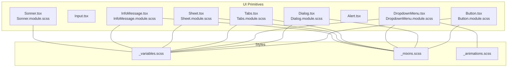
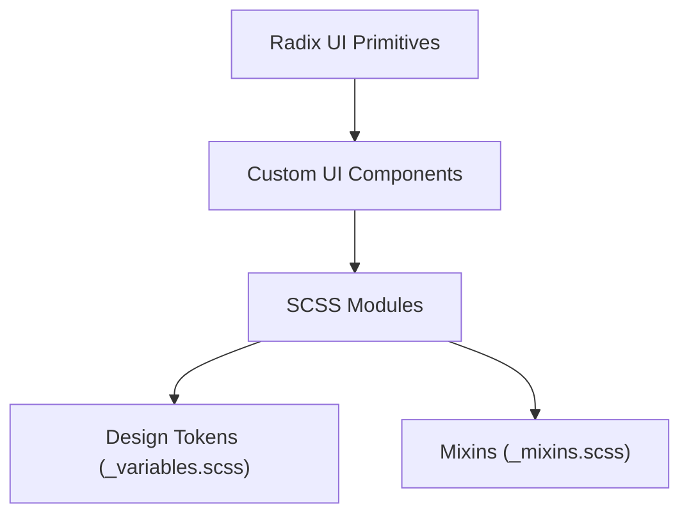
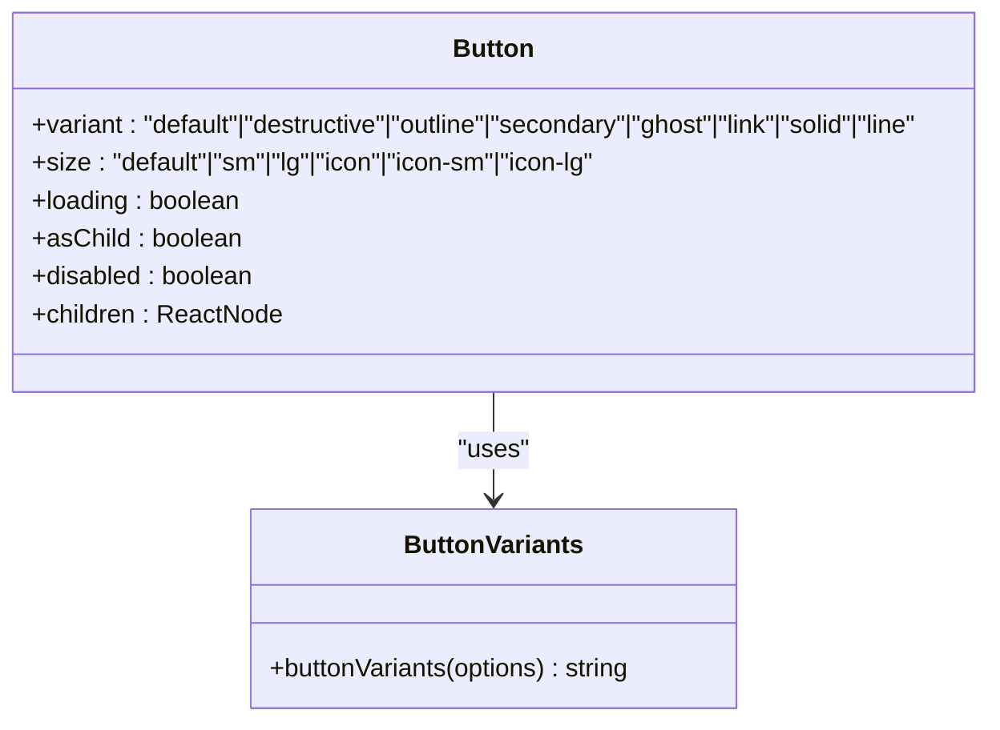
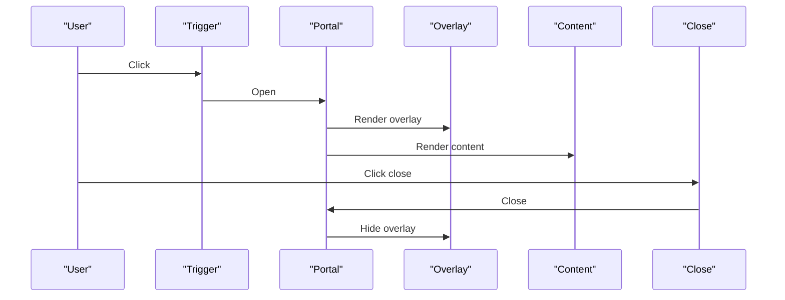
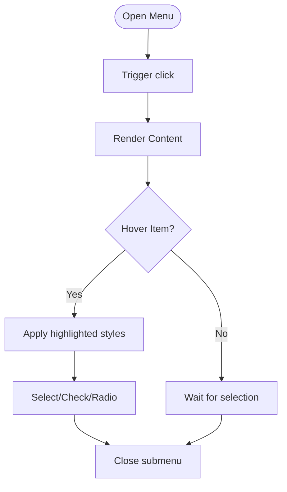
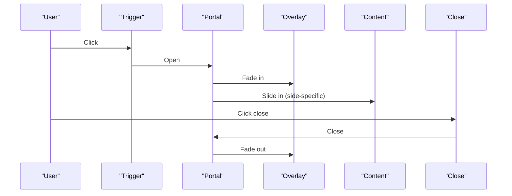
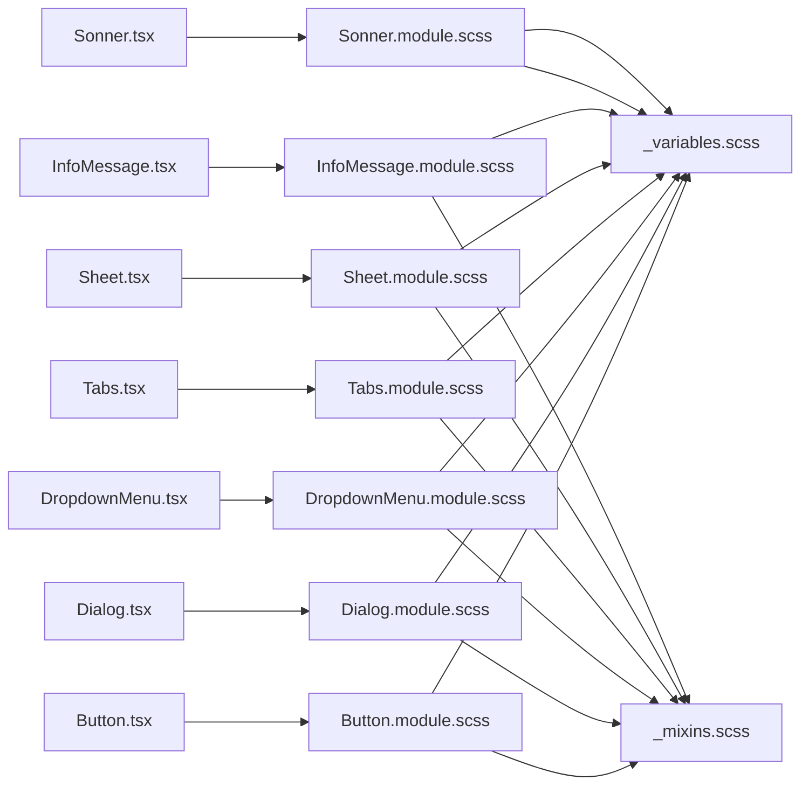

# UI Primitive Components

<cite>
**Referenced Files in This Document**
- [Button.tsx](file://src/components/ui/Button/Button.tsx)
- [Button.module.scss](file://src/components/ui/Button/Button.module.scss)
- [Input.tsx](file://src/components/ui/Input/Input.tsx)
- [Dialog.tsx](file://src/components/ui/Dialog/Dialog.tsx)
- [Dialog.module.scss](file://src/components/ui/Dialog/Dialog.module.scss)
- [DropdownMenu.tsx](file://src/components/ui/DropdownMenu/DropdownMenu.tsx)
- [DropdownMenu.module.scss](file://src/components/ui/DropdownMenu/DropdownMenu.module.scss)
- [Tabs.tsx](file://src/components/ui/Tabs/Tabs.tsx)
- [Tabs.module.scss](file://src/components/ui/Tabs/Tabs.module.scss)
- [Sheet.tsx](file://src/components/ui/Sheet/Sheet.tsx)
- [Sheet.module.scss](file://src/components/ui/Sheet/Sheet.module.scss)
- [Alert.tsx](file://src/components/ui/Alert/Alert.tsx)
- [InfoMessage.tsx](file://src/components/ui/InfoMessage/InfoMessage.tsx)
- [InfoMessage.module.scss](file://src/components/ui/InfoMessage/InfoMessage.module.scss)
- [Sonner.tsx](file://src/components/ui/Sonner/Sonner.tsx)
- [Sonner.module.scss](file://src/components/ui/Sonner/Sonner.module.scss)
- [variables.scss](file://src/styles/_variables.scss)
- [mixins.scss](file://src/styles/_mixins.scss)
- [animations.scss](file://src/styles/_animations.scss)
</cite>

## Table of Contents
1. [Introduction](#introduction)
2. [Project Structure](#project-structure)
3. [Core Components](#core-components)
4. [Architecture Overview](#architecture-overview)
5. [Detailed Component Analysis](#detailed-component-analysis)
6. [Dependency Analysis](#dependency-analysis)
7. [Performance Considerations](#performance-considerations)
8. [Troubleshooting Guide](#troubleshooting-guide)
9. [Conclusion](#conclusion)
10. [Appendices](#appendices)

## Introduction
This document describes the UI primitive components built on Radix UI primitives. It covers Button, Input, Dialog, DropdownMenu, Tabs, Sheet, Alert, InfoMessage, and Sonner. It explains Radix UI integration patterns, accessibility compliance, design token usage, component APIs, styling approaches, animation behaviors, and composition patterns. Guidance is included for theming customization and responsive design.

## Project Structure
The UI primitives live under src/components/ui/<ComponentName>/ with a TypeScript file and a matching SCSS module. Shared design tokens and mixins are centralized under src/styles/.

**Diagram sources**
- [Button.tsx](file://src/components/ui/Button/Button.tsx#L1-L80)
- [Button.module.scss](file://src/components/ui/Button/Button.module.scss#L1-L157)
- [Dialog.tsx](file://src/components/ui/Dialog/Dialog.tsx#L1-L98)
- [Dialog.module.scss](file://src/components/ui/Dialog/Dialog.module.scss#L1-L113)
- [DropdownMenu.tsx](file://src/components/ui/DropdownMenu/DropdownMenu.tsx#L1-L204)
- [DropdownMenu.module.scss](file://src/components/ui/DropdownMenu/DropdownMenu.module.scss#L1-L78)
- [Tabs.tsx](file://src/components/ui/Tabs/Tabs.tsx#L1-L47)
- [Tabs.module.scss](file://src/components/ui/Tabs/Tabs.module.scss#L1-L52)
- [Sheet.tsx](file://src/components/ui/Sheet/Sheet.tsx#L1-L138)
- [Sheet.module.scss](file://src/components/ui/Sheet/Sheet.module.scss#L1-L217)
- [Alert.tsx](file://src/components/ui/Alert/Alert.tsx#L1-L60)
- [InfoMessage.tsx](file://src/components/ui/InfoMessage/InfoMessage.tsx#L1-L21)
- [InfoMessage.module.scss](file://src/components/ui/InfoMessage/InfoMessage.module.scss#L1-L29)
- [Sonner.tsx](file://src/components/ui/Sonner/Sonner.tsx#L1-L26)
- [Sonner.module.scss](file://src/components/ui/Sonner/Sonner.module.scss#L1-L50)
- [variables.scss](file://src/styles/_variables.scss)
- [mixins.scss](file://src/styles/_mixins.scss)
- [animations.scss](file://src/styles/_animations.scss)

**Section sources**
- [Button.tsx](file://src/components/ui/Button/Button.tsx#L1-L80)
- [Dialog.tsx](file://src/components/ui/Dialog/Dialog.tsx#L1-L98)
- [DropdownMenu.tsx](file://src/components/ui/DropdownMenu/DropdownMenu.tsx#L1-L204)
- [Tabs.tsx](file://src/components/ui/Tabs/Tabs.tsx#L1-L47)
- [Sheet.tsx](file://src/components/ui/Sheet/Sheet.tsx#L1-L138)
- [Alert.tsx](file://src/components/ui/Alert/Alert.tsx#L1-L60)
- [InfoMessage.tsx](file://src/components/ui/InfoMessage/InfoMessage.tsx#L1-L21)
- [Sonner.tsx](file://src/components/ui/Sonner/Sonner.tsx#L1-L26)

## Core Components
- Button: A versatile button with variants (default, destructive, outline, secondary, ghost, link, solid, line), sizes (default, sm, lg, icon, icon-sm, icon-lg), loading state, and optional slot composition.
- Input: A styled input field with className composition and forwardRef support.
- Dialog: A modal dialog built on @radix-ui/react-dialog with overlay, content, header/footer/title/description, and close button.
- DropdownMenu: A menu system with triggers, groups, submenus, items (including checkbox/radio), labels, separators, and shortcuts.
- Tabs: A tabbed interface with list, trigger, and content slots.
- Sheet: A slide-out panel drawer with sides (top, bottom, left, right), overlay, and optional close button.
- Alert: A semantic alert container with default and destructive variants.
- InfoMessage: A lightweight informational message with an icon and content area.
- Sonner: A toast notification system wrapper with themed toast classes.

**Section sources**
- [Button.tsx](file://src/components/ui/Button/Button.tsx#L16-L30)
- [Input.tsx](file://src/components/ui/Input/Input.tsx#L5-L17)
- [Dialog.tsx](file://src/components/ui/Dialog/Dialog.tsx#L7-L97)
- [DropdownMenu.tsx](file://src/components/ui/DropdownMenu/DropdownMenu.tsx#L11-L203)
- [Tabs.tsx](file://src/components/ui/Tabs/Tabs.tsx#L8-L46)
- [Sheet.tsx](file://src/components/ui/Sheet/Sheet.tsx#L9-L137)
- [Alert.tsx](file://src/components/ui/Alert/Alert.tsx#L6-L20)
- [InfoMessage.tsx](file://src/components/ui/InfoMessage/InfoMessage.tsx#L6-L19)
- [Sonner.tsx](file://src/components/ui/Sonner/Sonner.tsx#L8-L23)

## Architecture Overview
Each primitive composes Radix UI primitives and applies SCSS modules for styling. Design tokens from _variables.scss and mixins from _mixins.scss unify spacing, colors, radii, and focus rings. Animations are defined per component or shared via _animations.scss.

**Diagram sources**
- [Dialog.tsx](file://src/components/ui/Dialog/Dialog.tsx#L1-L98)
- [DropdownMenu.tsx](file://src/components/ui/DropdownMenu/DropdownMenu.tsx#L1-L204)
- [Tabs.tsx](file://src/components/ui/Tabs/Tabs.tsx#L1-L47)
- [Sheet.tsx](file://src/components/ui/Sheet/Sheet.tsx#L1-L138)
- [Button.tsx](file://src/components/ui/Button/Button.tsx#L1-L80)
- [variables.scss](file://src/styles/_variables.scss)
- [mixins.scss](file://src/styles/_mixins.scss)

## Detailed Component Analysis

### Button
- Purpose: Unified button with variants, sizes, loading state, and slot composition.
- API highlights:
  - Props include variant, size, loading, asChild, and standard button attributes.
  - buttonVariants helper returns composed class names for external usage.
- States and variants:
  - Variants: default/solid, destructive, outline/line, secondary, ghost, link.
  - Sizes: default, sm, lg, icon, icon-sm, icon-lg.
  - Loading toggles a spinner overlay and disables interaction.
- Accessibility:
  - Inherits disabled semantics; loading state visually indicates pending state.
- Styling and animations:
  - Uses design tokens for colors, radii, and transitions.
  - Hover/focus states via mixins; active press effect; loading overlay with spinner animation.
- Composition:
  - Supports asChild to render a different element while preserving behavior.

**Diagram sources**
- [Button.tsx](file://src/components/ui/Button/Button.tsx#L16-L41)

**Section sources**
- [Button.tsx](file://src/components/ui/Button/Button.tsx#L16-L77)
- [Button.module.scss](file://src/components/ui/Button/Button.module.scss#L14-L157)

### Input
- Purpose: Styled input with className composition and forwardRef.
- API highlights:
  - Accepts standard input attributes; ref is forwarded to the native input.
- Styling:
  - Composed with shared utility classes and local SCSS.

**Section sources**
- [Input.tsx](file://src/components/ui/Input/Input.tsx#L5-L17)
- [Input.tsx](file://src/components/ui/Input/Input.tsx#L1-L21)

### Dialog
- Purpose: Modal overlay with animated content and close controls.
- API highlights:
  - Exports Root, Trigger, Portal, Overlay, Content, Header, Footer, Title, Description, Close.
  - Content supports aria-describedby override and close button with screen-reader text.
- States and animations:
  - Overlay and content animate on open/close via data-state attributes.
- Accessibility:
  - Uses Radix UI roles and states; close button includes assistive text.

**Diagram sources**
- [Dialog.tsx](file://src/components/ui/Dialog/Dialog.tsx#L7-L43)

**Section sources**
- [Dialog.tsx](file://src/components/ui/Dialog/Dialog.tsx#L12-L97)
- [Dialog.module.scss](file://src/components/ui/Dialog/Dialog.module.scss#L4-L112)

### DropdownMenu
- Purpose: Contextual menu with submenus, checkboxes, radios, labels, and separators.
- API highlights:
  - Exports Root, Trigger, Group, Portal, Sub, SubContent, SubTrigger, Content, Item, CheckboxItem, RadioItem, Label, Separator, Shortcut, RadioGroup.
  - SubTrigger and Item support inset padding; Shortcut aligns right.
- Styling and interactions:
  - Items highlight on focus; danger variant supported via data attribute.
  - Content uses popup animation mixin.
- Accessibility:
  - Integrates with Radix keyboard navigation and focus management.

**Diagram sources**
- [DropdownMenu.tsx](file://src/components/ui/DropdownMenu/DropdownMenu.tsx#L61-L76)
- [DropdownMenu.module.scss](file://src/components/ui/DropdownMenu/DropdownMenu.module.scss#L5-L58)

**Section sources**
- [DropdownMenu.tsx](file://src/components/ui/DropdownMenu/DropdownMenu.tsx#L11-L203)
- [DropdownMenu.module.scss](file://src/components/ui/DropdownMenu/DropdownMenu.module.scss#L1-L78)

### Tabs
- Purpose: Organize content into selectable tabs.
- API highlights:
  - Exports Root, List, Trigger, Content.
  - Active state managed by Radix UI data-state.
- Styling:
  - List background and rounded container; active trigger gets background and shadow.

**Section sources**
- [Tabs.tsx](file://src/components/ui/Tabs/Tabs.tsx#L8-L46)
- [Tabs.module.scss](file://src/components/ui/Tabs/Tabs.module.scss#L4-L51)

### Sheet
- Purpose: Slide-out panel drawer for mobile and desktop affordances.
- API highlights:
  - Exports Root, Trigger, Portal, Overlay, Content, Header, Footer, Title, Description, Close.
  - Content accepts side and hideCloseButton props; autoFocus focuses content on open.
- States and animations:
  - Side-specific animations for top/bottom/left/right; overlay fades in/out.
- Accessibility:
  - Focus management on open; close button with assistive text.

**Diagram sources**
- [Sheet.tsx](file://src/components/ui/Sheet/Sheet.tsx#L35-L76)
- [Sheet.module.scss](file://src/components/ui/Sheet/Sheet.module.scss#L54-L128)

**Section sources**
- [Sheet.tsx](file://src/components/ui/Sheet/Sheet.tsx#L29-L137)
- [Sheet.module.scss](file://src/components/ui/Sheet/Sheet.module.scss#L39-L217)

### Alert
- Purpose: Semantic alert container with default and destructive variants.
- API highlights:
  - Uses class-variance-authority for variants; exports Alert, AlertTitle, AlertDescription.
- Accessibility:
  - Alert sets role="alert"; suitable for persistent notifications.

**Section sources**
- [Alert.tsx](file://src/components/ui/Alert/Alert.tsx#L6-L59)

### InfoMessage
- Purpose: Lightweight informational message with icon and content area.
- API highlights:
  - Role="status" and aria-live="polite" for accessible announcements.
- Styling:
  - Uses design tokens for background, borders, radius, and typography.

**Section sources**
- [InfoMessage.tsx](file://src/components/ui/InfoMessage/InfoMessage.tsx#L11-L20)
- [InfoMessage.module.scss](file://src/components/ui/InfoMessage/InfoMessage.module.scss#L4-L28)

### Sonner
- Purpose: Toast notification system with themed classes.
- API highlights:
  - Wraps sonner Toaster and injects SCSS class names for toast, description, action, cancel.
- Theming:
  - SCSS module defines base styles and hover states for toasts and buttons.

**Section sources**
- [Sonner.tsx](file://src/components/ui/Sonner/Sonner.tsx#L8-L23)
- [Sonner.module.scss](file://src/components/ui/Sonner/Sonner.module.scss#L7-L49)

## Dependency Analysis
- Radix UI integration:
  - Dialog, DropdownMenu, Tabs, Sheet wrap primitives from @radix-ui/react-dialog and @radix-ui/react-tabs.
  - DropdownMenu wraps @radix-ui/react-dropdown-menu.
- Utility composition:
  - Components compose className via a shared utility and SCSS modules.
- Design tokens:
  - All components consume design tokens and mixins for consistent spacing, colors, radii, and focus styles.

**Diagram sources**
- [Button.tsx](file://src/components/ui/Button/Button.tsx#L1-L80)
- [Button.module.scss](file://src/components/ui/Button/Button.module.scss#L1-L157)
- [Dialog.tsx](file://src/components/ui/Dialog/Dialog.tsx#L1-L98)
- [Dialog.module.scss](file://src/components/ui/Dialog/Dialog.module.scss#L1-L113)
- [DropdownMenu.tsx](file://src/components/ui/DropdownMenu/DropdownMenu.tsx#L1-L204)
- [DropdownMenu.module.scss](file://src/components/ui/DropdownMenu/DropdownMenu.module.scss#L1-L78)
- [Tabs.tsx](file://src/components/ui/Tabs/Tabs.tsx#L1-L47)
- [Tabs.module.scss](file://src/components/ui/Tabs/Tabs.module.scss#L1-L52)
- [Sheet.tsx](file://src/components/ui/Sheet/Sheet.tsx#L1-L138)
- [Sheet.module.scss](file://src/components/ui/Sheet/Sheet.module.scss#L1-L217)
- [InfoMessage.tsx](file://src/components/ui/InfoMessage/InfoMessage.tsx#L1-L21)
- [InfoMessage.module.scss](file://src/components/ui/InfoMessage/InfoMessage.module.scss#L1-L29)
- [Sonner.tsx](file://src/components/ui/Sonner/Sonner.tsx#L1-L26)
- [Sonner.module.scss](file://src/components/ui/Sonner/Sonner.module.scss#L1-L50)
- [variables.scss](file://src/styles/_variables.scss)
- [mixins.scss](file://src/styles/_mixins.scss)

**Section sources**
- [Button.tsx](file://src/components/ui/Button/Button.tsx#L1-L80)
- [Dialog.tsx](file://src/components/ui/Dialog/Dialog.tsx#L1-L98)
- [DropdownMenu.tsx](file://src/components/ui/DropdownMenu/DropdownMenu.tsx#L1-L204)
- [Tabs.tsx](file://src/components/ui/Tabs/Tabs.tsx#L1-L47)
- [Sheet.tsx](file://src/components/ui/Sheet/Sheet.tsx#L1-L138)
- [InfoMessage.tsx](file://src/components/ui/InfoMessage/InfoMessage.tsx#L1-L21)
- [Sonner.tsx](file://src/components/ui/Sonner/Sonner.tsx#L1-L26)

## Performance Considerations
- Prefer variant and size combinations that minimize reflows; avoid excessive nested animations.
- Use asChild for Button to prevent unnecessary DOM nodes when composing links or custom anchors.
- Limit deep portal nesting to reduce stacking context complexity.
- Keep Sheet content lightweight; defer heavy computations until after open transitions complete.
- For Sonner, batch toasts and avoid rapid successive updates to reduce re-renders.

## Troubleshooting Guide
- Button disabled state:
  - Ensure loading prop disables interaction and prevents pointer events during loading.
- Dialog focus trap:
  - Verify that focus is returned to the trigger after closing; confirm Portal rendering order.
- DropdownMenu keyboard navigation:
  - Confirm SubTrigger and Item indicators are properly aligned; check inset paddings and highlight states.
- Sheet autoFocus:
  - If focus does not land inside SheetContent, inspect onOpenAutoFocus handling and contentRef usage.
- InfoMessage announcements:
  - Ensure role="status" and aria-live="polite" are present for screen reader support.
- Sonner styling:
  - Confirm toastOptions classNames match SCSS class names and are applied consistently.

**Section sources**
- [Button.tsx](file://src/components/ui/Button/Button.tsx#L56-L74)
- [Dialog.tsx](file://src/components/ui/Dialog/Dialog.tsx#L35-L42)
- [DropdownMenu.tsx](file://src/components/ui/DropdownMenu/DropdownMenu.tsx#L23-L41)
- [Sheet.tsx](file://src/components/ui/Sheet/Sheet.tsx#L43-L50)
- [InfoMessage.tsx](file://src/components/ui/InfoMessage/InfoMessage.tsx#L13-L18)
- [Sonner.tsx](file://src/components/ui/Sonner/Sonner.tsx#L10-L21)

## Conclusion
These primitives provide a cohesive, accessible, and themeable foundation for interactive UI surfaces. They integrate tightly with Radix UI, leverage design tokens and mixins for consistency, and offer clear APIs for composition and customization. Use the provided patterns to build complex interfaces while maintaining accessibility and responsiveness.

## Appendices

### Component APIs and Props Summary
- Button
  - Props: variant, size, loading, asChild, disabled, children, and standard button attributes.
  - Helpers: buttonVariants(options) returns composed class names.
- Input
  - Props: className, type, and standard input attributes.
- Dialog
  - Components: Root, Trigger, Portal, Overlay, Content, Header, Footer, Title, Description, Close.
  - Content supports aria-describedby override and close button.
- DropdownMenu
  - Components: Root, Trigger, Group, Portal, Sub, SubContent, SubTrigger, Content, Item, CheckboxItem, RadioItem, Label, Separator, Shortcut, RadioGroup.
- Tabs
  - Components: Root, List, Trigger, Content.
- Sheet
  - Components: Root, Trigger, Portal, Overlay, Content, Header, Footer, Title, Description, Close.
  - Content props: side, hideCloseButton, plus standard dialog content props.
- Alert
  - Components: Alert, AlertTitle, AlertDescription; variant supports default and destructive.
- InfoMessage
  - Props: children, className.
- Sonner
  - Component: Toaster; toastOptions classNames mapped to SCSS classes.

**Section sources**
- [Button.tsx](file://src/components/ui/Button/Button.tsx#L16-L41)
- [Input.tsx](file://src/components/ui/Input/Input.tsx#L5-L17)
- [Dialog.tsx](file://src/components/ui/Dialog/Dialog.tsx#L86-L97)
- [DropdownMenu.tsx](file://src/components/ui/DropdownMenu/DropdownMenu.tsx#L187-L203)
- [Tabs.tsx](file://src/components/ui/Tabs/Tabs.tsx#L8-L46)
- [Sheet.tsx](file://src/components/ui/Sheet/Sheet.tsx#L126-L137)
- [Alert.tsx](file://src/components/ui/Alert/Alert.tsx#L22-L32)
- [InfoMessage.tsx](file://src/components/ui/InfoMessage/InfoMessage.tsx#L6-L19)
- [Sonner.tsx](file://src/components/ui/Sonner/Sonner.tsx#L6-L23)

### Theming and Design Tokens
- Design tokens:
  - Colors, radii, z-indexes, and font sizes are defined centrally and consumed by components.
- Mixins:
  - Focus rings, hover states, and visually-hidden text are standardized via mixins.
- SCSS modules:
  - Each component’s SCSS file imports tokens and mixins to maintain consistency.

**Section sources**
- [variables.scss](file://src/styles/_variables.scss)
- [mixins.scss](file://src/styles/_mixins.scss)
- [Button.module.scss](file://src/components/ui/Button/Button.module.scss#L1-L157)
- [Dialog.module.scss](file://src/components/ui/Dialog/Dialog.module.scss#L1-L113)
- [DropdownMenu.module.scss](file://src/components/ui/DropdownMenu/DropdownMenu.module.scss#L1-L78)
- [Tabs.module.scss](file://src/components/ui/Tabs/Tabs.module.scss#L1-L52)
- [Sheet.module.scss](file://src/components/ui/Sheet/Sheet.module.scss#L1-L217)
- [InfoMessage.module.scss](file://src/components/ui/InfoMessage/InfoMessage.module.scss#L1-L29)
- [Sonner.module.scss](file://src/components/ui/Sonner/Sonner.module.scss#L1-L50)

### Accessibility Compliance Checklist
- Buttons:
  - Disabled state reflects in visuals and semantics; loading state communicates pending action.
- Dialog:
  - Overlay and content animate on state changes; close button has assistive label.
- DropdownMenu:
  - Keyboard navigation supported; highlighted states and disabled items clearly indicated.
- Tabs:
  - Active state uses data-state; focus ring visible.
- Sheet:
  - Focus trapped on open; close button accessible; assistive label present.
- Alert:
  - role="alert" set on container.
- InfoMessage:
  - role="status" and aria-live="polite" present.
- Sonner:
  - Toasts announce updates; action buttons keyboard accessible.

**Section sources**
- [Button.tsx](file://src/components/ui/Button/Button.tsx#L56-L74)
- [Dialog.tsx](file://src/components/ui/Dialog/Dialog.tsx#L35-L42)
- [DropdownMenu.tsx](file://src/components/ui/DropdownMenu/DropdownMenu.tsx#L34-L47)
- [Tabs.tsx](file://src/components/ui/Tabs/Tabs.tsx#L41-L45)
- [Sheet.tsx](file://src/components/ui/Sheet/Sheet.tsx#L48-L50)
- [Alert.tsx](file://src/components/ui/Alert/Alert.tsx#L26-L31)
- [InfoMessage.tsx](file://src/components/ui/InfoMessage/InfoMessage.tsx#L13-L18)
- [Sonner.tsx](file://src/components/ui/Sonner/Sonner.tsx#L10-L21)